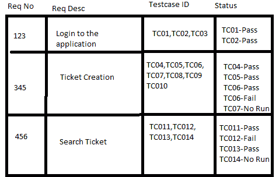
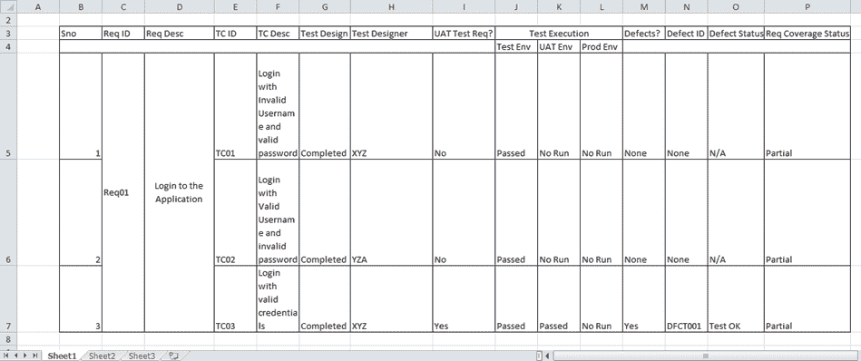
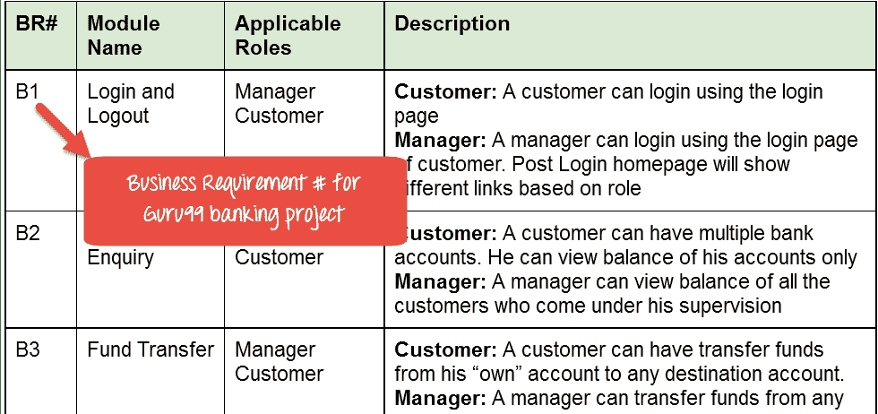
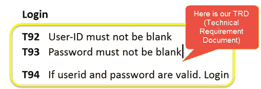
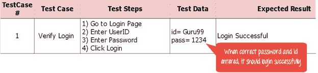
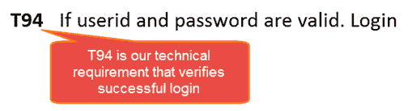
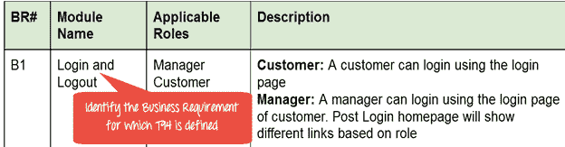
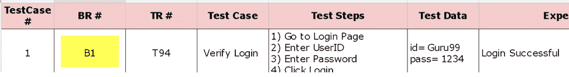
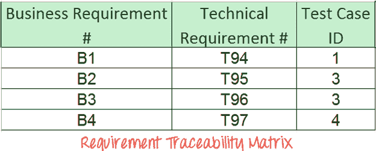

# 什么是需求可追溯性矩阵（RTM）？ 示例模板

> 原文： [https://www.guru99.com/traceability-matrix.html](https://www.guru99.com/traceability-matrix.html)

### 什么是可追溯性矩阵？ （TM 值）

可追溯性矩阵是一个文档，它与需要多对多关系以检查关系的完整性的任何两个基线文档相关联。

它用于跟踪需求并检查是否满足当前项目需求。

## 什么是需求追踪矩阵？

**需求可追溯性矩阵（RTM）**是一个文档，用于映射和跟踪带有测试用例的用户需求。 它在软件部署生命周期结束时提供的单个文档中捕获了客户提出的所有需求和需求可追溯性。 需求可追溯性矩阵的主要目的是验证是否通过测试用例检查了所有需求，以便在软件测试期间不取消任何功能。

在本教程中，您将了解有关-

*   [为什么 RTM 很重要？](#8)
*   [需求可追溯性矩阵中应包含哪些参数？](#3)
*   [可追溯性测试矩阵的类型](#4)
*   [如何创建需求追踪矩阵](#5)
*   [需求追踪矩阵](#6)的优势
*   [需求跟踪矩阵（RTM）模板](#7)

## 为什么 RTM 很重要？

每个测试人员的主要议程应该是了解客户的要求，并确保输出产品没有缺陷。 为了实现此目标，每个质量检查人员都应彻底了解需求并创建正面和负面的测试用例。

这意味着必须将客户端提供的软件需求进一步划分为不同的场景并进一步测试案例。 每种情况都必须单独执行。

这里出现一个问题，即如何确保考虑所有可能的场景/情况对需求进行测试？ 如何确保在测试周期内不遗漏任何要求？

一种简单的方法是使用相应的测试方案和测试案例来跟踪需求。 这仅称为“需求可追溯性矩阵”。

可追溯性矩阵通常是一个工作表，其中包含需求及其所有可能的测试方案和案例以及它们的当前状态，即它们是否已通过或失败。 这将有助于测试团队了解针对特定产品完成的测试活动的级别。

## 需求追踪矩阵中要包括哪些参数？

*   需求编号
*   需求类型和说明
*   状态测试用例

以上是样本需求可追溯性矩阵。

但是在一个典型的软件测试项目中，可追溯性矩阵将具有比这些参数更多的特性。

如上所述，需求可追溯性矩阵可以：

*   在测试用例数量中显示需求覆盖率
*   特定测试用例的设计状态以及执行状态
*   如果用户要进行任何用户接受测试，那么 UAT 状态也可以捕获在同一矩阵中。
*   相关的缺陷和当前状态也可以在同一矩阵中提及。

这种矩阵可以为所有测试活动提供**一站式服务**。

除了单独维护一个 excel。 测试团队还可以选择跟踪需求的可用测试管理工具。

## 可追溯性测试矩阵的类型

在软件工程中，可追溯性矩阵可分为以下三个主要部分：

*   **前向可追溯性**：此矩阵用于检查项目是否按期望的方向进行，并且产品正确。 它确保每个要求都适用于产品，并且每个要求都经过了彻底的测试。 它将需求映射到测试用例。
*   **向后或反向可追溯性：**用于确保当前产品是否保持在正确的轨道上。 这种类型的可追溯性的目的是通过添加代码，设计元素，测试或要求中未指定的其他工作来验证我们没有扩大项目范围。 它将测试用例映射到需求。
*   **双向可追溯性（向前+向后）：**此可追溯性矩阵确保测试用例满足所有要求。 它分析了工作产品中受[缺陷](/defect-management-process.html)影响的需求变更的影响，反之亦然。

## 如何创建需求追踪矩阵

让我们通过 Guru99 银行项目了解“需求可追溯性矩阵”的概念。

根据**业务需求文档（BRD）**和**技术需求文档（TRD）**，测试人员开始编写测试用例。

假设，下表是我们针对 **Guru99 银行业项目**的业务需求文档或 [BRD](https://docs.google.com/document/d/1FsLnZ4thNQF0MhFIFw2Q1KzOTAX89MB8BCvnpsPu5Lc/edit?usp=sharing) 。

在这种情况下，客户应该能够使用正确的密码和用户#id 登录到 Guru99 银行网站，而经理应该能够通过客户登录页面登录到该网站。

下表是我们的**技术要求文档（TRD）**。

**注意：**质量检查小组没有记录 BRD 和 TRD。 另外，一些公司使用**功能需求文档（FRD）**，与技术需求文档相似，但是创建可追溯性矩阵的过程保持不变。

让我们继续前进，在测试中创建 RTM

**步骤 1：**我们的[样本测试用例](/test-case.html)是

“验证登录名，输入正确的 ID 和密码后，它应该成功登录”

**步骤 2** ：确定该测试用例正在验证的技术要求。 对于我们的测试用例，技术要求是正在验证的 T94。

**步骤 3：**在测试用例中注意此技术要求（T94）。

**步骤 4：**标识为此 TR（技术要求-T94）定义的业务需求

**步骤 5：**注意测试用例中的 BR（业务需求）

**步骤 6：**针对所有测试用例执行上述操作。 稍后从测试套件中提取前 3 列。 测试中的 RTM 准备就绪！

## 需求追踪矩阵的优势

*   它确认 100％的测试覆盖率
*   它突出显示了所有缺少的需求或文档不一致的地方
*   它显示整体缺陷或执行状态，并着重于业务需求
*   在重新审视或重新测试测试用例方面，它有助于分析或评估对质量检查小组工作的影响

### 让我们通过视频中的示例学习 RTM

### 需求追踪矩阵（RTM）模板

点击下面下载 RTM 模板 Excel 文件

[下载 RTM 模板 Excel（.xlsx）](https://drive.google.com/uc?export=download&id=16NujoSY5hEDDkg1kTQelImTDvS9nvEbW "Requirements Traceability Matrix (RTM) Template")