# 如何上传&使用 Selenium Webdriver 下载文件

> 原文： [https://www.guru99.com/upload-download-file-selenium-webdriver.html](https://www.guru99.com/upload-download-file-selenium-webdriver.html)

在本教程中，我们将学习如何处理文件上载和下载。

## 上载档案

在本节中，我们将使用 [http://demo.guru99.com/test/upload/](http://demo.guru99.com/test/upload/) 作为我们的测试应用程序。 该站点可以轻松地使任何访问者上传文件而无需他们进行注册。

**在 WebDriver 中上传文件只需在文件选择输入字段上使用 sendKeys（）方法输入要上传文件的路径即可。**

<figure>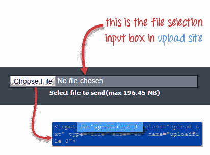 

<figcaption>处理 Selenium Webdriver 中的文件上传弹出窗口</figcaption>

</figure>

处理 Selenium Webdriver 中的文件上传弹出窗口

假设我们希望上传文件“ C：\ newhtml.html”。 我们的 WebDriver 代码应类似于以下所示。

```
package newproject;
import org.openqa.selenium.*;
import org.openqa.selenium.firefox.FirefoxDriver;
public class PG9 {
    public static void main(String[] args) {
        System.setProperty("webdriver.gecko.driver","C:\\geckodriver.exe");
        String baseUrl = "http://demo.guru99.com/test/upload/";
        WebDriver driver = new FirefoxDriver();

        driver.get(baseUrl);
        WebElement uploadElement = driver.findElement(By.id("uploadfile_0"));

        // enter the file path onto the file-selection input field
        uploadElement.sendKeys("C:\\newhtml.html");

        // check the "I accept the terms of service" check box
        driver.findElement(By.id("terms")).click();

        // click the "UploadFile" button
        driver.findElement(By.name("send")).click();
        }
}

```

运行此脚本后，您应该能够成功上传文件，并且应该会收到类似的消息。


在 WebDriver 中上传文件时，请记住以下两点

1.  无需模拟点击“浏览”按钮。 WebDriver 自动将文件路径输入到<输入 type =“ file” >元素的文件选择文本框中
2.  在 Java IDE 中设置文件路径时，请对反斜杠使用正确的转义符。

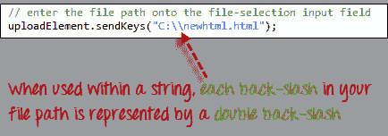

### 下载档案

**WebDriver 无法访问浏览器在单击下载链接或按钮时显示的下载对话框**。 但是，我们可以使用名为“ wget”的单独程序绕过这些对话框。

#### 什么是 Wget？

**Wget 是一个小型且易于使用的命令行程序，用于自动执行下载**。 基本上，我们将从 WebDriver 脚本访问 Wget 来执行下载过程。

#### 设置 Wget

**步骤 1：**在 C 驱动器中，创建一个新文件夹，并将其命名为“ Wget”。

从此处下载 wget.exe [并将其放置在您从上述步骤创建的 Wget 文件夹中。](https://eternallybored.org/misc/wget/)

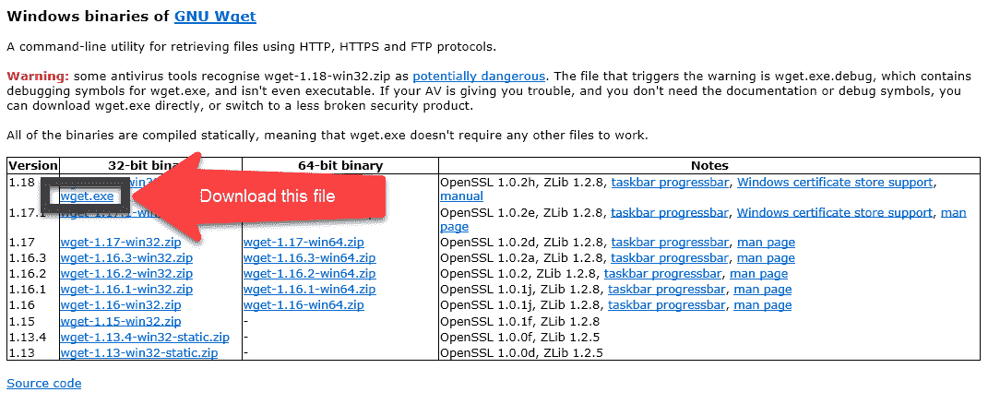

**步骤 2：**按下 Windows 键+“ R”打开运行； 输入“ cmd &”，然后单击“确定”。

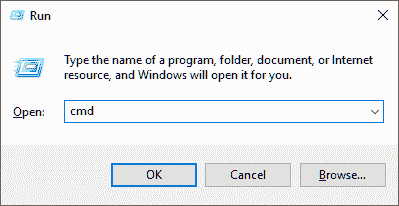

输入命令“ cd /”以移至根目录

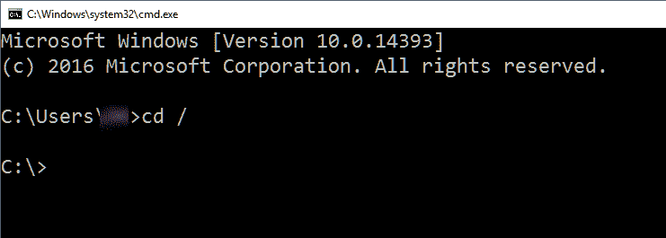

**步骤 3：**键入命令以检查给定的设置是否正常工作

```
cmd /c C:\\Wget\\wget.exe -P C: --no-check-certificate http://demo.guru99.com/selenium/msgr11us.exe
```

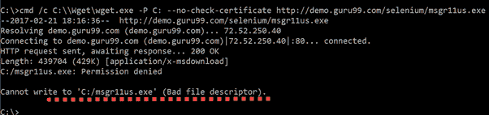

写入 C 驱动器似乎存在问题。

**步骤 4：**在使用 Selenium Webdriver 执行代码之前，需要在命令行中调试 wget 错误。 这些错误将在 Eclipse 中持续存在，并且错误消息不会提供足够的信息。 最好首先使用命令行来使 wget 工作。 如果它可以在命令行中运行，那么它肯定会在 Eclipse 中运行。

在我们的示例中，如步骤 3 所示，写入 C 驱动器存在问题。 让我们将下载位置更改为 D 驱动器并检查结果。

```
cmd /c C:\\Wget\\wget.exe -P D: --no-check-certificate http://demo.guru99.com/selenium/msgr11us.exe
```

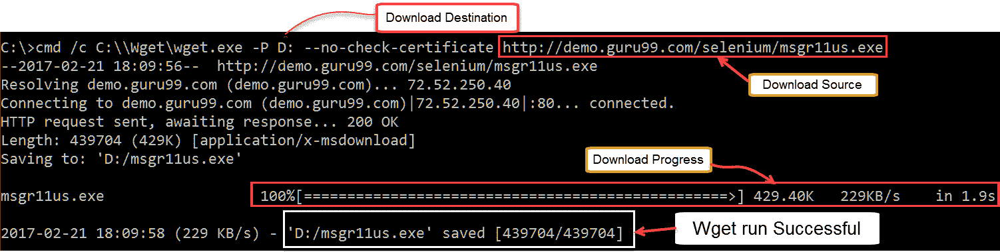

Messenger 已成功下载。

在继续之前，请不要忘记删除下载的文件

### 使用 WebDriver 和 Wget

在以下示例中，我们将使用 WebDriver 和 wget 下载流行的聊天软件 Yahoo Messenger。 我们的基本 URL 为 [http://demo.guru99.com/test/yahoo.html](http://demo.guru99.com/test/yahoo.html) 。

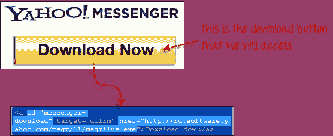

**步骤 1**

导入“ java.io.IOException”包，因为稍后在步骤 4 中我们将不得不捕获 IOException。


**步骤 2**

使用 getAttribute（）获得下载链接的“ href”值，并将其另存为 String 变量。 在这种情况下，我们将变量命名为“ sourceLocation”。


**步骤 3**

使用以下命令设置 wget 的语法。

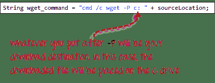

**步骤 4**

通过从 WebDriver 代码中调用 wget 来启动下载过程。

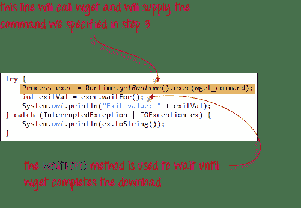

总结起来，您的 WebDriver 代码看起来像下面所示的代码。

```
package newproject;
import java.io.IOException;

import org.openqa.selenium.*;
import org.openqa.selenium.firefox.FirefoxDriver;
public class PG8 {
    public static void main(String[] args) {

        System.setProperty("webdriver.gecko.driver","C:\\geckodriver.exe");
                String baseUrl = "http://demo.guru99.com/test/yahoo.html";
        WebDriver driver = new FirefoxDriver();

        driver.get(baseUrl);
        WebElement downloadButton = driver.findElement(By
        .id("messenger-download"));
        String sourceLocation = downloadButton.getAttribute("href");
        String wget_command = "cmd /c C:\\Wget\\wget.exe -P D: --no-check-certificate " + sourceLocation;

        try {
        Process exec = Runtime.getRuntime().exec(wget_command);
        int exitVal = exec.waitFor();
        System.out.println("Exit value: " + exitVal);
        } catch (InterruptedException | IOException ex) {
        System.out.println(ex.toString());
        }
        driver.close();
        }

}

```

执行完此代码后，检查您的 D 驱动器，并验证 Yahoo Messenger 安装程序已成功下载到那里。

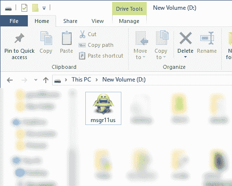

**摘要**

*   在 WebDriver 中上传文件只需在文件选择输入字段上使用 sendKeys（）方法输入要上传文件的路径即可。
*   WebDriver 无法自行自动下载文件。
*   使用 WebDriver 下载文件的最简单方法是使用 Wget。