# Selenium WebDriver 中的 XPath：完整教程

> 原文： [https://www.guru99.com/xpath-selenium.html](https://www.guru99.com/xpath-selenium.html)

在 Selenium 自动化中，如果一般定位符（例如 id，class，name 等）找不到元素，则使用 XPath 在网页上查找元素。

在本教程中，我们将学习 xpath 和不同的 XPath 表达式以查找复杂或动态元素，这些元素的属性在刷新或执行任何操作时会动态更改。

在本教程中，您将学习-

*   [什么是 XPath？](#1)
*   [X 路径的类型](#2)

*   [绝对 XPath](#3)
*   [相对 XPath](#4)

*   [基本 XPath](#5)
*   [Contains（）](#6)
*   [使用或&和](#7)
*   [启动功能](#8)
*   [Text（）](#9)
*   [XPath 轴方法](#10)

*   [关注](#11)
*   [祖先](#12)
*   [儿童](#13)
*   [之前的](#14)
*   [后继兄弟](#15)
*   [父级](#16)
*   [自我](#17)
*   [后代](#18)

## 什么是 XPath？

XPath 被定义为 **XML 路径**。 **它是用于使用 XML 路径表达式**在网页上查找任何元素的语法或语言。 XPath 用于使用 HTML DOM 结构查找网页上任何元素的位置。 XPath 的基本格式将在下面通过屏幕截图进行说明。

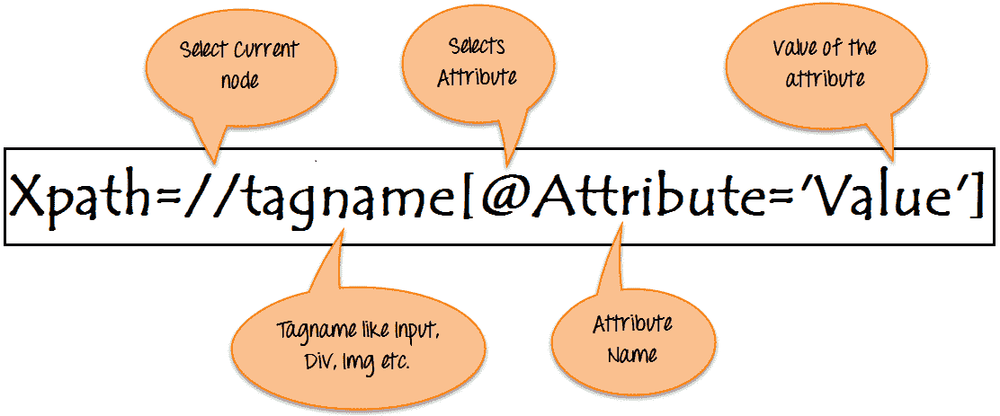

XPath 的**语法：**

XPath 包含位于网页上的元素的路径。 创建 XPath 的标准语法是。

```
Xpath=//tagname[@attribute='value']
```

*   **//：：**选择当前节点。
*   **标记名：**特定节点的标记名。
*   **@：**选择属性。
*   **属性：**节点的属性名称。
*   **值：**属性的值。

为了准确地在网页上找到元素，可以使用不同类型的定位器：

| **XPath 定位器** | **在网页**上查找其他元素 |
| **ID** | 通过元素的 ID 查找元素 |
| **类别名称** | 通过元素的类名查找元素 |
| **名称** | 通过元素名称查找元素 |
| **链接文字** | 通过链接的文本查找元素 |
| **XPath** | 查找动态元素并在网页的各种元素之间遍历所需的 XPath |
| **CSS 路径** | CSS 路径还会查找没有名称，类或 ID 的元素。 |

## X 路径的类型

XPath 有两种类型：

**1）绝对 XPath**

**2）相对 XPath**

### 绝对 XPath：

这是查找元素的直接方法，但是绝对 XPath 的缺点是，如果在元素的路径中进行了任何更改，则 XPath 将会失败。

XPath 的关键特征是它以单个正斜杠（/）开头，这意味着您可以从根节点中选择元素。

以下是以下屏幕中显示的元素的绝对 xpath 表达式的示例。

**绝对 xpath：**

```
html/body/div[1]/section/div[1]/div/div/div/div[1]/div/div/div/div/div[3]/div[1]/div/h4[1]/b
```

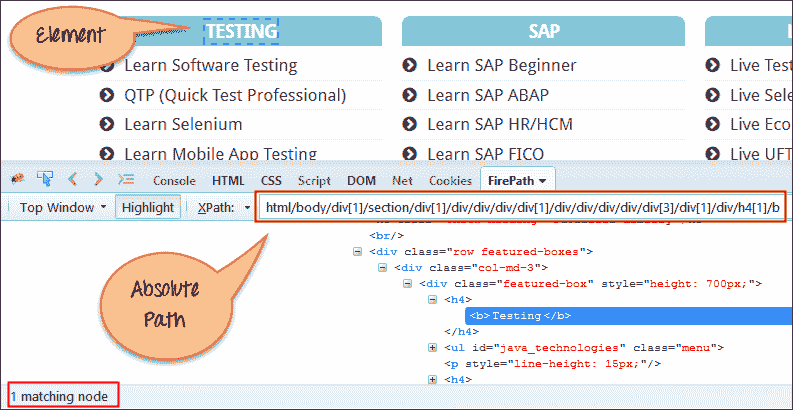

### 相对 xpath：

对于相对 Xpath，路径从 HTML DOM 结构的中间开始。 它以双斜杠（//）开头，这意味着它可以在网页上的任何位置搜索元素。

您可以从 HTML DOM 结构的中间开始，而无需编写长 xpath。

以下是以下屏幕中显示的相同元素的相对 XPath 表达式的示例。 这是用于通过相对 XPath 查找元素的常用格式。

```
Relative xpath: //*[@class='featured-box']//*[text()='Testing']
```

[ ](/images/3-2016/032816_0758_XPathinSele3.png) 

**什么是 XPath 轴。**

XPath 轴从当前上下文节点搜索 XML 文档中的不同节点。 XPath 轴是用于查找动态元素的方法，否则，这是没有 ID，Classname，Name 等的常规 XPath 方法无法实现的。

轴方法用于查找那些在刷新或任何其他操作时会动态更改的元素。 Selenium Webdriver 中常用的坐标轴方法很少，如孩子，父母，祖先，兄弟姐妹，在前，自己等。

## 在硒中使用 XPath 处理复杂的&动态元素

### 1）基本 XPath：

XPath 表达式基于 XML 文档中的 **ID，Name，Classname** 等属性，选择节点或节点列表，如下所示。

```
Xpath=//input[@name='uid']
```

这是访问页面[的链接 http://demo.guru99.com/v1/](http://demo.guru99.com/v1/)

[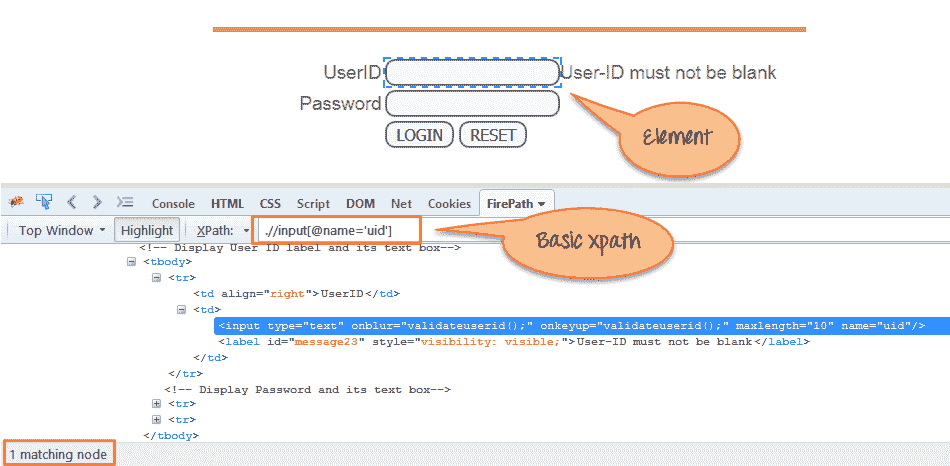 ](/images/3-2016/032816_0758_XPathinSele4.png) 

一些更基本的 xpath 表达式：

```
Xpath=//input[@type='text']				
Xpath=	//label[@id='message23']
Xpath=	//input[@value='RESET']
Xpath=//*[@class='barone']
Xpath=//a[@href='http://demo.guru99.com/']
Xpath= //img[@src='//cdn.guru99.com/images/home/java.png']

```

### 2）Contains（）：

Contains（）是 XPath 表达式中使用的方法。 当任何属性的值动态更改（例如，登录信息）时，将使用该属性。

包含功能可以查找具有部分文本的元素，如以下示例所示。

在此示例中，我们尝试仅通过使用属性的部分文本值来标识元素。 在下面的 XPath 表达式中，部分值'sub'代替了提交按钮。 可以观察到成功找到了元素。

“类型”的完整值是“提交”，但仅使用部分值“子”。

```
Xpath=//*[contains(@type,'sub')]  
```

“名称”的完整值是“ btnLogin”，但仅使用部分值“ btn”。

```
Xpath=//*[contains(@name,'btn')]
```

在上面的表达式中，我们将“名称”作为属性，并将“ btn”作为部分值，如下面的屏幕快照所示。 这将发现 2 个元素（LOGIN & RESET），因为它们的“名称”属性以“ btn”开头。

[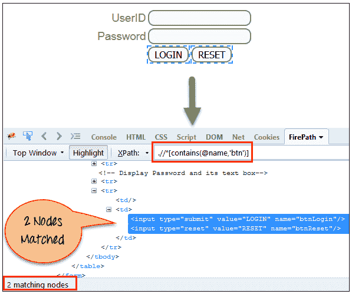 ](/images/3-2016/032816_0758_XPathinSele5.png) 

同样，在下面的表达式中，我们将“ id”作为属性，将“ message”作为部分值。 这将找到 2 个元素（“用户 ID 不能为空” &“密码不能为空”），因为其“名称”属性以“消息”开头。

```
Xpath=//*[contains(@id,'message')]				
```

[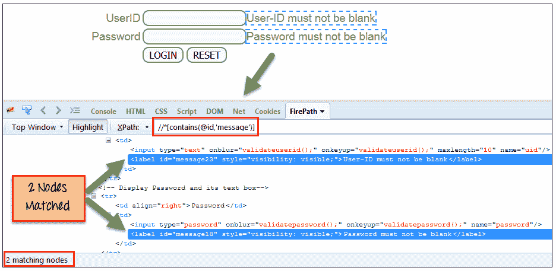 ](/images/3-2016/032816_0758_XPathinSele6.png) 

在下面的表达式中，我们将链接的“文本”作为属性，并将“ here”作为部分值，如下面的屏幕快照所示。 当显示文本“ here”时，将找到链接（“ here”）。

```
Xpath=//*[contains(text(),'here')]
Xpath=//*[contains(@href,'guru99.com')]				
```

[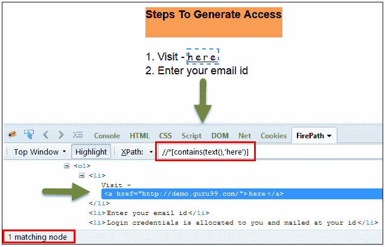 ](/images/3-2016/032816_0758_XPathinSele7.png) 

### 3）使用 OR & AND：

在 OR 表达式中，使用两个条件，第一个条件还是第二个条件应为 true。 如果任何一个条件为真或两者皆有，则也适用。 意味着找到元素的任何一种条件都应该为真。

在下面的 XPath 表达式中，它标识单个或两个条件都成立的元素。

```
Xpath=//*[@type='submit' or @name='btnReset']
```

将两个元素都突出显示为具有属性“ type”的“ LOGIN”元素和具有属性“ name”的“ RESET”元素。

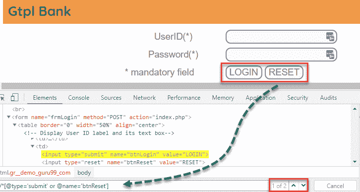

在 AND 表达式中，使用了两个条件，两个条件都应该为 true 才能找到元素。 如果任何一个条件为假，它将无法找到元素。

```
Xpath=//input[@type='submit' and @name='btnLogin']
```

**在下面的表达式中，突出显示“ LOGIN”元素，因为它同时具有属性“ type”和“ name”。**

[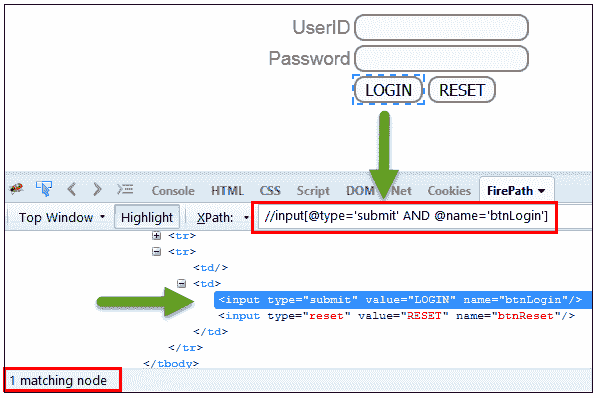 ](/images/3-2016/032816_0758_XPathinSele9.png) 

### 4）启动功能：

Starts-with 函数查找其属性值的元素

刷新或网页上的任何操作发生更改。 在此表达式中，匹配属性的起始文本用于查找其属性动态变化的元素。 您还可以找到其属性值为静态（不变）的元素。

例如-：假设特定元素的 ID 动态变化，例如：

Id =“ message12”

Id =“ message345”

Id =“ message8769”

依此类推..但是初始文本是相同的。 在这种情况下，我们使用 Start-with 表达式。

在下面的表达式中，有两个元素的 ID 以“消息”开头（即，“用户 ID 不能为空” &“密码不能为空”）。 在下面的示例中，XPath 查找其“ ID”以“ message”开头的那些元素。

```
Xpath=//label[starts-with(@id,'message')]
```

[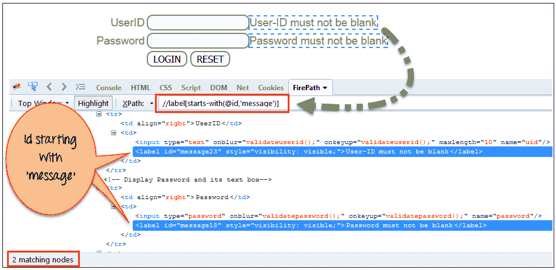 ](/images/3-2016/032816_0758_XPathinSele10.png) 

### 5）Text（）：

在此表达式中，使用文本功能，我们找到具有完全文本匹配的元素，如下所示。 在我们的例子中，我们找到带有文本“ UserID”的元素。

```
Xpath=//td[text()='UserID']				
```

[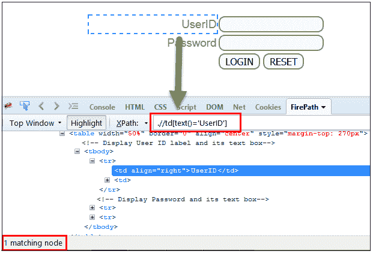 ](/images/3-2016/032816_0758_XPathinSele11.png) 

### 6）XPath 轴方法：

这些 XPath 轴方法用于查找复杂或动态元素。 下面我们将看到其中一些方法。

为了说明这些 XPath 轴方法，我们将使用 Guru99 银行演示站点。

### a）以下：

选择当前节点（）文档中的所有元素[用户 ID 输入框是当前节点]，如下屏幕所示。

```
Xpath=//*[@type='text']//following::input
```


通过使用“跟随”轴密码，登录和重置按钮，可以匹配 3 个“输入”节点。 如果要专注于任何特定元素，则可以使用以下 XPath 方法：

```
Xpath=//*[@type='text']//following::input[1]
```

您可以根据需要通过输入[1]，[2]…………来更改 XPath。

输入为“ 1”时，下面的屏幕快照将查找作为“密码”输入框元素的特定节点。

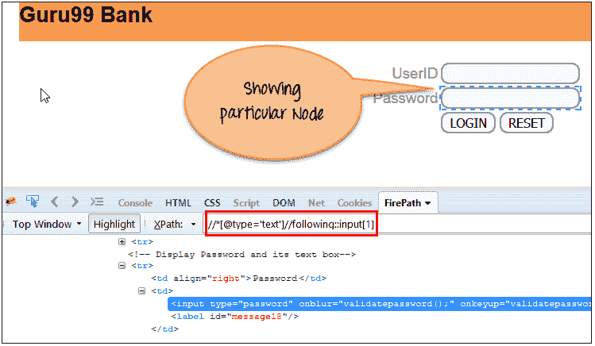

### b）祖先：

祖先轴选择当前节点的所有祖先元素（祖父母，父母等），如以下屏幕所示。

在下面的表达式中，我们找到当前节点（“ ENTERPRISE TESTING”节点）的祖先元素。

```
Xpath=//*[text()='Enterprise Testing']//ancestor::div
```


通过使用“祖先”轴匹配的 13 个“ div”节点。 如果您想关注任何特定元素，则可以使用下面的 XPath，根据需要更改数字 1、2：

```
Xpath=//*[text()='Enterprise Testing']//ancestor::div[1]
```

您可以根据需要通过输入[1]，[2]…………来更改 XPath。

### c）儿童：

选择当前节点（Java）的所有子元素，如下屏幕所示。

```
Xpath=//*[@id='java_technologies']//child::li
```

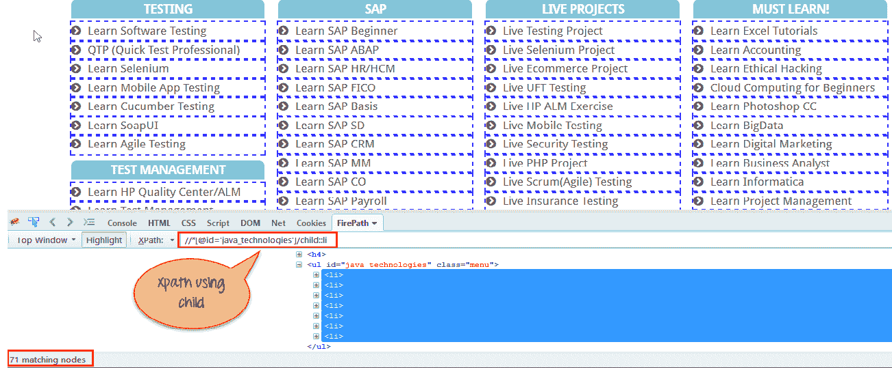

通过使用“子”轴可以匹配 71 个“ li”节点。 如果要关注任何特定元素，则可以使用以下 xpath：

```
Xpath=//*[@id='java_technologies']/child::li[1]
```

您可以根据需要通过输入[1]，[2]…………来更改 xpath。

### d）之前：

如下屏幕所示，选择当前节点之前的所有节点。

在下面的表达式中，它标识“ LOGIN”按钮之前的所有输入元素，即**用户 ID** 和**密码**输入元素。

```
Xpath=//*[@type='submit']//preceding::input
```

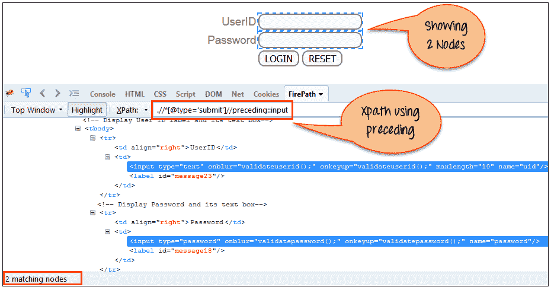

通过使用“上一个”轴可以匹配 2 个“输入”节点。 如果您想关注任何特定元素，则可以使用以下 XPath：

```
Xpath=//*[@type='submit']//preceding::input[1]
```

You can change the xpath according to the requirement by putting [1],[2]…………and so on.

### e）以下同级：

选择上下文节点的以下同级。 兄弟姐妹与当前节点处于同一级别，如以下屏幕所示。 它将在当前节点之后找到元素。

```
 xpath=//*[@type='submit']//following-sibling::input
```

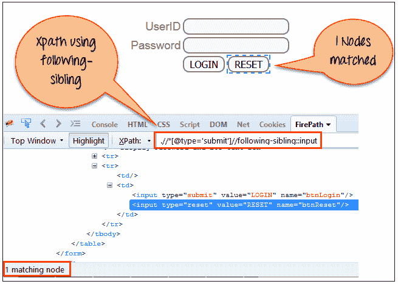

一个输入节点通过使用“跟随兄弟”轴进行匹配。

### f）父级：

选择当前节点的父节点，如下屏幕所示。

```
Xpath=//*[@id='rt-feature']//parent::div
```

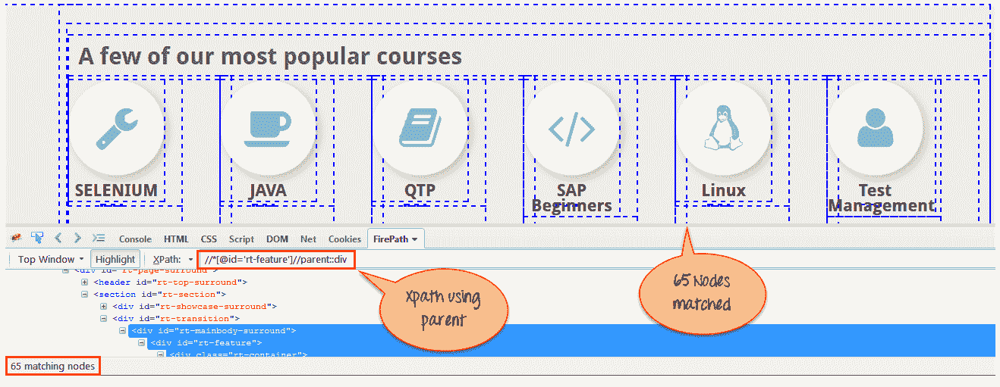

通过使用“父”轴匹配的 65 个“ div”节点。 如果您想关注任何特定元素，则可以使用以下 XPath：

```
Xpath=//*[@id='rt-feature']//parent::div[1]
```

You can change the XPath according to the requirement by putting [1],[2]…………and so on.

### g）自：

选择当前节点或“自身”意味着它指示节点本身，如以下屏幕所示。

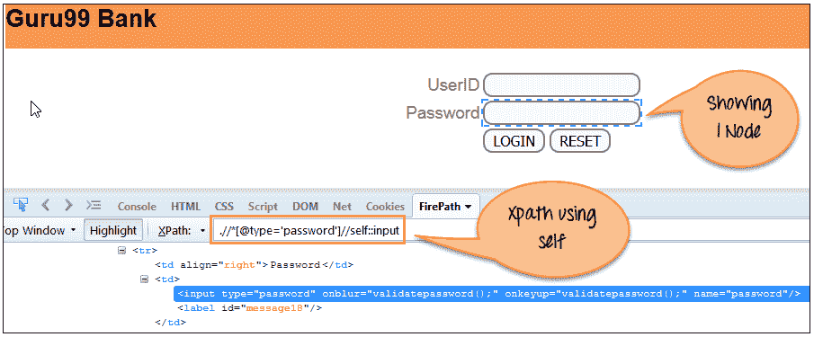

使用“ self”轴匹配一个节点。 它总是只找到一个节点，因为它代表了自我元素。

```
Xpath =//*[@type='password']//self::input
```

### h）后代：

Selects the descendants of the current node as shown in the below screen.

在下面的表达式中，它标识当前元素（“主体环绕”框架元素）的所有元素后代，这意味着向下位于节点（子节点，孙子节点等）下。

```
Xpath=//*[@id='rt-feature']//descendant::a
```

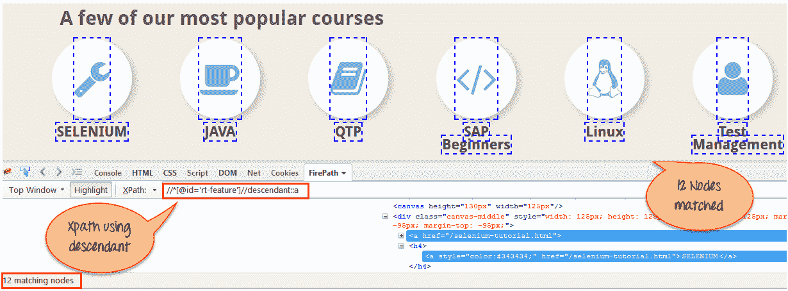

通过使用“后代”轴可以匹配 12 个“链接”节点。 如果您想关注任何特定元素，则可以使用以下 XPath：

```
Xpath=//*[@id='rt-feature']//descendant::a[1]
```

You can change the XPath according to the requirement by putting [1],[2]…………and so on.

**摘要：**

需要 XPath 才能在网页上查找元素，以便对该特定元素执行操作。

*   XPath 有两种类型：
    *   **绝对 XPath**
    *   **相对 XPath**

*   XPath 轴是用于查找动态元素的方法，否则通常的 XPath 方法无法找到
*   XPath 表达式根据 XML 文档中的 ID，Name，Classname 等属性选择节点或节点列表。