# Selenium WebDriver 中的警报&弹出窗口处理

> 原文： [https://www.guru99.com/alert-popup-handling-selenium.html](https://www.guru99.com/alert-popup-handling-selenium.html)

在本教程中，我们将学习在 Web 应用程序[测试](/software-testing.html)中发现的不同类型的警报，以及如何在 Selenium WebDriver 中处理警报。 我们还将看到我们如何根据警报类型来接受和拒绝警报。

在本教程中，您将学习-

*   [什么是警报？](#1)
*   [如何在 Selenium WebDriver](#2) 中处理警报
*   [如何使用 Webdriver 处理[Selenium Popup]窗口](#3)

## 什么是警报？

警报是一个小消息框，它在屏幕上显示通知，以向用户提供某种信息或请求允许执行某种操作。 它也可以用于警告目的。

以下是几种警报类型：

**1）简单警报**

这个简单的警报在屏幕上显示一些信息或警告。

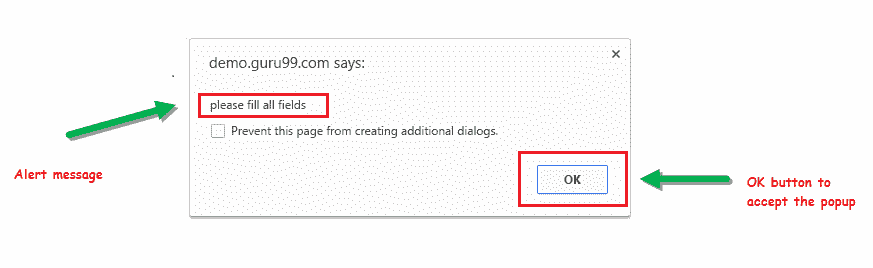

**2）提示警报。**

该提示警报要求用户提供一些输入，Selenium Webdriver 可以使用 sendkeys（“ input…。”）输入文本。

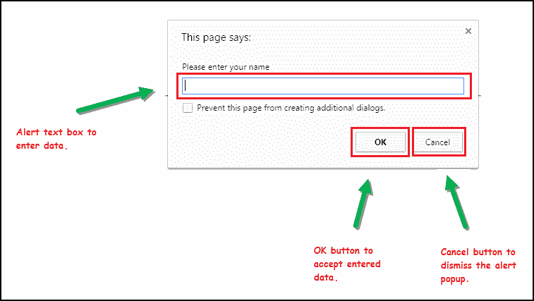

**3）确认警报。**

该确认警报要求获得执行某种类型的操作的权限。

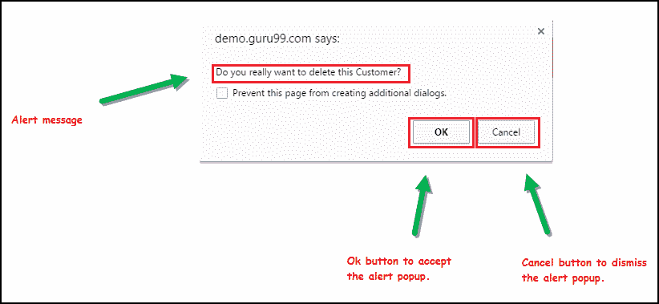

## 如何处理 Selenium WebDriver 中的警报

Alert 界面提供了以下几种在 Selenium Webdriver 中广泛使用的方法。

1）void dismiss（） **//单击警报的“取消”按钮。**

```
driver.switchTo().alert().dismiss();
```

2）void accept（） **//单击警报的“确定”按钮。**

```
driver.switchTo().alert().accept();
```

3）String getText **（）//捕获警报消息。**

```
driver.switchTo().alert().getText();			
```

4）void sendKeys（String stringToSend） **//向警报框发送一些数据。**

```
driver.switchTo().alert().sendKeys("Text");
```

您可以看到显示了许多 Alert 方法，如 Eclipse 建议的以下屏幕所示。

我们可以使用 Selenium 的 **.switchTo（）**方法轻松地从主窗口切换到警报。

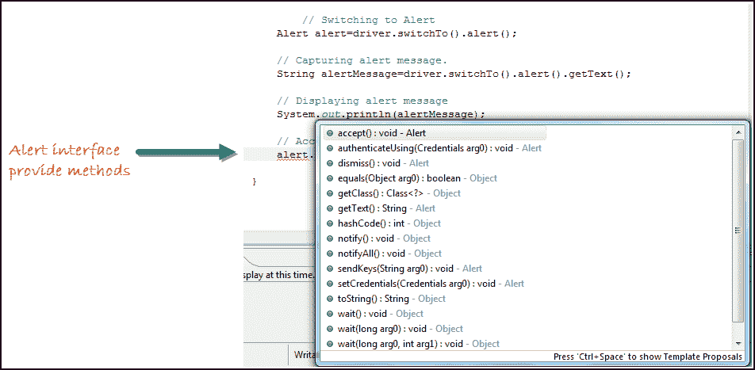

**现在，我们将自动化给定的以下场景。**

在这种情况下，我们将使用 Guru99 演示站点来说明 Selenium Alert 的处理。

**步骤 1）**启动 Web 浏览器并打开站点“ [http://demo.guru99.com/test/delete_customer.php](http://demo.guru99.com/test/delete_customer.php) ”

**步骤 2）**输入任何客户 ID。


**步骤 3）**输入客户 ID 后，单击“提交”按钮。

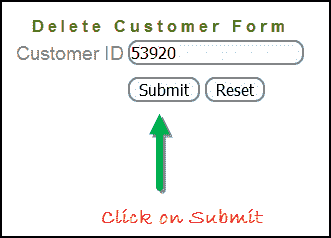

**步骤 4）**拒绝/接受警报。

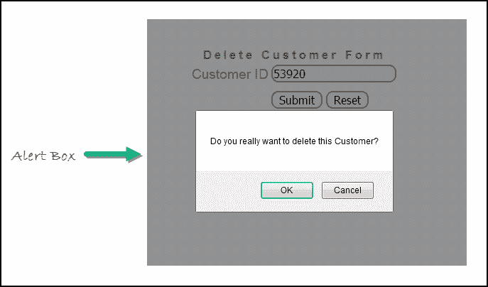

**使用上述场景**处理 Selenium Webdriver 中的警报

```
import org.openqa.selenium.By;
import org.openqa.selenium.WebDriver;
import org.openqa.selenium.chrome.ChromeDriver;
import org.openqa.selenium.NoAlertPresentException;	
import org.openqa.selenium.Alert;

public class AlertDemo {

	public static void main(String[] args) throws NoAlertPresentException,InterruptedException  {									
		System.setProperty("webdriver.chrome.driver","G:\\chromedriver.exe");
		WebDriver driver = new ChromeDriver();

        // Alert Message handling

        driver.get("http://demo.guru99.com/test/delete_customer.php");			

        driver.findElement(By.name("cusid")).sendKeys("53920");					
        driver.findElement(By.name("submit")).submit();			

        // Switching to Alert        
        Alert alert = driver.switchTo().alert();		

        // Capturing alert message.    
        String alertMessage= driver.switchTo().alert().getText();		

        // Displaying alert message		
        System.out.println(alertMessage);	
        Thread.sleep(5000);

        // Accepting alert		
        alert.accept();		
    }	

}

```

**输出：**

当您执行上述代码时，它将启动该站点。 尝试通过处理屏幕上显示的确认警报来删除客户 ID，从而从应用程序中删除客户 ID。

## 如何使用 Webdriver 处理 Selenium 弹出窗口

在自动化中，当我们在任何 Web 应用程序中都有多个窗口时，活动可能需要将多个窗口之间的控制权从一个切换到另一个，以完成操作。 操作完成后，它必须返回到主窗口，即父窗口。 我们将在本文中通过示例进一步说明这一点。

在 Selenium Web 驱动程序中，有一些方法可以处理多个窗口。

**Driver.getWindowHandles（）;**

要通过 Web 驱动程序处理所有打开的窗口，可以使用“ Driver.getWindowHandles（）”，然后可以在 Web 应用程序中将窗口从一个窗口切换到另一个窗口。 它的返回类型是 Iterator < String >。

**Driver.getWindowHandle（）;**

当站点打开时，我们需要通过 **driver.getWindowHandle（）**处理主窗口。 这将处理在此驱动程序实例中唯一标识它的当前窗口。 它的返回类型是 String。

要在 Selenium WebDriver 中处理多个窗口，请执行以下步骤。

现在，我们将自动执行以下给定方案，以了解如何使用 Selenium Webdriver 处理多个窗口。

在这种情况下，我们将使用“ Guru99”演示站点来说明窗口处理。

**步骤 1）**启动站点。

启动浏览器并打开站点“ **http://demo.guru99.com/popup.php** ”


**步骤 2）**单击链接“单击此处”。

当用户单击“单击此处”链接时，将打开新的子窗口。

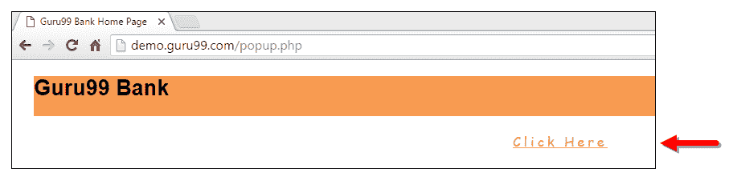

**步骤 3）**新建子窗口打开。

将打开一个新窗口，要求用户输入电子邮件 ID 并提交页面。

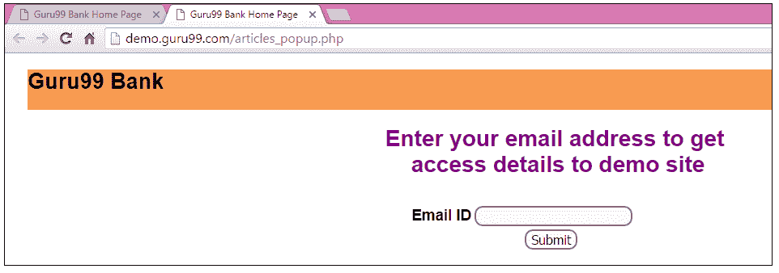

**步骤 4）**输入您的电子邮件 ID 并提交。

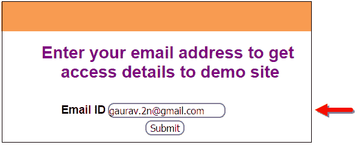

**步骤 5）**在提交页面时显示访问凭据。

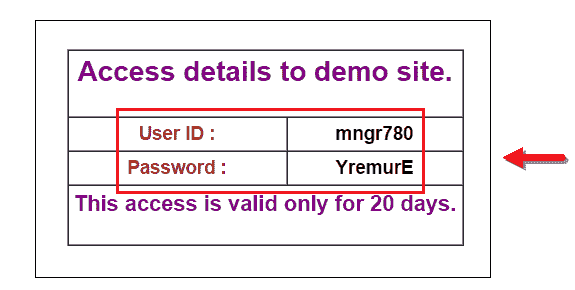

执行代码时，您会看到子窗口在新选项卡中打开。

1.  关闭在其上显示凭据的子窗口。

[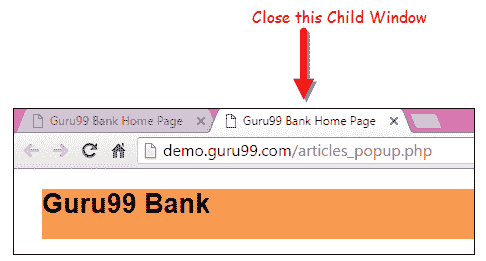 ](/images/3-2016/032216_1314_AlertPopuph16.png) 

2.  切换到父窗口。

[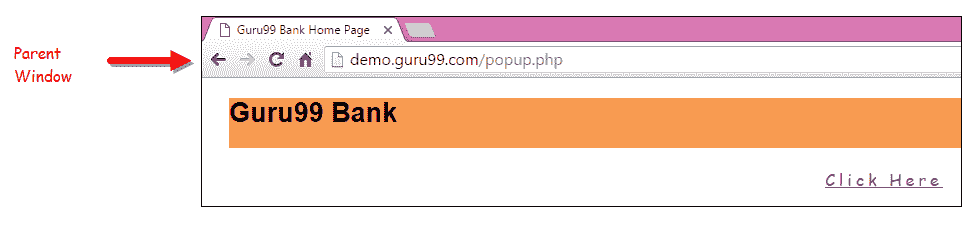 ](/images/3-2016/032216_1314_AlertPopuph17.png) 

**使用上述方案在 Selenium Webdriver 中处理多个窗口。**

```
import java.util.Iterator;		
import java.util.Set;		
import org.openqa.selenium.By;		
import org.openqa.selenium.WebDriver;		
import org.openqa.selenium.firefox.FirefoxDriver;		

public class WindowHandle_Demo {				

    public static void main(String[] args) throws InterruptedException {									
        	WebDriver driver=new FirefoxDriver();			

        //Launching the site.				
            driver.get("http://demo.guru99.com/popup.php");			
        driver.manage().window().maximize();		

driver.findElement(By.xpath("//*[contains(@href,'popup.php')]")).click();			

        String MainWindow=driver.getWindowHandle();		

        // To handle all new opened window.				
            Set<String> s1=driver.getWindowHandles();		
        Iterator<String> i1=s1.iterator();		

        while(i1.hasNext())			
        {		
            String ChildWindow=i1.next();		

            if(!MainWindow.equalsIgnoreCase(ChildWindow))			
            {    		

                    // Switching to Child window
                    driver.switchTo().window(ChildWindow);	                                                                                                           
                    driver.findElement(By.name("emailid"))
                    .sendKeys("This email address is being protected from spambots. You need JavaScript enabled to view it.
	");                			

                    driver.findElement(By.name("btnLogin")).click();			

			// Closing the Child Window.
                        driver.close();		
            }		
        }		
        // Switching to Parent window i.e Main Window.
            driver.switchTo().window(MainWindow);				
    }
}		

```

**输出：**

当您执行上述代码时，它将启动该站点，并单击链接“单击此处”，从而在新选项卡中打开一个子窗口。 您可以关闭子窗口，并在操作完成后切换到父窗口。 因此，在应用程序中处理多个窗口。

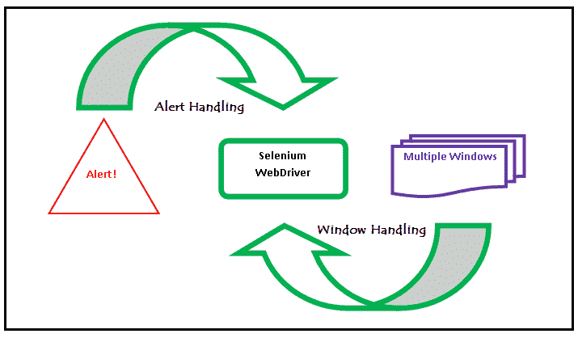

**结论：**

*   我们定义了警报的类型，并通过屏幕截图显示了它们。
*   演示了使用特定场景使用 Selenium WebDriver 处理警报。
*   使用 Selenium WebDriver 在特定情况下处理了多个窗口。