# 如何在 Selenium WebDriver 中处理 Web 表

> 原文： [https://www.guru99.com/selenium-webtable.html](https://www.guru99.com/selenium-webtable.html)

## 读取 HTML Web 表

有时我们需要访问 HTML 表中的元素（通常是文本）。 但是，对于 Web 设计人员来说，很少向表中的某个单元格提供 id 或 name 属性。 因此，我们不能使用“ By.id（）”，“ By.name（）”或“ By.cssSelector（）”之类的常用方法。 在这种情况下，最可靠的选择是使用“ By.xpath（）”方法访问它们。

在本教程中，您将学习-

*   [如何为表](#10)编写 XPath
*   [访问嵌套表](#11)
*   [使用属性作为谓词](#12)
*   [快捷方式：使用检查元素访问硒](#13)中的表

## 如何为表编写 XPath

考虑下面的 HTML 代码。

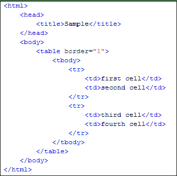.png)

我们将使用 [XPath](/xpath-selenium.html) 获取包含文本“第四个单元格”的单元格的内部文本。

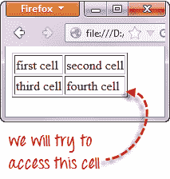.png)

**步骤 1-设置父元素（表格）**

**WebDriver 中的 XPath 定位符始终以双斜杠“ //”开头，然后是父元素**。 由于我们正在处理表，因此父元素应始终为<表>标签。 因此，我们的 XPath 定位器的第一部分应以“ // table”开头。

.png)

**步骤 2-添加子元素**

<表>紧邻的元素是< tbody >，因此我们可以说< tbody >是<表>的“子”。 而且，<表>是< tbody >的“父”。 XPath 中的所有子元素都放置在其父元素的右边，并用一个正斜杠“ /”分隔，如下所示。

 ](/images/image022(1).png) [ 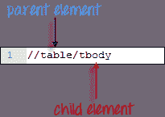

**步骤 3-添加谓词**

<正文>元素包含两个< tr >标签。 现在我们可以说这两个< tr >标签是< tbody >的“子代”。 因此，可以说< tbody >是< tr >元素的父代。

我们可以得出的另一结论是，两个< tr >元素是同级元素。 **兄弟姐妹是指具有相同父项**的子元素。

要访问我们要访问的< td >（文本为“第四单元格”的那个），我们必须首先访问**第二个** < tr >，而不是第一个 。 如果我们只写“ // table / tbody / tr”，那么我们将访问第一个< tr >标签。

那么，我们如何访问第二个< tr >呢？ 答案是使用**谓词**。

**谓词是用方括号“ []”括起来的数字或 HTML 属性，用于将子元素与其同级元素**区别开。 由于我们需要访问的< tr >是第二个，因此我们将使用“ [2]”作为谓词。

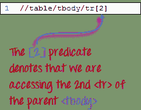

如果我们不使用任何谓词，那么 XPath 将访问第一个兄弟。 因此，我们可以使用这两个 XPath 代码之一访问第一个< tr >。

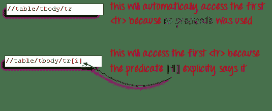

**步骤 4-使用适当的谓词**添加成功的子元素

我们需要访问的下一个元素是第二个< td >。 运用从第 2 步和第 3 步中学到的原理，我们将最终确定 XPath 代码，如下所示。

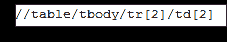

现在我们有了正确的 XPath 定位器，我们已经可以使用下面的代码访问所需的单元格并获取其内部文本。 假定您已将上述 HTML 代码保存为 C 驱动器中的“ newhtml.html”。

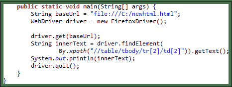

```
public static void main(String[] args) {
	String baseUrl = "http://demo.guru99.com/test/write-xpath-table.html";
	WebDriver driver = new FirefoxDriver();

	driver.get(baseUrl);
	String innerText = driver.findElement(
		By.xpath("//table/tbody/tr[2]/td[2]")).getText(); 	
        System.out.println(innerText); 
	driver.quit();
	}
}
```

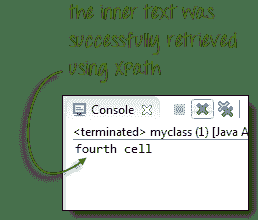

## 访问嵌套表

上面讨论的相同原理适用于嵌套表。 **嵌套表是位于另一个表**中的表。 一个例子如下所示。

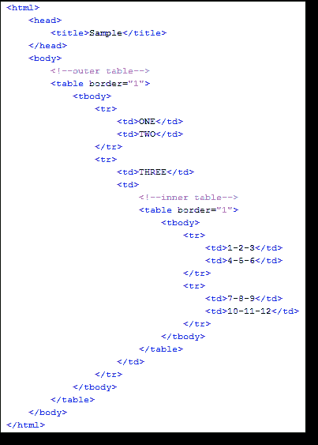 ](/images/image029.png) [ 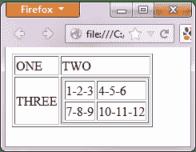

要使用上一节中的“ // parent / child”和谓词概念访问带有文本“ 4-5-6”的单元格，我们应该能够在下面提出 XPath 代码。

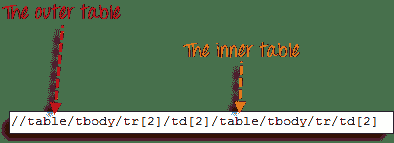

下面的 WebDriver 代码应该能够检索我们正在访问的单元格的内部文本。

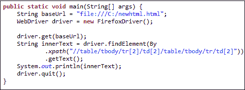

```
public static void main(String[] args) {
	String baseUrl = "http://demo.guru99.com/test/accessing-nested-table.html";
	WebDriver driver = new FirefoxDriver();

	driver.get(baseUrl);
	String innerText = driver.findElement(
		By.xpath("//table/tbody/tr[2]/td[2]/table/tbody/tr/td[2]")).getText(); 		
        System.out.println(innerText); 
	driver.quit();
}
```

以下输出确认内部表已成功访问。

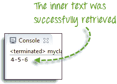

## 使用属性作为谓词

如果该元素是用 HTML 代码深层编写的，则谓词所用的数字很难确定，那么我们可以改用该元素的唯一属性。

在下面的示例中，“纽约到芝加哥”单元格位于 Mercury Tours 主页的 HTML 代码的深处。

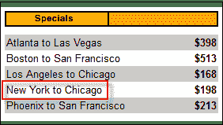


在这种情况下，我们可以使用表的唯一属性（width =“ 270”）作为谓词。 **通过在属性前面加上@符号**来用作谓词。 在上面的示例中，“纽约到芝加哥”单元格位于第四< tr >的第一< td >中，因此我们的 XPath 应该如下所示。

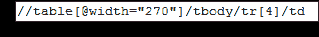

请记住，当我们将 XPath 代码放入 Java 中时，应在“ 270”的两边使用转义字符反斜杠“ \”作为双引号，以便 By.xpath（）的字符串参数不会过早终止。 。


现在，我们准备使用下面的代码访问该单元格。

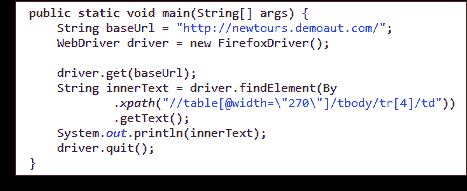

```
public static void main(String[] args) {
	String baseUrl = "http://demo.guru99.com/test/newtours/";
	WebDriver driver = new FirefoxDriver();

	driver.get(baseUrl);
	String innerText = driver.findElement(By
		.xpath("//table[@width=\"270\"]/tbody/tr[4]/td"))
		.getText(); 		
	System.out.println(innerText); 
	driver.quit();
}
```


## 快捷方式：使用检查元素访问硒中的表

如果元素的编号或属性非常困难或无法获得，则生成 XPath 代码的最快方法是使用 Inspect Element。

请考虑以下 Mercury Tours 主页上的示例。


**步骤 1**

使用 Firebug 获取 XPath 代码。

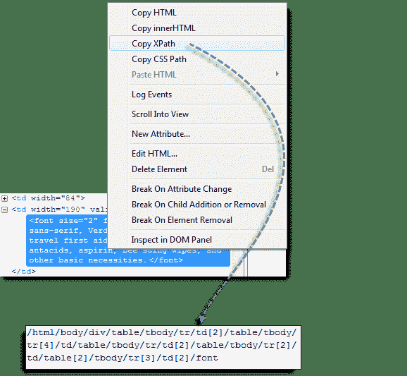

**步骤 2**

查找第一个“表”父元素，然后删除其左侧的所有内容。

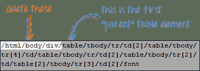

**步骤 3**

在代码的其余部分前面加上双斜杠“ //”，并将其复制到 WebDriver 代码中。

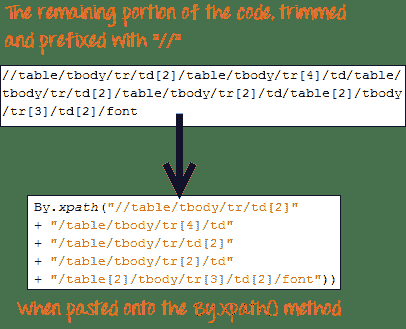

下面的 WebDriver 代码将能够成功检索我们正在访问的元素的内部文本。

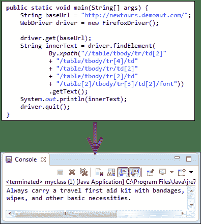

```
public static void main(String[] args) {
	String baseUrl = "http://demo.guru99.com/test/newtours/";
	WebDriver driver = new FirefoxDriver();

	driver.get(baseUrl);
	String innerText = driver.findElement(By
		.xpath("//table/tbody/tr/td[2]"
		+ "//table/tbody/tr[4]/td/"
		+ "table/tbody/tr/td[2]/"
		+ "table/tbody/tr[2]/td[1]/"
		+ "table[2]/tbody/tr[3]/td[2]/font"))
		.getText(); 		
	System.out.println(innerText); 
	driver.quit();
}
```

**摘要**

*   By.xpath（）通常用于访问表元素。
*   如果该元素是用 HTML 代码深层编写的，则谓词所用的数字很难确定，那么我们可以改用该元素的唯一属性。
*   通过在属性前面加上@符号来将其用作谓词。
*   使用 Inspect 元素访问 Selenium 中的表