# 使用 Selenium WebDriver 处理动态 Web 表

> 原文： [https://www.guru99.com/handling-dynamic-selenium-webdriver.html](https://www.guru99.com/handling-dynamic-selenium-webdriver.html)

网络上发布了两种类型的 HTML 表格-

1.  **静态表**：数据是静态的，即行数和列数是固定的。
2.  **动态表**：数据是动态的，即行数和列数不固定。

以下是 Sales 动态表的示例。 根据输入日期过滤器，行数将被更改。 因此，它本质上是动态的。

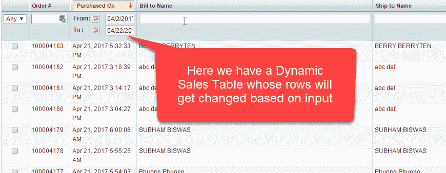

处理静态表很容易，但是由于行和列不是恒定的，所以动态表有点困难。

**在本教程中，您将学习-**

*   [使用 X 路径定位 Web 表格元素](#1)
*   [示例：从动态 Web 表](#2)中获取行数和列数
*   [示例：获取动态表](#3)中特定行和列的单元格值
*   [示例：获取动态表](#4)列中所有值的最大值
*   [示例：获取动态表](#5)的所有值

## 使用 X-Path 定位 Web 表格元素

在找到网络元素之前，首先让我们了解-

**什么是网络元素？**

Web 元素不过是 HTML 元素，例如文本框，下拉单选按钮，提交按钮等。这些 HTML 元素以**开头**标记编写，以**结束**标记结尾。

例如，

**< p >** 我的第一个 HTML 文档 **< / p >。**

获取要定位的 Web 元素的 X 路径的步骤。

**步骤 1）**在 Chrome 中，转到 [http://demo.guru99.com/test/web-table-element.php](http://demo.guru99.com/test/web-table-element.php)

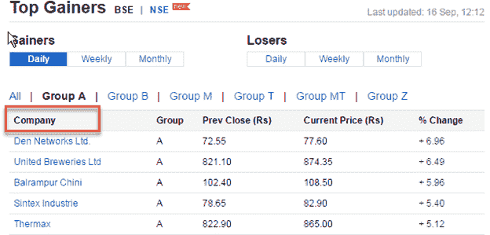

**步骤 2）**右键单击要获取其 x 路径的 Web 元素。 在我们的情况下，右键单击“公司”，然后选择“检查”选项。 将显示以下屏幕-

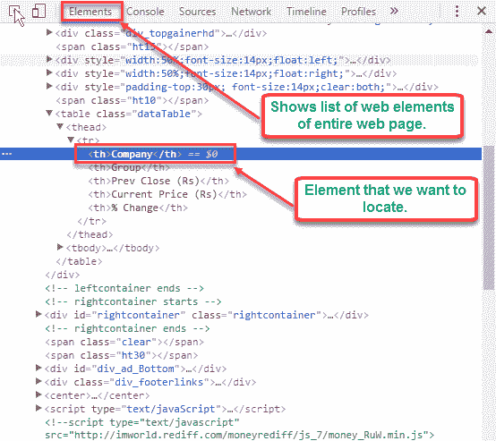

**步骤 3）**右键单击突出显示的 Web 元素>选择复制->复制 x 路径选项。

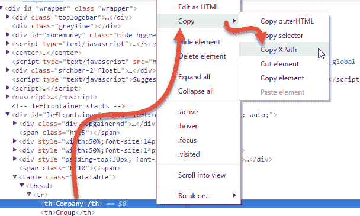

**步骤 4）**使用 Selenium WebDriver 中复制的 X 路径“ // * [@ id =“ leftcontainer”] / table / thead / tr / th [1]”来查找元素。

## 示例：从动态 Web 表获取行和列数

当表格本质上是动态的时，我们无法预测其行数和列数。

使用 Selenium Web 驱动程序，我们可以找到

*   Web 表的行数和列数
*   X 行或 Y 列的数据。

以下是用于获取 Web 表的行和列总数的程序。

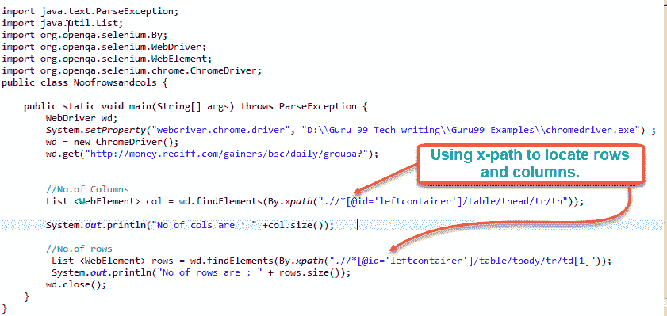

```
import java.text.ParseException;
import java.util.List;
import org.openqa.selenium.By;
import org.openqa.selenium.WebDriver;
import org.openqa.selenium.WebElement;
import org.openqa.selenium.chrome.ChromeDriver;

public class Noofrowsandcols {
    public static void main(String[] args) throws ParseException {
    	WebDriver wd;
	  System.setProperty("webdriver.chrome.driver","G://chromedriver.exe");
	  wd= new ChromeDriver();
        wd.get("http://demo.guru99.com/test/web-table-element.php");         
        //No.of Columns
        List col = wd.findElements(By.xpath(".//*[@id=\"leftcontainer\"]/table/thead/tr/th"));
        System.out.println("No of cols are : " +col.size()); 
        //No.of rows 
        List <webelement>rows = wd.findElements(By.xpath(".//*[@id='leftcontainer']/table/tbody/tr/td[1]")); 
        System.out.println("No of rows are : " + rows.size());
        wd.close();
    }
}</webelement> 
```

**代码说明：**

*   在这里，我们首先声明 Web 驱动程序对象“ wd” &将其初始化为 chrome 驱动程序。
*   我们将列表< WebElement >用于“ col”中的总列数。
*   findElements 命令返回与指定定位符匹配的所有元素的列表
*   使用 findElements 和 X 路径// * [@@ id = \“ leftcontainer \”] / table / thead / tr / th，我们得到所有列
*   同样，我们对行重复此过程。

.

**输出：**

[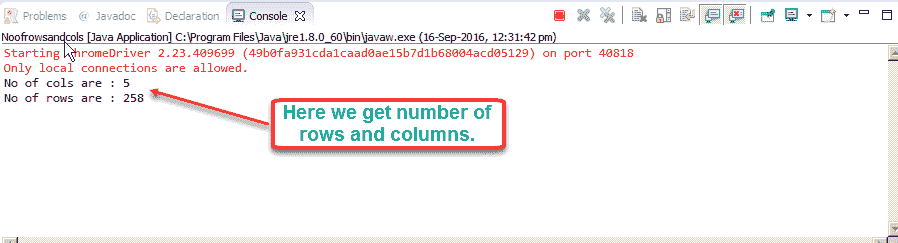 ](/images/2-2017/050217_0717_HandlingDyn6.png) 

## 示例：获取动态表中特定行和列的单元格值

假设我们需要表的第 3 <sup>rd</sup> 行及其第二个单元格的数据。 见下表

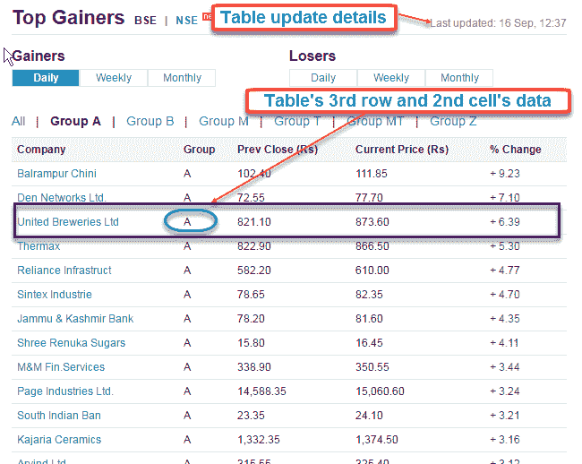

在上表中，一段时间后数据会定期更新。 您尝试检索的数据将与上述屏幕截图不同。 但是，代码保持不变。 这是获取第 3 <sup>行和第<sup>列数据的示例程序。</sup></sup>

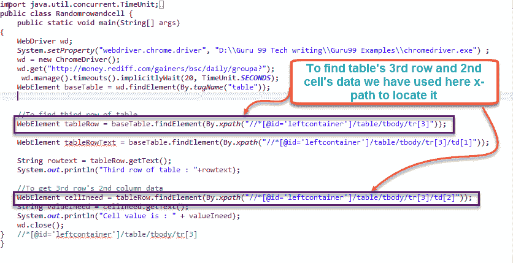

```
import java.text.ParseException;
import java.util.List;
import org.openqa.selenium.By;
import org.openqa.selenium.WebDriver;
import org.openqa.selenium.WebElement;
import org.openqa.selenium.chrome.ChromeDriver;
import java.util.concurrent.TimeUnit;

public class RowandCell {
    public static void main(String[] args) throws ParseException {
    	WebDriver wd;
		System.setProperty("webdriver.chrome.driver","G://chromedriver.exe");
		 wd= new ChromeDriver();
		 wd.get("http://demo.guru99.com/test/web-table-element.php"); 
		 wd.manage().timeouts().implicitlyWait(20, TimeUnit.SECONDS);
		 WebElement baseTable = wd.findElement(By.tagName("table"));

		 //To find third row of table
		 WebElement tableRow = baseTable.findElement(By.xpath("//*[@id=\"leftcontainer\"]/table/tbody/tr[3]"));
         String rowtext = tableRow.getText();
		 System.out.println("Third row of table : "+rowtext);

		    //to get 3rd row's 2nd column data
		    WebElement cellIneed = tableRow.findElement(By.xpath("//*[@id=\"leftcontainer\"]/table/tbody/tr[3]/td[2]"));
		    String valueIneed = cellIneed.getText();
		    System.out.println("Cell value is : " + valueIneed); 
		    wd.close();
    }
}

```

**Code Explanation:**

*   使用定位器属性“标记名”定位表。
*   使用 [XPath](/xpath-selenium.html) “ // * [@ id = \” leftcontainer \“] / table / tbody / tr [3]”找到第 3 个<sup>行</sup>行，并使用 getText（ ）功能
*   使用 Xpath“ // * [@ id = \” leftcontainer \“] / table / tbody / tr [3] / td [2]”在 3 <sup>rd</sup> 行中找到第二个单元格，并使用 getText（）函数

**输出**：

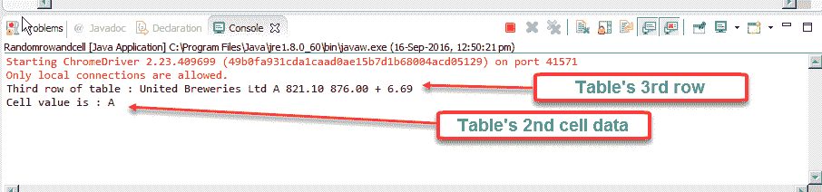

## 示例：获取动态表列中所有值的最大值

在此示例中，我们将获得特定列中所有值的最大值。

请参考下表-

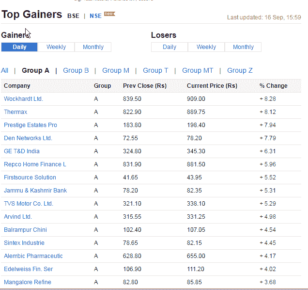

这是代码

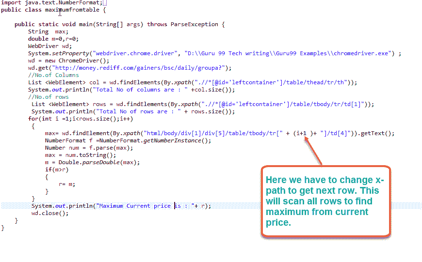

```
import java.text.ParseException;
import java.util.List;
import org.openqa.selenium.By;
import org.openqa.selenium.WebDriver;
import org.openqa.selenium.WebElement;
import org.openqa.selenium.chrome.ChromeDriver;
import java.text.NumberFormat;

public class MaxFromTable {
    public static void main(String[] args) throws ParseException {
    	WebDriver wd;
		System.setProperty("webdriver.chrome.driver","G://chromedriver.exe");
		 wd= new ChromeDriver();
		 wd.get("http://demo.guru99.com/test/web-table-element.php"); 
		 String max;
	     double m=0,r=0;

	       //No. of Columns
	        List col = wd.findElements(By.xpath(".//*[@id='leftcontainer']/table/thead/tr/th"));
	        System.out.println("Total No of columns are : " +col.size());
	        //No.of rows
	        List <webelement>rows = wd.findElements(By.xpath (".//*[@id='leftcontainer']/table/tbody/tr/td[1]"));
	        System.out.println("Total No of rows are : " + rows.size());
	        for (int i =1;i<rows.size();i++)
	        {    
	            max= wd.findElement(By.xpath("html/body/div[1]/div[5]/table/tbody/tr[" + (i+1)+ "]/td[4]")).getText();
	            NumberFormat f =NumberFormat.getNumberInstance(); 
	            Number num = f.parse(max);
	            max = num.toString();
	            m = Double.parseDouble(max);
	            if(m>r)
	             {    
	                r=m;
	             }
	        }
	        System.out.println("Maximum current price is : "+ r);
    }
}</webelement> 
```

**代码说明：**

*   使用 chrome 驱动程序，我们找到 Web 表并使用 XPath“ .//*[@id='leftcontainer']/table/tbody/tr/td[1]”获取行总数
*   使用 for 循环，我们遍历总行数并逐个获取值。 为了获得下一行，我们在 XPath 中使用（i + 1）
*   我们将旧值与新值进行比较，最大值在 for 循环的末尾打印

**输出**


## 示例：获取动态表的所有值

考虑下表 [http://demo.guru99.com/test/table.html](http://demo.guru99.com/test/table.html)

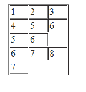

每行的列数是不同的。

在这里，行号 1、2 和 4 有 3 个单元格，行号 3 有 2 个单元格，行号 5 有 1 个单元格。

我们需要获取所有单元格的值

**这是代码：**

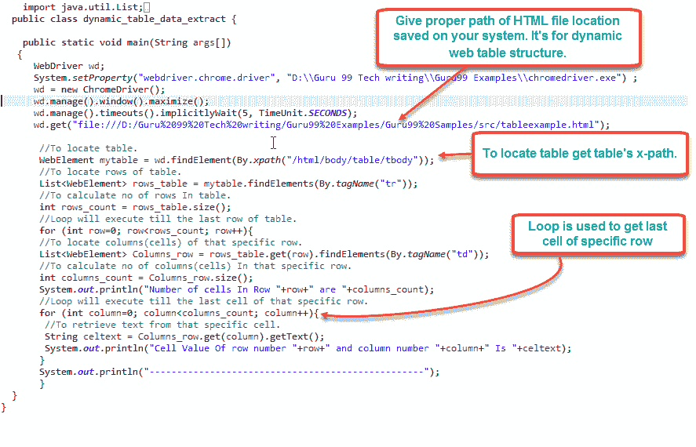

```
import java.text.ParseException;
import java.util.List;
import org.openqa.selenium.By;
import org.openqa.selenium.WebDriver;
import org.openqa.selenium.WebElement;
import java.util.concurrent.TimeUnit;
import org.openqa.selenium.chrome.ChromeDriver;

public class NofRowsColmns {
    public static void main(String[] args) throws ParseException {
    	WebDriver wd;
    	System.setProperty("webdriver.chrome.driver","G://chromedriver.exe");
    	wd = new ChromeDriver();
    	wd.manage().timeouts().implicitlyWait(5, TimeUnit.SECONDS);
    	wd.get("http://demo.guru99.com/test/table.html");
    	//To locate table.
    	WebElement mytable = wd.findElement(By.xpath("/html/body/table/tbody"));
    	//To locate rows of table. 
    	List < WebElement > rows_table = mytable.findElements(By.tagName("tr"));
    	//To calculate no of rows In table.
    	int rows_count = rows_table.size();
    	//Loop will execute till the last row of table.
    	for (int row = 0; row < rows_count; row++) {
    	    //To locate columns(cells) of that specific row.
    	    List < WebElement > Columns_row = rows_table.get(row).findElements(By.tagName("td"));
    	    //To calculate no of columns (cells). In that specific row.
    	    int columns_count = Columns_row.size();
    	    System.out.println("Number of cells In Row " + row + " are " + columns_count);
    	    //Loop will execute till the last cell of that specific row.
    	    for (int column = 0; column < columns_count; column++) {
    	        // To retrieve text from that specific cell.
    	        String celtext = Columns_row.get(column).getText();
    	        System.out.println("Cell Value of row number " + row + " and column number " + column + " Is " + celtext);
    	    }
    	    System.out.println("-------------------------------------------------- ");
    	}
   	}
}

```

**Code Explanation:**

*   rows_count 给出总行数
*   对于每一行，我们使用 rows_table.get（row）.findElements（By.tagName（“ td”）））获得列总数。
*   我们遍历每一列和每一行并获取值。

**输出**：

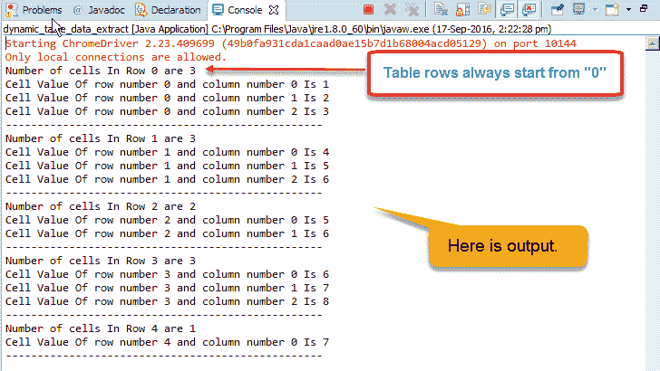

**摘要**

*   By.xpath（）通常用于访问表元素。
*   静态 Web 表本质上是一致的。 也就是说，它们确实具有固定的行数和单元格数据。
*   动态 Web 表是不一致的，即它们没有固定数量的行和单元格数据。
*   使用 Selenium Web 驱动程序，我们可以轻松处理动态 Web 表。
*   Selenium Webdriver 允许我们通过 X 路径访问动态 Web 表

本文由 Kanchan Kulkarni 提供。