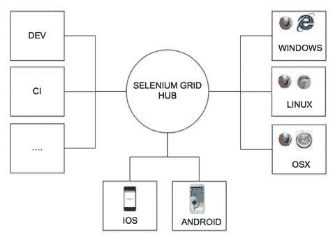
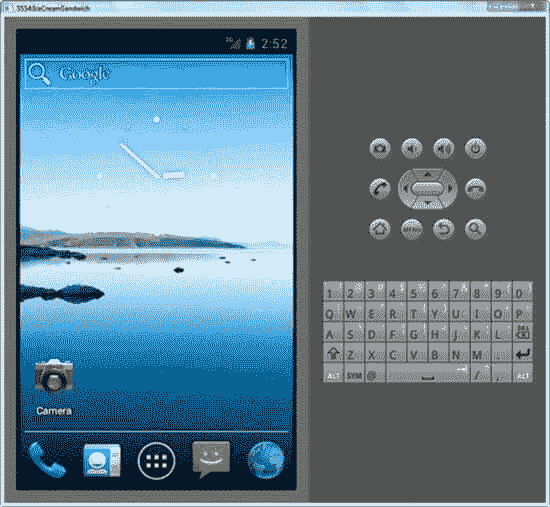

# Selenium WebDriver 中所需的功能

> 原文： [https://www.guru99.com/desired-capabilities-selenium.html](https://www.guru99.com/desired-capabilities-selenium.html)

## 什么是所需功能？

所需的功能是一系列键/值对，用于存储浏览器属性（如浏览器名称，浏览器版本，浏览器驱动程序在系统中的路径等），以确定运行时浏览器的行为。

*   还可以使用所需的功能来配置 Selenium WebDriver 的驱动程序实例。
*   我们可以使用所需功能来配置 FirefoxDriver，ChromeDriver，InternetExplorerDriver 等驱动程序实例。

在本教程中，您将学习-

*   [什么是所需功能？](#1)
*   [为什么我们需要所需功能？](#4)
*   [不同类型的所需功能方法](#2)
*   [设置功能方法](#3)的示例

## 为什么我们需要所需的功能？

每个[测试](/software-testing.html)场景都应在某些特定的测试环境上执行。 测试环境可以是 Web 浏览器，[移动](/mobile-testing.html)设备，移动仿真器，移动模拟器等。

所需功能类可帮助我们告诉 Webdriver，我们将在测试脚本中使用哪种环境。

DesiredCapabilities 类的 **setCapability 方法**，将在 Selenium Grid 中使用，在本教程的后面部分中将进行介绍。 它用于在不同的机器配置上执行并行执行。

**例如：网格**



它用于设置执行测试用例时使用的浏览器属性（例如 Chrome，IE），平台名称（例如 Linux，Windows）。

对于移动自动化，当我们在不同种类的移动设备上执行测试时，可以设置移动平台（例如 iOS，Android）平台版本（例如 Android 中的 3.x，4.x）。



上面的模拟器示例显示了 android 平台集和 IceCream Sandwich（4.x）平台版本集。

所需功能在以下情况下更有用：

*   在移动应用程序自动化中，可以在其中设置浏览器属性和设备属性。
*   在 Selenium 网格中，当我们想在具有不同操作系统和版本的不同浏览器上运行测试用例时。

## 不同类型的所需功能方法

在这里，我们将看到不同类型的所需功能方法，并了解如何使用此方法之一“ **setCapability Method”。**

1.  **getBrowserName（）**

```
public java.lang.String getBrowserName()
```

2.  **setBrowserName（）**

```
public void setBrowserName(java.lang.String browserName)
```

3.  **getVersion（）**

```
public java.lang.String getVersion()
```

4.  **setVersion（）**

```
public void setVersion(java.lang.String version)
```

5.  **getPlatform（）**

```
public Platform getPlatform()
```

6.  **setPlatform（）**

```
public Platform setPlatform()
```

7.  **getCapability 方法**

DesiredCapabilities 类的 getCapability 方法可用于获取系统中当前正在使用的功能。

```
public java.lang.Object getCapability(java.lang.String capabilityName)
```

8.  **setCapabilityMethod**

Desired Capabilities 类的 setCapability（）方法可用于设置设备名称，平台版本，平台名称，被测应用的绝对路径（被测应用（Android）的.apk 文件），应用活动（ 在 Android 中）和 appPackage（java）。

[Java](/java-tutorial.html) 中的**“ setCapability 方法”** 具有以下声明：

```
setCapability : public void setCapability(java.lang.String capabilityName,boolean value)
```

```
setCapability  :public void setCapability(java.lang.String capabilityName,java.lang.String value)
```

```
setCapability  :public void setCapability(java.lang.String capabilityName,Platform value)
```

```
setCapability  :public void setCapability(java.lang.String key,java.lang.Object value)
```

## 设置功能方法示例

让我们考虑一个示例，我们要在 Internet Explorer 浏览器中运行[测试用例](/test-case.html)，以使用 Selenium Webdriver 打开 www.gmail.com 网站。

以下是代码。

```
import org.openqa.selenium.WebDriver;
import org.openqa.selenium.ie.InternetExplorerDriver;

public class IEtestforDesiredCapabilities {

 public static void main(String[] args) {

WebDriver driver = new InternetExplorerDriver();
 driver.manage().window().maximize();
 driver.get("http://gmail.com");

 driver.quit();
 }

}

```

现在从 Eclipse 运行此代码，并检出控制台。

**输出：**

当执行上述代码时，它将引发以下错误。 发生此错误是因为未设置浏览器驱动程序的路径（在上述情况下为 IE）。硒代码无法找到浏览器。

**必须通过 webdriver.ie.driver 系统属性设置驱动程序可执行文件的路径； 有关更多信息，请参见 http://code.google.com/p/selenium/wiki/InternetExplorerDriver。 可以从 http://code.google.com/p/selenium/downloads/list 下载最新版本**

 **2012 年 12 月 11 日 org.openqa.selenium.ie.InternetExplorerDriverServer initializeLib

警告：不建议使用这种启动 IE 驱动程序的方法，该方法将在硒 2.26 中删除。 请从 http://code.google.com/p/selenium/downloads/list 下载 IEDriverServer.exe，并确保它位于您的 PATH 中。** 

**解决方案**：

错误本身的警告部分提供了上述问题的解决方案。

*   下载用于 32 位或 64 位的 Internet ExplorerDriver 独立服务器。
*   将驱动程序保存在系统中的适当位置。
*   使用 **System.setProperty** 方法设置驱动程序的路径。
*   它用于通过 webdriver 属性设置 IE 驱动程序。 它有助于找到存储在系统位置中的驱动程序可执行文件。 （例如：“ C：\ IEDriverLocation \ IEDriver.exe”）

```
import org.openqa.selenium.WebDriver;
import org.openqa.selenium.ie.InternetExplorerDriver;
import org.openqa.selenium.remote.DesiredCapabilities;

public class IEtestforDesiredCapabilities {

 public static void main(String[] args) {

//it is used to define IE capability 
 DesiredCapabilities capabilities = DesiredCapabilities.internetExplorer();

capabilities.setCapability(CapabilityType.BROWSER_NAME, "IE");
capabilities.setCapability(InternetExplorerDriver.
  INTRODUCE_FLAKINESS_BY_IGNORING_SECURITY_DOMAINS,true);

System.setProperty("webdriver.ie.driver", "C:\\IEDriverServer.exe");

 //it is used to initialize the IE driver
 WebDriver driver = new InternetExplorerDriver(capabilities);

 driver.manage().window().maximize();

 driver.get("http://gmail.com");

 driver.quit();
 }

}

```

**代码说明：**

在上面的代码中，

*   import 语句将导入 selenium Web 驱动程序所需的软件包，Internet Explorer 驱动程序所需的软件包，所需功能的软件包。
*   setCapability 将各种功能作为输入变量，然后由 Web 驱动程序用于在所需环境中启动应用程序。
*   setProperty 用于设置驱动程序所在的路径。 Web 驱动程序然后找到所需的驱动程序。
*   通过使用“ get”方法在 Internet Explorer 浏览器中打开 Gmail 网站。

**Output:**

Internet Explorer 浏览器上的测试用例将使用 Selenium Webdriver 成功运行。

**结论**

所需功能类将帮助设置一个环境，以定义可以在其上执行测试的浏览器/环境的行为。

它有助于在具有所需功能的理想环境中启动我们的应用程序。

***本文由 Krithika Ramkumar 发表***