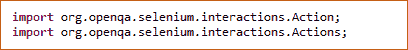
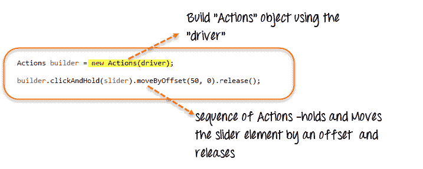
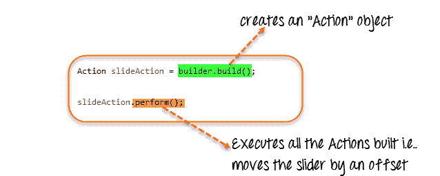
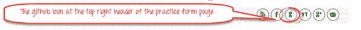
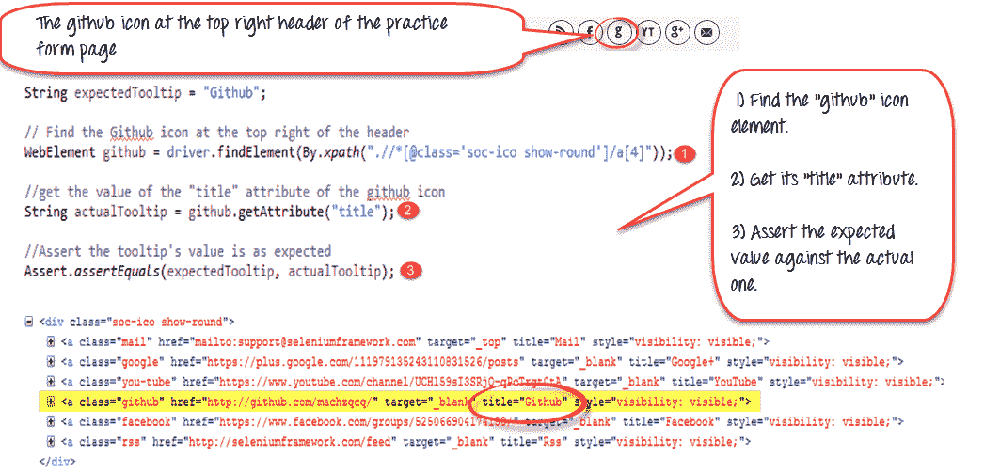
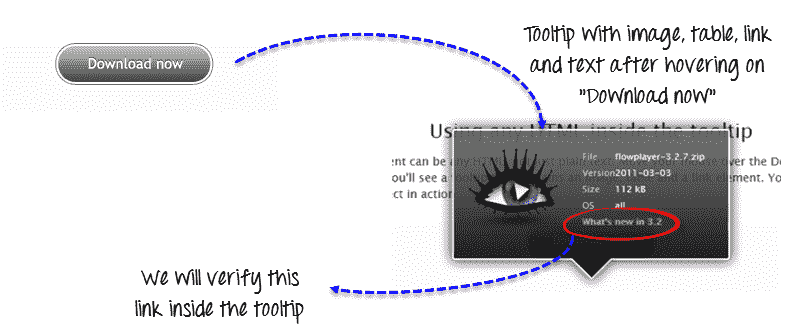
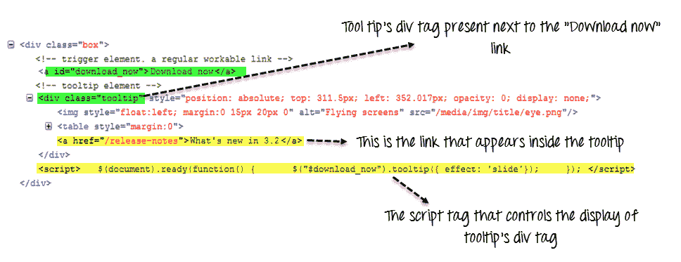
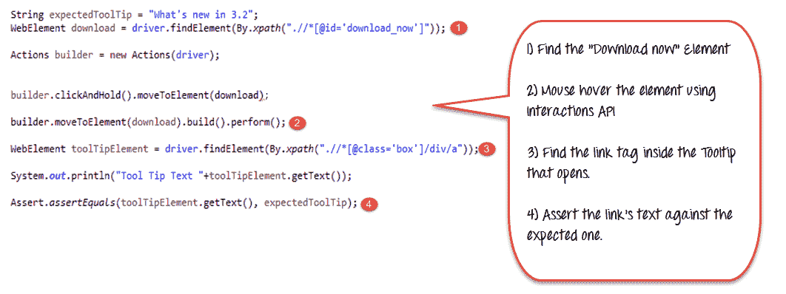

# 如何使用 Selenium WebDriver 验证工具提示

> 原文： [https://www.guru99.com/verify-tooltip-selenium-webdriver.html](https://www.guru99.com/verify-tooltip-selenium-webdriver.html)

工具提示是当鼠标悬停在网页上的对象（如链接，图像，按钮，文本区域等）上时出现的文本。 文本通常会提供有关其出现的对象的更多信息。

传统上，工具提示是作为元素的“标题”属性来实现的。 此属性的值显示为鼠标悬停时的工具提示。 这是静态文本，不带样式地提供元素的信息。

现在，有许多插件可用于“工具提示”实施。 带有样式，渲染，图像和链接的高级工具提示正在使用 JavaScript / JQuery 插件或 CSS 工具提示来实现。

*   为了访问或验证使用 HTML“ title”属性实现的静态工具提示，我们可以简单地使用 WebElement 的 getAttribute（“ title”）方法。 将此方法的返回值（即工具提示文本）与期望值进行比较以进行验证。
*   对于其他形式的工具提示实现，我们将必须使用 Web 驱动程序提供的“高级用户交互 API”来创建鼠标悬停效果，然后检索该元素的工具提示。

## 高级用户交互 API 简介：

Advanced User Interactions API 为用户操作提供了 API，例如在网页上使用键盘或鼠标进行拖放，悬停，多选，按键和释放以及其他操作。

您可以参考此链接以获取有关 API 的更多详细信息。

[https://seleniumhq.github.io/selenium/docs/api/java/index.html?org/openqa/selenium/interactions/Actions.html](https://seleniumhq.github.io/selenium/docs/api/java/index.html?org/openqa/selenium/interactions/Actions.html)

在这里，让我们看看如何使用几个类和方法，这些类和方法将需要将滑块元素移动一个偏移量。

**步骤 1）**为了使用 API​​，需要导入以下包/类：



**步骤 2）**创建一个“ Actions”类的对象，并构建用户动作序列。 Actions 类用于构建用户动作的序列，如 moveToElement（），dragAndDrop（）等。API 提供了与用户动作相关的各种方法。

驱动程序对象作为其构造函数的参数提供。



**步骤 3）**使用“ Actions”类的 build（）方法创建一个 Action Object。 调用 perform（）方法以执行由 Actions 对象（此处为 builder）构建的所有操作。



我们已经看到了如何使用 API​​提供的一些用户 Actions 方法-clickAndHold（element），moveByOffset（10,0），release（）。 API 提供了许多此类方法。

有关更多详细信息，请参见[链接](https://seleniumhq.github.io/selenium/docs/api/java/index.html?org/openqa/selenium/interactions/Actions.html)。

## 如何在 Selenium Webdriver 中获取工具提示文本

让我们看一下在简单场景中访问和验证工具提示的演示

*   方案 1：使用“ title”属性实现工具提示
*   方案 2：工具提示是使用 jQuery 插件实现的。

### **方案 1：HTML“标题”属性**

对于这种情况，让我们以示例网站- [http://demo.guru99.com/test/social-icon.html](http://demo.guru99.com/test/social-icon.html) 为例。

我们将尝试验证页面右上方的“ github”图标的工具提示。



为了做到这一点，我们将首先找到该元素并获取其“ title”属性，并使用预期的工具提示文本进行验证。

由于我们假设工具提示位于“ title”属性中，因此我们甚至没有自动实现鼠标悬停效果，而只是使用“ getAttribute（）”方法检索该属性的值。



**这是代码**

```
import org.openqa.selenium.By;		
import org.openqa.selenium.WebDriver;		
import org.openqa.selenium.chrome.ChromeDriver;		
import org.openqa.selenium.*;		

public class ToolTip {				
    public static void main(String[] args) {									

        String baseUrl = "http://demo.guru99.com/test/social-icon.html";					
        System.setProperty("webdriver.chrome.driver","G:\\chromedriver.exe");					
        WebDriver driver = new ChromeDriver();					
        driver.get(baseUrl);					
        String expectedTooltip = "Github";	

        // Find the Github icon at the top right of the header		
        WebElement github = driver.findElement(By.xpath(".//*[@class='soc-ico show-round']/a[4]"));	

        //get the value of the "title" attribute of the github icon		
        String actualTooltip = github.getAttribute("title");	

        //Assert the tooltip's value is as expected 		
        System.out.println("Actual Title of Tool Tip"+actualTooltip);							
        if(actualTooltip.equals(expectedTooltip)) {							
            System.out.println("Test Case Passed");					
        }		
        driver.close();			
   }		
}		

```

**代码**的说明

1.  找到代表“ github”图标的 WebElement。
2.  使用 getAttribute（）方法获取其“ title”属性。
3.  将值与预期的工具提示值进行对照。

### 方案 2：JQuery 插件：

有很多 JQuery 插件可用于实现工具提示，并且每个插件都有略有不同的实现形式。

一些插件希望工具提示 HTML 始终显示在工具提示适用的元素旁边，而其他插件则创建一个动态的“ div”标签，将其悬停在元素上时会即时显示。

对于我们的演示，让我们考虑工具提示实现的“ jQuery Tools Tooltip”方法。

在 URL – [http://demo.guru99.com/test/tooltip.html](http://demo.guru99.com/test/tooltip.html) 中，您可以看到演示，将鼠标悬停在“立即下载”上，我们将获得带有图像的高级工具提示， 标注背景，表格以及其中的可点击链接。



如果查看下面的源代码，您会发现代表工具提示的 div 标签始终位于“立即下载”链接的标签旁边。 但是，下面的 script 标记内的代码控制何时需要弹出。



让我们尝试仅验证工具提示中的链接文本以进行此处的演示。

我们将首先找到与“立即下载”相对应的 WebElement。 然后使用 Interactions API，我们将移至元素（鼠标悬停）。 接下来，我们将在显示的工具提示中找到与链接相对应的 WebElement，并根据预期的文本进行验证。



**Here is the code**

```
import org.openqa.selenium.interactions.Action;		
import org.openqa.selenium.interactions.Actions;		
import org.openqa.selenium.By;		
import org.openqa.selenium.WebDriver;		
import org.openqa.selenium.chrome.ChromeDriver;		
import org.openqa.selenium.*;		

public class JqueryToolTip {				
    public static void main(String[] args) {									

        String baseUrl = "http://demo.guru99.com/test/tooltip.html";					
        System.setProperty("webdriver.chrome.driver","G:\\chromedriver.exe");	

        WebDriver driver = new ChromeDriver();					
        String expectedTooltip = "What's new in 3.2";					
        driver.get(baseUrl);					

        WebElement download = driver.findElement(By.xpath(".//*[@id='download_now']"));							
        Actions builder = new Actions (driver);							

        builder.clickAndHold().moveToElement(download);					
        builder.moveToElement(download).build().perform(); 	

        WebElement toolTipElement = driver.findElement(By.xpath(".//*[@class='box']/div/a"));							
        String actualTooltip = toolTipElement.getText();			

        System.out.println("Actual Title of Tool Tip  "+actualTooltip);							
        if(actualTooltip.equals(expectedTooltip)) {							
            System.out.println("Test Case Passed");					
        }		
        driver.close();			
   }		
}		

```

**代码说明**

1.  找到与将鼠标悬停的元素“立即下载”相对应的 WebElement。
2.  使用 Interactions API，将鼠标悬停在“立即下载”上。
3.  假设显示了工具提示，请找到与工具提示内的链接相对应的 WebElement，即“ a”标签。
4.  根据我们存储在“ expectedToolTip”中的期望值，验证使用 getText（）检索到的链接的工具提示文本

### 摘要：

在本教程中，您学习了如何使用 Selenium Web 驱动程序访问工具提示。

*   工具提示以不同的方式实现–
    *   基本实现基于 HTML 的“ title”属性。 getAttribute（title）获取工具提示的值。
    *   其他工具提示实现（例如 JQuery），CSS 工具提示需要 Interactions API 来创建鼠标悬停效果
*   进阶使用者互动 API
    *   Actions 类的 moveToElement（element）用于将鼠标悬停在元素上。
    *   Actions 类的 Build（）方法将用户操作序列构建到 Action 对象中。
    *   Action 类的 Perform（）一次执行所有用户操作序列。
*   为了验证工具提示，我们必须首先将鼠标悬停在元素上，然后找到与工具提示相对应的元素，并获取其文本或其他值以对照预期值进行验证。