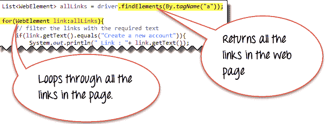
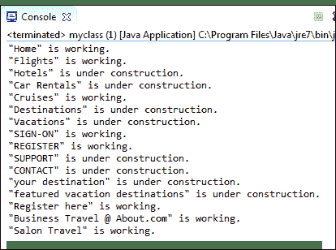

# 如何使用 Selenium Webdriver 查找所有/断开的链接

> 原文： [https://www.guru99.com/find-broken-links-selenium-webdriver.html](https://www.guru99.com/find-broken-links-selenium-webdriver.html)

## 什么是链接断开？

断开的链接是无法访问的链接或 URL。 由于某些服务器错误，它们可能已关闭或无法运行

URL 的状态始终为有效 2xx。 不同的 HTTP 状态代码具有不同的用途。 对于无效请求，HTTP 状态为 4xx 和 5xx。

4xx 类状态码主要用于客户端错误，而 5xx 类状态码主要用于服务器响应错误。

在单击并确认之前，我们很可能无法确认该链接是否正常工作。

## 为什么要检查断开的链接？

您应始终确保网站上没有断开的链接，因为用户不应进入错误页面。

如果未正确更新规则或服务器上不存在请求的资源，则会发生错误。

手动检查链接是一项繁琐的任务，因为每个网页可能都有大量链接&，必须对所有页面重复进行手动处理。

使用 Selenium 的自动化脚本将使过程自动化，这是更合适的解决方案。

## 如何检查断开的链接和图像

要检查断开的链接，您需要执行以下步骤。

1.  基于<和>标签收集网页中的所有链接。
2.  发送该链接的 HTTP 请求并读取 HTTP 响应代码。
3.  根据 HTTP 响应代码找出链接是有效的还是断开的。
4.  对所有捕获的链接重复此操作。

## 查找网页上断开链接的代码

以下是测试我们的用例的 Web 驱动程序代码：

```
package automationPractice;

import java.io.IOException;
import java.net.HttpURLConnection;
import java.net.MalformedURLException;
import java.net.URL;
import java.util.Iterator;
import java.util.List;

import org.openqa.selenium.By;
import org.openqa.selenium.WebDriver;
import org.openqa.selenium.WebElement;
import org.openqa.selenium.chrome.ChromeDriver;

public class BrokenLinks {

    private static WebDriver driver = null;

    public static void main(String[] args) {
        // TODO Auto-generated method stub

        String homePage = "http://www.zlti.com";
        String url = "";
        HttpURLConnection huc = null;
        int respCode = 200;

        driver = new ChromeDriver();

        driver.manage().window().maximize();

        driver.get(homePage);

        List<WebElement> links = driver.findElements(By.tagName("a"));

        Iterator<WebElement> it = links.iterator();

        while(it.hasNext()){

            url = it.next().getAttribute("href");

            System.out.println(url);

            if(url == null || url.isEmpty()){
System.out.println("URL is either not configured for anchor tag or it is empty");
                continue;
            }

            if(!url.startsWith(homePage)){
                System.out.println("URL belongs to another domain, skipping it.");
                continue;
            }

            try {
                huc = (HttpURLConnection)(new URL(url).openConnection());

                huc.setRequestMethod("HEAD");

                huc.connect();

                respCode = huc.getResponseCode();

                if(respCode >= 400){
                    System.out.println(url+" is a broken link");
                }
                else{
                    System.out.println(url+" is a valid link");
                }

            } catch (MalformedURLException e) {
                // TODO Auto-generated catch block
                e.printStackTrace();
            } catch (IOException e) {
                // TODO Auto-generated catch block
                e.printStackTrace();
            }
        }

        driver.quit();

    }
}

```

## 解释代码示例

### 步骤 1：导入软件包

除默认软件包外，还导入以下软件包：

```
import java.net.HttpURLConnection;
```

使用此包中的方法，我们可以发送 HTTP 请求并从响应中捕获 HTTP 响应代码。

### 步骤 2：收集网页中的所有链接

标识网页中的所有链接并将其存储在列表中。

```
List<WebElement> links = driver.findElements(By.tagName("a"));
```

获取迭代器以遍历列表。

```
Iterator<WebElement> it = links.iterator();
```

### 步骤 3：识别和验证 URL

在这一部分中，我们将检查 URL 是否属于第三方域或 URL 是否为空/空。

获取锚标记的 href 并将其存储在 url 变量中。

```
url = it.next().getAttribute("href");
```

检查 URL 是否为空或为空，如果满足条件，则跳过其余步骤。

```
if(url == null || url.isEmpty()){
              System.out.println("URL is either not configured for anchor tag or it is empty");
              continue;
     }
```

检查 URL 是属于主域还是第三方。 如果它属于第三方域，请跳过其余步骤。

```
 if(!url.startsWith(homePage)){
           System.out.println("URL belongs to another domain, skipping it.");
           continue;
   }
```

### 步骤 4：发送 http 请求

HttpURLConnection 类具有发送 HTTP 请求和捕获 HTTP 响应代码的方法。 因此，openConnection（）方法（URLConnection）的输出类型转换为 HttpURLConnection。

```
huc = (HttpURLConnection)(new URL(url).openConnection());
```

我们可以将请求类型设置为“ HEAD”而不是“ GET”。 这样就只返回标题，而不返回文档主体。

```
huc.setRequestMethod("HEAD");
```

在调用 connect（）方法时，将建立与 url 的实际连接并发送请求。

```
huc.connect();
```

### 步骤 5：验证链接

使用 getResponseCode（）方法，我们可以获取请求的响应代码

```
respCode = huc.getResponseCode();
```

根据响应代码，我们将尝试检查链接状态。

```
if(respCode >= 400){
        System.out.println(url+" is a broken link");
}
else{
        System.out.println(url+" is a valid link");
}

```

因此，我们可以从网页上获取所有链接并打印链接是否有效。

希望本教程可以帮助您使用硒检查断开的链接。

## 如何获取网页的所有链接

Web [测试](/software-testing.html)中的常见过程之一是测试页面中存在的所有链接是否正常工作。 使用 **Java for-each 循环**， **findElements（）** & **By.tagName（“ a”）**方法的组合，可以方便地完成此操作。

findElements（）方法返回带有标签 a 的 Web 元素列表。 使用 for-each 循环，可以访问每个元素。



下面的 WebDriver 代码检查 Mercury Tours 主页上的每个链接，以确定正在运行的链接和仍在构建的链接。

```
import org.openqa.selenium.By;		
import org.openqa.selenium.WebDriver;		
import org.openqa.selenium.chrome.ChromeDriver;		
import java.util.List;		
import java.util.concurrent.TimeUnit;		
import org.openqa.selenium.*;		

public class P1 {				

    public static void main(String[] args) {									
        String baseUrl = "http://demo.guru99.com/test/newtours/";					
        System.setProperty("webdriver.chrome.driver","G:\\chromedriver.exe");					
        WebDriver driver = new ChromeDriver();					

        String underConsTitle = "Under Construction: Mercury Tours";					
			driver.manage().timeouts().implicitlyWait(5, TimeUnit.SECONDS);					

			driver.get(baseUrl);					
        List<WebElement> linkElements = driver.findElements(By.tagName("a"));							
        String[] linkTexts = new String[linkElements.size()];							
			int					i = 0;					

			//extract the link texts of each link element		
			for (WebElement e : linkElements) {							
			linkTexts[i] = e.getText();							
			i++;			
        }		

			//test each link		
			for (String t : linkTexts) {							
			driver.findElement(By.linkText(t)).click();					
			if (driver.getTitle().equals(underConsTitle)) {							
                System.out.println("\"" + t + "\""								
                        + " is under construction.");			
            } else {			
                System.out.println("\"" + t + "\""								
                        + " is working.");			
            }		
			driver.navigate().back();			
        }		
			driver.quit();			
    }		
}

```

输出应类似于以下指示的输出。

*   使用 By.cssSelector（）和 By.xpath（）方法访问图像链接。

.png)

### 故障排除

在单独的情况下，代码访问的第一个链接可以是“主页”链接。 在这种情况下，当第一个动作打开浏览器时，driver.navigate.back（）动作将显示空白页面。 驱动程序将无法在空白浏览器中找到所有其他链接。 因此，IDE 将引发异常，其余代码将不执行。 使用 If 循环可以轻松地处理此问题。