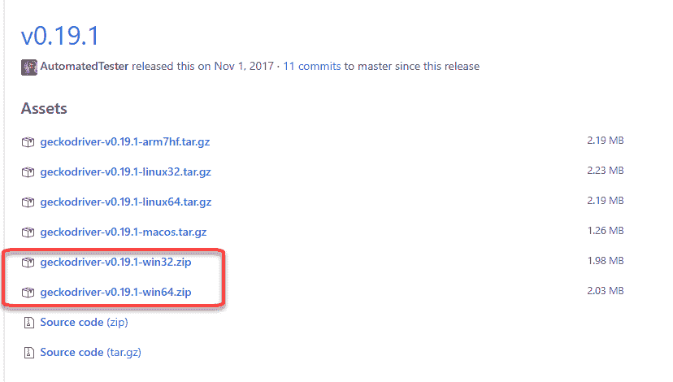
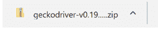
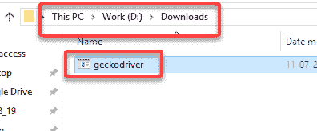

# Gecko（Marionette）驱动程序 Selenium：下载，安装，与 Firefox 一起使用

> 原文： [https://www.guru99.com/gecko-marionette-driver-selenium.html](https://www.guru99.com/gecko-marionette-driver-selenium.html)

## 什么是壁虎驱动程序？

术语 Gecko 代表 Mozilla Firefox 浏览器中内置的 Web 浏览器引擎。 Gecko 驱动程序充当启用 Web 驱动程序的客户端（Eclipse，Netbeans 等）和 Mozilla Firefox 浏览器之间的代理。 简而言之，Gecko 驱动程序充当 Selenium Web 驱动程序测试与 Mozilla Firefox 浏览器之间的链接。

在 Selenium 3 之前，Mozilla Firefox 浏览器是 Selenium 的默认浏览器。 在 Selenium 3 之后，测试人员需要使用 GeckoDriver 显式初始化脚本以使用 Firefox。 Selenium 使用 W3C Webdriver 协议将请求发送到 GeckoDriver，后者将其转换为名为 Marionette 的协议。 Firefox 将了解以木偶协议形式传输的命令并执行它们。


## 使用 Gecko 驱动程序的优势

Selenium Webdriver 版本 2.53 与 Mozilla Firefox 版本 47.0+不兼容。 Mozilla Firefox 早期版本中使用的 Firefox 驱动程序将停止使用，仅使用 GeckoDriver 实现。 因此，如果测试人员想要在 Mozilla Firefox 47.0+版本上运行自动化测试，则不得不使用 GeckoDriver。 但是最大的问题-优势是什么？

与默认的 Firefox 驱动程序相比，使用 GeckoDriver 的主要优点是**兼容性**。 GeckoDriver 使用 **W3C WebDriver 协议**与 Selenium 通信。 W3C 是 Web 驱动程序的通用定义标准。 这意味着 Selenium 开发人员（编码 Selenium 基础的人们）无需为每个浏览器版本创建 Web 驱动程序的新版本。 相同的 Web 驱动程序可用于多个浏览器版本。 因此，与早期版本的 Firefox 驱动程序相比，首选 GeckoDriver。

## 下载并安装 Gecko 驱动程序：

Gecko 驱动程序作为可执行文件提供，可以在系统上下载。 以下是下载 gecko 驱动程序的步骤列表。

**步骤 1）**在此页面 [https://github.com/mozilla/geckodriver/releases](https://github.com/mozilla/geckodriver/releases) ，根据您的操作系统选择适合 GeckoDriver 下载的版本



**步骤 2）** ZIP 文件下载完成后，将 ZIP 文件的内容提取到文件夹中



**步骤 3）**注意您提取驱动程序的位置。 稍后将使用 location 实例化驱动程序。

[ ](/images/1/030118_0746_GeckoMarion3.png) 

## 初始化 GeckoDriver 的方法：

有三种不同的初始化 GeckoDriver 的方法。

**1.使用 DesiredCapabilities：**

首先，设置 Gecko 驱动程序的系统属性。

句法：

```
System.setProperty("webdriver.gecko.driver","Path to geckdriver.exe file");
```

例：

```
System.setProperty("webdriver.gecko.driver","D:\\Downloads\\GeckoDriver.exe");
```

接下来，设置所需功能。

所需功能可帮助 Selenium 了解浏览器名称，版本和操作系统以执行自动化测试。 下面是使用 DesiredCapabilities 类设置壁虎驱动程序的代码。

```
DesiredCapabilities capabilities = DesiredCapabilities.firefox();
capabilities.setCapability("marionette",true);
```

这是完整的代码

```
System.setProperty("webdriver.gecko.driver", driverPath);
DesiredCapabilities capabilities = DesiredCapabilities.firefox();
capabilities.setCapability("marionette",true);
driver= new FirefoxDriver(capabilities);

```

**2.使用木偶属性：**

Gecko 驱动程序也可以使用 marionette 属性进行初始化，如下所示

```
System.setProperty("webdriver.gecko.driver","D:\\Downloads\\GeckoDriver.exe");
```

如果使用上述方法初始化了壁虎驱动程序，则不需要**即可获得所需功能的代码。**

**3.使用 FirefoxOptions：**

Mozilla Firefox 47+版本具有木偶驱动程序作为旧版系统。 利用这一点，可以使用 Firefox Options 如下调用 marionette 驱动程序

```
FirefoxOptions options = new FirefoxOptions();
options.setLegacy(true);
```

## 使用 Gecko 驱动程序启动 firefox 的代码：

```
package com.guru99.demo;

import org.junit.After;
import org.junit.Before;
import org.junit.Test;
import org.openqa.selenium.WebDriver;
import org.openqa.selenium.firefox.FirefoxDriver;
import org.openqa.selenium.remote.DesiredCapabilities;

public class GeckoDriverDemo {

    String driverPath = "D:\\Guru99Demo\\GeckoDriver.exe";
    public WebDriver driver;

    @Before
    public void startBrowser() {
        System.setProperty("webdriver.gecko.driver", driverPath);
        DesiredCapabilities capabilities = DesiredCapabilities.firefox();
        capabilities.setCapability("marionette", true);
        driver = new FirefoxDriver(capabilities);

    }

    @Test
    public void navigateToUrl() {
        driver.get("http://demo.guru99.com/selenium/guru99home/");
    }

    @After
    public void endTest() {
        driver.quit();
    }

}

```

代码说明：

**@Before 方法：**

最初，我们需要将 gecko 驱动程序的系统属性设置为 geckdriver.exe 文件下载位置。 我们需要将 Selenium 的 marionette 属性设置为 true 才能使用 Marionette 协议与 Gecko Driver 进行通信。 最后，我们需要使用“所需功能”对象启动 Firefox 浏览器实例。

以下语句有助于完成上述任务。

```
System.setProperty("webdriver.gecko.driver", driverPath);
DesiredCapabilities capabilities = DesiredCapabilities.firefox();
capabilities.setCapability("marionette",true);
driver= new FirefoxDriver(capabilities);

```

**@测试方法：**

我们正在使用 Selenium Web 驱动程序提供的内置“ get”方法导航到用户指定的 URL。 以下语句有助于实现相同目的。

```
driver.get("http://demo.guru99.com/selenium/guru99home/");
```

**@After 方法：**

最后，我们使用 quit 方法关闭浏览器实例。

```
driver.quit();
```

## 将非 Gecko 的脚本修改为 Gecko：

Selenium 3 之前使用的非 gecko 驱动程序脚本非常简单。 我们需要创建 Firefox 驱动程序的实例并使用 instance 变量。

```
@Before
public void startBrowser() {
    driver = new FirefoxDriver();

}

```

要转换为壁虎，您只需添加一行代码

```
    @Before
    public void startBrowser() {
        System.setProperty("webdriver.gecko.driver", "D:\\Downloads\\GeckoDriver.exe");
        driver = new FirefoxDriver();

    }

```

## 使用 Gecko 驱动程序时发生常见异常：

以下列出了在使用 Gecko Driver 并具有解决方案时发生的常见异常。

**1.驱动程序可执行文件的路径必须由 webdriver.gecko.driver 系统属性设置：**

当用户尝试实例化 Firefox 驱动程序而不设置 gecko 驱动程序的系统属性时，将发生此异常。 这通常由 Selenium 的初学者完成，他们不知道从 Selenium 3 到 Selenium 先前版本所做的更改。

解决上述异常的方法是使用下面的 geckodriver.exe 文件位置设置 gecko 驱动程序的系统属性

```
System.setProperty("webdriver.gecko.driver", "D:\\Downloads\\geckodriver.exe");
```

请注意，在创建 Mozilla Firefox 驱动程序实例之前，需要设置 gecko 驱动程序的属性。

**2\. Firefox 未连接异常：**

```
org.openqa.selenium.firefox.NotConnectedException: Unable to connect to host 127.0.0.1 on port 7055 after 45000 ms.
```

当 Firefox 版本已升级到最新版本时，通常会发生此异常。 解决此异常的方法是将 Selenium jar 文件和 gecko 驱动程序更新为最新版本并使用它们。

**3.会话未创建异常：**

```
org.openqa.selenium.SessionNotCreatedException: Unable to create new remote session.
```

由于 Selenium 和 Gecko 驱动程序之间的兼容性问题，发生此异常。 Gecko 驱动程序可用于 Firefox 47 或更高版本。 可以通过将 Firefox 版本更新到 47 或更高版本来解决。

**4.连接被拒绝异常：**

```
WebDriver Exception: Connection Refused
```

当 Web 驱动程序无法与 Firefox 建立连接时，会生成此消息。 可以使用以下任何一种技术来解决。

*   使用 driver.quit（）方法销毁 Web 驱动程序的早期实例
*   在执行自动化测试之前，请清理浏览器缓存
*   在 Eclipse IDE 中清理项目工作区
*   始终使用最新版本的 selenium gecko 驱动程序和最新版本的 Firefox 浏览器