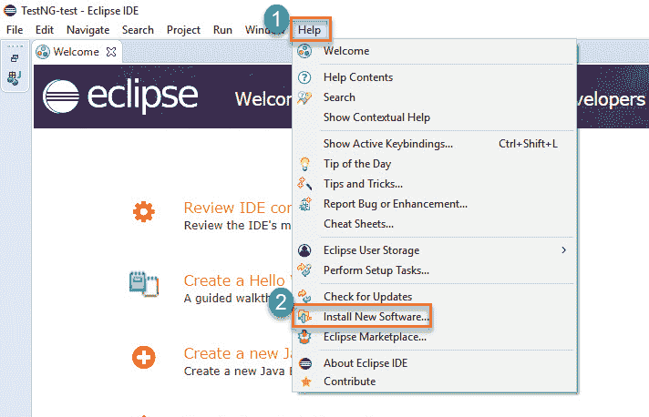
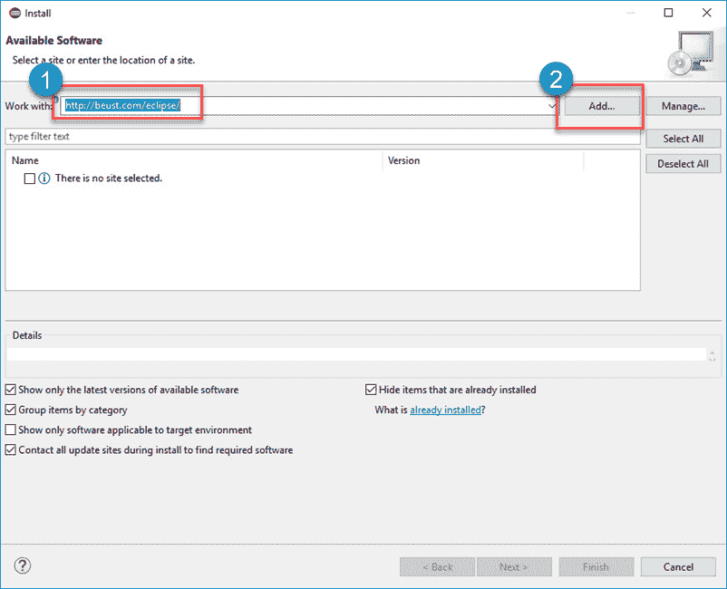
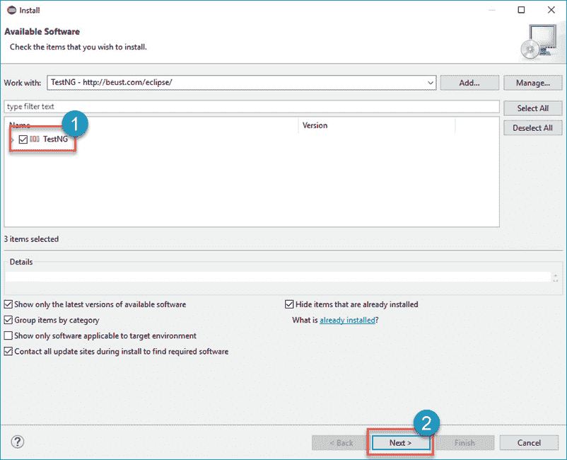
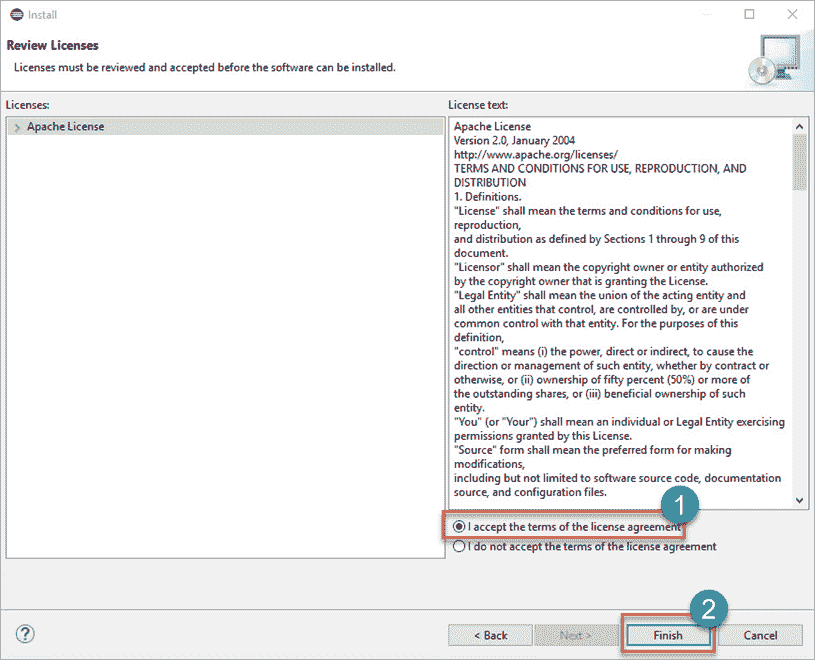
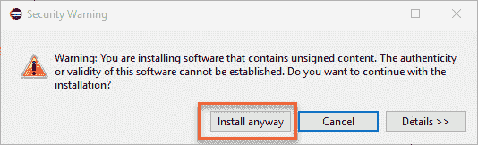
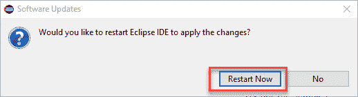
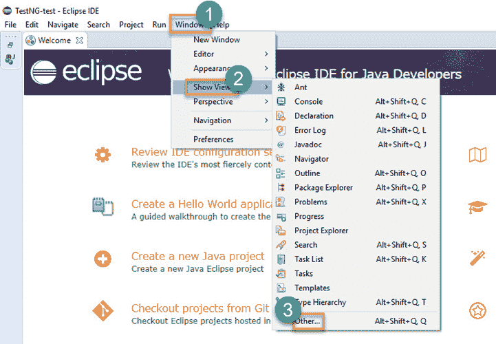
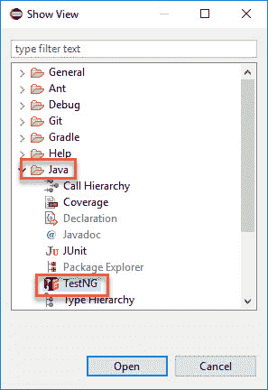

# 如何下载&在 Eclipse 中为 Selenium WebDriver 安装 TestNG

> 原文： [https://www.guru99.com/install-testng-in-eclipse.html](https://www.guru99.com/install-testng-in-eclipse.html)

以下是在 Eclipse 中安装 TestNG 的分步指南

## 在 Eclipse 中安装 TestNG

**步骤 1）**启动 Eclipse。

1.  在菜单栏上，单击“帮助”。
2.  选择“安装新软件…”选项。

**步骤 2）**在 Eclipse Install 对话框中

1.  在“使用方式”框中输入“ http://dl.bintray.com/testng-team/testng-eclipse-release/”
2.  单击添加按钮。

**步骤 3）**在“添加存储库”对话框中

1.  在名称文本字段中输入“ TestNG”
2.  点击添加按钮。

它将搜索输入的软件。

**步骤 4）**

1.  选中“ TestNG”复选框
2.  点击“下一步”按钮。

**步骤 5）**它将使您对要安装的项目进行审查。 单击下一步。

**步骤 6）**

1.  选择单选按钮“我接受许可协议的条款”
2.  单击完成。

这将需要时间，具体取决于您的 Internet 速度。

**步骤 7）**如果遇到安全警告，只需单击“仍然安装”。

**步骤 8）**等待安装完成。 当 Eclipse 提示您重新启动时，单击“立即重新启动”。

**步骤 9）**重新启动后，请验证 TestNG 是否确实已成功安装。 单击窗口>显示视图>其他。

然后打开 Java 目录，查看是否包含 TestNG。

到 TestNG 安装就可以了