# TestNG 教程：Selenium 中的注释，框架和示例

> 原文： [https://www.guru99.com/all-about-testng-and-selenium.html](https://www.guru99.com/all-about-testng-and-selenium.html)

## 什么是 TestNG？

**TestNG** 是一个自动化测试框架，其中 NG 代表“下一代”。 TestNG 的灵感来自使用注释（@）的 [JUnit](/junit-tutorial.html) 。 TestNG 克服了 JUnit 的缺点，旨在简化端到端测试。

使用 TestNG，您可以生成正确的报告，并且可以轻松了解通过，失败和跳过了多少个测试用例。 您可以单独执行失败的测试用例。

例如：

*   假设您有五个测试用例，则为每个测试用例编写一种方法（假定使用 main 方法编写程序而未使用 testNG）。 当您第一次运行该程序时，将成功执行三种方法，而第四种方法将失败。 然后更正第四个方法中存在的错误，现在您只想运行第四个方法，因为前三个方法始终可以成功执行。 不使用 TestNG，这是不可能的。
*   TestNG 在 test-output 文件夹中提供了一个选项，即 testng-failed.xml 文件。 如果您只想运行失败的测试用例，则意味着您运行此 XML 文件。 它将仅执行失败的测试用例。

除了上述概念之外，您还将了解有关 TestNG 的更多信息，例如 TestNG 的优点，如何使用@test 批注创建测试方法，如何将这些类转换为测试套件文件并通过 eclipse 以及从命令行执行 。

在本教程中，您将学习

*   [为什么将 TestNG 与硒一起使用？](#2)
*   [TestNG 优于 JUnit](#3) 的优势
*   [第一个使用注释的测试用例](#4)
*   [创建一个新的 TestNG 测试文件](#5)

*   [编码我们的第一个测试用例](#6)
*   [运行测试](#7)

*   [正在检查由 TestNG](#8) 创建的报告
*   [NGT0]中使用的注解[](#9)
*   [多个测试用例](#10)
*   [参数](#11)

*   [多个参数](#12)
*   [TestNG 注释的摘要](#13)

### 为什么将 TestNG 与硒一起使用？

默认的硒测试不会为测试结果生成正确的格式。 使用 TestNG，我们可以生成测试结果。

由于其优势，大多数 Selenium 用户都比 [Junit](/junit-tutorial.html) 更多地使用它。 TestNG 有这么多的功能，但是我们仅关注可在 Selenium 中使用的最重要的功能。 以下是 TestNG 的主要功能

*   以适当的格式生成报告，包括运行的测试用例，通过的测试用例的数量，失败的测试用例的数量以及跳过的测试用例的数量。
*   通过将多个测试用例转换为 testng.xml 文件，可以更轻松地对其进行分组。 您可以在其中确定应首先执行哪个测试用例的优先级。
*   只需使用名为“调用计数”的关键字，就可以多次执行同一测试用例而无循环。
*   使用 testng，您可以在多个浏览器上执行多个测试用例，即跨浏览器测试。
*   该测试框架可以轻松地与 Maven，Jenkins 等工具集成。
*   例如，测试中使用的注释非常容易理解：@ BeforeMethod，@ AfterMethod，@ BeforeTest，@ AfterTest
*   WebDriver 没有用于生成报告的本机机制。 TestNG 可以采用可读格式生成报告，如下所示。

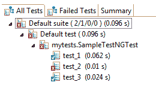

*   TestNG 简化了测试编码的方式。 在我们的测试中，不再需要静态的 main 方法。 操作顺序由易于理解的注释（不需要方法是静态的）进行调节。

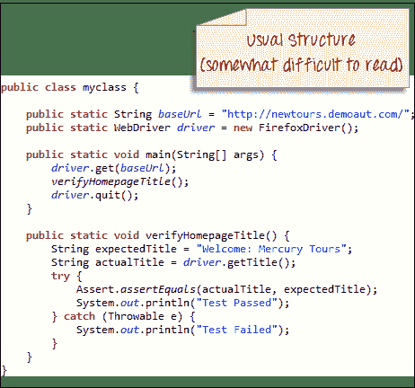

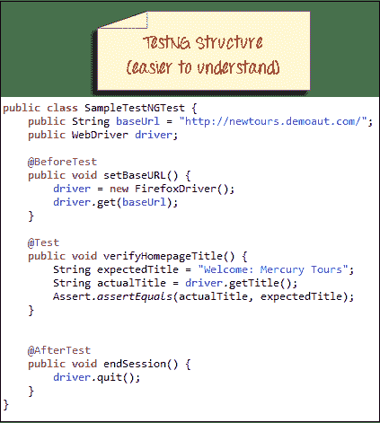

*   未捕获的异常由 TestNG 自动处理，而不会过早终止测试。 这些异常在报告中被报告为失败的步骤。

## TestNG 比 JUnit 的优势

与 JUnit 相比，TestNG 具有三个主要优点：

*   注释更容易理解
*   测试用例可以更容易地分组
*   可以并行测试

**TestNG 中的注释是可以控制将如何执行其下方法的代码行**。 它们始终以@符号开头。 下面是一个非常早期和快速的示例。


批注将在后面的“ TestNG 中使用的批注”一节中讨论，因此如果您还不了解上述示例，那是完全可以的。 重要的是，现在要注意，TestNG 中的注释比 JUnit 中的代码更易于编码和理解。

可以并行运行测试的功能在 TestNG 中可用，但在 JUnit 中不可用，因此它是使用 Selenium Grid 的测试人员的首选框架。

## 使用注释的第一个测试用例

在创建测试用例之前，我们应该首先在 Eclipse 中设置一个新的 TestNG Project，并将其命名为“ FirstTestNGProject”。

### 设置一个新的 TestNG 项目

**步骤 1：**单击文件>新建> [Java](/java-tutorial.html) 项目

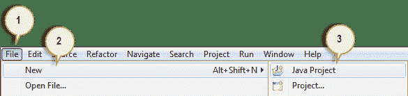

**步骤 2：**键入“ FirstTestNGProject”作为项目名称，然后单击“下一步”。

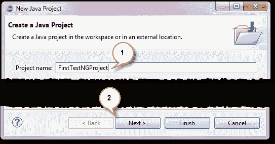

**步骤 3：**现在，我们将开始将 TestNG 库导入到我们的项目中。 单击“库”选项卡，然后单击“添加库…”。

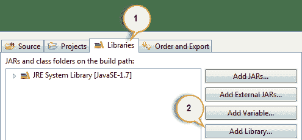

**步骤 4：**在“添加库”对话框中，选择“ TestNG”，然后单击“下一步”。

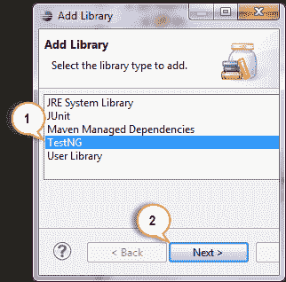

**步骤 5：**单击完成。

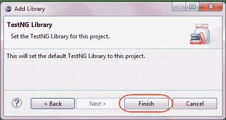

您应该注意到 TestNG 包含在“库”列表中。

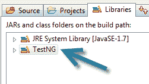

**步骤 6：**现在，我们将添加包含 Selenium API 的 JAR 文件。 在上一章中安装 Selenium 和 Eclipse 时，可以从 [http://docs.seleniumhq.org/download/](https://www.selenium.dev/downloads/) 下载的 Java 客户端驱动程序中找到这些文件。

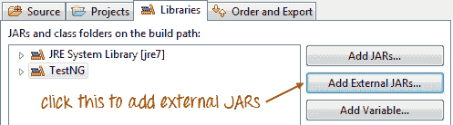

然后，导航到放置 Selenium JAR 文件的位置。

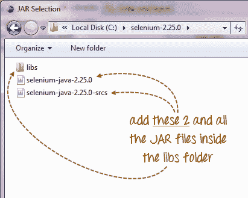

添加外部 JAR 之后，您的屏幕应如下所示。

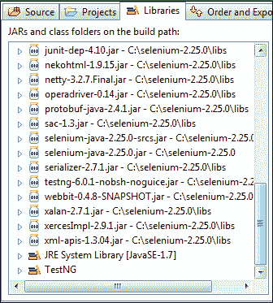

**步骤 7：**单击“完成”，并验证我们的 FirstTestNGProject 在 Eclipse 的 Package Explorer 窗口中可见。

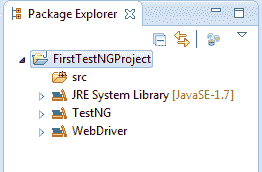

## 创建一个新的 TestNG 测试文件

现在我们已经完成了设置项目的工作，让我们创建一个新的 TestNG 文件。

**步骤 1：**右键单击“ src”软件包文件夹，然后选择“新建”。>其他…

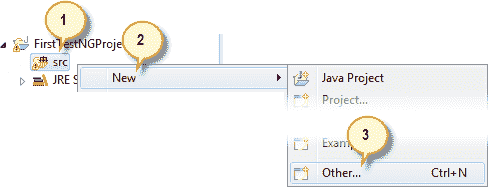

**步骤 2：**单击 TestNG 文件夹，然后选择“ TestNG 类”选项。 点击下一步。

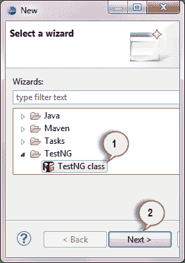

**步骤 3：**在相应的输入框中键入以下指示的值，然后单击“完成”。 请注意，我们已将 Java 文件命名为“ FirstTestNGFile”。

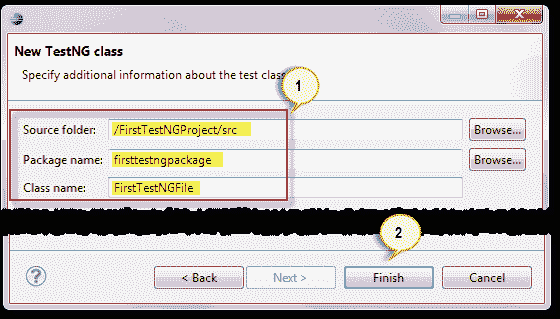

Eclipse 应该自动为我们的 TestNG 文件创建模板，如下所示。

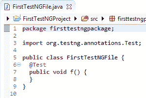

### 编码我们的第一个测试用例

现在让我们创建第一个[测试用例](/test-case.html)，该用例将检查 Mercury Tours 的主页是否正确。 如下所示键入您的代码。

```
package firsttestngpackage;
import org.openqa.selenium.*;
import org.openqa.selenium.firefox.FirefoxDriver;
import org.testng.Assert;
import org.testng.annotations.*;

public class firsttestngfile {
    public String baseUrl = "http://demo.guru99.com/test/newtours/";
    String driverPath = "C:\\geckodriver.exe";
    public WebDriver driver ; 

  @Test
  public void verifyHomepageTitle() {

      System.out.println("launching firefox browser"); 
      System.setProperty("webdriver.gecko.driver", driverPath);
      driver = new FirefoxDriver();
      driver.get(baseUrl);
      String expectedTitle = "Welcome: Mercury Tours";
      String actualTitle = driver.getTitle();
      Assert.assertEquals(actualTitle, expectedTitle);
      driver.close();
  }
}

```

请注意以下内容。

*   TestNG 不需要您具有 main（）方法。
*   方法不必是静态的。
*   我们使用了@Test 批注。 **@Test 用于告诉它所使用的方法是一个测试案例**。 在这种情况下，我们将 verifyHomepageTitle（）方法设置为测试用例，因此我们在其上方放置了一个'@Test'注释。
*   由于我们在 TestNG 中使用注释，因此需要导入包 org.testng.annotations。*。
*   我们使用了 Assert 类。 **Assert 类用于在 TestNG** 中进行验证操作。 要使用它，我们需要导入 org.testng.Assert 包。

一个 TestNG 文件中可能有多个测试用例（因此，有多个@Test 批注）。 稍后将在“ TestNG 中使用的批注”部分中对此进行详细处理。

### 运行测试

要运行测试，只需像往常一样在 Eclipse 中运行文件即可。 Eclipse 将提供两个输出-一个在“控制台”窗口中，另一个在“ TestNG 结果”窗口中。

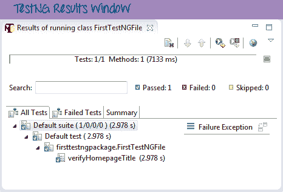

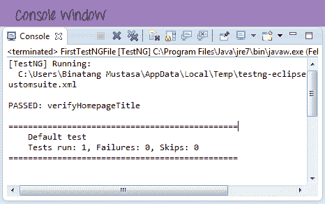

## 检查 TestNG 创建的报告

Eclipse 中的“控制台”窗口提供了测试案例结果的基于文本的报告，而“ TestNG 结果”窗口则为我们提供了图形化报告。

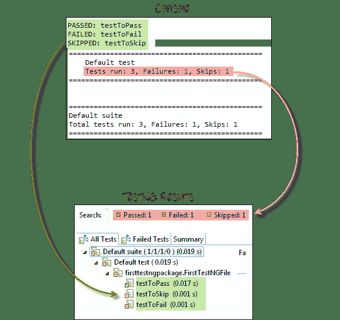

### 生成 HTML 报告

TestNG 能够生成 HTML 格式的报告。

**步骤 1：**运行上一节中创建的 FirstTestNGFile 后，在“项目资源管理器”窗口中右键单击项目名称（FirstTestNGProject），然后单击“刷新”选项。

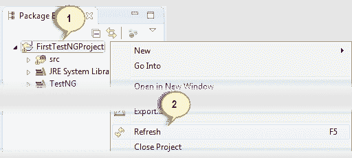

**步骤 2：**请注意，已创建“测试输出”文件夹。 展开并查找 index.html 文件。 该 HTML 文件是最新测试运行结果的报告。

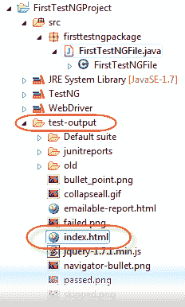

**步骤 3：**双击该 index.html 文件以在 Eclipse 的内置 Web 浏览器中将其打开。 就像在普通的 Web 浏览器中一样，只需重新按一下 F5，就可以在重新运行测试后随时刷新此页面。

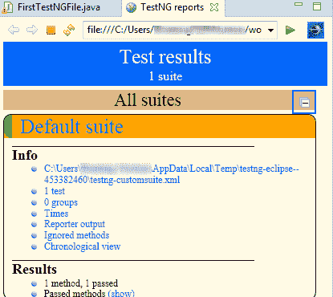

## [NGG0] TestNG 中使用的注释

在上一节中，向您介绍了@Test 批注。 现在，我们将研究更高级的注释及其用法。

### 多个测试案例

我们可以在一个 TestNG 文件中使用多个@Test 批注。 默认情况下，@ Test 注释的方法按字母顺序执行。 请参见下面的代码。 尽管方法 c_test，a_test 和 b_test 不在代码中按字母顺序排列，但它们将照此执行。

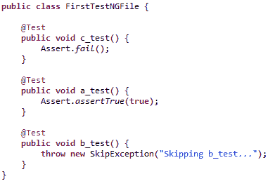

运行此代码，然后在生成的 index.html 页面上，单击“按时间顺序排列的视图”。

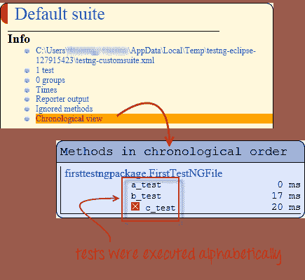

### 参数

如果希望方法以不同的顺序执行，请使用参数“ priority”。 **参数是可修改注释功能**的关键字。

*   参数要求您为其分配一个值。 通过在它们旁边放置一个“ =”，然后在其后跟数值，可以做到这一点。
*   参数用一对括号括起来，它们放在注释的后面，如下面的代码片段所示。

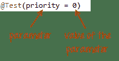

TestNG 将以最低优先级值到最高优先级执行@Test 批注。 您的优先级值不必是连续的。

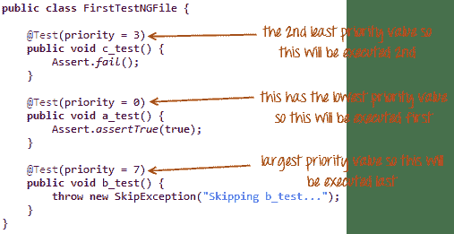

TestNG HTML 报告将确认方法是根据优先级的升序执行的。

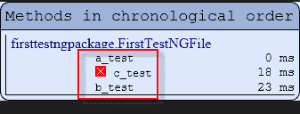

### 多个参数

除了“优先级”外，@ Test 还有一个名为“ alwaysRun”的参数，只能将其设置为“ true”或“ false”。 **要在单个注释中使用两个或多个参数，请用逗号**将其分开，如下所示。

```
@Test(priority = 0, alwaysRun = true)
```


@BeforeTest 和@AfterTest

| **@BeforeTest** | 在 TestNG 文件中的第一个测试用例之前，将在**之前执行此注释下的方法。** |
| **@AfterTest** | 在 TestNG 文件中的所有测试用例都执行完之后，将执行此注释下的方法**。** |

考虑下面的代码。

```
package firsttestngpackage;
import org.openqa.selenium.*;
import org.openqa.selenium.firefox.FirefoxDriver;
import org.testng.Assert;
import org.testng.annotations.*;
public class firsttestngfile {
    public String baseUrl = "http://demo.guru99.com/test/newtours/";
    String driverPath = "C:\\geckodriver.exe";
    public WebDriver driver ; 

     @BeforeTest
      public void launchBrowser() {
          System.out.println("launching firefox browser"); 
          System.setProperty("webdriver.gecko.driver", driverPath);
          driver = new FirefoxDriver();
          driver.get(baseUrl);
      }
      @Test
      public void verifyHomepageTitle() {
          String expectedTitle = "Welcome: Mercury Tours";
          String actualTitle = driver.getTitle();
          Assert.assertEquals(actualTitle, expectedTitle);
     }
      @AfterTest
      public void terminateBrowser(){
          driver.close();
      }
}

```

应用表和上面的代码提供的逻辑，我们可以预测执行方法的顺序为：

*   1 <sup>st</sup> -launchBrowser（）
*   2 <sup>和</sup>-verifyHomepageTitle（）
*   3 <sup>rd</sup> -TerminateBrowser（）

**注释块的放置可以互换，而不会影响它们执行的时间顺序**。 例如，尝试重新排列注释块，以使您的代码与以下代码相似。

```
package firsttestngpackage;
import org.openqa.selenium.*;
import org.openqa.selenium.firefox.FirefoxDriver;
import org.testng.Assert;
import org.testng.annotations.*;
public class firsttestngfile {
    public String baseUrl = "http://demo.guru99.com/test/newtours/";
    String driverPath = "C:\\geckodriver.exe";
    public WebDriver driver ; 
     @AfterTest                            //Jumbled
      public void terminateBrowser(){
          driver.close();
      }
     @BeforeTest                            //Jumbled
      public void launchBrowser() {
          System.out.println("launching firefox browser"); 
          System.setProperty("webdriver.gecko.driver", driverPath);
          driver = new FirefoxDriver();
          driver.get(baseUrl);
      }
      @Test                                //Jumbled
      public void verifyHomepageTitle() {
          String expectedTitle = "Welcome: Mercury Tours";
          String actualTitle = driver.getTitle();
          Assert.assertEquals(actualTitle, expectedTitle);
     }

}

```

运行上面的代码，请注意

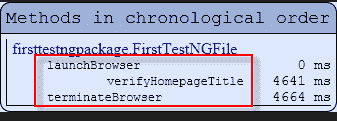

@BeforeMethod 和@AfterMethod

| **@BeforeMethod** | 在每个测试用例中，将在此方法之前执行**。** |
| **@AfterMethod** | 在每个测试用例中，在每个方法之后将执行此注释下的方法**。** |

在 Mercury Tours 中，假设我们想验证下面两个链接的目标页面的标题。


我们的测试流程为：

*   转到主页并验证其标题。
*   单击注册并验证其目标页面的标题。
*   返回首页并确认其标题是否正确。
*   单击支持，并验证其目标页面的标题。
*   返回首页并确认其标题是否正确。

下面的代码说明了如何使用@BeforeMethod 和@AfterMethod 有效执行上述方案。

```
package firsttestngpackage;
import org.openqa.selenium.*;
import org.openqa.selenium.firefox.FirefoxDriver;
import org.testng.Assert;
import org.testng.annotations.*;
@Test
public class firsttestngfile {
    public String baseUrl = "http://demo.guru99.com/test/newtours/";
    String driverPath = "C:\\geckodriver.exe";
    public WebDriver driver; 
    public String expected = null;
    public String actual = null;
        @BeforeTest
      public void launchBrowser() {
          System.out.println("launching firefox browser"); 
          System.setProperty("webdriver.gecko.driver", driverPath);
          driver= new FirefoxDriver();
          driver.get(baseUrl);
      }

      @BeforeMethod
      public void verifyHomepageTitle() {
          String expectedTitle = "Welcome: Mercury Tours";
          String actualTitle = driver.getTitle();
          Assert.assertEquals(actualTitle, expectedTitle);
      }
          @Test(priority = 0)
      public void register(){
          driver.findElement(By.linkText("REGISTER")).click() ;
          expected = "Register: Mercury Tours";
          actual = driver.getTitle();
          Assert.assertEquals(actual, expected);
      }
          @Test(priority = 1)
      public void support() {
            driver.findElement(By.linkText("SUPPORT")).click() ;
            expected = "Under Construction: Mercury Tours";
            actual = driver.getTitle();
            Assert.assertEquals(actual, expected);
      }
      @AfterMethod
      public void goBackToHomepage ( ) {
            driver.findElement(By.linkText("Home")).click() ;
      }

      @AfterTest
      public void terminateBrowser(){
          driver.close();
      }
}

```

执行此测试后，您的 TestNG 应报告以下顺序。

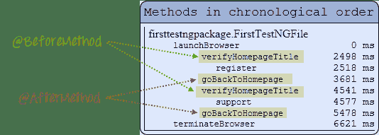

简而言之，@BeforeMethod 应该包含在每个测试用例之前需要在之前运行**的方法，而@AfterMethod 应该包含在每个测试用例之后**之后需要运行**的方法。**

## TestNG 注释的摘要

**@BeforeSuite** ：带注释的方法将在该套件中的所有测试运行之前运行。

**@AfterSuite** ：带注释的方法将在该套件中的所有测试运行后运行。

**@BeforeTest** ：带注释的方法将在运行属于标记内部类的任何测试方法之前运行。

**@AfterTest** ：注释方法将在标签内部所有属于类的测试方法运行后运行。

**@BeforeGroups** ：此配置方法将在其之前运行的组的列表。 保证此方法可以在调用属于这些组中的任何一个的第一个测试方法之前不久运行。

**@AfterGroups** ：此配置方法将在其后运行的组的列表。 保证在调用属于这些组中任何一个的最后一个测试方法后不久便可以运行该方法。

**@BeforeClass** ：带注释的方法将在调用当前类中的第一个测试方法之前运行。

**@AfterClass** ：带注释的方法将在当前类中的所有测试方法运行后运行。

**@BeforeMethod** ：带注释的方法将在每种测试方法之前运行。

**@AfterMethod** ：带注释的方法将在每种测试方法之后运行。

**@Test** ：带注释的方法是测试用例的一部分

### 结论

*   TestNG 是一个测试框架，能够使 Selenium 测试更容易理解，并能够生成易于理解的报告。
*   与 JUnit 相比，TestNG 的主要优点如下。
    *   注释更易于使用和理解。
    *   测试用例可以更容易地分组。
    *   TestNG 允许我们创建并行测试。
*   Eclipse 中的 Console 窗口生成基于文本的结果，而 TestNG 窗口更有用，因为它为我们提供了测试结果的图形输出以及其他有意义的细节，例如：
    *   每种方法的运行时。
    *   执行方法的时间顺序
*   TestNG 能够生成基于 HTML 的报告。
*   注释可以像通常的 Java 方法一样使用参数。