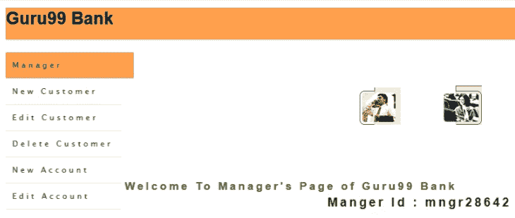

# TestNG 组：包含，排除示例-Selenium 教程

> 原文： [https://www.guru99.com/introduction-testng-groups.html](https://www.guru99.com/introduction-testng-groups.html)

TestNG 是一个[测试](/software-testing.html)框架，涵盖了不同类型的测试设计，例如单元测试，功能测试，端到端测试，UI 和集成测试。

您可以通过创建 XML 并通过 maven 运行一个或多个程序包（此处的程序包是指以适当的 Director 格式封装一组类）。

在本教程中，您将学习-

*   [个带有示例](#1)的 TestNG 组
*   [在环境变量中设置 Maven 和 Java 路径（对于 Windows 用户）](#2)
*   [XML 简介以及如何制作 XML 文件](#3)
*   [替代分组的另一种机制是在测试 XML](#4) 中“排除”或“包含”
*   [如何使用 XML 文件运行代码（视频演示）](#5)

## 具有示例的 TestNG 组

我们在 [Testng](/all-about-testng-and-selenium.html) 中使用组，

*   我们不想在不同的类中分别定义测试方法（取决于功能），并且
*   同时要忽略（不执行）某些测试用例，就好像它们在代码中不存在一样。
*   因此，要执行此操作，我们必须将它们分组。 这是通过使用 testNG 中支持的“包含”和“排除”机制来完成的。

在下面的示例中，我们显示了如何在 XML 文件中使用组的语法。

```
@Test (groups = { "bonding", "strong_ties" })	
```

在这里，我们使用 2 个组名，即“ bonding”和“ strong_ties”（这些逻辑名可以根据您的意愿进行更改）。

**<组>标签**定义 XML 中组的开始。

定制 XML 以从测试类中选择提到的组。 下面提到的是如何在 XML 文件中声明组的语法，例如

```
 <groups>		
   <run>		
    <include name="bonding" />		
   </run>		
  </groups>		

```

因此，让我们假设一个类中有 10 个测试方法。

在他们当中

*   “绑定”组中标记了 6 种方法，并且
*   4 个在“ strong_ties”组中

展望未来，我们将设置 maven / Java 路径，并使用 Eclipse IDE 演示基于 [Java](/java-tutorial.html) 的 maven 项目中使用 XML 文件的组的用法。

## 在环境变量中设置 Maven 和 Java 路径（对于 Windows 用户）

请参考 [https://www.guru99.com/maven-jenkins-with-selenium-complete-tutorial.html](/maven-jenkins-with-selenium-complete-tutorial.html)

[https://www.guru99.com/install-java.html](/install-java.html)

## XML 简介以及如何制作 XML 文件

*   Maven 框架中的 XML（可扩展标记语言）文件包含一个或多个测试的信息，并由**标签<套件>** 定义。
*   XML 中的测试信息由**标签< test >** 表示，并且可以包含一个或多个 TestNG 类。
*   将包含上述测试方法上方的 **@Test** 注释的 Java 类定义为 TestNG 方法。

序列中使用多个标签来构建有效的 testNG xml，例如<套件>，<测试>和<类>

*   首先是<套件>标签，它包含一个逻辑名，该逻辑名定义了报告给 testNG 的完整信息，以生成执行报告。
*   第二个是<测试名称=“ Guru 99 Smoke Test Demo” >，请注意这是逻辑名称，其中包含测试执行报告的信息，如通过，失败，跳过测试用例以及其他信息，如执行和分组的总时间 信息
*   第三是< class name =“ **com.group.guru99.TC_Class1** ” / >，com.group.guru99 是使用的包，测试类名称为 TC_Class1。

```
<?xml version="1.0" encoding="UTF-8" ?>	
<!DOCTYPE suite SYSTEM "http://testng.org/testng-1.0.dtd">	
 	<suite name="Suite">	
		<test name="Guru 99 Smoke Test Demo">	
			<groups>	
				<run>	
   					 <include name="strong_ties" />	
        		</run>	
       		</groups>	
			<classes>	
					<class name="com.group.guru99.TC_Class1" />	
           	</classes>	
		</test>	
  </suite>	

```

我们将使用此 XML 来处理即将到来的视频缺点。

## 另一种代替分组的机制是测试 XML 中的“排除”或“包含”

假设您发现复杂的组机制的用法，那么 testNG XML 促进了排除/包括测试的功能。

```
Exclude Tag:  Syntax for exclude tag <exclude name="${TEST_CASE_NAME}" />
Include Tag:  Syntax for include tag <include name="${TEST_CASE_NAME}" />

```

**注意：**我们可以一次包含/排除多个测试用例，它也适用于 Groups。

## 如何使用 XML 文件运行代码（视频演示）

带有**组的 Java 代码和 XML 的说明，将**标签排除并包括在 XML 中。

*   **Scenario**: Launch Guru99 demo Banking site, verify few thing's on login page after that enter credentials and re-verify few new thing on the application when logged in.

    

**注意**：应编码的每个步骤都应在单独的方法中声明，但是在执行时，它将根据 XML 文件中的条目执行测试方法。

**方法 1** ：初始化浏览器并启动 URL（tc01LaunchURL（））

**方法 2** ：验证登录页面标题（tc02VerifyLaunchPage（））

**方法 3** ：在登录表单（tc03EnterCredentials（））上输入用户名和密码

**方法 4** ：验证用户仪表板上是否存在 Manager ID（tc04VerifyLoggedInPage（））

**方法 5** ：验证用户仪表板上的更多链接（tc05VerifyHyperlinks（））

**我们方案的代码：**

```
package com.group.guru99;	

import java.util.concurrent.TimeUnit;	

import org.openqa.selenium.By;	
import org.openqa.selenium.WebDriver;	
import org.openqa.selenium.firefox.FirefoxDriver;	
import org.testng.Assert;	
import org.testng.annotations.Test;	

public class TC_Class1 {	
    public static final WebDriver webDriver = new FirefoxDriver();;	

    String launchPageHeading = "//h3[text()='Guru99 Bank']";	
    final String userName_element = "//input[@name='uid']", password_element = "//input[@name='password']",	
            signIn_element = "//input[@name='btnLogin']";	
    final String userName_value = "mngr28642", password_value = "ydAnate";	
    final String managerID = "//td[contains(text(),'Manger Id')]";	
    final String newCustomer = "//a[@href='addcustomerpage.php']", fundTransfer = "//a[@href='FundTransInput.php']";	

    /**	
     * This test case will initialize the webDriver	
     */	
    @Test(groups = { "bonding", "strong_ties" })	
    public void tc01LaunchURL() {	
        webDriver.manage().window().maximize();	
        webDriver.manage().timeouts().implicitlyWait(20, TimeUnit.SECONDS);	
        webDriver.get("http://www.demo.guru99.com/V4/");	
    }	

    /**	
     * Will check the presence of Heading on Login Page	
     */	
    @Test(groups = { "bonding" })	
    public void tc02VerifyLaunchPage() {	
        Assert.assertTrue(webDriver.findElement(By.xpath(launchPageHeading)).isDisplayed(),	
                "Home Page heading is not displayed");	
        System.out.println("Home Page heading is displayed");	
    }	

    /**	
     * This test case will enter User name, password and will then click on	
     * signIn button	
     */	
    @Test(groups = { "bonding", "strong_ties" })	
    public void tc03EnterCredentials() {	
        webDriver.findElement(By.xpath(userName_element)).sendKeys(userName_value);	
        webDriver.findElement(By.xpath(password_element)).sendKeys(password_value);	
        webDriver.findElement(By.xpath(signIn_element)).click();	
    }	

    /**	
     * This test case will verify manger's ID presence on DashBoard	
     */	
    @Test(groups = { "strong_ties" })	
    public void tc04VerifyLoggedInPage() {	
        Assert.assertTrue(webDriver.findElement(By.xpath(managerID)).isDisplayed(),	
                "Manager ID label is not displayed");	
        System.out.println("Manger Id label is displayed");	
    }	

    /**	
     * This test case will check the presence of presence of New customer link	
     * And FundTransfer link in Left pannel	
     */	
    @Test(groups = { "bonding" })	
    public void tc05VerifyHyperlinks() {	
        Assert.assertTrue(webDriver.findElement(By.xpath(newCustomer)).isEnabled(),	
                "New customer hyperlink is not displayed");	
        System.out.println("New customer hyperlink is displayed");	

        Assert.assertTrue(webDriver.findElement(By.xpath(fundTransfer)).isEnabled(),	
                "Fund Transfer hyperlink is not displayed");	
        System.out.println("Fund Transfer hyperlink is displayed");	
    }	

}	

```

请注意：凭据仅有效 20 天，因此，如果您尝试在本地计算机上运行代码，则可能会遇到无效的凭据错误。 请找到以下步骤来生成您的登录凭据：

1.  启动 [http://www.demo.guru99.com](http://www.demo.guru99.com)
2.  在框中输入您的电子邮件 ID。
3.  单击输入，然后在屏幕上查看您的登录详细信息。

**代码说明：**

如上所述，我们创建了 5 个测试用例，以独立的方法执行每个动作。

您可以观察到，对于每种方法，我们都关联了一个在其中包含某些值的组参数。

基本上，这些是区分组的名称，即“ strong_ties” &“ bonding”。

*   第一个和第三个方法被标记为“ bonding”，“ strong_ties”，这意味着如果在任何组中更新 XML，则将运行此[测试用例](/test-case.html)。
*   第二种方法仅标记为“ bonding”组，这意味着如果 XML 是使用 bonding 组更新的。 仅在这种情况下，此测试用例才会运行。
*   第四个测试用例被标记为 strong_ties 组，这意味着该测试用例仅在 XML 用 strong_ties 组名更新时才运行。
*   最后但并非最不重要的第五个测试用例已附加到绑定组，这意味着只有在使用绑定组名称更新 XML 的情况下，此测试用例才会运行。

因此，总的来说，我们有 4 种情况；

1.  我们想要运行所有测试用例，而与组名无关。 在这种情况下，我们将从运行 XML 中删除 Group 标记。

2.  我们想要运行仅与两个组中的任何一个都相关的测试用例，即 strong_ties 或 bonding

*   Please refer:
*   在此视频中，从运行 XML 中注释了 Group 参数。 因此，您将看到所有测试用例都已执行。

*   继续播放视频，现在我们在 XML 中包含了组名，您只能看到特定于该组的测试用例正在运行。

3.  我们正在使用排除机制来排除测试用例：

*   Please refer
*   您会看到，通过在运行 XML 中编写它们的名称，我们已经使用了排除少数测试用例（tc02）。 在最终结果中，提到的测试用例没有运行。

4.  最后，我们使用包含测试机制来包含测试用例（tc01LaunchURL，tc03EnterCredentials 和 tc05VerifyHyperlinks）

*   Please refer
*   在此视频中，您将看到 XML 提到的测试用例仅在测试执行期间运行。

请从提到的 URL 下载代码，它将包含所有类型的 testXML：

[下载上面的代码](https://drive.google.com/uc?export=download&id=0ByI5-ZLwpo25UTBMbnlEMmM1YU0)

**结论**

我们在这里学到了相对较新的方法，用于在 Maven 项目中使用 XML 运行测试用例。

我们首先提供有关 testNG 的简要介绍，然后继续讨论 Groups 的完整技术规范，包括和排除。