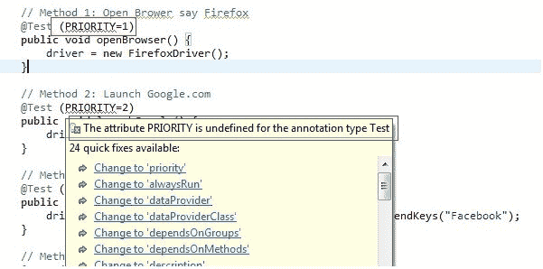

# 硒中的 TestNG @Test 优先级

> 原文： [https://www.guru99.com/test-case-priority-testng.html](https://www.guru99.com/test-case-priority-testng.html)

TestNG 是一个[测试](/software-testing.html)框架，涵盖了不同类型的测试设计，例如单元测试，功能测试，端到端测试，UI 测试和集成测试。

您可以在 [Testng](/all-about-testng-and-selenium.html) 代码中运行单个或多个测试用例。

如果在运行多个测试用例时未定义测试优先级，则 TestNG 会将所有@Test 的优先级分配为零（0）。

现在，在跑步时； 优先级较低的将优先安排。

在本教程中，您将学习-

*   [不具有优先级的 TestNG 代码演示](#1)
*   [没有按字母顺序优先的 TestNG 代码演示](#2)
*   [如何在 TestNG](#3) 中设置优先级
*   [具有相同优先级的方法](#4)
*   [结合优先级（具有相同优先级）和非优先级方法](#5)

## 无优先权的 TestNG 代码演示

让我们来看一个需要排序以便通过所有测试用例的场景：

**场景：**生成一个代码，在其中您需要使用特定关键字“ Facebook”执行 Google 搜索。 现在，确认浏览器标题已更改为“ Facebook-Google 搜索”。

注意：您编码的每个步骤应使用单独的方法

**方法 1** ：打开浏览器说 Firefox（openBrowser（））

**方法 2** ：启动 Google.com（launchGoogle（））

**方法 3** ：使用“ Facebook”执行搜索（performSearchAndClick1stLink（））

**方法 4** ：验证 Google 搜索页标题（FaceBookPageTitleVerification（））

**我们的方案**的代码：

```
import org.openqa.selenium.By;			
import org.openqa.selenium.WebDriver;			
import org.openqa.selenium.firefox.FirefoxDriver;			
import org.testng.Assert;			
import org.testng.annotations.Test;			

public class Priority_In_testNG {		
    WebDriver driver;			

	    // Method 1: Open Brower say Firefox			
	    @Test		
	    public void openBrowser() {				
	        driver = new FirefoxDriver();				
	    }		

	    // Method 2: Launch Google.com			
	    @Test		
	    public void launchGoogle() {				
	        driver.get("http://www.google.co.in");						
	    }		

	    // Method 3: Perform a search using "Facebook"			
	    @Test		
	    public void peformSeachAndClick1stLink() {				
	        driver.findElement(By.xpath(".//*[@title='Search']")).sendKeys("Facebook");								
	    }		

	    // Method 4: Verify Google search page title.			
	    @Test		
	    public void FaceBookPageTitleVerification() throws Exception {				
	        driver.findElement(By.xpath(".//*[@value='Search']")).click();						
	        Thread.sleep(3000);		
	        Assert.assertEquals(driver.getTitle().contains("Facebook - Google Search"), true);				
	    }		
	}		

```

**代码**的说明

如上所述，我们创建了 4 个测试用例，以独立的方式执行每个动作。

*   第一种方法**（openBrowser）**声明要初始化 Firefox 浏览器。
*   第二种方法**（launchGoogle）**指出，启​​动 Google.com 是在已初始化的浏览器中。
*   第三种方法**（peformSeachAndClick1stLink）**规定在搜索框中执行搜索（使用 xpath **（“ .//*[@title='Search']”“）**） 作为 **Facebook** 和
*   第四个也是最后一个方法**（FaceBookPageTitleVerification）**指出，单击 Google 的搜索图标并确认浏览器标题已更改为 **Facebook-Google 搜索。**

现在，如视频所示，使用 testNG 运行此代码，您会发现所有[测试用例](/test-case.html)都失败了。 失败的原因：由于要通过以前的测试用例，因此仅通过当前正在运行的测试用例。

在这种情况下，

*   执行的第一个方法是 **openBrowser（）。** 它通过了，因为它没有任何依赖性。
*   执行的第二个方法是 **FaceBookPageTitleVerification（）;。** 失败，因为我们试图单击搜索按钮并验证浏览器标题。
*   您可以看到，如果搜索活动未处理，那么如何传递其他任何步骤。 因此，这就是我的测试用例失败的原因。

```
PASSED: openBrowser
FAILED: FaceBookPageTitleVerification
FAILED: launchGoogle
FAILED: peformSeachAndClick1stLink
```

## 没有按字母顺序优先的 TestNG 代码演示

如果我们没有提到任何优先级，则 testng 将根据其方法名称的字母顺序执行@Test 方法，而不管其在代码中的实现位置。

```
package com.guru.testngannotations;

import org.testng.annotations.Test;

public class TestNG_Priority_Annotations {

@Test
public void c_method(){
System.out.println("I'm in method C");
}
@Test
public void b_method(){
System.out.println("I'm in method B");
}
@Test
public void a_method(){
System.out.println("I'm in method A");
}
@Test
public void e_method(){
System.out.println("I'm in method E");
}
@Test
public void d_method(){
System.out.println("I'm in method D");
}

}

```

输出量

```
I'm in method A 
I'm in method B 
I'm in method C 
I'm in method D 
I'm in method E 

```

尽管我们以随机方式（c，b，a，e，d）定义了方法，但是 testng 通过考虑字母顺序基于它们的方法名称执行了这些方法，并且它们也反映在输出中。

## 如何在 TestNG 中设置优先级

正如您在前面的示例中看到的那样，顺序才能通过此场景，因此，我们将使用 **Priority Parameter** 修改前面的代码，以便每个测试都应根据分配给它们的优先级运行 。

现在您可以看到，我们已经为每个测试用例分配了优先级，这意味着将首先执行较低优先级值的测试用例。

**进行测试的 NG 优先**

```
import org.openqa.selenium.By;			
import org.openqa.selenium.WebDriver;			
import org.openqa.selenium.firefox.FirefoxDriver;			
import org.testng.Assert;			
import org.testng.annotations.Test;			

public class Priority_In_testNG {		
    WebDriver driver;			

    // Method 1: Open Browser say Firefox			
    @Test (priority=1)		
    public void openBrowser() {				
        driver = new FirefoxDriver();				
    }		

    // Method 2: Launch Google.com			
    @Test (priority=2)		
    public void launchGoogle() {				
        driver.get("http://www.google.co.in");						
    }		

    // Method 3: Perform a search using "Facebook"			
    @Test (priority=3)		
    public void peformSeachAndClick1stLink() {				
        driver.findElement(By.xpath(".//*[@title='Search']")).sendKeys("Facebook");								
    }		

    // Method 4: Verify Google search page title.			
    @Test (priority=4)		
    public void FaceBookPageTitleVerification() throws Exception {				
        driver.findElement(By.xpath(".//*[@value='Search']")).click();						
        Thread.sleep(3000);		
        Assert.assertEquals(driver.getTitle().contains("Facebook - Google Search"), true);				
    }		
}		
```

**代码**的说明

为每个测试用例分配优先级后，使用 testNG 运行以上代码，如下面提到的 Video-2 所示。

在这里，您可以看到测试用例具有优先级。 首先执行具有较低优先级的测试用例，即现在根据测试用例中的优先级进行顺序执行。 因此，所有测试用例现在都通过了。

注意 eclipse 的控制台：

**输出**：

```
PASSED: openBrowser
PASSED: launchGoogle
PASSED: peformSearchAndClick1stLink
PASSED: FaceBookPageTitleVerification
```

数字 0 的优先级最高（将首先执行），并且优先级将根据给定的数字继续进行，即 0 的优先级高于 1。1 的优先级高于 2，依此类推。

```
package com.guru.testngannotations;
import org.testng.annotations.Test;

public class TestNG_Priority_Annotations {

    @Test(priority=6)
    public void c_method(){
    System.out.println("I'm in method C");
    }
    @Test(priority=9)
    public void b_method(){
    System.out.println("I'm in method B");
    }
    @Test(priority=1)
    public void a_method(){
    System.out.println("I'm in method A");
    }
    @Test(priority=0)
    public void e_method(){
    System.out.println("I'm in method E");
    }
    @Test(priority=3)
    public void d_method(){
    System.out.println("I'm in method D");
    }

}

```

Output

```
I'm in method E 
I'm in method A 
I'm in method D 
I'm in method C 
I'm in method B 
```

在这里，我们提供的优先级为 0、1、3、6、9。 因此，首先执行优先级为 0 的方法，然后执行优先级为 1 的方法，依此类推。 由于我们提供了优先级，此处将不考虑字母顺序方法名称

## 具有相同优先级的方法：

方法可能会包含相同的优先级。 在这些情况下，testng 考虑优先级相同的方法名称的字母顺序。

```
package com.guru.testngannotations;
import org.testng.annotations.Test;

public class TestNG_Priority_Annotations {

    @Test(priority=6)
    public void c_method(){
    System.out.println("I'm in method C");
    }
    @Test(priority=9)
    public void b_method(){
    System.out.println("I'm in method B");
    }
    @Test(priority=6)
    public void a_method(){
    System.out.println("I'm in method A");
    }
    @Test(priority=0)
    public void e_method(){
    System.out.println("I'm in method E");
    }
    @Test(priority=3)
    public void d_method(){
    System.out.println("I'm in method D");
    }

}

```

输出量

```
I'm in method E 
I'm in method D 
I'm in method A 
I'm in method C 
I'm in method B 

```

此处，“ e”和“ d”是根据其优先级值执行的。 但是方法“ a”和“ c”包含相同的优先级值（6）。 因此，这里 testng 考虑了字母“ a”和“ c”的顺序并相应地执行它们。

## 结合优先级（具有相同优先级）和非优先级方法：

在这种情况下，我们将在一堂课中介绍两种情况。

1.  具有相同优先级值的方法。
2.  超过一种非优先方法。

```
package com.guru.testngannotations;

import org.testng.annotations.Test;

public class TestNG_Priority_Annotations {

	@Test()
	public void c_method(){
		System.out.println("I'm in method C");
	}
	@Test()
	public void b_method(){
		System.out.println("I'm in method B");
	}
	@Test(priority=6)
	public void a_method(){
		System.out.println("I'm in method A");
	}
	@Test(priority=0)
	public void e_method(){
		System.out.println("I'm in method E");
	}
	@Test(priority=6)
	public void d_method(){
		System.out.println("I'm in method D");
	}
}

```

**输出：**

```
I'm in method B 
I'm in method C 
I'm in method E 
I'm in method A 
I'm in method D 
```

```
PASSED: b_method 
PASSED: c_method 
PASSED: e_method 
PASSED: a_method 
PASSED: d_method

```

**说明：**

**第一优先级：**非优先级方法：“ c”和“ b”：基于字母顺序，先执行“ b”，然后执行“ c”。

**第二优先级：**优先方法：“ a”，“ e”和“ d”：由于具有最高优先级（0），因此首先执行“ e”。 由于“ a”和“ d”方法的优先级相同，因此 testng 考虑了它们的方法名称的字母顺序。 因此，在它们之间，首先执行“ a”，然后执行“ d”。

**在 TestNG** 中区分大小写

仅供参考，有一种用于在 testNG 中定义优先级的标准语法，即 **@Test（priority = 4）**，假定您以其他语法进行定义，例如 **@Test （PRIORITY = 1）**，那么您的 IDE 会将其显示为编译错误。 请参考下图：



**结论：**

如您所见，如果需要按特定顺序运行一组测试用例，则可以使用 testNG 作为运行工具，使用 **Priority** 轻松完成。

***由于 Ramandeep Singh 和 Rama Krishna Gadde*** 的贡献，使得本教程成为可能。