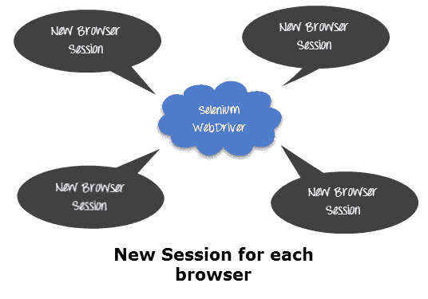
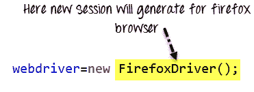
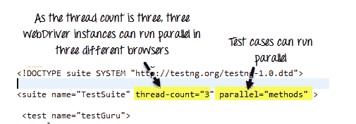
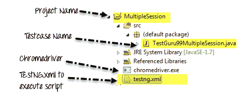

# Selenium 中的并行执行：会话处理& TestNG 依赖性

> 原文： [https://www.guru99.com/sessions-parallel-run-and-dependency-in-selenium.html](https://www.guru99.com/sessions-parallel-run-and-dependency-in-selenium.html)

要了解如何并行运行脚本，让我们首先了解

## 为什么我们需要会话处理？

在测试执行期间，Selenium WebDriver 必须一直与浏览器进行交互以执行给定的命令。 在执行时，也有可能在当前执行完成之前，其他人在同一台机器和相同类型的浏览器中开始执行另一个脚本。



在这种情况下，我们需要一种机制，通过这种机制我们的两个不同的执行不应相互重叠。 这可以使用 Selenium 中的会话处理来实现。

## 如何在 Selenium WebDriver 中实现会话处理？

如果检查 Selenium WebDriver 的源代码，则会找到一个名为“ sessionId”的变量。 每当我们创建 WebDriver 对象的新实例时，都会生成一个新的'sessionId'并将其附加到特定的 Firefox / Chrome / IE 驱动程序（）。



因此，我们在此之后所做的所有操作将仅在特定的 Firefox 浏览器会话中执行。


由于这是内置功能，因此无需明确分配会话 ID

**代码示例：**此处将为两个不同的 WebDriver 生成两个不同的会话。

```
import org.openqa.selenium.WebDriver;
import org.openqa.selenium.firefox.FirefoxDriver;
public class SessionHandling {
public static void main(String...strings ){
    //First session of WebDriver
    WebDriver driver = new FirefoxDriver();
    //Goto guru99 site
    driver.get("http://demo.guru99.com/V4/");

    //Second session of WebDriver
    WebDriver driver2 = new FirefoxDriver();
    //Goto guru99 site
    driver2.get("http://demo.guru99.com/V4/");
}
}
```

## 如何使用 Selenium 运行并行测试

在某些情况下，您想同时运行多个测试。

在这种情况下，可以使用“平行”属性



套件标签的 parallel 属性可以接受四个值：

<colgroup><col> <col></colgroup> 
| 测试 | [xml 文件的< test >标签内的所有测试用例将并行运行。](/software-testing.html) |
| 类 | [Java](/java-tutorial.html) 类中的所有测试用例将并行运行 |
| 方法 | 所有带有@Test 批注的方法将并行执行。 |
| 实例 | 同一实例中的测试用例将并行执行，但是两个不同实例的两种方法将在不同的线程中运行。 |

属性 *thread-count* 允许您指定应为此执行分配多少个线程。

完整示例：在本示例中，三个测试用例将并行运行并在 [http://demo.guru99.com](http://demo.guru99.com) 中填充登录数据

完整项目将如下所示：



TestGuru99MultipleSession.java

```
import org.openqa.selenium.WebDriver;
import org.openqa.selenium.chrome.ChromeDriver;
import org.testng.annotations.Test;
public class TestGuru99MultipleSession {
    @Test    
    public void executSessionOne(){
            //First session of WebDriver
        System.setProperty("webdriver.chrome.driver","chromedriver.exe");
            WebDriver driver = new ChromeDriver();
            //Goto guru99 site
            driver.get("http://demo.guru99.com/V4/");
            //find user name text box and fill it
            driver.findElement(By.name("uid")).sendKeys("Driver 1");

        }

    @Test    
        public void executeSessionTwo(){
            //Second session of WebDriver
        System.setProperty("webdriver.chrome.driver","chromedriver.exe");
        WebDriver driver = new ChromeDriver();
            //Goto guru99 site
        driver.get("http://demo.guru99.com/V4/");
        //find user name text box and fill it
        driver.findElement(By.name("uid")).sendKeys("Driver 2");

        }

    @Test    
        public void executSessionThree(){
            //Third session of WebDriver
        System.setProperty("webdriver.chrome.driver","chromedriver.exe");
        WebDriver driver = new ChromeDriver();
            //Goto guru99 site
        driver.get("http://demo.guru99.com/V4/");
        //find user name text box and fill it
        driver.findElement(By.name("uid")).sendKeys("Driver 3");

        }        
}
```

**TestNG.XML**

```
<?xml version="1.0" encoding="UTF-8"?>
<!DOCTYPE suite SYSTEM "http://testng.org/testng-1.0.dtd">
<suite name="TestSuite" thread-count="3" parallel="methods" >
<test name="testGuru">
<classes>
<class name="TestGuru99MultipleSession">
</class>
</classes>
</test>
</suite>
```

## 测试用例顺序和依赖性

您可以设置[测试用例](/test-case.html)执行的顺序和依赖性。

假设您有两个测试用例“ testGuru99TC1”和“ testGuru99TC2”，并且您想在“ testGuru99TC1”之前执行测试用例“ testGuru99TC2”。 在这种情况下，我们将使用'dependsOnMethods'属性进行依赖和执行顺序。

```
<?xml version="1.0" encoding="UTF-8"?>
<!DOCTYPE suite SYSTEM "http://testng.org/testng-1.0.dtd">
<suite name="TestSuite" thread-count="3" parallel="methods" >
<test name="testGuru">
<classes>
<class name="TestGuru99MultipleSession">
<include value="testGuru99TC1" dependsOnMethods=" testGuru99TC2"/>
<include value="testGuru99TC2"/>
</class>
</classes>
</test>
</suite>
```

## 摘要

*   为 WebDriver 的新实例创建一个新的 sessionID。
*   一个会话将与一个特定的浏览器绑定。
*   使用属性线程和并行，可以并行运行脚本。
*   您可以使用属性依赖性来设置测试执行的顺序