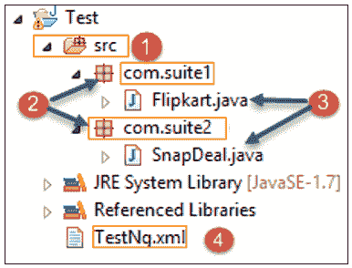
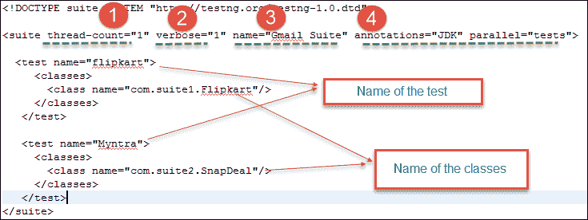
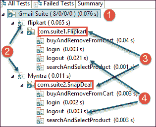
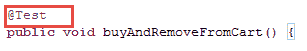

# TestNG：如何在 Selenium 中运行多个测试套件

> 原文： [https://www.guru99.com/testng-execute-multiple-test-suites.html](https://www.guru99.com/testng-execute-multiple-test-suites.html)

TestNG 使您可以在项目中并行运行测试方法，测试类和测试用例。 通过执行并行执行，我们可以减少在不同线程中同时启动和执行测试的“执行时间”。

在这里，我们将看到如何使用 TestNG 运行多个类（又名不同的套件）。

## 步骤 1）创建一个 TestNG.xml 文件以执行测试

为此，请执行以下步骤。

1.  在 eclipse 中创建一个新项目
2.  在项目中创建两个包（将它们分别命名为 com.suite1 和 com.suite2）
3.  在每个包中创建一个类（将它们命名为 Flipkart.java 和 Snapdeal.java），然后将以下代码复制到各个类中
4.  在您的项目中创建一个新文件，并将其命名为 testng.xml（确保已安装了 eclipse 的测试插件，可在此处找到说明）。 Testng.xml 包含所有配置（类名，测试名和西服名。

Flipkart.java

```
package com.suite1;

import java.util.concurrent.TimeUnit;

import org.openqa.selenium.Alert;
import org.openqa.selenium.By;
import org.openqa.selenium.WebDriver;
import org.openqa.selenium.WebElement;
import org.openqa.selenium.firefox.FirefoxDriver;
import org.openqa.selenium.interactions.Actions;
import org.testng.annotations.AfterClass;
import org.testng.annotations.BeforeClass;
import org.testng.annotations.Test;

public class Flipkart{

	WebDriver driver = new FirefoxDriver();
	String username = ""; // Change to your username and passwrod
	String password = "";

	// This method is to navigate flipkart URL
	@BeforeClass
	public void init() {
		driver.manage().window().maximize();
		driver.manage().timeouts().implicitlyWait(60, TimeUnit.SECONDS);
		driver.navigate().to("https://www.flipkart.com");
	}

	// To log in flipkart
	@Test
	public void login() {
		driver.findElement(By.partialLinkText("Login")).click();
		driver.findElement(
				By.cssSelector(".fk-input.login-form-input.user-email"))
				.sendKeys(username);
		driver.findElement(
				By.cssSelector(".fk-input.login-form-input.user-pwd"))
				.sendKeys(password);
		driver.findElement(By.cssSelector(".submit-btn.login-btn.btn")).click();
	}

	// Search For product
	@Test
	public void searchAndSelectProduct() {
		driver.findElement(By.id("fk-top-search-box")).sendKeys("moto g3");
		driver.findElement(
				By.cssSelector("search-bar-submit.fk-font-13.fk-font-bold"))
				.click();

		// select the first item in the search results
		String css = ".gd-row.browse-grid-row:nth-of-type(1) > div:nth-child(1)>div>div:nth-child(2)>div>a";
		driver.findElement(By.cssSelector(css)).click();
	}

	@Test
	public void buyAndRemoveFromCart() {
		driver.findElement(
				By.cssSelector(".btn-express-checkout.btn-big.current"))
				.click();
		driver.findElement(By.cssSelector(".remove.fk-inline-block")).click();
		Alert a = driver.switchTo().alert();
		a.accept();
	}

	@Test
	public void logout() {
		Actions s = new Actions(driver);
		WebElement user = driver.findElement(By.partialLinkText(username));
		s.moveToElement(user).build().perform();
		driver.findElement(By.linkText("Logout")).click();
	}

	@AfterClass
	public void quit() {
		driver.close();
	}
}

```

SnapDeal.java

```
package com.suite2;

import java.util.concurrent.TimeUnit;

import org.openqa.selenium.Alert;
import org.openqa.selenium.By;
import org.openqa.selenium.WebDriver;
import org.openqa.selenium.WebElement;
import org.openqa.selenium.firefox.FirefoxDriver;
import org.openqa.selenium.interactions.Actions;
import org.testng.annotations.AfterClass;
import org.testng.annotations.BeforeClass;
import org.testng.annotations.Test;

public class SnapDeal {

	WebDriver driver = new FirefoxDriver();
	String username = ""; // Change to your username and passwrod
	String password = "";
	String pinCode = "";

	// This method is to navigate snapdeal URL
	@BeforeClass
	public void init() {
		driver.manage().window().maximize();
		driver.manage().timeouts().implicitlyWait(60, TimeUnit.SECONDS);
		driver.navigate().to("https://www.snapdeal.com");
	}

	// To log in flipkart
	@Test
	public void login() {
		driver.findElement(By.xpath("//button[text()='Login']")).click();

		driver.switchTo().frame("loginIframe");

		driver.findElement(By.cssSelector("div[onClick='getLoginForm()']"))
				.click();

		driver.findElement(By.id("j_username")).sendKeys(username);
		driver.findElement(By.id("j_password_login")).sendKeys(password);
		driver.findElement(By.id("signin_submit")).click();

		driver.switchTo().defaultContent();
	}

	// Search For product
	@Test
	public void searchAndSelectProduct() {
		driver.findElement(By.cssSelector(".col-xs-20.searchformInput.keyword"))
				.sendKeys("iphone 6s");
		driver.findElement(By.cssSelector(".sd-icon.sd-icon-search")).click();

		// select the first item in the search results
		String css = ".product_grid_row:nth-of-type(1)>div:nth-child(1)";
		driver.findElement(By.cssSelector(css)).click();
	}

	@Test
	public void buyAndRemoveFromCart() {

		driver.findElement(By.xpath("//li[contains(text(),'Silver')]")).click();
		driver.findElement(By.id("pincode-check")).sendKeys(pinCode);
		driver.findElement(By.id("buy-button-id")).click();

		driver.findElement(By.cssSelector("i[title='Delete Item']")).click();
		Alert a = driver.switchTo().alert();	
		a.accept();
	}

	@Test
	public void logout() {

		driver.findElement(By.linkText("START SHOPPING NOW")).click();
		Actions s = new Actions(driver);
		WebElement user = driver.findElement(By.cssSelector(".sd-icon.sd-icon-user"));
		s.moveToElement(user).build().perform();
		driver.findElement(By.linkText("Logout")).click();
	}

	@AfterClass
	public void quit() {
		driver.close();
	}
}

```

TestNg.xml

```
<!DOCTYPE suite SYSTEM "http://testng.org/testng-1.0.dtd">	

<suite thread-count="1" verbose="1" name="Gmail Suite" annotations="JDK" parallel="tests">

  <test name="flipkart">
	 <classes>
	   <class name="com.suite1.Flipkart"/>
	 </classes>
   </test>

  <test name="Myntra">
     <classes>
       <class name="com.suite2.SnapDeal"/>
     </classes>
   </test>
</suite>

```

最终的项目结构如下所示，



## 步骤 2）在 TestNG 中并行执行

如上所示创建 xml 文件后，在下一步中，我们将执行并行测试。 下面是代码。



**1）** **线程数**：用于基于数字脚本的并行执行。 它将以并行或顺序执行。

**2）** **详细**：用于在控制台中记录执行详细信息。 该值应为 1-10。 随着增加 testng.xml 配置文件中 verbose 属性的值，控制台窗口中的日志详细信息将变得更加详细和清晰。

**3）** **名称**：套件名称。 这是“ Gmail 套件”

**4）** **并行**：要并行运行脚本，值可以是测试/类/方法/套件。 默认值为**无**

右键单击 testng.xml 并选择“运行作为测试”，一旦成功，您将看到所有结果

当您执行以上代码时，您将获得以下输出。

**输出：**



1）在 testng.xml 中给出的套件名称


2）testng.xml 中给出的测试名称


3）在 testng.xml 中给出的类的名称


4）.java 文件中用@Test 注释的方法名称



同样，它将执行测试套件以进行快速交易。

**结论：**

在上面的示例中，我们在这里看到了如何使用 [Testng](/all-about-testng-and-selenium.html) 执行并行测试。 TestNG 提供了在单个配置文件（XML）中并行执行多个测试的选项。