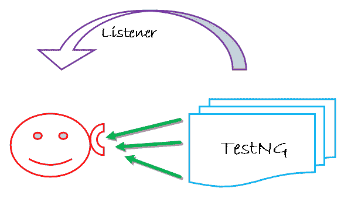
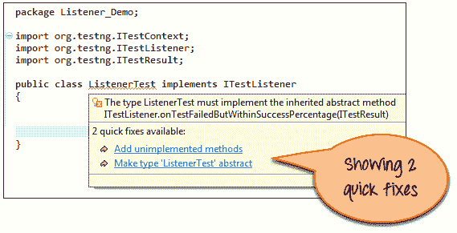
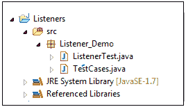
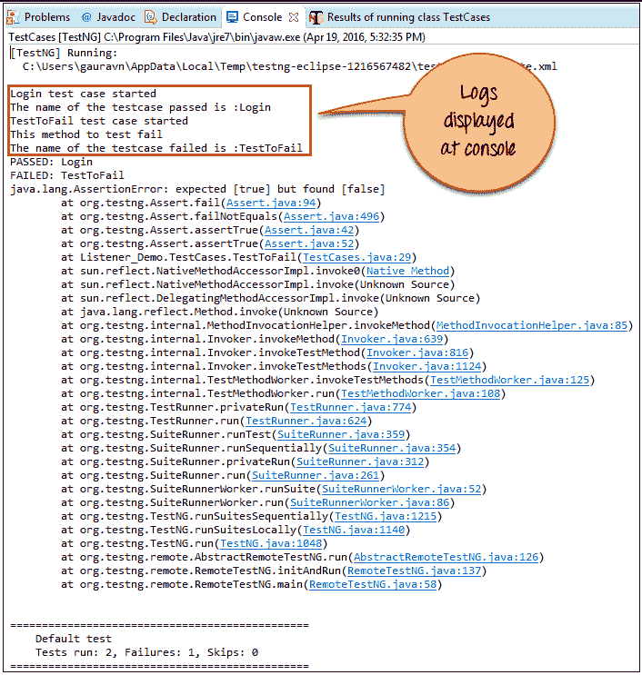
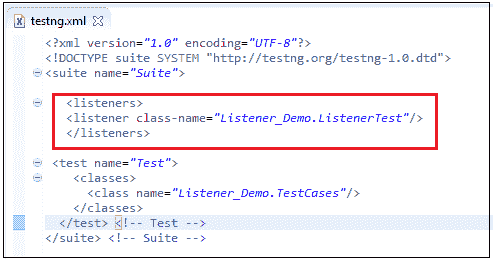

# Selenium 中的 TestNG 侦听器：​​ITestListener & ITestResult 示例

> 原文： [https://www.guru99.com/listeners-selenium-webdriver.html](https://www.guru99.com/listeners-selenium-webdriver.html)

有两个主要的听众。

1.  WebDriver 侦听器
2.  TestNG 侦听器

在本教程中，我们将讨论 [Testng](/all-about-testng-and-selenium.html) 侦听器。 这是您将学到的-

*   [什么是 TestNG 中的侦听器？](#1)
*   [TestNG](#2) 中的侦听器类型
*   [测试方案：](#3)
*   [创建 TestNG 侦听器](#4)的步骤
*   [将侦听器用于多个类。](#5)

## TestNG 中的侦听器是什么？

侦听器定义为修改默认 TestNG 行为的接口。 顾名思义，侦听器“侦听”硒脚本中定义的事件并相应地表现。 通过实现侦听器接口在硒中使用它。 它允许自定义 TestNG 报告或日志。 有多种类型的 TestNG 侦听器可用。



## TestNG 中的侦听器类型

侦听器有多种类型，可让您更改 TestNG 的行为。

以下是一些 TestNG 侦听器：

1.  IAnnotationTransformer，
2.  IAnnotationTransformer2，
3.  可配置的
4.  IConfigurationListener，
5.  IExecutionListener，
6.  我可以
7.  IInvokedMethodListener，
8.  IInvokedMethodListener2，
9.  IMethodInterceptor，
10.  IReporter，
11.  ISuiteListener，
12.  ITestListener。

接口上方称为 TestNG 侦听器。 这些接口用于硒中以生成日志或自定义 TestNG 报告。

在本教程中，我们将实现 ITestListener。

ITestListener 具有以下方法

*   **OnStart-** OnStart 方法在任何测试开始时被调用。
*   **onTestSuccess-** onTestSuccess 方法在任何测试成功时被调用。
*   **onTestFailure-在任何测试失败时调用** onTestFailure 方法。
*   **onTestSkipped-** onTestSkipped 方法在任何测试中被跳过。
*   每次测试失败但在成功百分比之内，都会调用 **onTestFailedButWithinSuccessPercentage-** 方法。
*   执行所有测试后，将调用 **onFinish-** onFinish 方法。

## 测试方案：

在此测试方案中，我们将自动执行登录过程并实现“ ItestListener”。

1.  启动 Firefox 并打开站点“ [http://demo.guru99.com/V4/”](http://demo.guru99.com/V4/)


1.  登录到该应用程序。


## 创建 TestNG 侦听器的步骤

对于上述测试方案，我们将实现 Listener。

**步骤 1）**创建实现“ ITestListener”的类“ ListenerTest”。 将鼠标移到红线文本上，Eclipse 将为您提供 2 个快速修复的建议，如以下屏幕所示：



只需单击“添加未实现的方法”。 多个未实现的方法（无主体）被添加到代码中。 检查以下-

```
package Listener_Demo;		

import org.testng.ITestContext ;		
import org.testng.ITestListener ;		
import org.testng.ITestResult ;		

public class ListenerTest implements ITestListener						
{		

    @Override		
    public void onFinish(ITestContext arg0) {					
        // TODO Auto-generated method stub				

    }		

    @Override		
    public void onStart(ITestContext arg0) {					
        // TODO Auto-generated method stub				

    }		

    @Override		
    public void onTestFailedButWithinSuccessPercentage(ITestResult arg0) {					
        // TODO Auto-generated method stub				

    }		

    @Override		
    public void onTestFailure(ITestResult arg0) {					
        // TODO Auto-generated method stub				

    }		

    @Override		
    public void onTestSkipped(ITestResult arg0) {					
        // TODO Auto-generated method stub				

    }		

    @Override		
    public void onTestStart(ITestResult arg0) {					
        // TODO Auto-generated method stub				

    }		

    @Override		
    public void onTestSuccess(ITestResult arg0) {					
        // TODO Auto-generated method stub				

    }		
}		

```

让我们修改“ ListenerTest”类。 特别是，我们将修改以下方法-

```
onTestFailure, onTestSkipped, onTestStart, onTestSuccess, etc.
```

修改很简单。 我们只打印测试的名称。

在控制台中创建日志。 用户很容易了解哪个测试是通过，失败和跳过状态。

修改后，代码看起来像-

```
package Listener_Demo;		

import org.testng.ITestContext;		
import org.testng.ITestListener;		
import org.testng.ITestResult;		

public class ListenerTest implements ITestListener						
{		

    @Override		
    public void onFinish(ITestContext Result) 					
    {		

    }		

    @Override		
    public void onStart(ITestContext Result)					
    {		

    }		

    @Override		
    public void onTestFailedButWithinSuccessPercentage(ITestResult Result)					
    {		

    }		

    // When Test case get failed, this method is called.		
    @Override		
    public void onTestFailure(ITestResult Result) 					
    {		
    System.out.println("The name of the testcase failed is :"+Result.getName());					
    }		

    // When Test case get Skipped, this method is called.		
    @Override		
    public void onTestSkipped(ITestResult Result)					
    {		
    System.out.println("The name of the testcase Skipped is :"+Result.getName());					
    }		

    // When Test case get Started, this method is called.		
    @Override		
    public void onTestStart(ITestResult Result)					
    {		
    System.out.println(Result.getName()+" test case started");					
    }		

    // When Test case get passed, this method is called.		
    @Override		
    public void onTestSuccess(ITestResult Result)					
    {		
    System.out.println("The name of the testcase passed is :"+Result.getName());					
    }		

}			

```

**步骤 2）**为登录过程自动化创建另一个类“ TestCases”。 Selenium 将执行此“ TestCases”以自动登录。

```
package Listener_Demo;		

import org.openqa.selenium.By;		
import org.openqa.selenium.WebDriver;		
import org.openqa.selenium.firefox.FirefoxDriver;		
import org.testng.Assert;		
import org.testng.annotations.Listeners;		
Import org.testng.annotations.Test;		

public class TestCases {				
WebDriver driver= new FirefoxDriver();					

// Test to pass as to verify listeners .		
@Test		
public void Login()				
{		
    driver.get("http://demo.guru99.com/V4/");					
    driver.findElement(By.name("uid")).sendKeys("mngr34926");							
    driver.findElement(By.name("password")).sendKeys("amUpenu");							
    driver.findElement(By.name("btnLogin")).click();					
}		

// Forcefully failed this test as to verify listener.		
@Test		
public void TestToFail()				
{		
    System.out.println("This method to test fail");					
    Assert.assertTrue(false);			
}		
}

```

**步骤 3）**接下来，在我们的常规项目类（即“ TestCases”）中实现此侦听器。 有两种不同的方法可以连接到类和接口。

第一种方法是使用侦听器批注（@Listeners），如下所示：

```
@Listeners(Listener_Demo.ListenerTest.class)				
```

如下所示，我们在“ TestCases”类中使用它。

因此，最后，使用侦听器注释后，类“ TestCases”看起来像：

```
package Listener_Demo;		

import org.openqa.selenium.By;		
import org.openqa.selenium.WebDriver;		
import org.openqa.selenium.firefox.FirefoxDriver;		
import org.testng.Assert;		
import org.testng.annotations.Listeners;		
import org.testng.annotations.Test;             		

@Listeners(Listener_Demo.ListenerTest.class)			

public class TestCases {				
WebDriver driver= new FirefoxDriver();					

//Test to pass as to verify listeners.		
@Test		
public void Login()				
{		
    driver.get("http://demo.guru99.com/V4/");					
    driver.findElement(By.name("uid")).sendKeys("mngr34926");							
    driver.findElement(By.name("password")).sendKeys("amUpenu");							
    driver.findElement(By.id("")).click();					
}		

//Forcefully failed this test as verify listener.		
@Test		
public void TestToFail()				
{		
    System.out.println("This method to test fail");					
    Assert.assertTrue(false);			
}		
}			

```

项目结构如下：



**步骤 4）：**执行“ TestCases”类。 根据标为@Test 的方法的行为，将自动调用“ ListenerTest”类中​​的方法。

**步骤 5）：**验证日志显示在控制台上的输出。

“ TestCases”的输出将如下所示：



```
[TestNG] Running:		
C:\Users\gauravn\AppData\Local\Temp\testng-eclipse--1058076918\testng-customsuite.xml		

Login Test Case started		
The name of the testcase passed is:Login		
TestToFail test case started		
This method to test fail		
The name of the testcase failed is:TestToFail		
PASSED: Login		
FAILED: TestToFail		
java.lang.AssertionError: expected [true] but found [false]			
```

## 对多个类使用侦听器。

如果项目有多个类，则将监听器添加到每个类中可能很麻烦且容易出错。

在这种情况下，我们可以创建一个 testng.xml 并在 XML 中添加侦听器标签。



该侦听器在整个测试套件中实现，而与您拥有的类数无关。 当您运行此 XML 文件时，侦听器将在所有提到的类上工作。 您还可以声明任意数量的侦听器类。

**摘要：**

需要侦听器以在 Selenium Webdriver 中生成日志或自定义 TestNG 报告。

*   侦听器的类型很多，可以根据需要使用。
*   侦听器是 Selenium Web 驱动程序脚本中使用的接口
*   演示了 Selenium 中侦听器的使用
*   为多个类实现了监听器