# 如何在 TestNG 中执行失败的测试用例：Selenium WebDriver

> 原文： [https://www.guru99.com/run-failed-test-cases-in-testng.html](https://www.guru99.com/run-failed-test-cases-in-testng.html)

在本教程中，您将学习-

*   [创建一个硒项目](#1)
*   [将 Selenium 项目转换并执行为 TestNG](#2)
*   [通过命令行](#3)执行 TestNG
*   [如何仅运行失败的测试用例](#4)
*   [从命令行](#5)运行 testng-failed.xml 文件

## 创建一个硒项目

准备项目

**步骤 1）**在 Eclipse 中，通过单击新的 Java 项目来创建 [Java](/java-tutorial.html) 项目

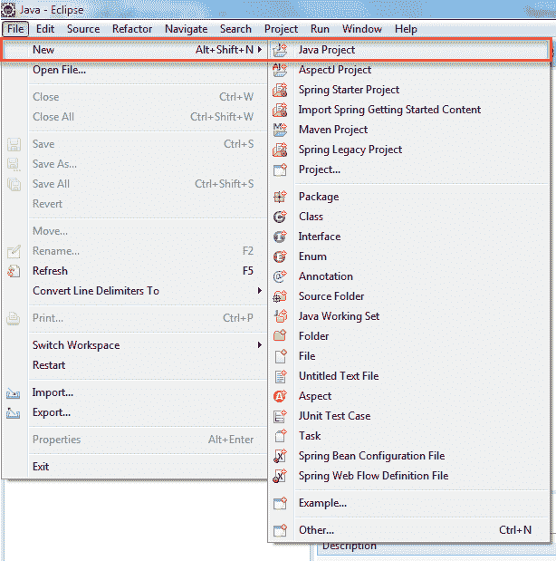

**步骤 2）**在此步骤中，

1.  给出项目名称
2.  选择执行环境
3.  选择项目布局选项
4.  点击“完成”按钮。

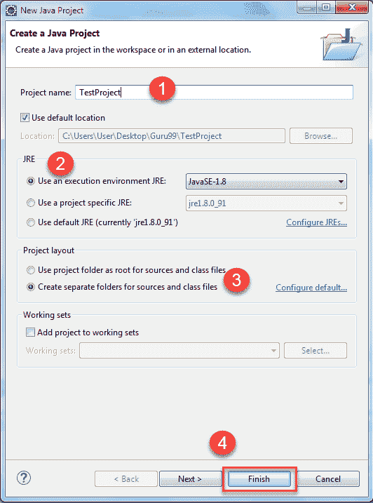

当您单击完成按钮时。 创建了“ TestProject” java 项目。 “ TestProject”将如下所示。

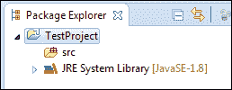

**步骤 3）**打开该新创建的项目。 您将能够在 Package Explorer 中看到“ src”文件夹。

1.  右键单击项目，然后选择“新建”
2.  选择选项包

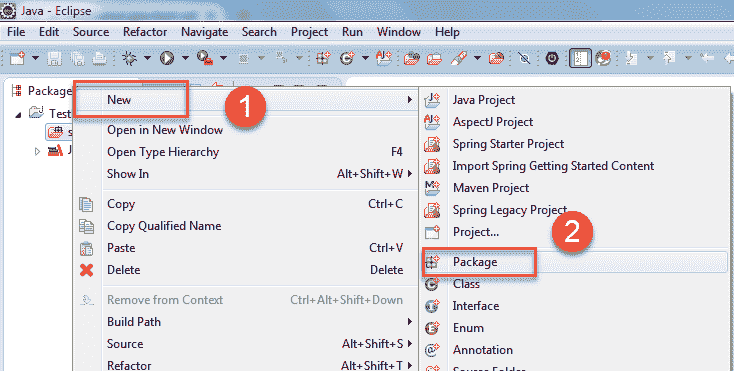

**步骤 4）**在此步骤中，

1.  浏览 src 文件夹并选择包
2.  给出包装名称并
3.  最后，单击完成按钮。 （程序包名称-> com.test）

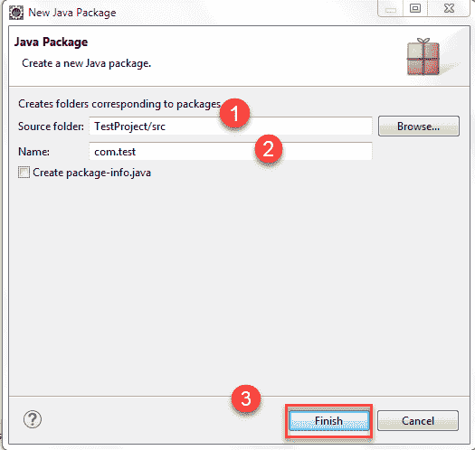

单击“完成”后，项目结构将如下所示：

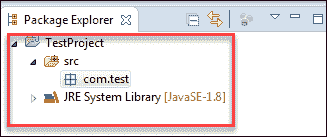

**步骤 5）**在此步骤中，

1.  现在，右键单击新创建的包，然后
2.  选择选项“类别”。

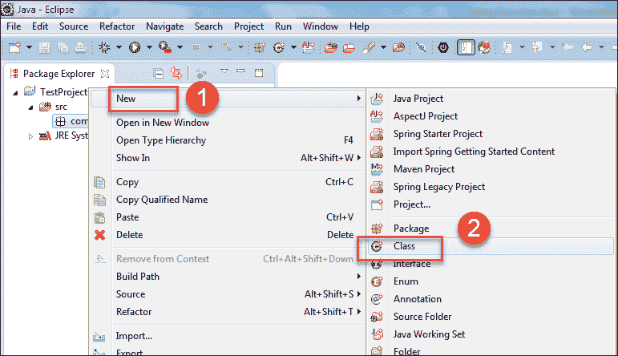

将打开一个新窗口。

**步骤 6）**在此步骤中，

1.  给出“班级”名称
2.  选择修饰符
3.  浏览并选择超类 java.lang.object
4.  单击完成按钮。

在这里，您将创建两个类，例如： **DemoA，DemoB** 。

首先创建类 DemoA。

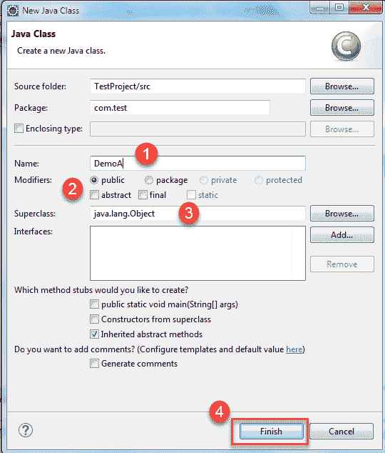

当您单击“完成”按钮时。 然后它将创建类似这样的类：

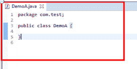

同样，创建类 DemoB，单击“完成”时，按钮类如下所示-

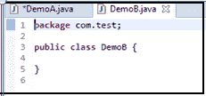

**步骤 7）**如果您已经安装了 TestNG 库，只需单击 Java Project --- > Properties。


**步骤 8）**现在在属性窗口中，

1.  单击 Java 构建路径
2.  点击图书馆
3.  单击添加库。


下一个

1.  点击“ TestNg”，然后
2.  点击“下一步”。

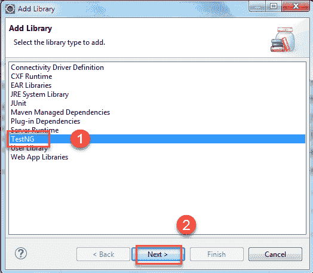

然后点击“完成”按钮。

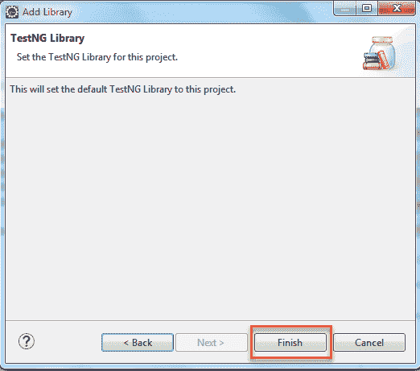

之后，编写以下代码。

**适用于 Class DemoA**

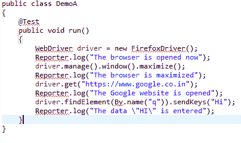

**代码说明：**

*   Driver.manage（）。window（）。maximize（）;

这行代码将最大化浏览器窗口。

*   driver.get（https://www.google.co.in）;

此行将在“ URL”字段中输入指定的 URL。

*   driver.findElement（By.name（“ q”））。sendKeys（“ Hi”）;

该行将识别“ Google”搜索框，并输入您使用 sendKeys 方法发送的数据。

**输出：上面的程序包含错误，因此无法执行。**

对于 DemoB 类，

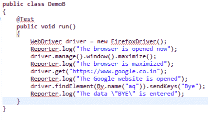

带红色下划线的单词是此处的错误。 因为尚未添加包含这些类和接口的 jar 文件。 为了消除上述代码中存在的错误，请添加相应的 jar 文件。 右键单击 Java 项目，然后选择“属性”。

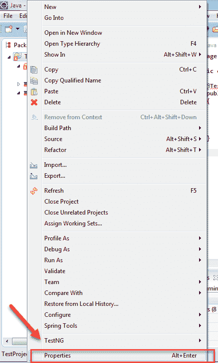

**步骤 8）**在属性窗口中，

1.  单击左侧导航窗格上的 Java Build 路径。
2.  点击库标签，
3.  单击添加外部 JAR，然后选择 Selenium 独立 jar 文件
4.  点击“确定”按钮。

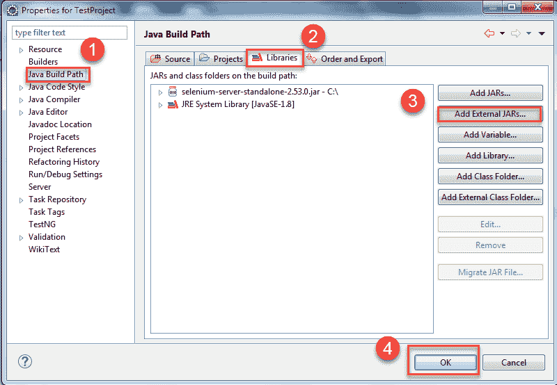

完成此步骤后，所有错误将自动删除。 如果没有，则将鼠标放在显示错误的代码上，并导入所有必需的类和接口。

对于@test，如果仍然显示错误，则将鼠标放在该位置。 它将显示可能的选项。 然后单击添加 TestNG 库选项。 同样，对其他“班级”也要这样做。

在两个类（即 DemoA 和 DemoB）中编写代码后，请转到下一步。

**步骤 9）**在此步骤中，

1.  右键单击项目，然后
2.  Select option folder to create a folder called 'lib' and paste testNG jar file and selenium jar file (selenium-server-standalone<version>).

    （需要从 Web 下载 Testng 和 Selenium-server-standalone jar 文件并将其存储在系统中。您需要手动转到该文件夹​​并复制这两个 jar，然后右键单击 eclipse 中的'lib'文件夹，然后单击 糊）

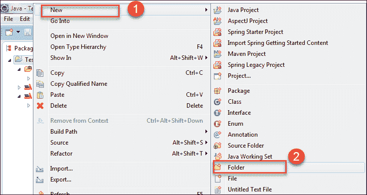

**步骤 10）**在此步骤中，

1.选择父文件夹

2.将文件夹名称命名为“ lib”，（在 lib 文件夹中添加这两个 jar 文件的主要目的是，在命令提示符下执行时，您可以告诉编译器执行程序所需的 jar 文件 位于此位置。如果要从 eclipse 执行 testng.xml，则完全不需要此 lib 文件夹）

3.点击“完成”按钮

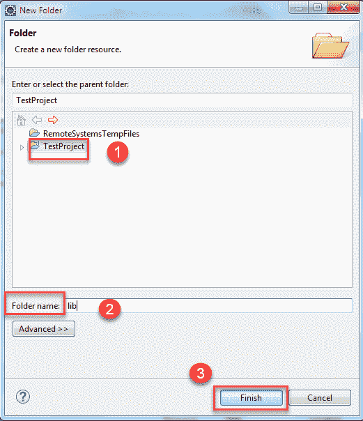

需要从 Web 下载 Testng 和 Selenium-server-standalone jar 文件并将其存储在系统中。 您需要手动转到该文件夹​​并复制这两个 jar，然后右键单击 Eclipse 中存在的“ lib”文件夹，然后单击“粘贴”

创建文件夹后，下一步就是将我们的程序 DemoA 和 DemoB 转换为 Testng.xml 文件。

### 将硒项目转换并执行为 TestNG

**步骤 1）**在此步骤中，

1.  选择该包下存在的两个 Java 文件，然后单击鼠标右键。
2.  选择名为“ testNG”的选项。
3.  单击转换为“ testNG”。

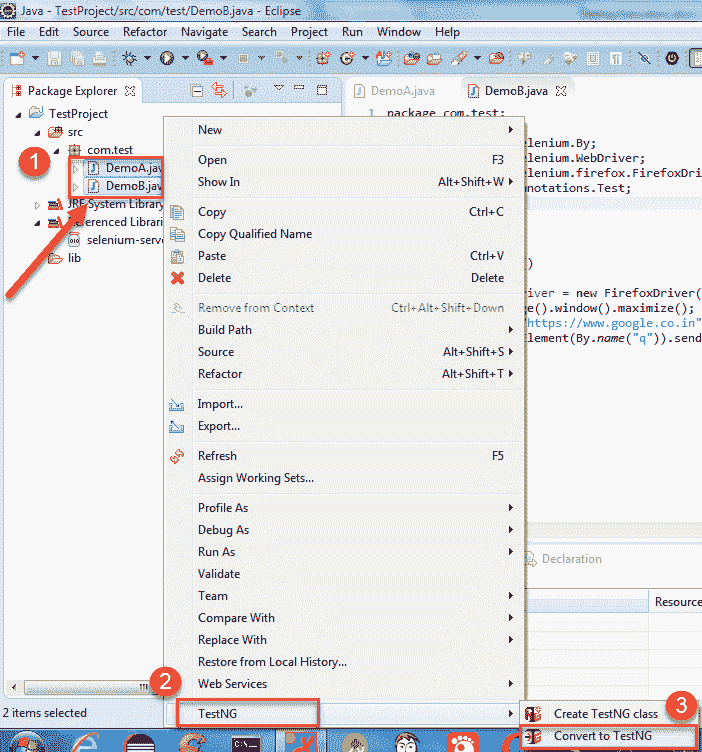

**步骤 2）**将打开一个新窗口。 在此窗口中，输入详细信息，例如

1.  位置
2.  套房名称
3.  测试名称
4.  班级选择
5.  平行模式
6.  点击“完成”按钮

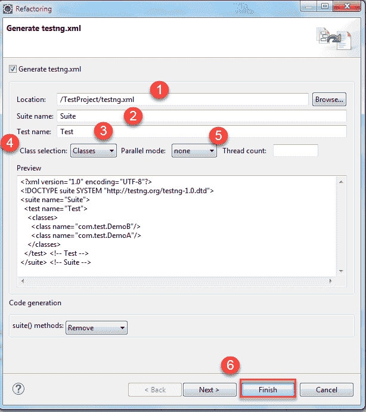

然后在 java 项目下创建了 testng.xml 文件，它看起来像这样。

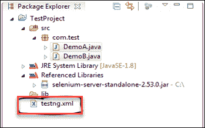

（如果要运行该 testng.xml 文件，请右键单击 Package Explorer 左导​​航窗格中存在的那个 testng.xml 文件，然后单击以 TestNG Suite 运行。）

**步骤 3）** testng.xml 套件文件如下所示：

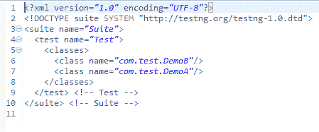

如果要先执行 DemoA 类，则删除该完整行，然后将其添加到 DemoB 类之前，如下所示：

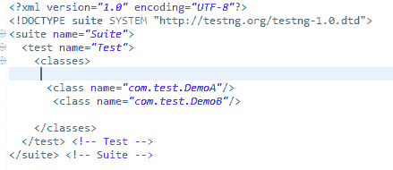

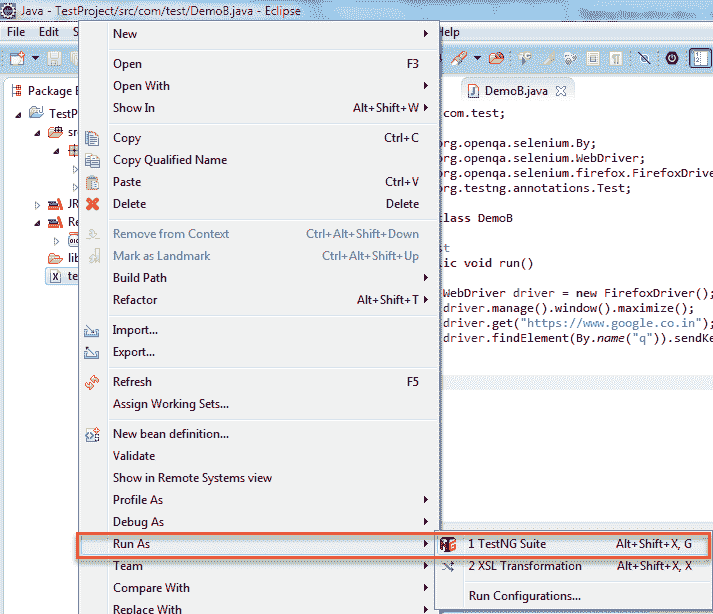

**步骤 4）**执行 testng.xml 文件后，它将以以下方式显示结果。 （由于尚未使用 System.out.println（）编写任何可执行语句，因此它不会在控制台窗口上打印任何内容）。

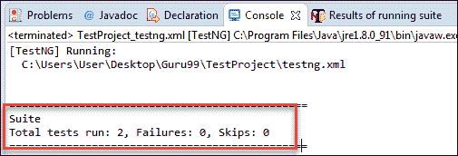

这是通过 Eclipse 执行测试的方法之一，如果要从命令提示符处执行包含两个类文件（例如 DemoA，DemoB）的相同 testng.xml 套件文件，则需要执行以下步骤。

现在打开命令提示符，然后转到 Project 工作区。

## 通过命令行执行 TestNG

您需要找到项目空间的位置

**步骤 1）**首先右键单击 Java 项目，然后选择属性选项。 在属性窗口中，选择选项资源。


**步骤 2）**现在，当您单击左侧导航窗格中的“资源”链接时。 它将显示项目的确切存储位置

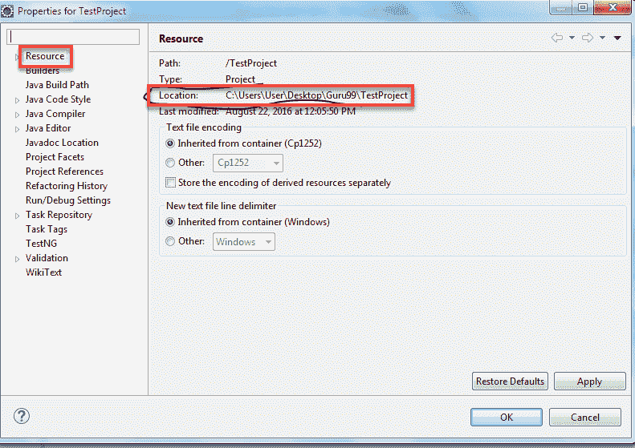

项目工作区为 **C：\ Users \ User \ Desktop \ Guru99 \ TestProject** 。 因此，您要将目录更改为该特定位置。

**步骤 3）**然后键入以下命令。 （此命令是通用命令）

[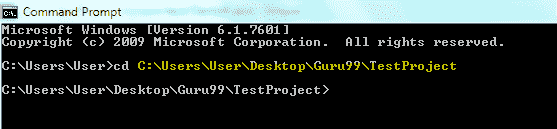 ](/images/8-2016/090116_1045_TestNGTutor37.png) 

java –cp“工作空间\ *中存在 lib 文件夹的路径；项目工作空间中存在 bin 文件夹的路径；项目工作空间的 lib 文件夹中存在的 testng.jar 文件的路径” org.testng.TestNG testng.xml

但是对于我们的项目，您需要编写以下命令。

```
Java –cp  "C:\Users\User\Desktop\Guru99\TestProject\lib\*;
  C:\Users\User\Desktop\Guru99\TestProject\bin" org.testng.TestNG testng.xml
```

**步骤 4）**然后按 Enter。 DemoA 和 DemoB 这两个类都将开始执行。 最后，它将在命令提示符下显示结果。

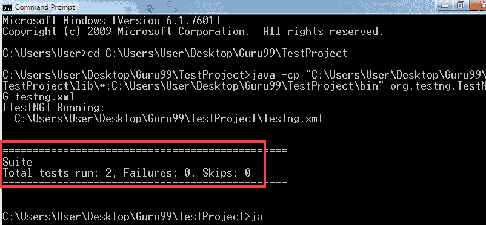

### 如何仅运行失败的测试用例

如果要通过 Eclipse 仅执行失败的测试用例，请首先刷新项目。

**步骤 1）**右键单击 Java 项目（演示 A 和 B）。 选择刷新选项，或者直接选择 Java 项目并按 F5。

**步骤 2）**然后，您将可以看到测试输出文件夹。 在该文件夹中，您有一个名为 testng-failed.xml 的文件。

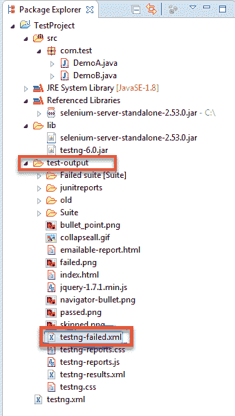

**步骤 3）**右键单击此文件，然后单击运行方式，然后选择称为“ testNG suite”的选项。

假设如果所有测试用例都成功执行，则如果您有三个测试用例，则意味着您无法在 test-output 文件夹下看到此文件夹。 仅当其中一个测试用例失败时，此文件夹才会出现。 然后运行此文件，它将仅运行失败的测试用例。

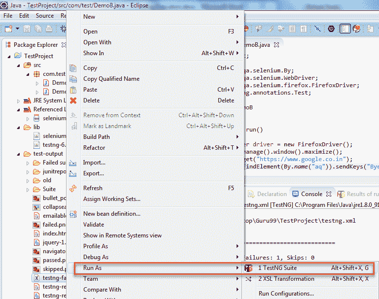

### 从命令行运行 testng-failed.xml 文件

**步骤 1）**在命令提示符下运行失败的测试用例。 打开命令提示符，然后转到“项目”工作区。

[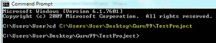 ](/images/8-2016/090116_1045_TestNGTutor41.png) 

我的项目工作区为 **C：\ Users \ User \ Desktop \ Guru99 \ TestProject** 。 因此，您将目录更改为该特定位置。

**步骤 2）**键入以下命令。 （此命令是通用命令）

java –cp“在工作区\ *中存在 lib 文件夹的路径；在项目工作区中存在 bin 文件夹的路径；在项目工作区的 lib 文件夹中存在的 testing.jar 文件的路径” org.testng.TestNG 测试输出/测试失败。 XML 文件

对于我们的项目，您需要编写以下命令。

```
Java –cp "C:\Users\User\Desktop\Guru99\TestProject\lib\*;
C:\Users\User\Desktop\Guru99\TestProject\bin" org.testng.TestNG test-output/testng-failed.xml
```

**步骤 3）**然后按 Enter。 它将仅运行失败的类，并且显示仅与该类相对应。

在上面的类中，即 DemoB 只需更改代码即可。

```
driver.findElement(By.name("a")).sendKeys("Bye");		
```

上面的代码将找不到任何元素。 因此，它将引发异常。 但是在我们的程序中，您没有处理异常，因此我们的程序将停止执行其余代码。 因此，ClassB 将失败。

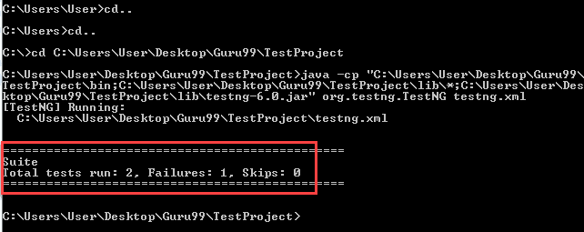

**摘要**：

*   TestNG 是自动化测试框架，它受 Junit 的启发，并包含不同的注释。
*   TestNG 在其标准报告中生成报告，其中包含以下内容：
    *   有多少个测试用例？
    *   通过了多少个测试用例？
    *   有多少测试用例失败？
    *   跳过多少个测试用例？
*   通过将测试类转换为测试套件文件，可以轻松地将多个测试用例分组并执行它们。
*   TestNG 可以轻松地与其他第三方工具集成。 它提供了不同的功能，例如为测试用例分配优先级，使用调用计数多次执行相同的测试用例。
*   如果在执行多个测试用例时任何一个测试用例失败，则可以分别执行该特定测试用例。
*   Reporter 类的静态方法“ log”可用于存储 org.testng 中存在的日志记录信息

本文由 **Sandeep Batageri** 提供