# Selenium WebDriver 中的 TestNG 报告生成

> 原文： [https://www.guru99.com/testng-report.html](https://www.guru99.com/testng-report.html)

在执行自动化测试以及手动测试时，生成报告非常重要。

*   通过查看结果，您可以轻松确定通过，失败和跳过了多少个测试用例。
*   通过查看报告，您将了解项目的状态。

Selenium Web 驱动程序用于自动执行 Web 应用程序，但不会生成任何报告。

*   TestNG 将生成默认报告。
*   当执行 testng.xml 文件时，并刷新项目。 您将在该文件夹中找到 test-output 文件夹。
*   右键单击 emailable-report.html 并选择选项。 使用网络浏览器打开。

在本教程中，您将学习-

*   [方法-1：emailable-report.html](#7)
*   [方法 2：index.html](#8)
*   [方法 3：记者类别](#9)

### 方法-1：emailable-report.html

1.  单击选项“ emailable-report.html”
2.  点击选项网络浏览器

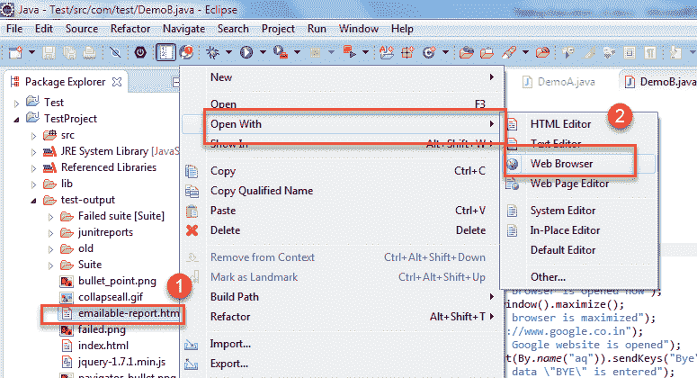

如果两个类都通过，testng 的输出报告将如下所示：

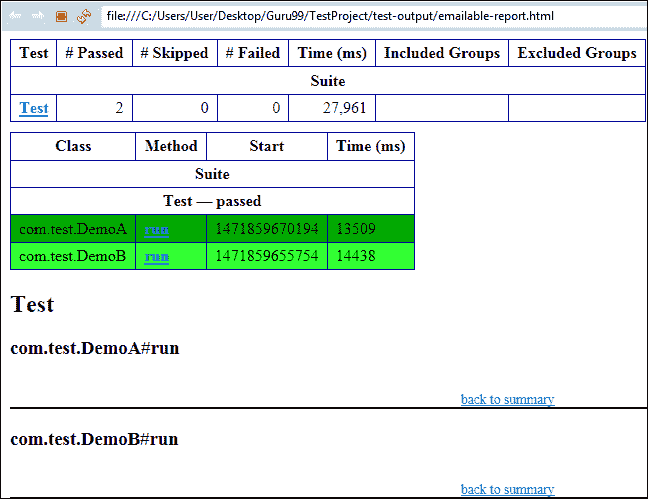

考虑一下您故意使测试用例（即 DemoB 类）失败的情况。 然后将这两个类都转换为 testng.xml 套件文件并运行它。 然后结果将如下所示。 它将显示失败的测试用例。

这是 DemoB 类的结果：

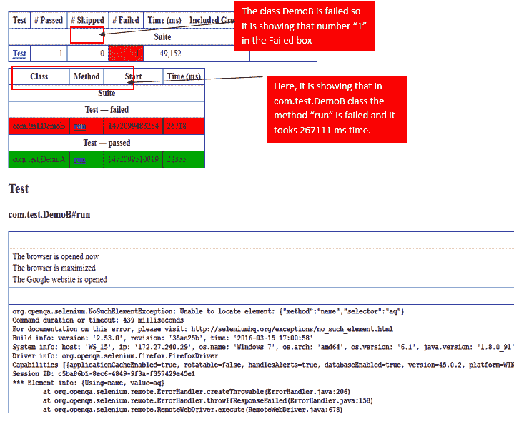

类似地，Class DemoA 的结果将如下所示：

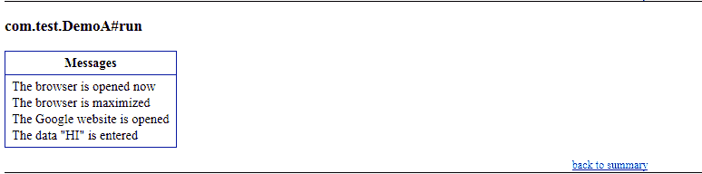

### 方法 2 index.html

1.  在项目目录中右键单击 index.html。
2.  选择使用 Web 浏览器选项打开的选项。 它将按以下顺序显示结果。

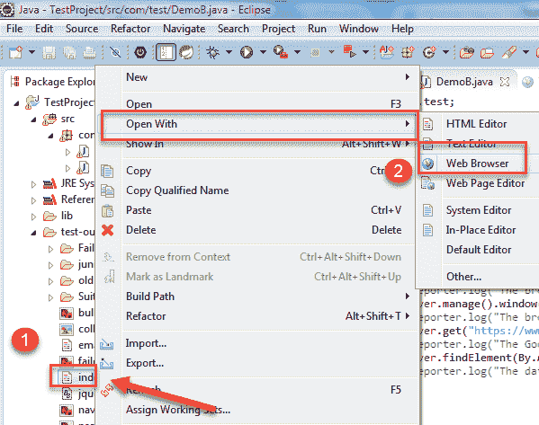

结果将如下所示：

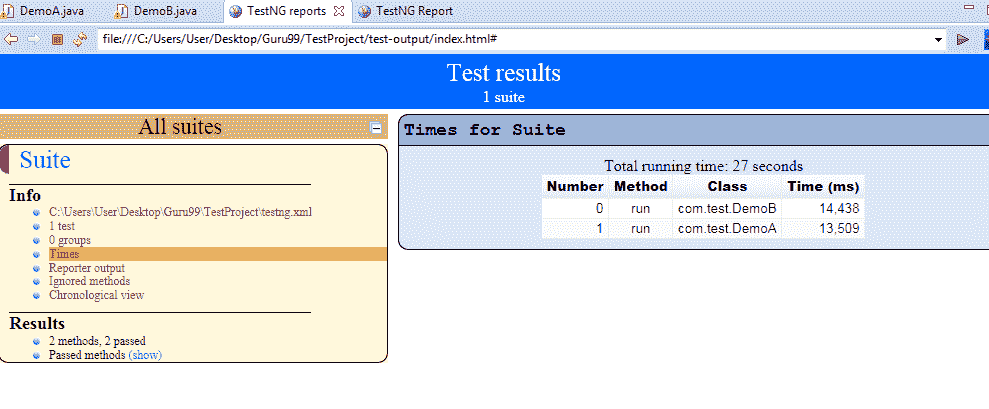

### 方法 3 报告程序类

连同这些报告生成的方法一起，您可以使用 object.properties 文件来存储系统生成的日志以及用户生成的日志。 但是，在测试中存储日志信息的最简单方法之一是使用 **Reporter 类**。

记者是 TestNG 中的一门课。 它提供了 4 种不同的方法来存储日志信息：

1.  Reporter.log（String s）;
2.  Reporter.log（String s，Boolean logToStandardOut）;
3.  Reporter.log（String s，int level）;
4.  Reporter.log（String s，int level，布尔值 logToStandardOut）;

**范例**：

创建两个类，例如 DemoA 和 DemoB，然后在这些类中编写以下代码。

对于类 DemoA；

*   上面已经说明了 DemoA 的代码。 在这里，您正在使用 Reporter 类的**日志方法。** （对于实现报告类，该类必须实现 org.testng.IReporter 接口）。
*   log 方法是 Reporter 类的静态方法。 因此，您正在通过 Reporter 类访问该方法。
*   log 方法用于存储写在程序内部的日志信息。 通过查看日志信息，您可以轻松地知道程序的确切停止位置。

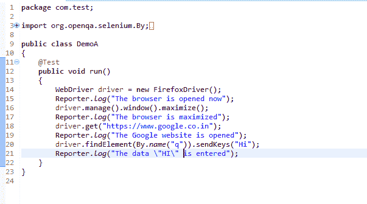

对于类 DemoB：

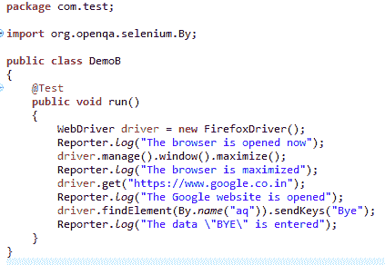

*   现在，通过选择这两个类创建 testng.xml 文件，然后
*   选择运行方式和
*   单击转换为 testng。
*   然后通过选择运行方式并选择 testng 套件来运行此 testng.xml 文件。
*   然后刷新项目，打开 test-output 文件夹。

1.  In the test-output folder, open the emailable-report.html. It will look like:

    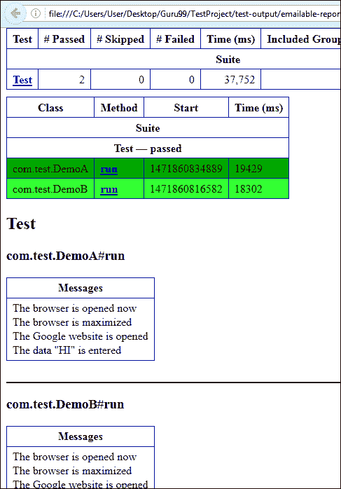

同样，您还将有一个 Demo B 项目的输出。

2.在 test-output 文件夹中，打开 index.html。 它看起来像：

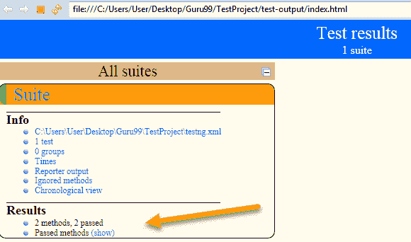

单击报告程序输出。 无论测试方法中编写了什么，它将打开日志信息。

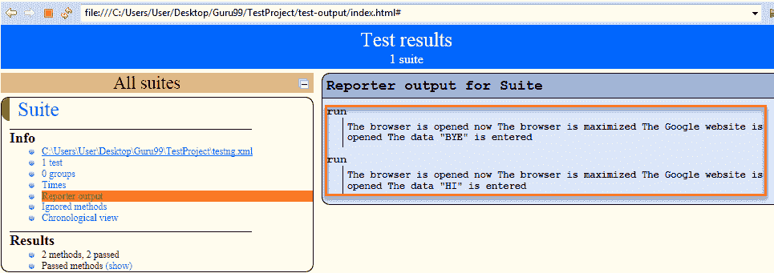

单击时代。 它将显示运行类中存在的测试方法所花费的时间。

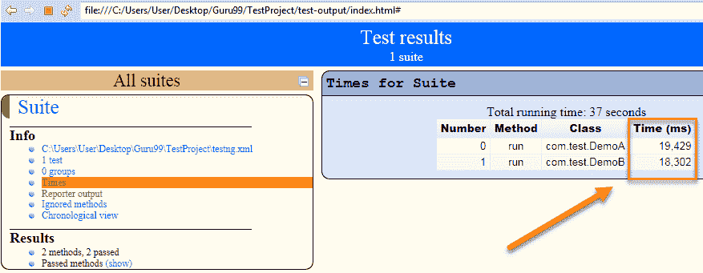