# 在 Selenium WebDriver 中自定义 PDF &电子邮件 TestNG 报告

> 原文： [https://www.guru99.com/pdf-emails-and-screenshot-of-test-reports-in-selenium.html](https://www.guru99.com/pdf-emails-and-screenshot-of-test-reports-in-selenium.html)

在研究其他内容之前，我们首先要了解-

## 为什么我们需要报告？

当我们使用 Selenium 或任何其他自动化工具时，我们正在 Web 应用程序上执行操作。 但是，我们自动化的目的不仅仅是练习被测应用程序。 作为自动化测试人员，我们应该测试应用程序，查找错误并将其报告给开发团队或更高级别的管理层。 在这里，报告对于软件[测试](/software-testing.html)流程非常重要

## TestNG 报告

TestNG 库提供了非常方便的报告功能。 执行后， [Testng](/all-about-testng-and-selenium.html) 将在项目的根目录下生成一个 test-output 文件夹。 此文件夹包含两种类型的报告-

**Index.html：**这是当前执行的完整报告，其中包含诸如错误，组，时间，报告程序日志，测试 XML 文件的信息。

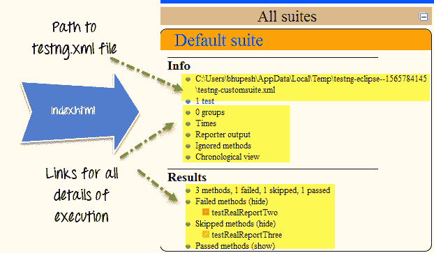

**emailable-report.html：**这是当前测试执行的摘要报告，其中以绿色（通过测试用例）和红色（对于失败测试用例）突出显示[测试用例](/test-case.html)消息。 。

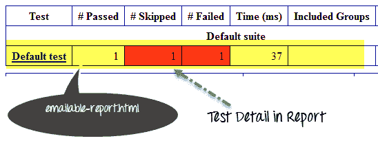

## 如何自定义 TestNG 报告

TestNG 的报告非常方便，但是有时候，我们在报告中需要的数据更少，或者想要以 pdf，excel 等其他格式显示报告，或者想要更改报告的布局。

我们可以通过两种方式自定义 TestNG 报告

*   使用 ITestListener 接口：
*   使用 IReporter 界面：

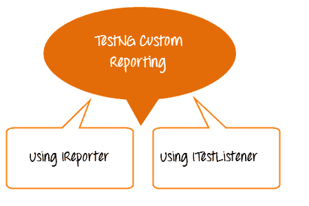

### ITestListener 接口

当需要自定义实时报告时，可以使用此界面。 换句话说，如果我们要在 TetNG 套件中执行大量测试用例，并且想要获取每个测试用例的报告，那么在每个测试用例之后，我们都需要实现 ITestListener 接口。 该接口将覆盖 onTestFailure，onTestStart，onTestSkipped 方法以发送当前测试用例的正确状态。

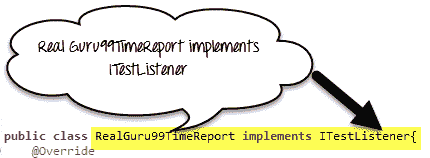

这是我们将要遵循的步骤

*   创建一个名为 RealGuru99Report 的类，并在其中实现 iTestListener。
*   实现 iTestListener 的方法
*   创建测试方法，并将 RealGuru99Report 类添加为 Test Method 类中的侦听器。


**代码示例**

RealGuru99TimeReport.java 是实时报告类。 它将实现 ITestListener 接口进行报告

```
package testNGReport.realTimeReport;

import org.testng.ITestContext;

import org.testng.ITestListener;

import org.testng.ITestResult;

public class RealGuru99TimeReport implements ITestListener{

    @Override

    public void onStart(ITestContext arg0) {

         System.out.println("Start Of Execution(TEST)->"+arg0.getName());

    }

    @Override

    public void onTestStart(ITestResult arg0) {

        System.out.println("Test Started->"+arg0.getName());

    }

    @Override

    public void onTestSuccess(ITestResult arg0) {

        System.out.println("Test Pass->"+arg0.getName());

    }

    @Override

    public void onTestFailure(ITestResult arg0) {

        System.out.println("Test Failed->"+arg0.getName());

    }

    @Override

    public void onTestSkipped(ITestResult arg0) {

        System.out.println("Test Skipped->"+arg0.getName());

    }

    @Override

    public void onFinish(ITestContext arg0) {

System.out.println("END Of Execution(TEST)->"+arg0.getName());

    }

    @Override

    public void onTestFailedButWithinSuccessPercentage(ITestResult arg0) {

        // TODO Auto-generated method stub

    }

}
```

**TestGuru99RealReport.java 是真实报告**的测试用例

```
package testNGReport.realTimeReport;

import org.testng.Assert;

import org.testng.annotations.Listeners;

import org.testng.annotations.Test;

@Listeners(RealGuru99TimeReport.class)

public class TestGuru99RealReport {

    @Test

    public void testRealReportOne(){

        Assert.assertTrue(true);

    }

    @Test

    public void testRealReportTwo(){

        Assert.assertTrue(false);

    }

    //Test case depends on failed testcase= testRealReportTwo

    @Test(dependsOnMethods="testRealReportTwo")

    public void testRealReportThree(){

    }

}
```

输出看起来像-

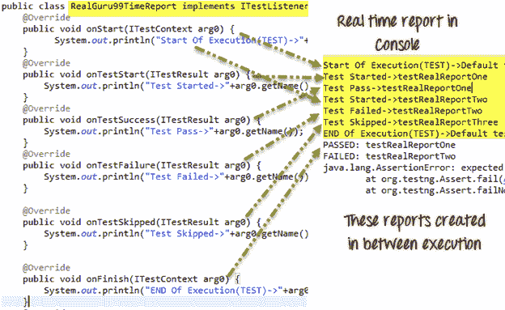

### IReporter 界面

如果要自定义 TestNG 生成的最终测试报告，则需要实现 IReporter 接口。 该接口只有一种方法可以实现 generateReport。 此方法在列表< ISuite >中具有完整测试执行的所有信息，我们可以使用它生成报告。

**Code Example**

**Guru99Reporter.java 是用于自定义报告**的文件

```
package testNGReport.iReporterReport;

import java.util.Collection;

import java.util.Date;

import java.util.List;

import java.util.Map;

import java.util.Set;

import org.testng.IReporter;

import org.testng.IResultMap;

import org.testng.ISuite;

import org.testng.ISuiteResult;

import org.testng.ITestContext;

import org.testng.ITestNGMethod;

import org.testng.xml.XmlSuite;

public class Guru99Reporter implements IReporter{

    @Override

    public void generateReport(List<XmlSuite> arg0, List<ISuite> arg1,

            String outputDirectory) {

        // Second parameter of this method ISuite will contain all the suite executed.

        for (ISuite iSuite : arg1) {

         //Get a map of result of a single suite at a time

            Map<String,ISuiteResult> results =    iSuite.getResults();

         //Get the key of the result map

            Set<String> keys = results.keySet();

        //Go to each map value one by one

            for (String key : keys) {

             //The Context object of current result

            ITestContext context = results.get(key).getTestContext();

            //Print Suite detail in Console

             System.out.println("Suite Name->"+context.getName()

                    + "::Report output Ditectory->"+context.getOutputDirectory()

                     +"::Suite Name->"+ context.getSuite().getName()

                     +"::Start Date Time for execution->"+context.getStartDate()

                     +"::End Date Time for execution->"+context.getEndDate());

             //Get Map for only failed test cases

            IResultMap resultMap = context.getFailedTests();

            //Get method detail of failed test cases

            Collection<ITestNGMethod> failedMethods = resultMap.getAllMethods();

            //Loop one by one in all failed methods

            System.out.println("--------FAILED TEST CASE---------");

            for (ITestNGMethod iTestNGMethod : failedMethods) {

                //Print failed test cases detail

                System.out.println("TESTCASE NAME->"+iTestNGMethod.getMethodName()

                        +"\nDescription->"+iTestNGMethod.getDescription()

                        +"\nPriority->"+iTestNGMethod.getPriority()

                        +"\n:Date->"+new Date(iTestNGMethod.getDate()));

            }

        }

        }

    }

}
```

**TestGuru99ForReporter.java 是自定义报告的演示**

```
package testNGReport.iReporterReport;

import org.testng.Assert;

import org.testng.annotations.Listeners;

import org.testng.annotations.Test;

//Add listener to listen report and write it when testcas finished

@Listeners(value=Guru99Reporter.class)

public class TestGuru99ForReporter {

    @Test(priority=0,description="testReporterOne")

    public void testReporterOne(){

        //Pass test case

        Assert.assertTrue(true);

    }

    @Test(priority=1,description="testReporterTwo")

    public void testReporterTwo(){

        //Fail test case

        Assert.assertTrue(false);

    }

}
```

输出将像-

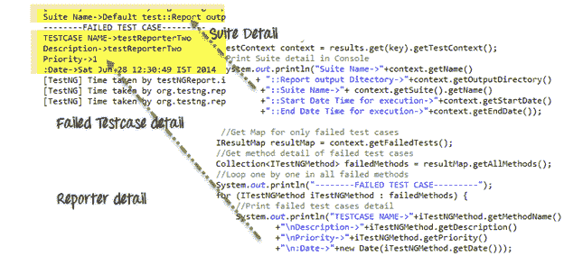

## PDF 和报告电子邮件

上面的报告实现非常简单明了，可帮助您开始进行报告定制。

但是在公司环境中，您将需要创建高度定制的报告。 这是我们将要处理的方案

1.  以 PDF 格式创建自定义报告
2.  仅截取有关错误的屏幕截图。 链接到 PDF 屏幕截图
3.  发送 PDF 电子邮件

PDF 报告如下所示

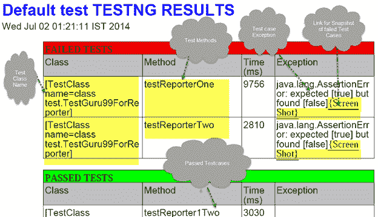

要创建 pdf 报告，我们需要一个 [Java](/java-tutorial.html) API， **IText** 。 在处下载[。 还有另一个自定义侦听器类，它实际上是在实现此 IText jar 并为我们创建 pdf 报告。 在此处下载](http://mirrors.ibiblio.org/pub/mirrors/maven2/com/lowagie/itext/2.1.7/itext-2.1.7.jar)[](https://groups.google.com/group/testng-users/attach/3bc22fcb3e8cc39c/JyperionListener.java?part=0.1&authuser=0)

上图显示了生成的 PDF 报告的默认格式。 您可以自定义

这是我们将如何处理的方法

步骤 1）创建一个基类

步骤 2）自定义 JypersionListerner.Java（PDF 创建代码）

步骤 3）创建一个 TestGuru99PDFEmail.java，它将执行测试用例，创建 PDF

步骤 4）将代码附加到 TestGuru99PDFEmail.java 以通过电子邮件发送 PDF 报告

**让我们看一下这些步骤**

步骤 1）创建基类

该基类具有创建 WebDriver 和获取屏幕截图的功能

```
package PDFEmail;

import java.io.File;

import org.apache.commons.io.FileUtils;

import org.openqa.selenium.OutputType;

import org.openqa.selenium.TakesScreenshot;

import org.openqa.selenium.WebDriver;

import org.openqa.selenium.firefox.FirefoxDriver;

public class BaseClass {

    static WebDriver driver;

    public static WebDriver getDriver(){

        if(driver==null){

        WebDriver driver ;
    	System.setProperty("webdriver.gecko.driver","C:\\geckodriver.exe");
    	driver = new FirefoxDriver();

        }

        return driver;

    }

    /**

     * This function will take screenshot

     * @param webdriver

     * @param fileWithPath

     * @throws Exception

     */

    public static void takeSnapShot(WebDriver webdriver,String fileWithPath) throws Exception{

        //Convert web driver object to TakeScreenshot

        TakesScreenshot scrShot =((TakesScreenshot)webdriver);

        //Call getScreenshotAs method to create image file

                File SrcFile=scrShot.getScreenshotAs(OutputType.FILE);

            //Move image file to new destination

                File DestFile=new File(fileWithPath);

                //Copy file at destination

                FileUtils.copyFile(SrcFile, DestFile);

    }

}
```

步骤 2）自定义 JypersionListener.java

我们将坚持默认的报告格式。 但是我们将进行 2 种自定义

*   添加代码以指示 JypersionListener 对错误进行截图
*   将截图截图的链接附加到 PDF 报告中

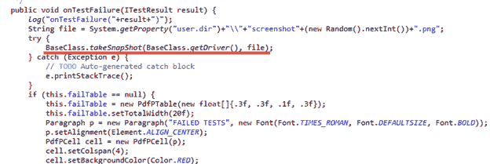

添加代码以将屏幕截图附加到 PDF 报告

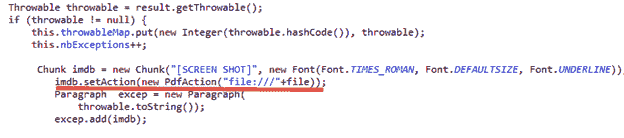

步骤 3）创建一个 TestGuru99PDFEmail.java，它将执行测试用例，创建 PDF

*   在这里，我们将添加 JyperionListener.class 作为侦听器
*   我们将执行 3 个测试用例。
*   使用 Assert.assertTrue，我们将仅通过一个而使 2 个测试用例失败。
*   仅根据我们的定制为失败的测试用例截屏

```
package PDFEmail;

import java.util.Properties;

import javax.activation.DataHandler;

import javax.activation.DataSource;

import javax.activation.FileDataSource;

import javax.mail.BodyPart;

import javax.mail.Message;

import javax.mail.MessagingException;

import javax.mail.Multipart;

import javax.mail.Session;

import javax.mail.Transport;

import javax.mail.internet.AddressException;

import javax.mail.internet.InternetAddress;

import javax.mail.internet.MimeBodyPart;

import javax.mail.internet.MimeMessage;

import javax.mail.internet.MimeMultipart;

import org.openqa.selenium.WebDriver;

import org.testng.Assert;

import org.testng.annotations.AfterSuite;

import org.testng.annotations.Listeners;

import org.testng.annotations.Test;

import reporter.JyperionListener;

//Add listener for pdf report generation

@Listeners(JyperionListener.class)

public class TestGuru99PDFReport extends BaseClass {

    WebDriver driver;

    //Testcase failed so screen shot generate

    @Test

    public void testPDFReportOne(){

        driver = BaseClass.getDriver();

        driver.get("http://google.com");

        Assert.assertTrue(false);

    }

    //Testcase failed so screen shot generate

    @Test

    public void testPDFReporTwo(){

        driver = BaseClass.getDriver();

        driver.get("http:/guru99.com");

        Assert.assertTrue(false);

    }

    //Test test case will be pass, so no screen shot on it

    @Test

    public void testPDFReportThree(){

        driver = BaseClass.getDriver();

        driver.get("http://demo.guru99.com");

        Assert.assertTrue(true);

    }
```

Step 4) Append code to TestGuru99PDFEmail.java to send PDF report via email

*   我们将使用注释@AfterSuite 发送 PDF 报告的电子邮件
*   我们将使用 Gmail 发送电子邮件
*   要启用电子邮件，需要导入许多库文件，例如 mail.jar，pop3.jar，smtpt.jar 等。
*   在执行此操作之前，请输入收件人的电子邮件地址和密码

```
 //After complete execution send pdf report by email

    @AfterSuite

    public void tearDown(){

        sendPDFReportByGMail("This email address is being protected from spambots. You need JavaScript enabled to view it.
	", "password", "This email address is being protected from spambots. You need JavaScript enabled to view it.", "PDF Report", "");

        }

    /**

     * Send email using java

     * @param from

     * @param pass

     * @param to

     * @param subject

     * @param body

     */

    private static void sendPDFReportByGMail(String from, String pass, String to, String subject, String body) {

Properties props = System.getProperties();

String host = "smtp.gmail.com";

props.put("mail.smtp.starttls.enable", "true");

props.put("mail.smtp.host", host);

props.put("mail.smtp.user", from);

props.put("mail.smtp.password", pass);

props.put("mail.smtp.port", "587");

props.put("mail.smtp.auth", "true");

Session session = Session.getDefaultInstance(props);

MimeMessage message = new MimeMessage(session);

try {

    //Set from address

message.setFrom(new InternetAddress(from));

message.addRecipient(Message.RecipientType.TO, new InternetAddress(to));

//Set subject

message.setSubject(subject);

message.setText(body);

BodyPart objMessageBodyPart = new MimeBodyPart();

objMessageBodyPart.setText("Please Find The Attached Report File!");

Multipart multipart = new MimeMultipart();

multipart.addBodyPart(objMessageBodyPart);

objMessageBodyPart = new MimeBodyPart();

//Set path to the pdf report file

String filename = System.getProperty("user.dir")+"\\Default test.pdf";

//Create data source to attach the file in mail

DataSource source = new FileDataSource(filename);

objMessageBodyPart.setDataHandler(new DataHandler(source));

objMessageBodyPart.setFileName(filename);

multipart.addBodyPart(objMessageBodyPart);

message.setContent(multipart);

Transport transport = session.getTransport("smtp");

transport.connect(host, from, pass);

transport.sendMessage(message, message.getAllRecipients());

transport.close();

}

catch (AddressException ae) {

ae.printStackTrace();

}

catch (MessagingException me) {

me.printStackTrace();

}

}

}
```

**在此处下载完整的项目**

注意：当我们单击 pdf 中的屏幕快照链接时，它将显示安全对话框。 我们必须允许此对话框打开 pdf。

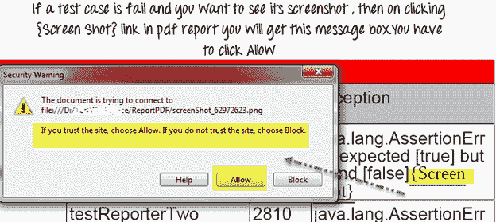

这样生成的电子邮件将如下所示

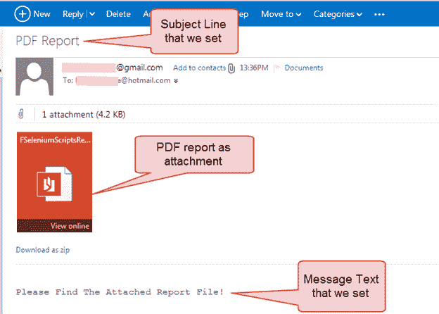

摘要：

*   TestNG 具有内置的报告功能。
*   在完全执行测试用例之后，TestNG 在项目的根目录中生成一个 test-output 文件夹。
*   在 test-output 文件夹中，有两个主要报告，index.html 和 emailable-report.html。
*   要自定义 TestNG 报告，我们需要实现两个接口 ITestListener 和 IReporter。
*   如果我们需要在两次执行之间获取报告，则需要 ITestListener。
*   为了在完成执行后创建最终报告，我们需要实现 IReporter。
*   截取屏幕截图，在 Selenium WebDriver 中，我们需要将 cast WebDriver 键入到 TakesScreenShot 接口。
*   要生成 pdf 报告，我们需要在项目中添加 IText jar。

[在本教程中下载用于演示的 Selenium 项目文件](https://drive.google.com/uc?export=download&id=0B_vqvT0ovzHcUFVqWUJWRGpibmc)