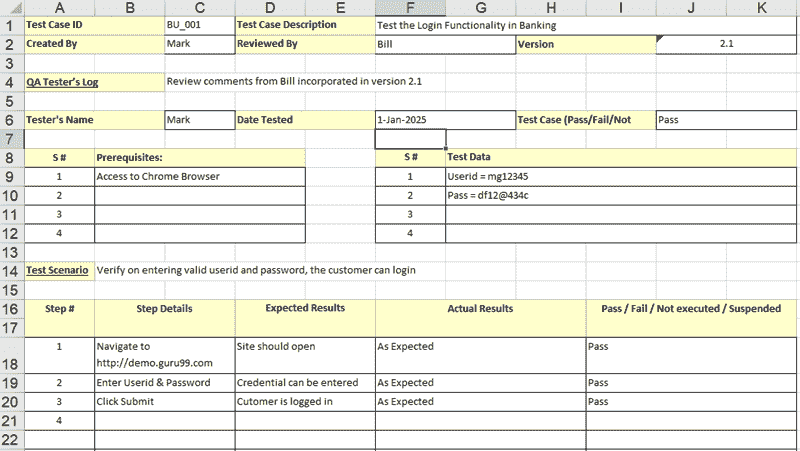

# 下载示例测试案例模板：示例 Excel，Word 格式

> 原文： [https://www.guru99.com/download-sample-test-case-template-with-explanation-of-important-fields.html](https://www.guru99.com/download-sample-test-case-template-with-explanation-of-important-fields.html)

好的[测试用例](/test-case.html)模板可以为测试团队维护测试工件的一致性，并使所有涉众都容易理解测试用例。 以标准格式编写测试用例可减少测试工作量和错误率。 如果您正在查看专家的测试用例，则更希望使用测试用例格式。

为您的项目选择的模板取决于您的测试策略。 许多组织在 Microsoft Excel 中创建测试用例，而另一些组织在 Microsoft Word 中创建。 有些甚至使用诸如 HP ALM 之类的测试管理工具来记录其测试用例。

点击下面下载测试用例 XLS

[下载测试用例模板（.xls）](https://drive.google.com/uc?export=download&id=0ByI5-ZLwpo25eXFlcU5ZMTJsT28)

无论选择哪种测试案例文档方法，任何好的测试案例模板都必须具有以下字段

| **测试用例字段** | **说明** |
| **测试案例 ID：** | 

*   每个测试用例都应由唯一的 ID 表示。 要指示测试类型，请遵循一些约定，例如“ TC_UI_1”，指示“ User Interface Test Case＃1”。

 |
| **测试优先级：** | 

*   在执行测试时很有用。
    *   低
    *   中
    *   高

 |
| **模块的名称**： | 

*   确定要测试的主模块或子模块的名称

 |
| 设计的**测试：** | 

*   测试人员的姓名

 |
| **设计的测试日期**： | 

*   设计测试的日期

 |
| 执行的**测试：** | 

*   谁执行了测试仪

 |
| **测试执行日期**： | 

*   需要执行测试的日期

 |
| **名称或测试标题**： | 

*   测试用例的标题

 |
| **描述/测试摘要**： | 

*   简要确定摘要或测试目的

 |
| **前提条件**： | 

*   在执行此测试用例之前需要完成的任何要求。 要执行此测试用例，请列出所有前提条件

 |
| **依赖项**： | 

*   确定对测试需求或其他测试用例的任何依赖关系

 |
| **测试步骤**： | 

*   详细提及所有测试步骤，并按需要执行的顺序编写。 在编写测试步骤时，请确保提供尽可能多的详细信息

 |
| **测试数据**： | 

*   使用测试数据作为测试用例的输入。 提供具有精确值的不同数据集以用作输入

 |
| **预期结果**： | 

*   提及预期的结果，包括应该在屏幕上显示的错误或消息

 |
| **后置条件**： | 

*   运行测试用例后系统的状态是什么？

 |
| **实际结果**： | 

*   测试执行后，应填写实际测试结果

 |
| **状态（失败/通过）：** | 

*   如果实际结果不符合估算结果，则将此字段标记为失败

 |
| **注释**： | 

*   如果上面的字段

中还有一些特殊情况 |

**根据项目要求，您可以有以下字段**

*   **链接/缺陷 ID** ：包括[缺陷](/defect-management-process.html)的链接，或者如果测试状态失败，则确定缺陷编号
*   **关键字/测试类型**：要根据测试类型确定测试，可以使用此字段。 例如：可用性，功能，业务规则等。
*   **要求**：正在为此测试用例编写的要求
*   **参考/附件**：对于复杂的测试场景很有用，提供文档或图表的实际路径
*   **自动化（是/否）**：在测试用例自动化时跟踪自动化状态
*   **Custom Fields**: Fields particular your project being tested due to client/project requirements.

    

## 测试案例模板

单击下面的下载测试用例 Excel 文件

[下载上述测试案例模板（.xls）](https://drive.google.com/uc?export=download&id=0ByI5-ZLwpo25eXFlcU5ZMTJsT28)

单击下面的下载测试用例 Word 文件

[下载以上测试用例模板（.docx）](https://drive.google.com/uc?export=download&id=1zP2u9lbp_KBjeMTq1dfilZL8-J7ig27A)