# Dataprovider & TestNG XML：Selenium 中的参数化（示例）

> 原文： [https://www.guru99.com/parameterization-using-xml-and-dataproviders-selenium.html](https://www.guru99.com/parameterization-using-xml-and-dataproviders-selenium.html)

在创建软件时，我们始终希望它对不同的数据集可以有所不同。 对于同一软件的[测试](/software-testing.html)，我们仅用一组数据进行测试就不公平。 同样，在这里，我们需要验证我们的系统正在采用它希望支持的所有组合。

图中是参数化。 为了在运行时将多个数据传递给应用程序，我们需要参数化测试脚本。

我们通过参数化实现的概念称为**数据驱动测试。**

在本教程中，您将学习-

*   [TestNG-中的参数化类型-](#1)
*   [带 Testng.xml 的参数注释](#2)
*   [故障排除](#3)
*   [使用 Dataprovider](#4) 的参数
*   [从不同的类](#5)调用 DataProvider
*   [Dataprovider](#6) 中参数的类型

## TestNG-中的参数化类型

为了使参数化更加清晰，我们将在 Selenium Webdriver 最受欢迎的框架之一中浏览参数化选项- **TestNG** 。

**有两种方法**，我们可以通过它们在 TestNG 中实现参数化

1.  With the help of **Parameters** **annotation** and **TestNG XML** file.

    

2.  With the help of **DataProvider** annotation.

    

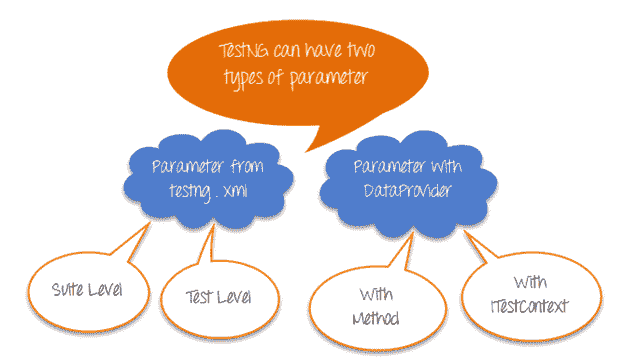

来自 Testng.xml 的参数可以是套件级别或测试级别

来自 DataProvider 的参数可以采用 Method 和 ITestContext 作为参数。

让我们详细研究它们-

## 带 Testng.xml 的参数注释

当您确实想处理复杂性&时，请使用注释选择参数化，输入组合的数量会减少。

让我们看看这是如何工作的

测试场景

步骤 1）启动浏览器&转到 Google.com

步骤 2）输入搜寻关键字

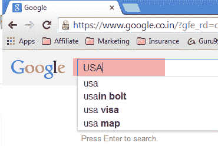

步骤 3）确认输入的值与我们的测试数据提供的值相同

步骤 4）重复 2 & 3 直到输入所有值

<colgroup><col> <col></colgroup> 
| 测试作者 | 搜索关键字 |
| 大师 99 | 印度 |
| 克里希纳 | 美国 |
| 布普什 | 中国 |

这是没有参数的情况下的示例

```
package parameters;

import org.testng.annotations.Test;
import org.testng.AssertJUnit;
import java.util.concurrent.TimeUnit;
import org.openqa.selenium.By;
import org.openqa.selenium.WebDriver;
import org.openqa.selenium.WebElement;
import org.openqa.selenium.firefox.FirefoxDriver;

public class NoParameterWithTestNGXML {
	String driverPath = "C:\\geckodriver.exe";
	WebDriver driver;

    @Test
    public void testNoParameter() throws InterruptedException{
        String author = "guru99";
        String searchKey = "india";

        System.setProperty("webdriver.gecko.driver", driverPath);        
        driver= new FirefoxDriver();
        driver.manage().timeouts().implicitlyWait(10, TimeUnit.SECONDS);

        driver.get("https://google.com");
        WebElement searchText = driver.findElement(By.name("q"));
        //Searching text in google text box
        searchText.sendKeys(searchKey);

        System.out.println("Welcome ->"+author+" Your search key is->"+searchKey);
                System.out.println("Thread will sleep now");

        Thread.sleep(3000);
        System.out.println("Value in Google Search Box = "+searchText.getAttribute("value") +" ::: Value given by input = "+searchKey);
        //verifying the value in google search box
        AssertJUnit.assertTrue(searchText.getAttribute("value").equalsIgnoreCase(searchKey));
}
}
```

一个研究，上面的例子。 试想一下，当我们对 3 个输入组合执行此操作时，代码将变得多么复杂

现在，让我们使用 TestNG 参数化它

为此，您需要

*   创建一个将存储参数的 XML 文件
*   在测试中，添加注释@Parameters

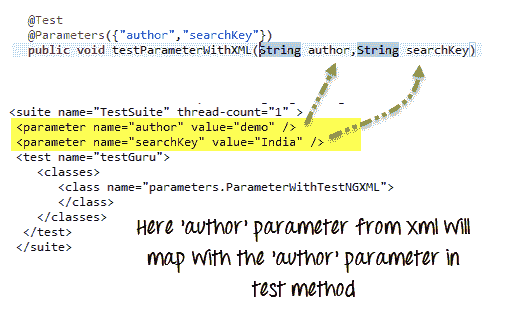

这是完整的代码

**测试级别 TestNG.xml**

```
<?xml version="1.0" encoding="UTF-8"?>
<!DOCTYPE suite SYSTEM "http://testng.org/testng-1.0.dtd">
<suite name="TestSuite" thread-count="3" >
<parameter name="author" value="Guru99" />
<parameter name="searchKey" value="India" />
<test name="testGuru">
<parameter name="searchKey" value="UK" />
<classes>
<class name="parameters.ParameterWithTestNGXML">
</class>
</classes>
</test>
</suite>
```

**ParameterWithTestNGXML.java 文件**

```
package parameters;

import org.testng.AssertJUnit;
import java.util.concurrent.TimeUnit;

import org.openqa.selenium.By;
import org.openqa.selenium.WebDriver;
import org.openqa.selenium.WebElement;
import org.openqa.selenium.firefox.FirefoxDriver;

import org.testng.annotations.Optional;
import org.testng.annotations.Parameters;
import org.testng.annotations.Test;

public class ParameterWithTestNGXML {
	String driverPath = "C:\\geckodriver.exe";
	WebDriver driver;
    @Test
    @Parameters({"author","searchKey"})
    public void testParameterWithXML( @Optional("Abc") String author,String searchKey) throws InterruptedException{

        System.setProperty("webdriver.gecko.driver", driverPath);
        driver = new FirefoxDriver();
        driver.manage().timeouts().implicitlyWait(10, TimeUnit.SECONDS);
        driver.get("https://google.com");

        WebElement searchText = driver.findElement(By.name("q"));
        //Searching text in google text box
        searchText.sendKeys(searchKey);

        System.out.println("Welcome ->"+author+" Your search key is->"+searchKey);
        System.out.println("Thread will sleep now");
        Thread.sleep(3000);
        System.out.println("Value in Google Search Box = "+searchText.getAttribute("value") +" ::: Value given by input = "+searchKey);
        //verifying the value in google search box
        AssertJUnit.assertTrue(searchText.getAttribute("value").equalsIgnoreCase(searchKey));

}
}
```

有关运行脚本，选择 XML 文件和“以 Test NG Suite 运行”的说明

**右键单击.xml 文件->运行方式-> [测试版](/all-about-testng-and-selenium.html)套件（注意：套件）**

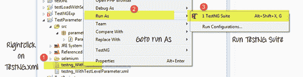

现在，可以在 2 个级别定义参数

1.  套件级别– TestNG XML 文件的<套件>标记内的参数将为套件级别参数。
2.  测试级别-测试 XML 文件的<测试>标记内的参数将为测试级别参数。

这是带有套件级别参数的相同测试

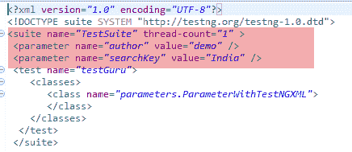

***注意：*** 如果套件级别和测试级别中的参数名称相同，则测试级别参数将优先于套件级别。 因此，在那种情况下，该测试级别内的所有类将共享重写的参数，而测试级别外的其他类将共享套件级别的参数。

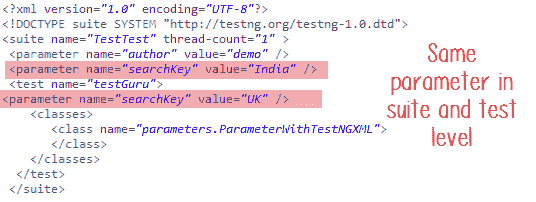

### 故障排除

***问题＃1*** 无法将 testng.xml 中的参数值类型转换为相应的测试方法的参数，这将引发错误。

考虑下面的例子

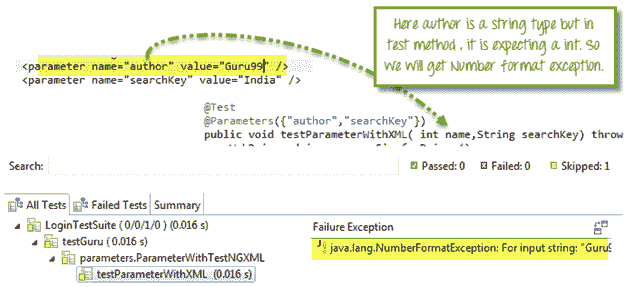

在这里，“作者”属性等于“ Guru99”，它是一个字符串，在相应的测试方法中，它期望一个整数值，因此我们将在这里得到一个例外。

***问题＃2*** 您的@Parameters 在 testing.xml 中没有相应的值。

您可以通过在测试方法的相应参数中添加 **@optional** ，**批注**来解决这种情况。

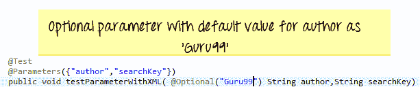

***问题＃3* ：**您要使用 Testng.xml 测试同一参数的多个值

简单的答案是这不能完成！ 您可以有多个不同的参数，但是每个参数只能有一个值。 这有助于防止将值硬编码到脚本中。 这使代码可重用。 可以将其视为脚本的配置文件。 如果要为参数使用多个值，请使用 DataProviders

## 使用 Dataprovider 的参数

@Parameters 批注很容易，但是要测试多组数据，我们需要使用 Data Provider。

要使用我们的测试框架填充数千个 Web 表单，我们需要一种不同的方法，该方法可以在一个执行流程中为我们提供非常大的数据集。

这个数据驱动的概念是通过 TestNG 中的 **@DataProvider** 注释实现的。

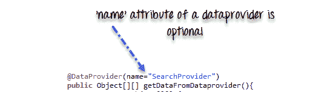

它只有一个**属性'name'**。 如果未指定 name 属性，则 DataProvider 的名称将与相应的方法名称相同。

数据提供者将**二维 JAVA 对象**返回到测试方法和测试方法，将在 M * N 类型的对象数组中调用 M 次。 例如，如果 DataProvider 返回一个 2 * 3 对象的数组，则相应的测试用例将每次使用 3 个参数被调用 2 次。

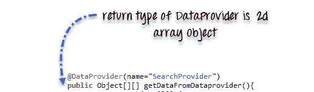

**完整示例**

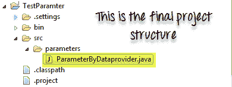

```
package parameters;

import java.util.concurrent.TimeUnit;

import org.openqa.selenium.By;
import org.openqa.selenium.WebDriver;
import org.openqa.selenium.WebElement;
import org.openqa.selenium.firefox.FirefoxDriver;

import org.testng.Assert;
import org.testng.annotations.BeforeTest;
import org.testng.annotations.DataProvider;
import org.testng.annotations.Test;

public class ParameterByDataprovider {
    WebDriver driver;
    String driverPath = "C:\\geckodriver.exe";

    @BeforeTest
    public void setup(){
        //Create firefox driver object
         System.setProperty("webdriver.gecko.driver", driverPath);
         driver = new FirefoxDriver();
         driver.manage().timeouts().implicitlyWait(10, TimeUnit.SECONDS);
         driver.get("https://google.com");
    }

    /** Test case to verify google search box
     * @param author
     * @param searchKey
     * @throws InterruptedException
     */

    @Test(dataProvider="SearchProvider")
    public void testMethod(String author,String searchKey) throws InterruptedException{
    {
        WebElement searchText = driver.findElement(By.name("q"));
        //search value in google searchbox
        searchText.sendKeys(searchKey);
        System.out.println("Welcome ->"+author+" Your search key is->"+searchKey);
        Thread.sleep(3000);
        String testValue = searchText.getAttribute("value");
        System.out.println(testValue +"::::"+searchKey);
        searchText.clear();
        //Verify if the value in google search box is correct
        Assert.assertTrue(testValue.equalsIgnoreCase(searchKey));
    }
    }
    /**
     * @return Object[][] where first column contains 'author'
     * and second column contains 'searchKey'
     */

    @DataProvider(name="SearchProvider")
    public Object[][] getDataFromDataprovider(){
    return new Object[][] 
    	{
            { "Guru99", "India" },
            { "Krishna", "UK" },
            { "Bhupesh", "USA" }
        };

    }

}
```

### 从不同的类调用 DataProvider

默认情况下，DataProvider 驻留在测试方法所在的类或其基类中。 要将其放在其他类中，我们需要将数据提供者方法设为静态，在测试方法中，我们需要在 **@Test** 批注中添加属性 **dataProviderClass** 。

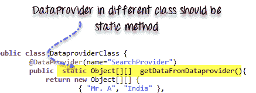

**代码示例**

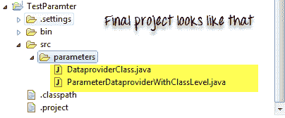

**TestClass ParameterDataproviderWithClassLevel.java**

```
package parameters;

import java.util.concurrent.TimeUnit;
import org.openqa.selenium.By;
import org.openqa.selenium.WebDriver;
import org.openqa.selenium.WebElement;
import org.openqa.selenium.firefox.FirefoxDriver;
import org.testng.Assert;
import org.testng.annotations.BeforeTest;
import org.testng.annotations.Test;

public class ParameterDataproviderWithClassLevel {
    WebDriver driver;
    String driverPath = "C:\\geckodriver.exe";

 	@BeforeTest
    public void setup(){
 		System.setProperty("webdriver.gecko.driver", driverPath);
		driver = new FirefoxDriver();
        driver.manage().timeouts().implicitlyWait(10, TimeUnit.SECONDS);
        driver.get("https://google.com");
    }

    @Test(dataProvider="SearchProvider",dataProviderClass=DataproviderClass.class)
    public void testMethod(String author,String searchKey) throws InterruptedException{

        WebElement searchText = driver.findElement(By.name("q"));
        //Search text in google text box
        searchText.sendKeys(searchKey);
        System.out.println("Welcome ->"+author+" Your search key is->"+searchKey);
        Thread.sleep(3000);
        //get text from search box
        String testValue = searchText.getAttribute("value");
        System.out.println(testValue +"::::"+searchKey);
        searchText.clear();
        //verify if search box has correct value
        Assert.assertTrue(testValue.equalsIgnoreCase(searchKey));
   }
}
```

**DataproviderClass.java**

```
package parameters;

import org.testng.annotations.DataProvider;
public class DataproviderClass {
        @DataProvider(name="SearchProvider")
        public static Object[][] getDataFromDataprovider(){
            return new Object[][] {
                { "Guru99", "India" },
                { "Krishna", "UK" },
                { "Bhupesh", "USA" }
            };  
}}
```

### Dataprovider 中的参数类型

DataProvider 方法支持两种类型的参数。

**方法**-如果 **SAME** 数据提供程序在使用不同的测试方法时应具有不同的行为，请使用 Method 参数。

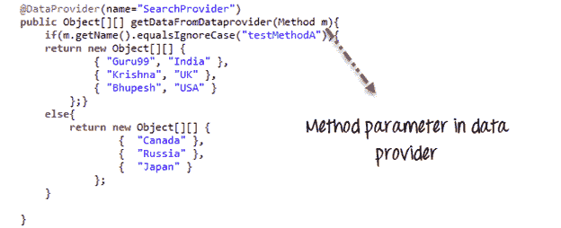

在以下示例中，

*   我们检查方法名称是否为 testMethodA。
*   如果是，则返回一组值
*   否则返回另一组值

```
package parameters;

import java.lang.reflect.Method;
import java.util.concurrent.TimeUnit;
import org.openqa.selenium.By;
import org.openqa.selenium.WebDriver;
import org.openqa.selenium.WebElement;
import org.openqa.selenium.firefox.FirefoxDriver;
import org.testng.Assert;
import org.testng.annotations.BeforeTest;
import org.testng.annotations.DataProvider;
import org.testng.annotations.Test;

public class ParameterByMethodInDataprovider{

    WebDriver driver;
    String driverPath = "C:\\geckodriver.exe";

    @BeforeTest
    public void setup(){
    	System.setProperty("webdriver.gecko.driver", driverPath);
    	driver = new FirefoxDriver();
        driver.manage().timeouts().implicitlyWait(10, TimeUnit.SECONDS);
        driver.get("https://google.com");
    }

    @Test(dataProvider="SearchProvider")
    public void testMethodA(String author,String searchKey) throws InterruptedException{

    	WebElement searchText = driver.findElement(By.name("q"));
        //Search text in search box
        searchText.sendKeys(searchKey);
        //Print author and search string
        System.out.println("Welcome ->"+author+" Your search key is->"+searchKey);
        Thread.sleep(3000);
        String testValue = searchText.getAttribute("value");
        System.out.println(testValue +"::::"+searchKey);
        searchText.clear();
        //Verify if google text box is showing correct value
        Assert.assertTrue(testValue.equalsIgnoreCase(searchKey));
    }

    @Test(dataProvider="SearchProvider")
    public void testMethodB(String searchKey) throws InterruptedException{
        {
        	WebElement searchText = driver.findElement(By.name("q"));
            //Search text in search box
            searchText.sendKeys(searchKey);
            //Print only search string
            System.out.println("Welcome ->Unknown user Your search key is->"+searchKey);
            Thread.sleep(3000);
            String testValue = searchText.getAttribute("value");
            System.out.println(testValue +"::::"+searchKey);
            searchText.clear();
            //Verify if google text box is showing correct value
            Assert.assertTrue(testValue.equalsIgnoreCase(searchKey));
        }
    }    
    /**
     * Here DataProvider returning value on the basis of test method name
     * @param m
     * @return
     **/

    @DataProvider(name="SearchProvider")
    public Object[][] getDataFromDataprovider(Method m){
        if(m.getName().equalsIgnoreCase("testMethodA")){
        return new Object[][] {
                { "Guru99", "India" },
                { "Krishna", "UK" },
                { "Bhupesh", "USA" }
            };}
        else{
        return new Object[][] {
                { "Canada" },
                { "Russia" },
                { "Japan" }
            };}       
    }
}
```

这是输出


**ITestContext** -它可以用于基于组为测试用例创建不同的参数。

在现实生活中，您可以使用 ITestContext 根据测试方法，测试主机，配置更改参数值。

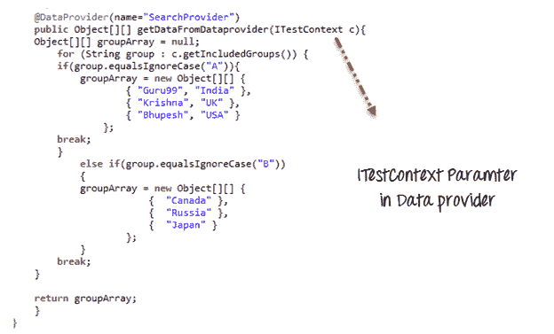

在下面的代码示例中

*   我们有 2 组 A & B
*   每种测试方法都分配给一个组
*   如果组的值为 A，则返回特定的数据集
*   如果组的值为 B，则返回另一个数据集

```
package parameters;

import java.util.concurrent.TimeUnit;
import org.openqa.selenium.By;
import org.openqa.selenium.WebDriver;
import org.openqa.selenium.WebElement;
import org.openqa.selenium.firefox.FirefoxDriver;
import org.testng.Assert;
import org.testng.ITestContext;
import org.testng.annotations.BeforeTest;
import org.testng.annotations.DataProvider;
import org.testng.annotations.Test;

public class ParameterByITestContextInDataprovider {
	WebDriver driver;
	String driverPath = "C:\\geckodriver.exe";
	@BeforeTest(groups={"A","B"})
	public void setup(){
		System.setProperty("webdriver.gecko.driver", driverPath);
		  	driver = new FirefoxDriver();
			driver.manage().timeouts().implicitlyWait(10, TimeUnit.SECONDS);
			driver.get("https://google.com");
	}

	@Test(dataProvider="SearchProvider",groups="A")
	public void testMethodA(String author,String searchKey) throws InterruptedException{
		{
		  //search google textbox
			WebElement searchText = driver.findElement(By.name("q"));
			//search a value on it
			searchText.sendKeys(searchKey);
			System.out.println("Welcome ->"+author+" Your search key is->"+searchKey);
			Thread.sleep(3000);
			String testValue = searchText.getAttribute("value");
			System.out.println(testValue +"::::"+searchKey);
			searchText.clear();
			//verify correct value in searchbox
			Assert.assertTrue(testValue.equalsIgnoreCase(searchKey));
	}
	}

	@Test(dataProvider="SearchProvider",groups="B")
	public void testMethodB(String searchKey) throws InterruptedException{
		{
		  //find google search box
			WebElement searchText = driver.findElement(By.name("q"));
			//search a value on it
			searchText.sendKeys(searchKey);
			System.out.println("Welcome ->Unknown user Your search key is->"+searchKey);
			Thread.sleep(3000);
			String testValue = searchText.getAttribute("value");
			System.out.println(testValue +"::::"+searchKey);
			searchText.clear();
			//verify correct value in searchbox
			Assert.assertTrue(testValue.equalsIgnoreCase(searchKey));
	}
	}

	/**
	 * Here the DAtaProvider will provide Object array on the basis on ITestContext
	 * @param c
	 * @return
	 */
	@DataProvider(name="SearchProvider")
	public Object[][] getDataFromDataprovider(ITestContext c){
	Object[][] groupArray = null;
		for (String group : c.getIncludedGroups()) {
		if(group.equalsIgnoreCase("A")){
			groupArray = new Object[][] { 
					{ "Guru99", "India" }, 
					{ "Krishna", "UK" }, 
					{ "Bhupesh", "USA" } 
				};
		break;	
		}
			else if(group.equalsIgnoreCase("B"))
			{
			groupArray = new Object[][] { 
						{  "Canada" }, 
						{  "Russia" }, 
						{  "Japan" } 
					};
			}
		break;
	}
	return groupArray;		
	}
}
```

注意：如果直接运行您的 testng 类，它将首先调用 dataprovider，由于组不可用，该数据提供程序无法获取组信息。 但是，相反，如果您通过 testng.xml 调用此类，它将在 ITestContext 中提供可用的组信息。 使用以下 XML 调用测试

```
<!DOCTYPE suite SYSTEM "http://beust.com/testng/testng-1.0.dtd" >
<suite name="test-parameter">

  <test name="example1">

    <groups>
        <run>
            <include name="A" />
        </run>
    </groups>

    <classes>
       <class
        name="parameters.ParameterByITestContextInDataprovider" />
    </classes>

  </test>

  <test name="example2">

    <groups>
        <run>
            <include name="B" />
        </run>
    </groups>

    <classes>
       <class
        name="parameters.ParameterByITestContextInDataprovider" />
    </classes>

  </test>

</suite>

```

**摘要**：

*   **必须进行参数化**才能创建**数据驱动测试**。
*   TestNG 支持两种参数化，使用 **@ Parameter + TestNG.xml** 和使用 **@DataProvider**
*   In **@Parameter+TestNG.xml** parameters can be placed in suite level and test level. If

    在两个地方都声明了相同的参数名称； 测试级别参数将优先于西服级别参数。

*   使用@ Parameter + TestNG.xml 一次只能设置一个值，但是@DataProvider 返回**一个对象**的二维数组。
*   如果 DataProvider 存在于不同的类中，那么测试方法所在的类为 **DataProvider** 应该是**静态方法**。
*   **DataProvider** 支持两个参数，即**方法**和 **ITestContext。**