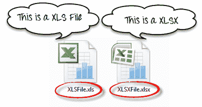
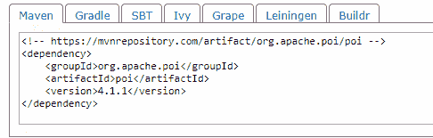
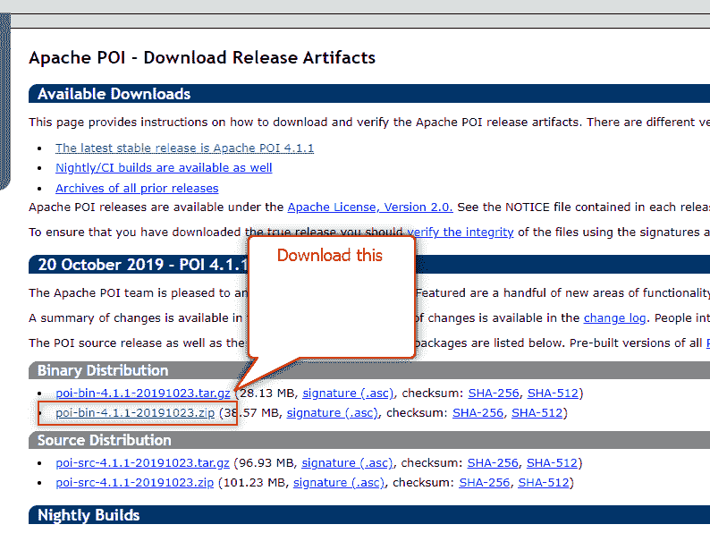
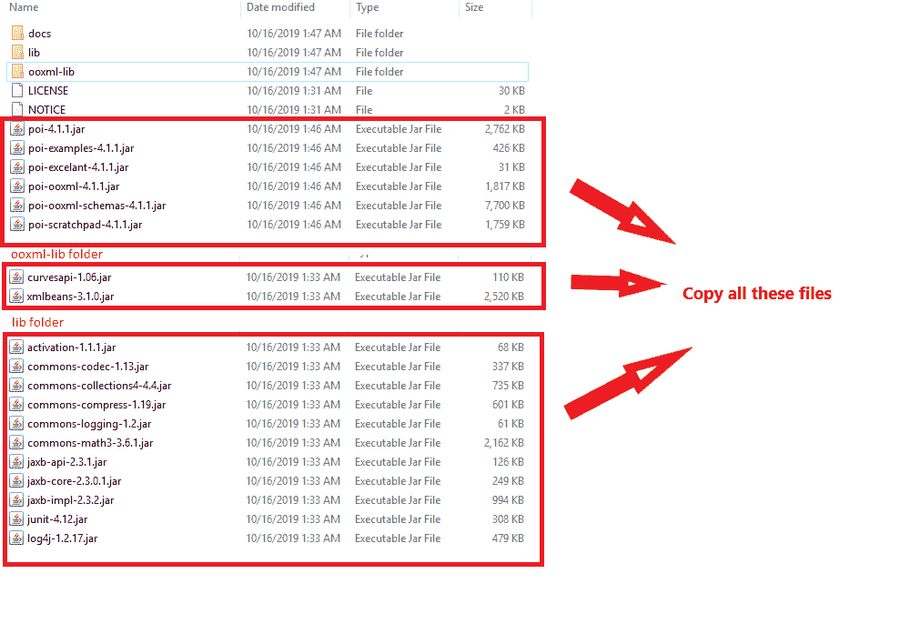
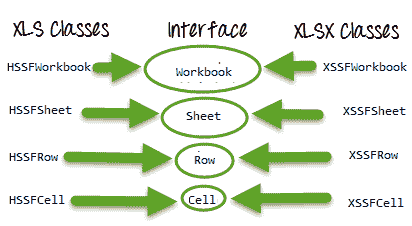
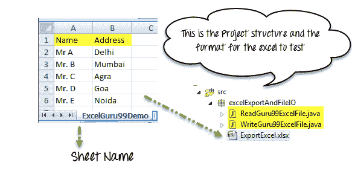
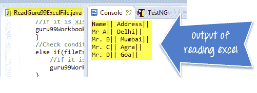
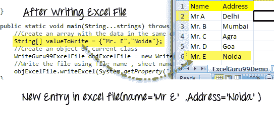
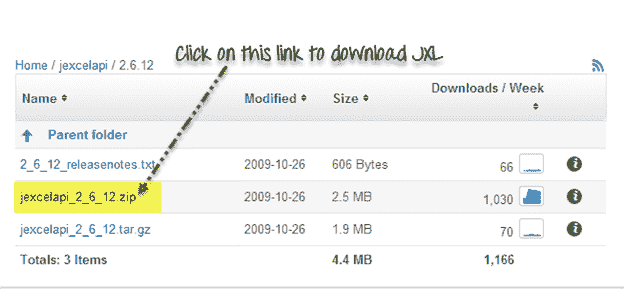

# 从 Selenium Webdriver 中的 Excel 文件中读取&写入数据：POI & JXL

> 原文： [https://www.guru99.com/all-about-excel-in-selenium-poi-jxl.html](https://www.guru99.com/all-about-excel-in-selenium-poi-jxl.html)

文件 IO 是任何软件过程的关键部分。 我们经常创建文件，打开文件&或在我们的计算机中将其删除。 Selenium Automation 也是如此。 我们需要一个使用 Selenium 处理文件的过程。

Java 为我们提供了使用 Selenium 进行文件操作的不同类。 在本教程中，我们将学习如何借助 [Java](/java-tutorial.html) IO 包和 [Apache](/apache.html) POI 库在 [Excel](/excel-tutorials.html) 文件上进行读写。

*   [如何使用 POI（Maven POM 依赖性）处理 excel 文件](#1)
*   POI 中的[类和接口](#2)
*   [读/写操作](#3)
*   [从 Excel 文件](#4)读取数据
*   [将数据写入 Excel 文件](#5)
*   [使用 JXL API](#6) 的 Excel 操作

## 汇出 Excel

### 如何使用 POI（Maven POM 依赖项）处理 excel 文件



为了读取或编写 Excel，Apache 提供了一个非常著名的库 POI。 该库足以读取和写入 Excel 的 **XLS** 和 **XLSX** 文件格式。

要读取 **XLS** 文件，POI 库提供了 **HSSF** 实现。

要读取 **XLSX，将选择 **POI** **库**的** **XSSF** 实现。 让我们详细研究这些实现。

如果您在项目中使用 Maven，则 Maven 依赖项将是



```
<dependency>
<groupId>org.apache.poi</groupId>
<artifactId>poi</artifactId>
<version>4.1.1</version>
</dependency>
```

或者，您可以直接从[下载最新版本的 POI 罐子 http://poi.apache.org/download.html](http://poi.apache.org/download.html) &下载最新的 zip 文件



当下载该 jar 的 zip 文件时，您需要将其解压缩并将所有这些 jar 添加到项目的类路径中。



## POI 中的  类和接口：



以下是 **POI** 中不同的 Java 接口和类的列表，用于读取 **XLS** 和 **XLSX** 文件-

*   **工作簿**：XSSFWorkbook 和 HSSFWorkbook 类实现此接口。
*   **XSSFWorkbook** ：是 XLSX 文件的类表示。
*   **HSSFWorkbook** ：是 XLS 文件的类表示。
*   **工作表**：XSSFSheet 和 HSSFSheet 类实现此接口。
*   **XSSFSheet** ：是表示 XLSX 文件中的图纸的类。
*   **HSSFSheet** ：是表示 XLS 文件中的图纸的类。
*   **第**行：XSSFRow 和 HSSFRow 类实现此接口。
*   **XSSFRow** ：是一个类，表示 XLSX 文件工作表中的一行。
*   **HSSFRow** ：是表示 XLS 文件工作表中的一行的类。
*   **单元格**：XSSFCell 和 HSSFCell 类实现此接口。
*   **XSSFCell** ：是表示 XLSX 文件行中的单元格的类。
*   **HSSFCell：**是表示 XLS 文件行中单元格的类。

## **读/写操作-**

对于我们的示例，我们将考虑以下给定的 Excel 文件格式



## **从 Excel 文件**读取数据

完整示例：在这里，我们尝试从 Excel 文件中读取数据

```
package excelExportAndFileIO;

import java.io.File;

import java.io.FileInputStream;

import java.io.IOException;

import org.apache.poi.hssf.usermodel.HSSFWorkbook;

import org.apache.poi.ss.usermodel.Row;

import org.apache.poi.ss.usermodel.Sheet;

import org.apache.poi.ss.usermodel.Workbook;

import org.apache.poi.xssf.usermodel.XSSFWorkbook;

public class ReadGuru99ExcelFile {

    public void readExcel(String filePath,String fileName,String sheetName) throws IOException{

    //Create an object of File class to open xlsx file

    File file =    new File(filePath+"\\"+fileName);

    //Create an object of FileInputStream class to read excel file

    FileInputStream inputStream = new FileInputStream(file);

    Workbook guru99Workbook = null;

    //Find the file extension by splitting file name in substring  and getting only extension name

    String fileExtensionName = fileName.substring(fileName.indexOf("."));

    //Check condition if the file is xlsx file

    if(fileExtensionName.equals(".xlsx")){

    //If it is xlsx file then create object of XSSFWorkbook class

    guru99Workbook = new XSSFWorkbook(inputStream);

    }

    //Check condition if the file is xls file

    else if(fileExtensionName.equals(".xls")){

        //If it is xls file then create object of HSSFWorkbook class

        guru99Workbook = new HSSFWorkbook(inputStream);

    }

    //Read sheet inside the workbook by its name

    Sheet guru99Sheet = guru99Workbook.getSheet(sheetName);

    //Find number of rows in excel file

    int rowCount = guru99Sheet.getLastRowNum()-guru99Sheet.getFirstRowNum();

    //Create a loop over all the rows of excel file to read it

    for (int i = 0; i < rowCount+1; i++) {

        Row row = guru99Sheet.getRow(i);

        //Create a loop to print cell values in a row

        for (int j = 0; j < row.getLastCellNum(); j++) {

            //Print Excel data in console

            System.out.print(row.getCell(j).getStringCellValue()+"|| ");

        }

        System.out.println();
    } 

    }  

    //Main function is calling readExcel function to read data from excel file

    public static void main(String...strings) throws IOException{

    //Create an object of ReadGuru99ExcelFile class

    ReadGuru99ExcelFile objExcelFile = new ReadGuru99ExcelFile();

    //Prepare the path of excel file

    String filePath = System.getProperty("user.dir")+"\\src\\excelExportAndFileIO";

    //Call read file method of the class to read data

    objExcelFile.readExcel(filePath,"ExportExcel.xlsx","ExcelGuru99Demo");

    }

}
```

注意：此处我们不使用 [Testng](/all-about-testng-and-selenium.html) 框架。 将类作为 Java 应用程序运行



## 将数据写入 Excel 文件

完整示例：在这里，我们尝试通过在 Excel 文件中添加新行来从 Excel 文件写入数据

```
package excelExportAndFileIO;

import java.io.File;

import java.io.FileInputStream;

import java.io.FileOutputStream;

import java.io.IOException;

import org.apache.poi.hssf.usermodel.HSSFWorkbook;

import org.apache.poi.ss.usermodel.Cell;

import org.apache.poi.ss.usermodel.Row;

import org.apache.poi.ss.usermodel.Sheet;

import org.apache.poi.ss.usermodel.Workbook;

import org.apache.poi.xssf.usermodel.XSSFWorkbook;

public class WriteGuru99ExcelFile {

    public void writeExcel(String filePath,String fileName,String sheetName,String[] dataToWrite) throws IOException{

        //Create an object of File class to open xlsx file

        File file =    new File(filePath+"\\"+fileName);

        //Create an object of FileInputStream class to read excel file

        FileInputStream inputStream = new FileInputStream(file);

        Workbook guru99Workbook = null;

        //Find the file extension by splitting  file name in substring and getting only extension name

        String fileExtensionName = fileName.substring(fileName.indexOf("."));

        //Check condition if the file is xlsx file

        if(fileExtensionName.equals(".xlsx")){

        //If it is xlsx file then create object of XSSFWorkbook class

        guru99Workbook = new XSSFWorkbook(inputStream);

        }

        //Check condition if the file is xls file

        else if(fileExtensionName.equals(".xls")){

            //If it is xls file then create object of XSSFWorkbook class

            guru99Workbook = new HSSFWorkbook(inputStream);

        }    

    //Read excel sheet by sheet name    

    Sheet sheet = guru99Workbook.getSheet(sheetName);

    //Get the current count of rows in excel file

    int rowCount = sheet.getLastRowNum()-sheet.getFirstRowNum();

    //Get the first row from the sheet

    Row row = sheet.getRow(0);

    //Create a new row and append it at last of sheet

    Row newRow = sheet.createRow(rowCount+1);

    //Create a loop over the cell of newly created Row

    for(int j = 0; j < row.getLastCellNum(); j++){

        //Fill data in row

        Cell cell = newRow.createCell(j);

        cell.setCellValue(dataToWrite[j]);

    }

    //Close input stream

    inputStream.close();

    //Create an object of FileOutputStream class to create write data in excel file

    FileOutputStream outputStream = new FileOutputStream(file);

    //write data in the excel file

    guru99Workbook.write(outputStream);

    //close output stream

    outputStream.close();

    }

    public static void main(String...strings) throws IOException{

        //Create an array with the data in the same order in which you expect to be filled in excel file

        String[] valueToWrite = {"Mr. E","Noida"};

        //Create an object of current class

        WriteGuru99ExcelFile objExcelFile = new WriteGuru99ExcelFile();

        //Write the file using file name, sheet name and the data to be filled

        objExcelFile.writeExcel(System.getProperty("user.dir")+"\\src\\excelExportAndFileIO","ExportExcel.xlsx","ExcelGuru99Demo",valueToWrite);

    }

}
```



## 使用 JXL API 的 Excel 操作


JXL 还是另一个著名的读取 Excel 文件的 jar。 现在，大多数项目都使用一天的 POI，但是在 POI 之前，JXL 只是用于 Excel 操作的 Java API。 这是一个非常小而简单的 API。

提示：*我的建议是不要在任何新项目中使用 JXL，因为该库从 2010 年开始就没有积极开发，并且与 POI API 相比缺少该功能。*

下载 JXL：

如果要使用 JXL，可以从此链接下载

[https://sourceforge.net/projects/jexcelapi/files/jexcelapi/2.6.12/](https://sourceforge.net/projects/jexcelapi/files/jexcelapi/2.6.12/)



您还可以在 Jzip 的压缩文件中获得演示示例。

一些功能：

*   JXL 能够阅读 Excel 95、97、2000，XP，2003 工作簿。
*   我们可以使用英语，法语，西班牙语，德语。
*   可以复制图表并在 Excel 中插入图像

退税：

*   我们只能编写 Excel 97 和更高版本（不支持在 Excel 95 中编写）。
*   JXL 不支持 Excel 文件的 XLSX 格式。
*   它生成 Excel 2000 格式的电子表格。

**摘要：**

*   可以通过 Java IO 操作读取 Excel 文件。 为此，我们需要使用 **Apache POI Jar** 。
*   Excel 文件中有两种工作簿，即 **XLSX** 和 **XLS** 文件。
*   POI 具有不同的 Interfaces Workbook，Sheet，Row，Cell。
*   这些接口由相应的 **XLS** （ **HSSFWorkbook，HSSFSheet，HSSFRow，HSSFCell** ）和 **XLSX** （ **XSSFWorkbook，XSSFSheet，XSSFRow，XSSFCell** ）实现 ）文件操作类。
*   JXL 是另一个用于 Excel 操作的 API。
*   JXL 无法使用 Excel 的 XLSX 格式。