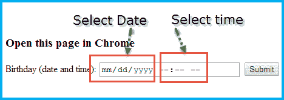
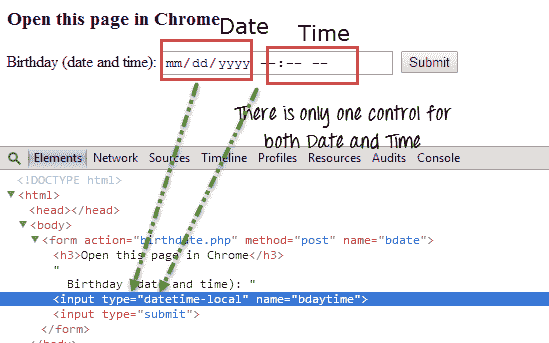
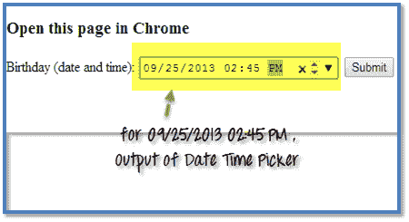
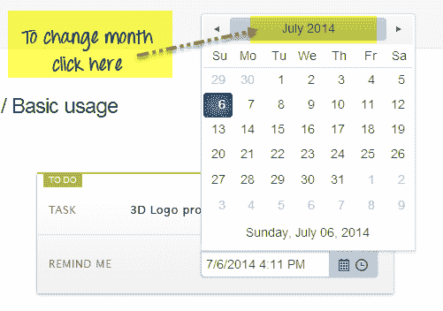
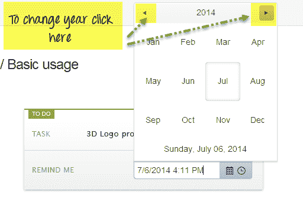
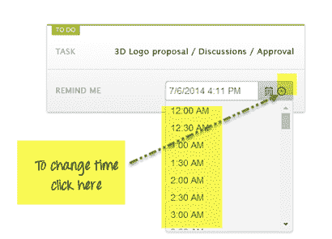
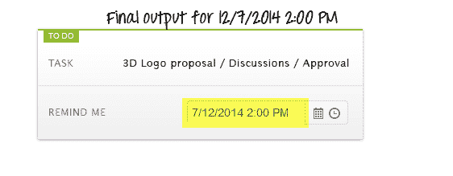

# 如何从 Selenium Webdriver 中的 DatePicker /日历中选择日期

> 原文： [https://www.guru99.com/handling-date-time-picker-using-selenium.html](https://www.guru99.com/handling-date-time-picker-using-selenium.html)

对于 DateTime 选择，HTML5 具有如下所示的新控件。



可以在此处访问上面的页面[](http://demo.guru99.com/test/)

如果看到 DateTime Picker 控件的 DOM，则日期和时间都只有一个输入框。



因此，要首先处理这种类型的控件，我们将填充日期而不用定界符分隔，即如果日期为 2013 年 9 月 25 日，则将 09252013 传递到输入框。 完成后，我们将通过按“制表符” &填充时间将焦点从日期转移到时间。

如果需要填充 02:45 PM，则将其“ 0245PM”传递给同一输入框。

datepicker 的代码如下所示：

```
import java.util.List;

import java.util.concurrent.TimeUnit;

import org.openqa.selenium.By;

import org.openqa.selenium.Keys;

import org.openqa.selenium.WebDriver;

import org.openqa.selenium.WebElement;

import org.openqa.selenium.chrome.ChromeDriver;

import org.testng.annotations.Test;

public class DateTimePicker {

    @Test

    public void dateTimePicker(){

        System.setProperty("webdriver.chrome.driver", "chromedriver.exe");

        WebDriver driver = new ChromeDriver();

        driver.manage().timeouts().implicitlyWait(10, TimeUnit.SECONDS);

        driver.get("http://demo.guru99.com/test/");

        //Find the date time picker control

        WebElement dateBox = driver.findElement(By.xpath("//form//input[@name='bdaytime']"));

        //Fill date as mm/dd/yyyy as 09/25/2013

        dateBox.sendKeys("09252013");

        //Press tab to shift focus to time field

        dateBox.sendKeys(Keys.TAB);

        //Fill time as 02:45 PM

        dateBox.sendKeys("0245PM");

    }

    }
```

输出将像-



让我们看一下另一个 Calendar 示例。 我们将使用 Telerik DateTimePicker 控件。 可以在处访问[](http://demos.telerik.com/kendo-ui/datetimepicker/index)


如果需要更改月份，则必须单击日历标题的中间位置。



同样，如果需要更改年份，则可以通过单击日期选择器上的下一个或上一个链接来完成。



最后，要更改时间，我们可以从下拉菜单中选择正确的时间（注意：此处的时间间隔为 30 分钟，即 12：00、12：30、1：00、1：30 等）。



一个完整的例子看起来像-

```
import java.util.Calendar;

import java.util.List;

import java.util.concurrent.TimeUnit;

import org.openqa.selenium.By;

import org.openqa.selenium.WebDriver;

import org.openqa.selenium.WebElement;

import org.openqa.selenium.firefox.FirefoxDriver;

import org.testng.annotations.Test;

public class DatePicker {

    @Test

    public void testDAtePicker() throws Exception{

        //DAte and Time to be set in textbox

        String dateTime ="12/07/2014 2:00 PM";

        WebDriver driver = new FirefoxDriver();

        driver.manage().window().maximize();

        driver.get("http://demos.telerik.com/kendo-ui/datetimepicker/index");

        driver.manage().timeouts().implicitlyWait(10, TimeUnit.SECONDS);

        //button to open calendar

        WebElement selectDate = driver.findElement(By.xpath("//span[@aria-controls='datetimepicker_dateview']"));

    selectDate.click();

    //button to move next in calendar

    WebElement nextLink = driver.findElement(By.xpath("//div[@id='datetimepicker_dateview']//div[@class='k-header']//a[contains(@class,'k-nav-next')]"));

    //button to click in center of calendar header

    WebElement midLink = driver.findElement(By.xpath("//div[@id='datetimepicker_dateview']//div[@class='k-header']//a[contains(@class,'k-nav-fast')]"));

    //button to move previous month in calendar

    WebElement previousLink = driver.findElement(By.xpath("//div[@id='datetimepicker_dateview']//div[@class='k-header']//a[contains(@class,'k-nav-prev')]")); 

        //Split the date time to get only the date part

        String date_dd_MM_yyyy[] = (dateTime.split(" ")[0]).split("/");

        //get the year difference between current year and year to set in calander

        int yearDiff = Integer.parseInt(date_dd_MM_yyyy[2])- Calendar.getInstance().get(Calendar.YEAR);

        midLink.click();

        if(yearDiff!=0){

            //if you have to move next year

            if(yearDiff>0){

                for(int i=0;i< yearDiff;i++){

                    System.out.println("Year Diff->"+i);

                    nextLink.click();

                }

            }

            //if you have to move previous year

            else if(yearDiff<0){

                for(int i=0;i< (yearDiff*(-1));i++){

                    System.out.println("Year Diff->"+i);

                    previousLink.click();

                }

            }

        }

        Thread.sleep(1000);

        //Get all months from calendar to select correct one

        List<WebElement> list_AllMonthToBook = driver.findElements(By.xpath("//div[@id='datetimepicker_dateview']//table//tbody//td[not(contains(@class,'k-other-month'))]"));

        list_AllMonthToBook.get(Integer.parseInt(date_dd_MM_yyyy[1])-1).click();

        Thread.sleep(1000);

        //get all dates from calendar to select correct one

        List<WebElement> list_AllDateToBook = driver.findElements(By.xpath("//div[@id='datetimepicker_dateview']//table//tbody//td[not(contains(@class,'k-other-month'))]"));

        list_AllDateToBook.get(Integer.parseInt(date_dd_MM_yyyy[0])-1).click();

        ///FOR TIME

        WebElement selectTime = driver.findElement(By.xpath("//span[@aria-controls='datetimepicker_timeview']"));

        //click time picker button

        selectTime.click();

        //get list of times

        List<WebElement> allTime = driver.findElements(By.xpath("//div[@data-role='popup'][contains(@style,'display: block')]//ul//li[@role='option']"));

        dateTime = dateTime.split(" ")[1]+" "+dateTime.split(" ")[2];

     //select correct time

        for (WebElement webElement : allTime) {

            if(webElement.getText().equalsIgnoreCase(dateTime))

            {

                webElement.click();

            }

        }

    }

}
```

输出会像

