# Selenium Grid 教程：集线器&节点（带有示例）

> 原文： [https://www.guru99.com/introduction-to-selenium-grid.html](https://www.guru99.com/introduction-to-selenium-grid.html)

## 什么是硒网格？

Selenium Grid 是 Selenium Suite 的一部分，专门用于跨不同的浏览器，操作系统和计算机并行运行多个测试。

Selenium Grid 有 2 个版本-较旧的 Grid 1 和较新的 Grid2。我们仅关注 Grid 2，因为 Selenium 团队逐渐不赞成 Grid 1。

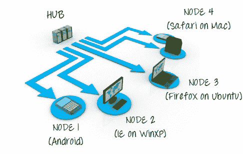

Selenium Grid 使用集线器节点概念，您只能在称为**集线器**的单台机器上运行测试，但是执行将由称为**节点**的不同机器完成。

在本教程中，您将学习-

*   [什么是硒网格？](#1)
*   [何时使用 Selenium Grid？](#2)
*   [网格 1.0 与网格 2.0](#3)
*   [硒网格体系结构](#4)
*   [如何设置硒网格？ 使用命令行](#5)
*   [设计可以在网格上运行的测试脚本](#6)
*   [使用 DesiredCapabilites 对象](#7)
*   [使用 RemoteWebDriver 对象](#8)
*   [在网格上运行示例测试用例](#9)
*   [使用 JSON 文件](#10)的硒网格配置
*   [使用 JSON 配置 NODES](#11)

## 何时使用硒网格？

如果要执行以下一项或两项操作，则应使用 Selenium Grid：

*   **同时针对不同的浏览器，操作系统和计算机运行测试。** 这将确保您正在测试[的应用程序](/software-testing.html)与多种浏览器-操作系统组合完全兼容。
*   **节省执行测试套件**的时间。 如果您将 Selenium Grid 设置为一次运行 4 个测试，那么您将能够以大约 4 倍的速度完成整个套件。

## 网格 1.0 与网格 2.0

以下是 Selenium Grid 1 和 Selenium Grid 2 之间的主要区别。

| 

网格 1

 | 

网格 2

 |
| Selenium Grid 1 有自己的遥控器，与 Selenium RC 服务器不同。 他们是两个不同的程序。 | Selenium Grid 2 现在与 Selenium Server jar 文件捆绑在一起 |
| 您需要首先安装和配置 [Apache](/apache.html) Ant，然后才能使用 Grid 1。 | 您无需在 Grid 2 中安装 Apache Ant。 |
| 仅支持 Selenium RC 命令/脚本。 | 可以同时支持 Selenium RC 和 WebDriver 脚本。 |
| 每个遥控器只能自动化一个浏览器。 | 一个遥控器最多可以自动化 5 个浏览器。 |

## 硒网格体系结构

Selenium Grid 具有集线器和节点体系结构。

#### 集线器

*   集线器是将测试加载到的中心点。
*   网格中应该只有一个集线器。
*   该集线器仅在一台机器上启动，例如，其操作系统为 Windows 7，浏览器为 IE 的计算机。
*   包含集线器的计算机将在其中运行测试，但是您将看到该节点上的浏览器是自动的。

#### 节点

*   节点是 Selenium 实例，将执行您在集线器上加载的测试。
*   网格中可以有一个或多个节点。
*   可以在具有不同平台和浏览器的多台计算机上启动节点。
*   运行节点的机器不必与集线器的平台相同。

硒网格可以通过两种不同的方式设置： 一个通过命令行，另一个通过 JSON 配置文件。

## 如何设置硒网格？ 使用命令行

在本节中，您将使用 2 台计算机。 第一台计算机将是运行集线器的系统，而另一台计算机将运行一个节点。 为简单起见，让我们将集线器运行的机器称为“机器 A”，而将节点运行的机器称为“机器 B”。 记录其 IP 地址也很重要。 假设机器 A 的 IP 地址为 192.168.1.3，而机器 B 的 IP 为 192.168.1.4。

**步骤 1**

从[此处](https://www.selenium.dev/downloads/)下载 Selenium 服务器。

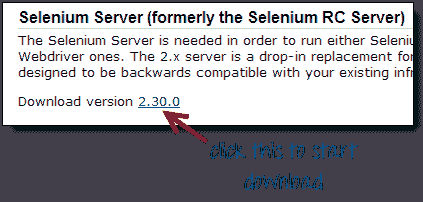

**步骤 2**

您可以将 Selenium Server .jar 文件放置在 HardDrive 中的任何位置。 但是出于本教程的目的，请将其放置在 Machine A 和 Machine B 的 C 驱动器上。完成此操作后，现在您已经完成了 Selenium Grid 的安装。 以下步骤将启动集线器和节点。

**步骤 3**

*   我们现在要启动一个枢纽。 转到计算机 A。在命令提示符下，导航到计算机 A 的-C 驱动器的根目录，因为这是我们放置 Selenium Server 的目录。
*   在命令提示符下，键入 **java -jar selenium-server-standalone-2.30.0.jar -role hub**
*   集线器应成功启动。 您的命令提示符应类似于下图


**步骤 4**

验证集线器是否正在运行的另一种方法是使用浏览器。 Selenium Grid 默认情况下，将 Machine A 的端口 4444 用于其 Web 界面。 只需打开浏览器，然后转到 [http：// localhost：4444 / grid / console](http://localhost:4444/grid/console)


另外，您可以通过以下方式检查计算机 B 是否可以访问集线器的 Web 界面：启动浏览器，然后转到“ iporhostnameofmachineA”应为运行集线器的计算机的 IP 地址或主机名。 由于机器 A 的 IP 地址为 192.168.1.3，因此在机器 B 上的浏览器中，您应该输入 [http://192.168.1.3:4444/grid/console](http://192.168.1.11:4444/grid/console)

**步骤 5**

*   现在已经建立了集线器，我们将启动一个节点。 转到计算机 B 并在那里启动命令提示符。
*   导航到驱动器 C 的根目录，然后输入以下代码。 我们使用 IP 地址 192.168.1.3，因为那是集线器运行的地方。 尽管您可以选择所需的任何免费端口号，但我们也使用了端口 5566。
*   注意：现在，如果使用 Firefox，则必须提供 Gecko 驱动程序的路径。 这是需要使用的更新代码

```
java -Dwebdriver.gecko.driver="C:\geckodriver.exe" -jar selenium-server-standalone-3.4.0.jar -role webdriver -hub http://192.168.1.3:4444/grid/register -port 5566
```

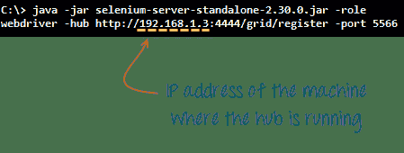

*   当您按 Enter 键时，您的命令提示符应类似于下图。

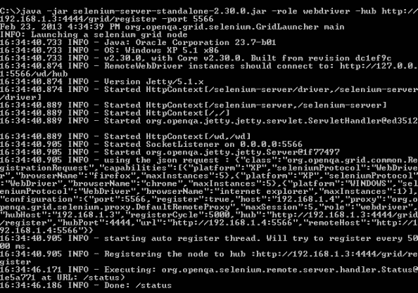

**步骤 6**

转到 Selenium Grid Web 界面并刷新页面。 您应该会看到类似这样的内容。

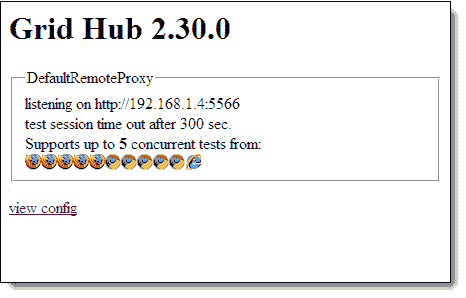

至此，您已经配置了一个简单的网格。 现在，您可以在计算机 B 上远程运行测试了。

## 设计可以在网格上运行的测试脚本

要设计将在网格上运行的测试脚本，我们需要使用 **DesiredCapabilites** 和 **RemoteWebDriver** 对象。

*   **所需的功能**用于设置将要自动化的**浏览器**和 **OS** 的类型
*   **RemoteWebDriver** 用于设置测试将针对的节点（或计算机）。

要使用 **DesiredCapabilites** 对象，您必须首先导入此程序包


要使用 **RemoteWebDriver** 对象，必须导入这些程序包。

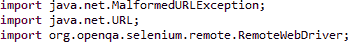

## 使用 DesiredCapabilites 对象

转到 Grid 的 Web 界面，然后将鼠标悬停在要自动化的浏览器图像上。 注意工具提示显示的**平台，**和**浏览器名称**。

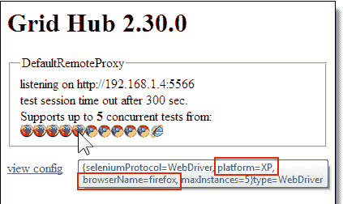.png)

在这种情况下，平台为“ XP”，而 browserName 为“ Firefox”。

我们将在 WebDriver 中使用平台和 browserName，如下所示（当然，您需要首先导入必要的软件包）。

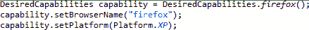

## 使用 RemoteWebDriver 对象

为 RemoteWebDriver 导入必要的程序包，然后将上面创建的 DesiredCapabilities 对象作为 RemoteWebDriver 对象的参数传递。


## 在网格上运行示例测试用例

下面是一个简单的 WebDriver [Testng](/all-about-testng-and-selenium.html) 代码，您可以在 Eclipse 上在机器 A 上创建该代码。一旦运行，它将在机器 B 上执行自动化。

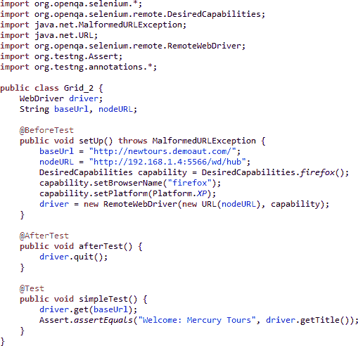

测试应该通过。

| 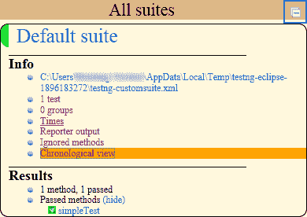 | 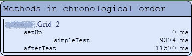 |

## 使用 JSON 文件的硒网格配置：

JSON 代表 Javascript Object Notation。 它是用于在浏览器和 Web 服务器之间交换数据的标准格式。 Selenium 具有一个内置的 JSON 配置文件，可用于设置 Selenium 网格。

以下是使用 JSON 配置文件配置硒网格的步骤。

**步骤 1）**使用以下路径下载 JSON 配置文件的代码 [https://github.com/SeleniumHQ/selenium/blob/selenium-3.141.59/java/server/src/org /openqa/grid/common/defaults/DefaultHub.json](https://github.com/SeleniumHQ/selenium/blob/selenium-3.141.59/java/server/src/org/openqa/grid/common/defaults/DefaultHub.json)

这是代码

```
{
	  "port": 4444,
	  "newSessionWaitTimeout": -1,
	  "servlets" : [],
	  "withoutServlets": [],
	  "custom": {},
	  "capabilityMatcher": "org.openqa.grid.internal.utils.DefaultCapabilityMatcher",
	  "registryClass": "org.openqa.grid.internal.DefaultGridRegistry",
	  "throwOnCapabilityNotPresent": true,
	  "cleanUpCycle": 5000,
	  "role": "hub",
	  "debug": false,
	  "browserTimeout": 0,
	  "timeout": 1800
}

```

**步骤 2）**将代码复制并粘贴到扩展名为'.json'的文本编辑器（如记事本）中

**步骤 3）**在命令提示符下使用以下命令启动集线器

```
java -jar selenium-server-standalone-2.53.1.jar -role hub -hubConfig hubconfig.json
```

**注意：**硒独立的 jar 文件和 json 文件必须存在于同一目录中

**步骤 4）**将出现以下屏幕，表明集线器已成功设置

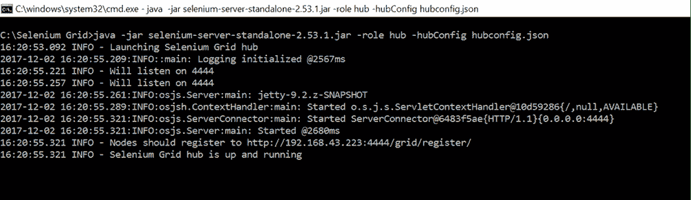

**步骤 5）**打开网络浏览器，然后尝试连接到以下 URL

```
http://192.168.43.223:4444/grid/console
```

**注：** URL 可能因机器而异。 必须使用上述屏幕上的 URL，后跟“节点应注册到”。

**步骤 6）** Grid Console 屏幕将出现，指示集线器已启动并正在运行


## 使用 JSON 配置 NODES：

**步骤 1）**使用以下 URL 下载 Selenium 提供的示例节点配置文件 [https://github.com/SeleniumHQ/selenium/blob/selenium-2.53.0/java/server/src /org/openqa/grid/common/defaults/DefaultNode.json](https://github.com/SeleniumHQ/selenium/blob/selenium-2.53.0/java/server/src/org/openqa/grid/common/defaults/DefaultNode.json)

**注意：**如果使用的是 SELENIUM 3.0 或更高版本，则必须使用以下 JSON 文件

[https://github.com/SeleniumHQ/selenium/blob/selenium-3.141.59/java/server/src/org/openqa/grid/common/defaults/DefaultNodeWebDriver.json](https://github.com/SeleniumHQ/selenium/blob/selenium-3.141.59/java/server/src/org/openqa/grid/common/defaults/DefaultNodeWebDriver.json)

**步骤 2）**复制代码并将其粘贴到文本编辑器（如记事本）中，并保存扩展名为“ .json”的文件

**步骤 3）**

在命令提示符下运行以下命令

```
Java-Dwebdriver.chrome.driver="chromedriver.exe" -Dwebdriver.ie.driver="IEDriverServer.exe" -Dwebdriver.gecko.driver="geckodriver.exe" -jar selenium-server-standalone-2.53.1.jar -role node -nodeConfig node1.json
```

**注意：**运行命令之前，请确保已将每个浏览器的驱动程序下载到本地计算机目录中

**步骤 4）**按下 Enter 键将出现以下屏幕

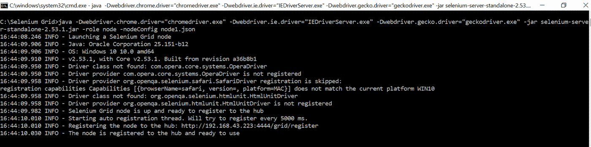

**步骤 5）**导航到网格控制台以验证是否已成功配置节点

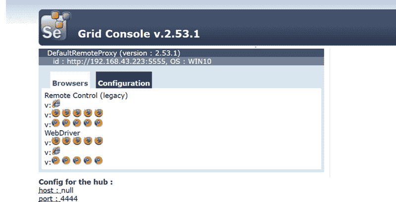

浏览器显示在网格控制台上。 因此，我们可以确保节点配置成功。

**硒网格上的测试案例：**

```
 package com.objectrepository.demo;
 import org.openqa.selenium.*;
 import org.openqa.selenium.remote.DesiredCapabilities;
 import java.net.MalformedURLException;
 import java.net.URL;
 import org.openqa.selenium.remote.RemoteWebDriver;
 import org.testng.Assert;
 import org.testng.annotations.*;

 public class SeleniumGrid {

     WebDriver driver;
     String baseURL, nodeURL;

     @BeforeTest
     public void setUp() throws MalformedURLException {
         baseURL = "http://demo.guru99.com/test/guru99home/";
         nodeURL = "http://192.168.43.223:4444/wd/hub";
         DesiredCapabilities capability = DesiredCapabilities.chrome();
         capability.setBrowserName("chrome");
         capability.setPlatform(Platform.WIN10);
         driver = new RemoteWebDriver(new URL(nodeURL), capability);
     }

     @AfterTest
     public void afterTest() {
         driver.quit();
     }
     @Test
     public void sampleTest() {
         driver.get(baseURL);

         if (driver.getPageSource().contains("MOBILE TESTING")) {
             Assert.assertTrue(true, "Mobile Testing Link Found");
         } else {
             Assert.assertTrue(false, "Failed: Link not found");
         }

     }

 }

```

上面的代码将启动 chrome 浏览器，并导航到“ baseURL”变量中指定的 URL。 确认页面上显示了链接名称“ Mobile Testing”

可以修改“ nodeURL”变量上的 URL 以反映远程计算机的 IP 地址。 可以在生成的默认 TestNG 报告上验证测试结果

## 摘要

*   Selenium Grid 用于在不同的浏览器和平台上同时运行多个测试。
*   网格使用集线器节点概念。
*   集线器是您加载测试的中心点。
*   节点是 Selenium 实例，将执行您在集线器上加载的测试。
*   要安装 Selenium Grid，只需下载 Selenium Server jar 文件-与运行 Selenium RC 测试所用的文件相同。
*   有两种验证集线器是否正在运行的方法：一种是通过命令提示符，另一种是通过浏览器
*   要在 Grid 上运行测试脚本，应使用 DesiredCapabilities 和 RemoteWebDriver 对象。
*   DesiredCapabilites 用于设置我们将自动执行的浏览器和操作系统的类型
*   RemoteWebDriver 用于设置测试将针对其运行的节点（或计算机）。