# Maven & Jenkins 与 Selenium 集成：完整教程

> 原文： [https://www.guru99.com/maven-jenkins-with-selenium-complete-tutorial.html](https://www.guru99.com/maven-jenkins-with-selenium-complete-tutorial.html)

## 詹金斯是什么？

Jenkins 是 Hudson 实验室开发的领先的开源持​​续集成工具。 它是跨平台的，可以在 Windows，Linux，Mac OS 和 Solaris 环境中使用。 Jenkins 用 Java 编写。 Jenkin 的主要用途是监视可以是 SVN 结帐，cron 或任何应用程序状态的任何作业。 当作业中发生特定步骤时，它会触发预配置的操作。

在本教程中，我们将学习

*   [詹金斯](#1)的重要功能
*   [为什么詹金斯和硒？](#2)
*   [什么是 Maven？](#8)
*   [安装 Maven 并将其与 TestNG Selenium](#3) 结合使用的步骤
*   [步骤安装 Jenkins 并将其配置为使用 TestNg Selenium](#4) 运行 Maven
*   [安排詹金斯自动执行。](#5)
*   [詹金斯与 TestNg](#6)
*   [詹金斯](#7)的好处

## Jenkins 的重要功能

*   变更支持：Jenkins 生成在 SVN 等存储库中完成的所有变更的列表。
*   永久链接：Jenkins 提供指向最新版本或失败版本的直接链接，可用于轻松通信
*   安装：Jenkins 易于使用直接安装文件（exe）或 war 文件进行安装，以使用应用程序服务器进行部署。
*   电子邮件集成：可以将 Jenkins 配置为通过电子邮件发送构建状态的内容。
*   易于配置：在 Jenkins 上配置各种任务很容易。
*   TestNG 测试：可以将 Jenkins 配置为在每次生成 SVN 之后在 [Testng](/all-about-testng-and-selenium.html) 上运行自动化测试版本。
*   多个 VM：可以将 Jenkins 配置为在多个计算机上分发构建。
*   项目构建：Jenkins 记录了 jar 的详细信息，jar 的版本以及构建和 jar 号的映射。
*   插件：可以在 Jenkins 中配置 3 个<sup>和</sup>第三方插件，以使用功能和其他功能。

## 为什么詹金斯和硒？

*   在 Jenkins 中运行 Selenium 测试允许您在每次软件更改时运行测试，并在测试通过时将软件部署到新环境中。
*   Jenkins 可以安排您的测试在特定时间运行。
*   您可以保存执行历史记录和测试报告。
*   Jenkins 支持 Maven 以持续集成的方式构建和测试项目。

## 什么是 Maven？

Maven is a powerful project / build management tool, based on the concept of a POM (Project Object Model) that includes project information and configuration information for Maven such as construction directory, source directory, dependency, test source directory, Goals, plugins, etc.

## 为什么选择 Maven & Jenkins

Selenium WebDriver 非常适合浏览器自动化。 但是，在将其用于测试和构建测试框架时，感觉功能不足。 将 Maven 与 Selenium 集成可带来以下好处 Apache Maven 为管理测试项目的整个生命周期提供支持。

*   Maven 用于定义项目结构，依赖关系，构建和测试管理。
*   使用 pom.xml（Maven），您可以配置构建测试和运行代码所需的依赖项。
*   在构建项目时，Maven 会自动从存储库下载必要的文件。

## 安装 Maven 并将其与 TestNG Selenium 结合使用的步骤

在本教程中，我们将使用 [Java](/java-tutorial.html) 开发人员使用 Eclipse（Juno）IDE 来设置 Selenium WebDriver 项目。 另外，我们需要将 m2eclipse 插件添加到 Eclipse，以简化构建过程并创建 pom.xml 文件。
让我们通过以下步骤将 m2eclipse 插件添加到 Eclipse：

**步骤 1）**在 Eclipse IDE 中，选择**帮助** | **从 Eclipse 主菜单安装新软件**。

**步骤 2）**在“安装”对话框中，输入 URL [http://download.eclipse.org/technology/m2e/releases/](http://download.eclipse.org/technology/m2e/releases/) 。 选择**使用**和 m2e 插件，如以下屏幕截图所示：

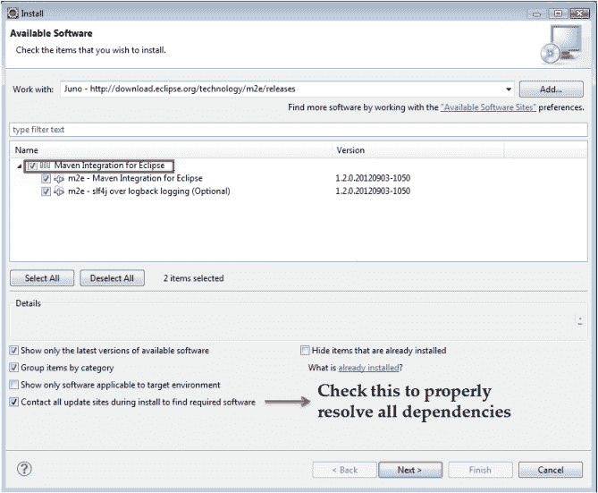

**步骤 3）**单击**下一个**按钮并完成安装。

**使用 Maven 配置 Eclipse**

安装了 m2e 插件后，我们现在需要创建 Maven 项目。

**步骤 1）**在 Eclipse IDE 中，通过选择**文件** | |创建一个新项目。 **新增** | **Eclipse 菜单中的其他**。

**步骤 2）**在**新建**对话框中，选择 **Maven** | **Maven 项目**，然后单击下一步


**步骤 3）**在 **New Maven 项目**对话框中，选择**创建一个简单项目**，然后单击下一步

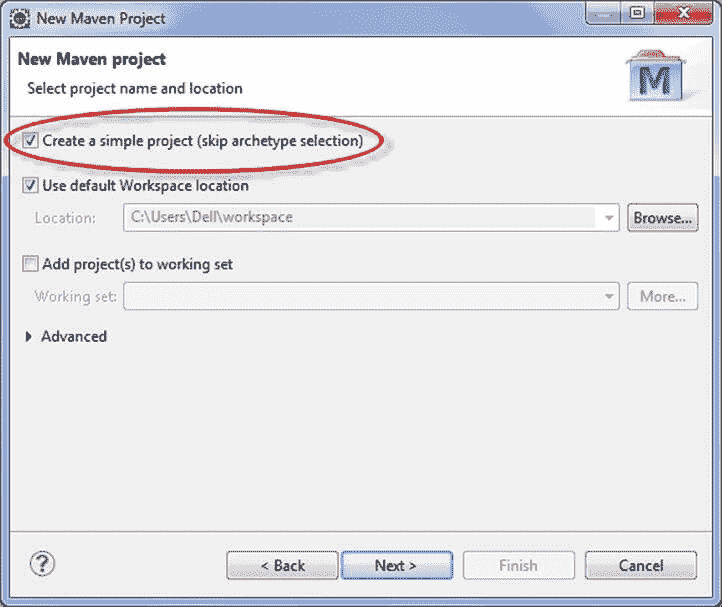

**步骤 4）**在**组 ID** 中输入 WebdriverTest：和**工件 ID** 中输入：，然后单击完成

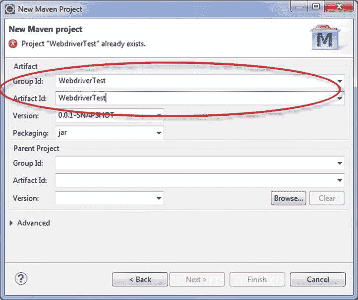

**步骤 5）** Eclipse 将创建具有以下结构的 **WebdriverTest** ：

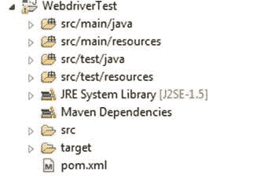

**步骤 6）**右键单击 **JRE 系统库**，然后从菜单中选择**属性**选项。

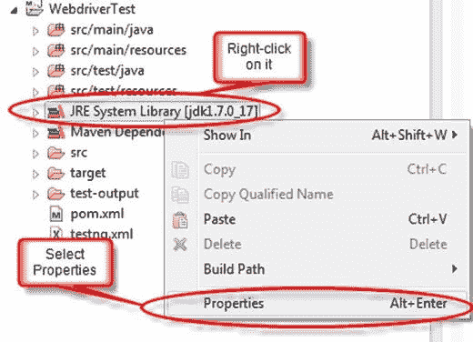

在“ JRE 系统库的**属性”对话框中，确保选择了“ **工作区默认 JRE** ”，然后单击“确定”。**

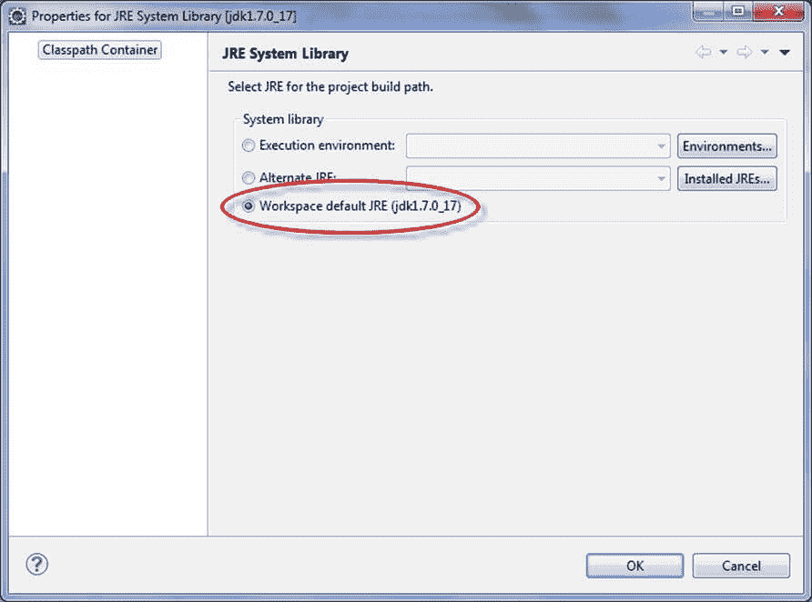

**步骤 7）**。 从 **Project Explorer** 中选择 **pom.xml** 。

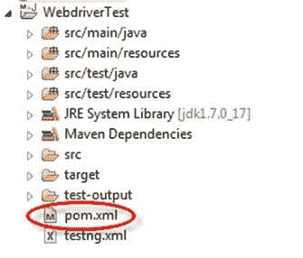

pom.xml 文件将在“编辑器”部分中打开

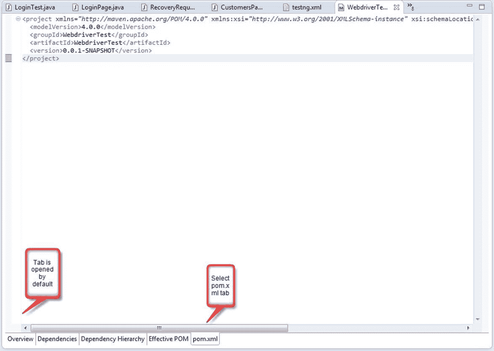

**步骤 8）**将 Selenium，Maven，TestNG， [Junit](/junit-tutorial.html) 依赖项添加到<项目>节点中的 pom.xml 中：

```
	<dependencies>			
        <dependency>				
             <groupId>junit</groupId>								
             <artifactId>junit</artifactId>								
             <version>3.8.1</version>								
             <scope>test</scope>								
        </dependency>				
        <dependency>				
            <groupId>org.seleniumhq.selenium</groupId>								
            <artifactId>selenium-java</artifactId>								
            <version>2.45.0</version>								
		</dependency>				
        <dependency>				
            <groupId>org.testng</groupId>								
            <artifactId>testng</artifactId>								
            <version>6.8.8</version>								
            <scope>test</scope>							  			
       </dependency>				
</dependencies>
```

**步骤 9）**创建一个新的 TestNG 类。 在**名称**：文本框中输入包名称作为“示例”和“ NewTest”，然后单击**完成**按钮，如以下屏幕截图所示：

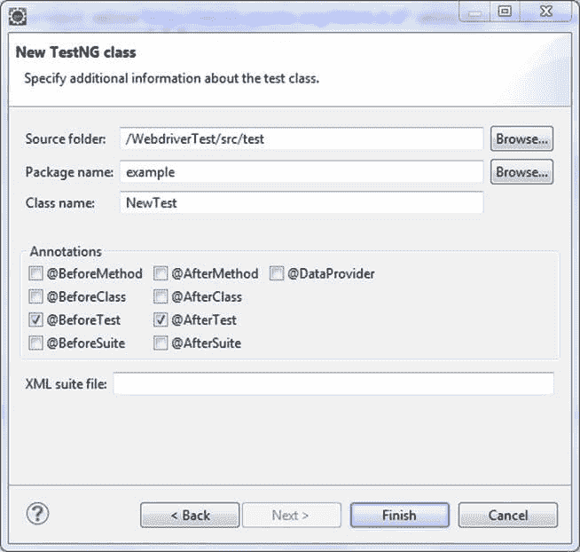

**步骤 10）**。 Eclipse 将创建 NewTest 类，如以下屏幕截图所示：

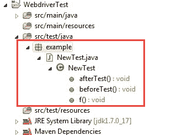

**步骤 11）**将以下代码添加到 **NewTest** 类中：

此代码将验证 Guru99 Selenium Page 的标题

```
package example;		

import org.openqa.selenium.By;		
import org.openqa.selenium.WebDriver;		
import org.openqa.selenium.firefox.FirefoxDriver;		
import org.testng.Assert;		
import org.testng.annotations.Test;	
import org.testng.annotations.BeforeTest;	
import org.testng.annotations.AfterTest;		
public class NewTest {		
	    private WebDriver driver;		
		@Test				
		public void testEasy() {	
			driver.get("http://demo.guru99.com/test/guru99home/");  
			String title = driver.getTitle();				 
			Assert.assertTrue(title.contains("Demo Guru99 Page")); 		
		}	
		@BeforeTest
		public void beforeTest() {	
		    driver = new FirefoxDriver();  
		}		
		@AfterTest
		public void afterTest() {
			driver.quit();			
		}		
}	

```

**步骤 12）**右键单击 WebdriverTest，然后选择 **TestNG** |。 **转换为 TestNG** 。
Eclipse 将创建 testng.xml，它说您只需要运行一个名称为 **NewTest** 的测试，如以下屏幕快照所示：

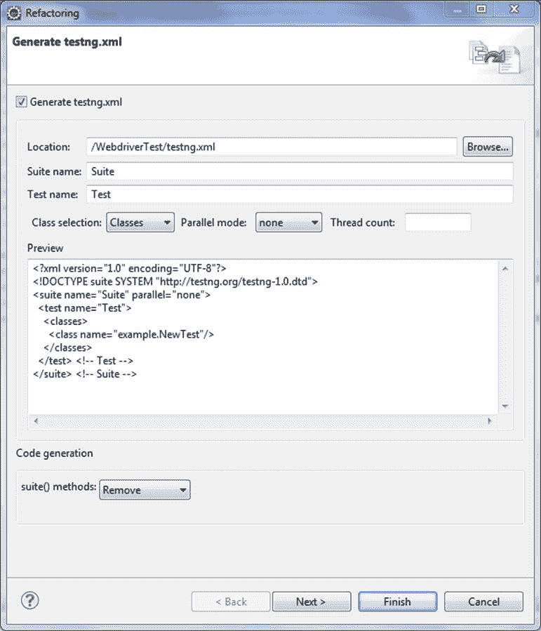

更新项目，并确保该文件出现在树**包资源管理器**中（右键单击项目-刷新）。

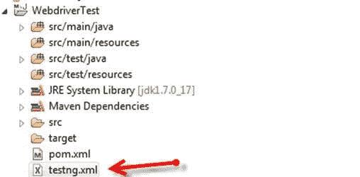

**步骤 13）**现在您需要通过此 **testng.xml 运行测试。**

因此，转到**运行配置**并创建一个新的启动 **TestNG** ，选择项目和字段 **Suite** 作为 **testng.xml** ，然后单击 跑

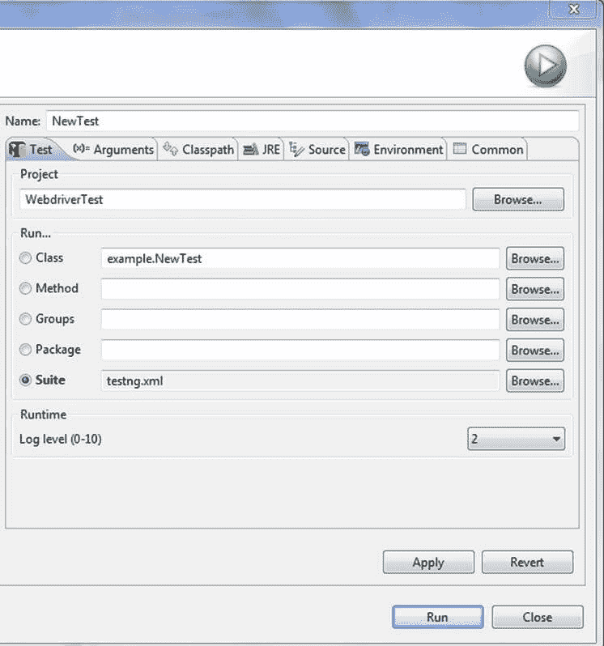

确保构建成功完成。

**步骤 14）**。 另外，我们需要添加

1.  Maven 编译器插件
2.  maven-surefire-插件
3.  testng.xml

到 pom.xml **。**

maven-surefire-plugin 用于配置和执行测试。 这里的插件用于为 TestNG 测试配置 testing.xml 并生成测试报告。

maven-compiler-plugin 用于帮助编译代码以及使用特定的 JDK 版本进行编译。 将以下代码段中的所有依赖项添加到<插件>节点中的 pom.xml 中：

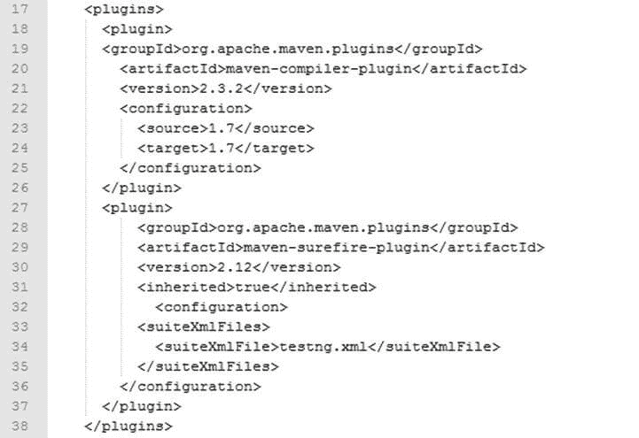

**步骤 15）**要在 Maven 生命周期中运行 **e** 测试，请右键单击 WebdriverTest 并选择 **Run As** | **Maven 测试**。 Maven 将执行该项目的测试。

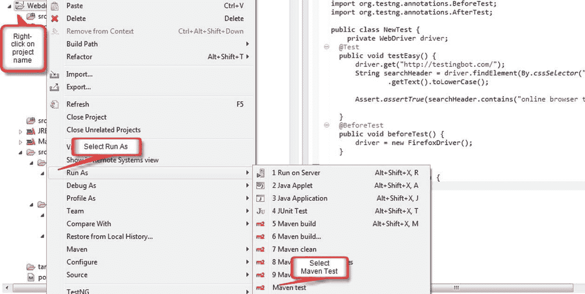

Make sure that build finished successfully.

## 安装 Jenkins 并将其配置为使用 TestNg Selenium 运行 Maven 的步骤

**安装**

**步骤 1）**转到 [http://jenkins-ci.org/](http://jenkins-ci.org/) 并为您的操作系统下载正确的软件包。 安装 Jenkins。

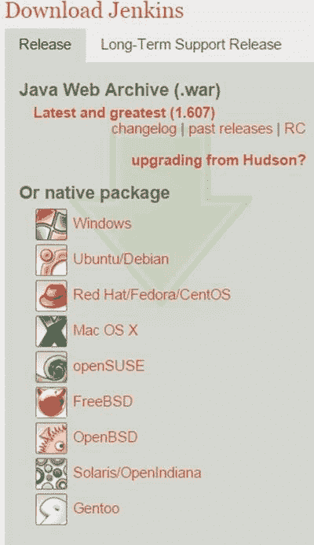

**步骤 2）**将 Jenkins 解压缩到指定的文件夹。 运行 exe 文件，如以下屏幕截图所示：

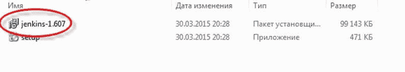

**步骤 3）**在 **Jenkins 1.607 设置**窗口中，单击**下一个**按钮。

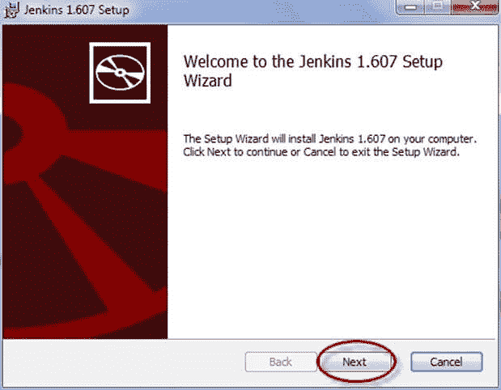

**步骤 4）**单击**最后安装**按钮。

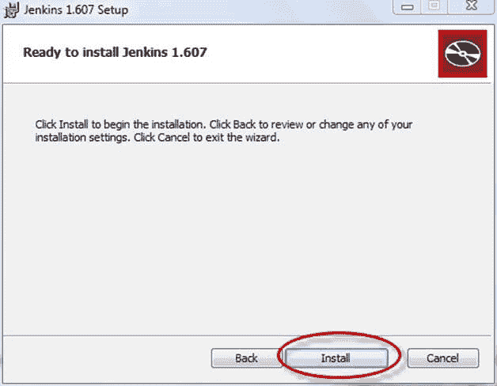

**步骤 5）**安装完成后，在浏览器窗口中导航至 Jenkins 仪表板（默认为 http：// localhost：8080）。

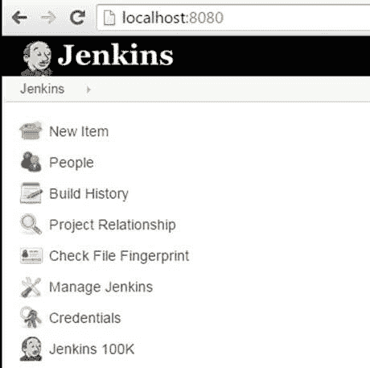

**步骤 6）**单击 **New Item** 链接以创建 CI 作业。

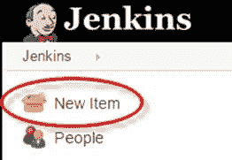

**步骤 7）**选择 Maven 项目单选按钮，如以下屏幕截图所示：


通过使用“构建 **Maven 项目**”选项，Jenkins 支持构建和测试 Maven 项目。

**步骤 6）**单击确定按钮。 在 Jenkins 仪表板中创建了一个名为“ WebdriverTest”的新作业。


**步骤 7）**转到**管理 Jenkins** = > **配置系统**，如以下屏幕快照所示。

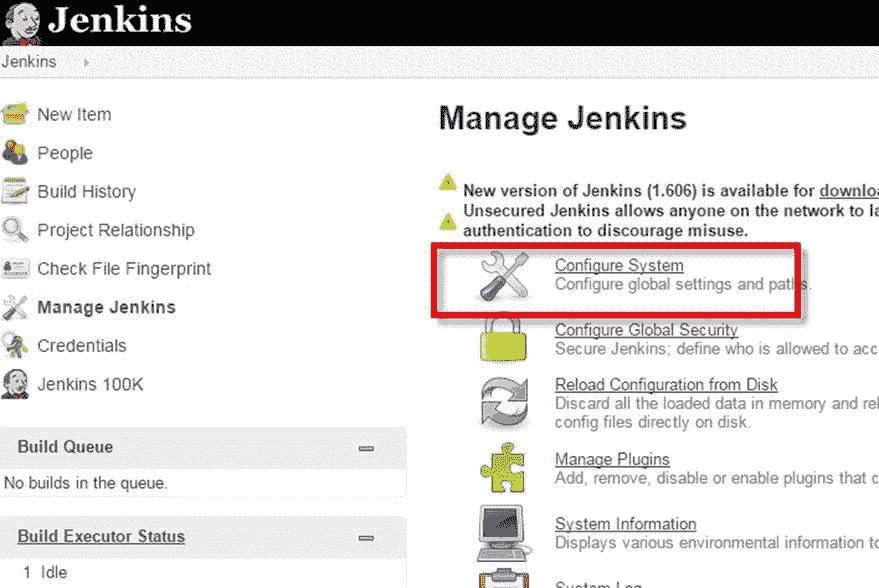

单击 JDK 安装并按照以下屏幕快照中的步骤配置 JDK：

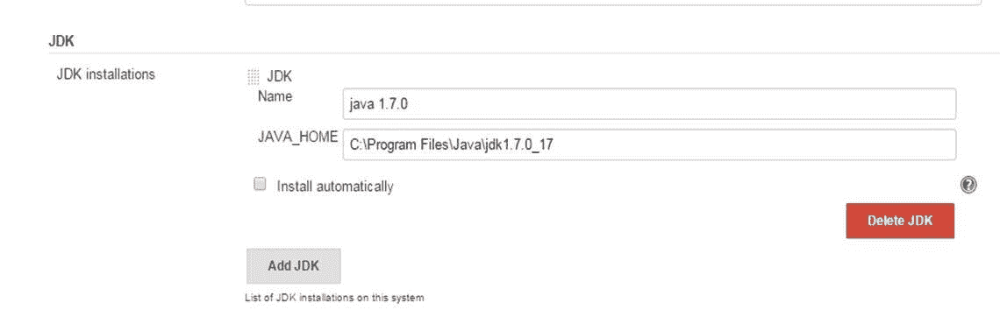

**步骤 8）**转到新作业的**构建**部分。

*   在**根 POM** 文本框中，输入 pom.xml 的完整路径。
*   In Goals and options section, enter "clean test"

    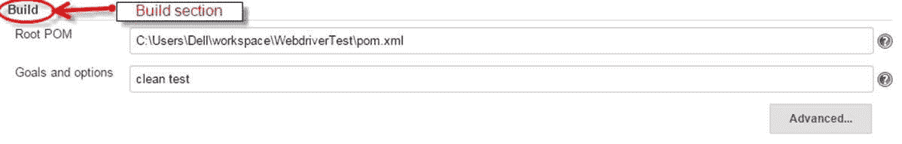

**步骤 9）**单击**应用**按钮。

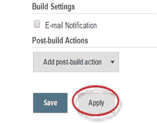

**步骤 10）**在 WebdriverTest 项目页面上，单击**立即构建**链接。

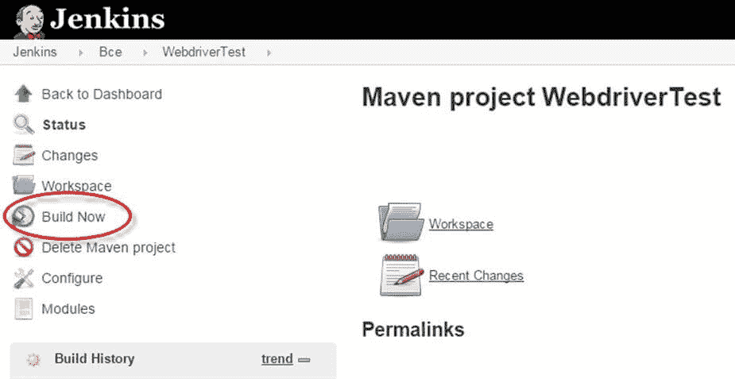

Maven 将构建该项目。 然后，它将使 TestNG 执行测试用例。

**步骤 11）**构建过程完成后，在 Jenkins Dashboard 中，单击 **WebdriverTest** 项目

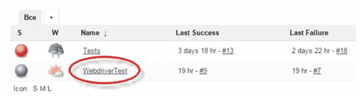

**步骤 12）** WebdriverTest 项目页面显示生成历史记录并链接到结果，如以下屏幕快照所示：

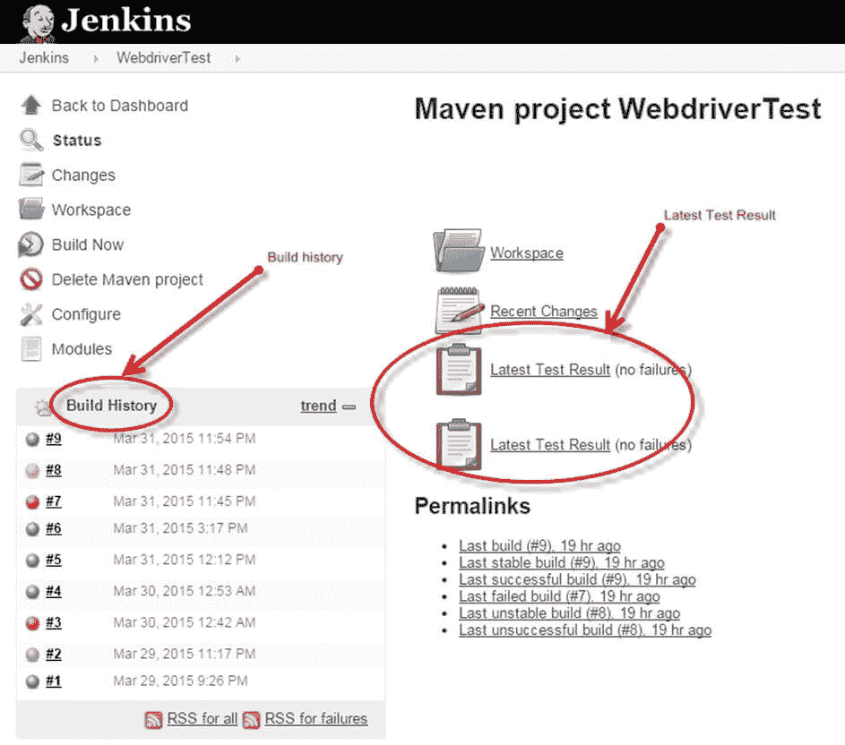

**步骤 13）**单击“最新测试结果”链接以查看测试结果，如以下屏幕快照所示：

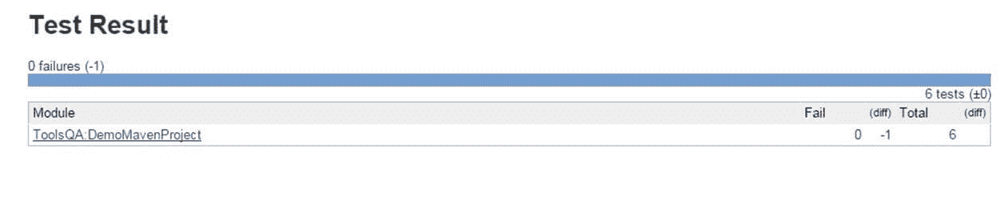

**步骤 14）**。 选择特定的版本，然后单击“ **console output** ”，您将看到当前状态。

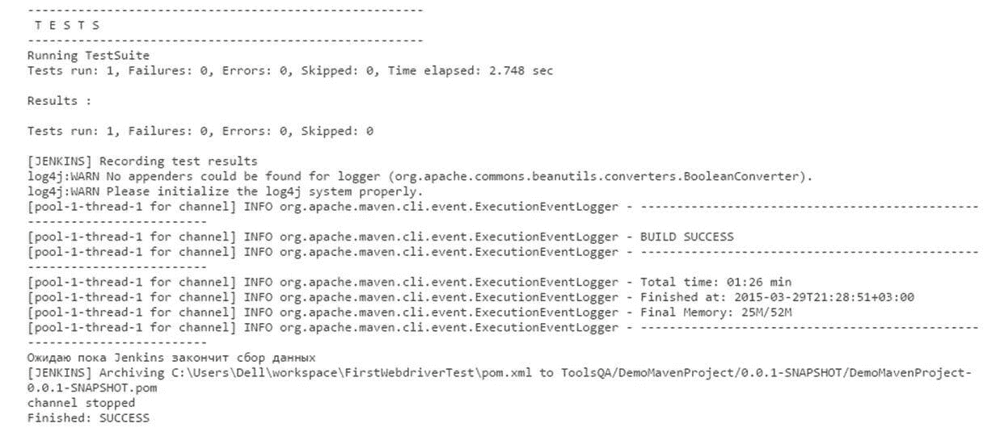

## 安排詹金斯自动执行。

计划构建（Selenium Tests）是 Jenkins 的重要功能之一，它可以根据定义的标准自动触发构建。 Jenkins 提供了多种在 Build Trigger 配置下触发构建过程的方式。

例如：
在“计划”文本框中输入 0 23 * * *，如以下屏幕截图所示。 这将每天晚上 11 点触发构建过程。

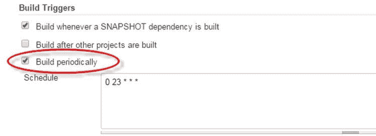

## 在没有 Maven 的情况下使用 Jenkings

要在 Jenkins 中运行纯 TestNg 脚本，请在构建中输入以下内容

**D：> java -cp“ Pathtolibfolder \ lib \ *; Pathtobinfolder \ bin” org.testng.TestNG testng.xml**

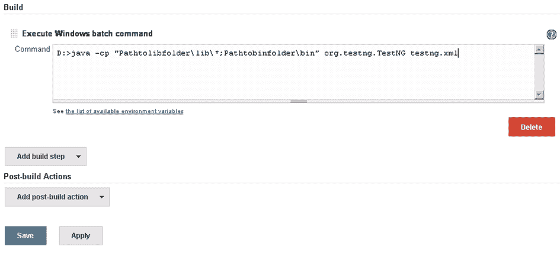

*   点击保存按钮。
*   注意：lib 和 bin 文件夹的实际路径需要在上述命令中添加。
*   保存命令后，Jenkins 将在预定义的时间内构建项目，并且此命令将使用 TestNG 运行。
*   结果将存储在自定义报告 HTML 文件中，该文件可通过具有 Jenkin 配置的电子邮件发送
*   代码的输出将是

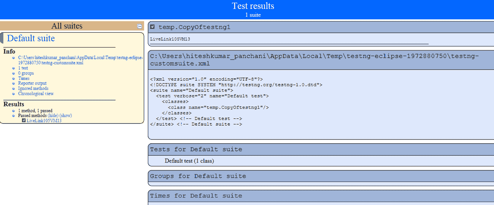

## 使用 Jenkins 的好处

1.  尽早发现问题-可以在软件开发的早期阶段检测到错误
2.  自动集成–无需单独工作即可集成所有更改
3.  安装程序–可在任何开发点使用的可部署系统
4.  记录–维护零件构建记录
5.  支持和插件：Jenkin 受欢迎的原因之一是大型社区支持的可用性。 此外，还有许多现成的插件可用来帮助您扩展其功能。