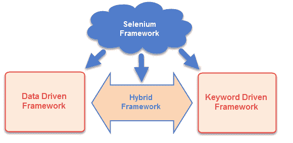
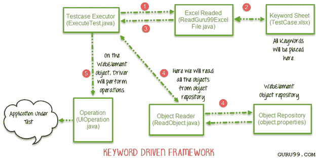
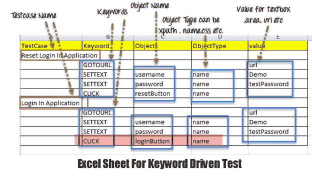
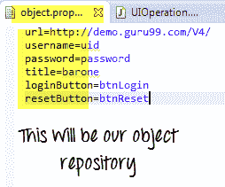
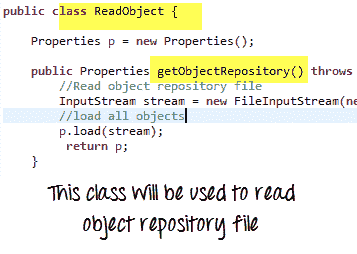
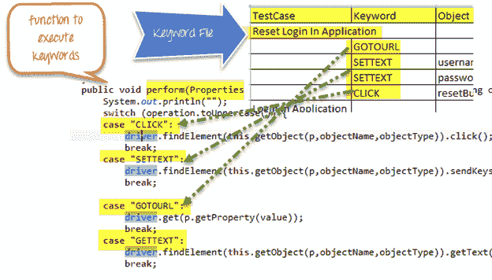
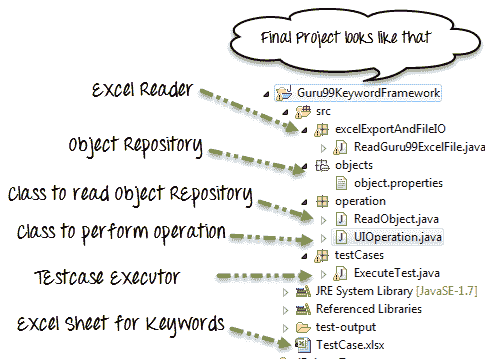
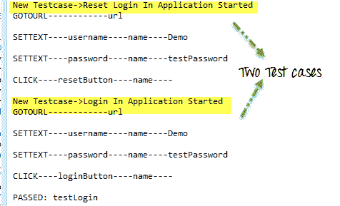
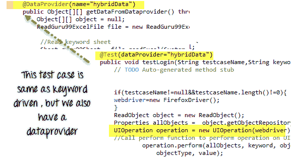
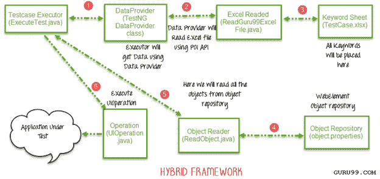

# Selenium 自动化框架：数据驱动，关键字驱动&混合

> 原文： [https://www.guru99.com/creating-keyword-hybrid-frameworks-with-selenium.html](https://www.guru99.com/creating-keyword-hybrid-frameworks-with-selenium.html)

## 什么是硒框架？

Selenium Framework 是一种代码结构，有助于简化代码维护。 如果没有框架，我们会将“代码”和“数据”放置在相同的位置，该位置既不可重用也不可读。 使用 Framework，可以产生有益的结果，例如增加代码重用，更高的可移植性，减少的脚本维护成本，更高的代码可读性等。

Selenium WebDriver 创建了三种类型的框架来自动执行手动测试用例

*   数据驱动测试框架
*   关键字驱动的测试框架
*   混合测试框架



## **数据驱动测试框架**

**在**数据驱动的框架中，我们所有的测试数据都是从某些外部文件生成的，例如 [Excel](/excel-tutorials.html) ，CSV，XML 或某些数据库表。


为了读取或编写 Excel，Apache 提供了一个非常著名的库 POI。 该库足以读取和写入 Excel 的 **XLS** 和 **XLSX** 文件格式。

要读取 **XLS** 文件，POI 库提供了 **HSSF** 实现。

要读取 **XLSX，将选择 **POI** **库**的** **XSSF** 实现。 让我们详细研究这些实现。

我们已经在[先前的教程](/all-about-excel-in-selenium-poi-jxl.html)中了解了数据驱动测试

## **关键字驱动的测试框架：**

在关键字驱动的测试框架中，所有操作和说明都写在某些外部文件（如 Excel 工作表）中。 这是完整框架的外观



如您所见，这是一个 5 步框架。 让我们逐步研究它

**步骤 1）**

*   驱动程序脚本 Execute.java 将调用 ReadGuru99ExcelFile.java
*   ReadGuru99ExcelFile.java 具有 POI 脚本以从 Excel 读取数据

**步骤 2）**

*   ReadGuru99ExcelFile.java 将从 TestCase.xlsx 读取数据
*   这是工作表的样子-



*   根据 Excel 文件中写入的关键字，框架将在 UI 上执行操作。
*   例如，我们需要单击“登录”按钮。 相应地，我们的 Excel 将具有关键字“点击”。 现在，AUT 可以在页面上具有数百个按钮，以标识“登录”按钮，在 Excel 中，我们将输入对象名称作为 loginButton &对象类型作为名称（请参见上图中突出显示的行）。 对象类型可以是 Xpath，名称 CSS 或任何其他值

**步骤 3）** ReadGuru99ExcelFile.java 会将这些数据传递给驱动程序脚本 Execute.java

**步骤 4）**

*   对于我们所有的 UI Web 元素，我们需要创建一个对象存储库，在其中放置它们的元素定位符（例如 Xpath，名称，CSS 路径，类名等）。



*   Execute.java（我们的驱动程序脚本）将读取整个对象存储库并将其存储在变量中
*   To read this object repository, we need a ReadObject class which has a getObjectRepository method to read it.

    

**注意：**您可能会想为什么我们需要创建一个对象存储库。 答案有助于代码维护。 例如，我们在 10 个不同的测试案例中使用名称为 btnlogin 的按钮。 将来，开发人员决定将名称从 btnlogin 更改为 Submit。 您将必须在所有 10 个测试用例中进行更改。 对于对象存储库，您只需在存储库中进行一次更改。

**步骤 5）**

*   驱动程序会将数据从 Excel &对象存储库传递到 UIOperation 类
*   UIOperation 类具有执行与 Excel 中提到的诸如 CLICK，SETTEXT 等…之类的关键字相对应的动作的功能。
*   UIOperation 类是 [Java](/java-tutorial.html) 类，它具有对 Web 元素执行操作的代码的实际实现



整个项目看起来像-



让我们看一个例子：

测试场景

*   我们正在执行 2 个测试用例
*   测试案例 1：
*   转到 [http://demo.guru99.com/V4/](http://demo.guru99.com/V4/)
*   输入用户名
*   输入密码
*   单击重置
*   测试案例 2：
*   转到 [http://demo.guru99.com/V4/](http://demo.guru99.com/V4/)
*   输入用户名
*   输入密码
*   单击登录

## object.properties

url = [http://demo.guru99.com/V4/](http://demo.guru99.com/V4/)

用户名= uid

密码=密码

标题=男爵

loginButton = btn 登录

重置按钮= btnReset

### ReadGuru99ExcelFile.java

```
package excelExportAndFileIO;
import java.io.File;
import java.io.FileInputStream;
import java.io.IOException;
import org.apache.poi.hssf.usermodel.HSSFWorkbook;
import org.apache.poi.ss.usermodel.Sheet;
import org.apache.poi.ss.usermodel.Workbook;
import org.apache.poi.xssf.usermodel.XSSFWorkbook;
public class ReadGuru99ExcelFile {

    public Sheet readExcel(String filePath,String fileName,String sheetName) throws IOException{
    //Create a object of File class to open xlsx file
    File file =    new File(filePath+"\\"+fileName);
    //Create an object of FileInputStream class to read excel file
    FileInputStream inputStream = new FileInputStream(file);
    Workbook guru99Workbook = null;
    //Find the file extension by spliting file name in substing and getting only extension name
    String fileExtensionName = fileName.substring(fileName.indexOf("."));
    //Check condition if the file is xlsx file
    if(fileExtensionName.equals(".xlsx")){
    //If it is xlsx file then create object of XSSFWorkbook class
    guru99Workbook = new XSSFWorkbook(inputStream);
    }
    //Check condition if the file is xls file
    else if(fileExtensionName.equals(".xls")){
        //If it is xls file then create object of XSSFWorkbook class
        guru99Workbook = new HSSFWorkbook(inputStream);
    }
    //Read sheet inside the workbook by its name
    Sheet guru99Sheet = guru99Workbook.getSheet(sheetName);
     return guru99Sheet;    
    }
}
```

### ReadObject.java

```
package operation;
import java.io.File;
import java.io.FileInputStream;
import java.io.IOException;
import java.io.InputStream;
import java.util.Properties;
public class ReadObject {
    Properties p = new Properties();
    public Properties getObjectRepository() throws IOException{
        //Read object repository file
        InputStream stream = new FileInputStream(new File(System.getProperty("user.dir")+"\\src\\objects\\object.properties"));
        //load all objects
        p.load(stream);
         return p;
    }

}
```

### UIOperation.java

```
package operation;
import java.util.Properties;
import org.openqa.selenium.By;
import org.openqa.selenium.WebDriver;
public class UIOperation {
    WebDriver driver;
    public UIOperation(WebDriver driver){
        this.driver = driver;
    }
    public void perform(Properties p,String operation,String objectName,String objectType,String value) throws Exception{
        System.out.println("");
        switch (operation.toUpperCase()) {
        case "CLICK":
            //Perform click
            driver.findElement(this.getObject(p,objectName,objectType)).click();
            break;
        case "SETTEXT":
            //Set text on control
            driver.findElement(this.getObject(p,objectName,objectType)).sendKeys(value);
            break;

        case "GOTOURL":
            //Get url of application
            driver.get(p.getProperty(value));
            break;
        case "GETTEXT":
            //Get text of an element
            driver.findElement(this.getObject(p,objectName,objectType)).getText();
            break;
        default:
            break;
        }
    }

    /**
     * Find element BY using object type and value
     * @param p
     * @param objectName
     * @param objectType
     * @return
     * @throws Exception
     */
    private By getObject(Properties p,String objectName,String objectType) throws Exception{
        //Find by xpath
        if(objectType.equalsIgnoreCase("XPATH")){

            return By.xpath(p.getProperty(objectName));
        }
        //find by class
        else if(objectType.equalsIgnoreCase("CLASSNAME")){

            return By.className(p.getProperty(objectName));

        }
        //find by name
        else if(objectType.equalsIgnoreCase("NAME")){

            return By.name(p.getProperty(objectName));

        }
        //Find by css
        else if(objectType.equalsIgnoreCase("CSS")){

            return By.cssSelector(p.getProperty(objectName));

        }
        //find by link
        else if(objectType.equalsIgnoreCase("LINK")){

            return By.linkText(p.getProperty(objectName));

        }
        //find by partial link
        else if(objectType.equalsIgnoreCase("PARTIALLINK")){

            return By.partialLinkText(p.getProperty(objectName));

        }else
        {
            throw new Exception("Wrong object type");
        }
    }
}
```

### ExecuteTest.java

```
package testCases;
import java.util.Properties;
import operation.ReadObject;
import operation.UIOperation;
import org.apache.poi.ss.usermodel.Row;
import org.apache.poi.ss.usermodel.Sheet;
import org.openqa.selenium.WebDriver;
import org.openqa.selenium.firefox.FirefoxDriver;
import org.testng.annotations.Test;
import excelExportAndFileIO.ReadGuru99ExcelFile;
public class ExecuteTest {
@Test
    public void testLogin() throws Exception {
        // TODO Auto-generated method stub
WebDriver webdriver = new FirefoxDriver();
ReadGuru99ExcelFile file = new ReadGuru99ExcelFile();
ReadObject object = new ReadObject();
Properties allObjects = object.getObjectRepository();
UIOperation operation = new UIOperation(webdriver);
//Read keyword sheet
Sheet guru99Sheet = file.readExcel(System.getProperty("user.dir")+"\\","TestCase.xlsx" , "KeywordFramework");
//Find number of rows in excel file
    int rowCount = guru99Sheet.getLastRowNum()-guru99Sheet.getFirstRowNum();
    //Create a loop over all the rows of excel file to read it
    for (int i = 1; i < rowCount+1; i++) {
        //Loop over all the rows
        Row row = guru99Sheet.getRow(i);
        //Check if the first cell contain a value, if yes, That means it is the new testcase name
        if(row.getCell(0).toString().length()==0){
        //Print testcase detail on console
            System.out.println(row.getCell(1).toString()+"----"+ row.getCell(2).toString()+"----"+
            row.getCell(3).toString()+"----"+ row.getCell(4).toString());
        //Call perform function to perform operation on UI
            operation.perform(allObjects, row.getCell(1).toString(), row.getCell(2).toString(),
                row.getCell(3).toString(), row.getCell(4).toString());
     }
        else{
            //Print the new testcase name when it started
                System.out.println("New Testcase->"+row.getCell(0).toString() +" Started");
            }
        }
    }
}
```

执行后，输出将类似于-



[在本教程中下载用于演示的 Selenium 项目文件](https://drive.google.com/uc?export=download&id=0B_vqvT0ovzHcZkxzUmpPcHhnOUU)

## 混合测试框架

混合测试框架是一个我们同时利用关键字和数据驱动框架的优势的概念。

在这里，对于关键字，我们将使用 Excel 文件来维护测试用例，对于测试数据，我们将使用 [Testng](/all-about-testng-and-selenium.html) 框架的提供者数据。



在我们的混合框架中，我们不需要在关键字驱动的框架中进行任何更改，这里我们只需要用 HybridExecuteTest.java 文件替换 ExecuteTest.java 文件。


该 HybridExecuteTest 文件包含由数据提供者概念驱动的关键字的所有代码。

混合框架的完整图示将如下所示



### HybridExecuteTest.java

```
package testCases;
import java.io.IOException;
import java.util.Properties;
import operation.ReadObject;
import operation.UIOperation;
import org.apache.poi.ss.usermodel.Row;
import org.apache.poi.ss.usermodel.Sheet;
import org.openqa.selenium.WebDriver;
import org.openqa.selenium.firefox.FirefoxDriver;
import org.testng.annotations.DataProvider;
import org.testng.annotations.Test;
import excelExportAndFileIO.ReadGuru99ExcelFile;
public class HybridExecuteTest {
    WebDriver webdriver = null;
@Test(dataProvider="hybridData")
    public void testLogin(String testcaseName,String keyword,String objectName,String objectType,String value) throws Exception {
        // TODO Auto-generated method stub

    if(testcaseName!=null&&testcaseName.length()!=0){
    webdriver=new FirefoxDriver();
    }
ReadObject object = new ReadObject();
Properties allObjects = object.getObjectRepository();
UIOperation operation = new UIOperation(webdriver);
    //Call perform function to perform operation on UI
            operation.perform(allObjects, keyword, objectName,
                objectType, value);

    }
@DataProvider(name="hybridData")
    public Object[][] getDataFromDataprovider() throws IOException{
    Object[][] object = null;
    ReadGuru99ExcelFile file = new ReadGuru99ExcelFile();
//Read keyword sheet
Sheet guru99Sheet = file.readExcel(System.getProperty("user.dir")+"\\","TestCase.xlsx" , "KeywordFramework");
//Find number of rows in excel file
    int rowCount = guru99Sheet.getLastRowNum()-guru99Sheet.getFirstRowNum();
    object = new Object[rowCount][5];
    for (int i = 0; i < rowCount; i++) {
        //Loop over all the rows
        Row row = guru99Sheet.getRow(i+1);
        //Create a loop to print cell values in a row
        for (int j = 0; j < row.getLastCellNum(); j++) {
            //Print excel data in console
            object[i][j] = row.getCell(j).toString();
        }
    }
    System.out.println("");
     return object;    
    }
}
```

摘要：

*   我们可以使用 Selenium WebDriver 创建三种类型的测试框架。
*   这些是数据驱动，关键字驱动和混合测试框架。
*   我们可以使用 TestNG 的数据提供程序来实现数据驱动的框架。
*   在关键字驱动的框架中，关键字被写入一些外部文件中，例如 excel 文件，而 Java 代码将调用此文件并执行测试用例。
*   混合框架是关键字驱动和数据驱动框架的混合体。

[在本教程中下载用于演示的 Selenium 项目文件](https://drive.google.com/uc?export=download&id=0B_vqvT0ovzHcOGZOUXBTc1M0X2s)