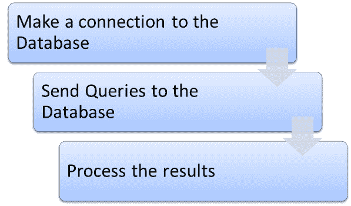
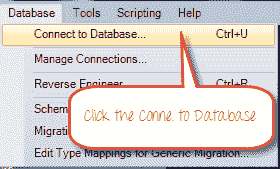
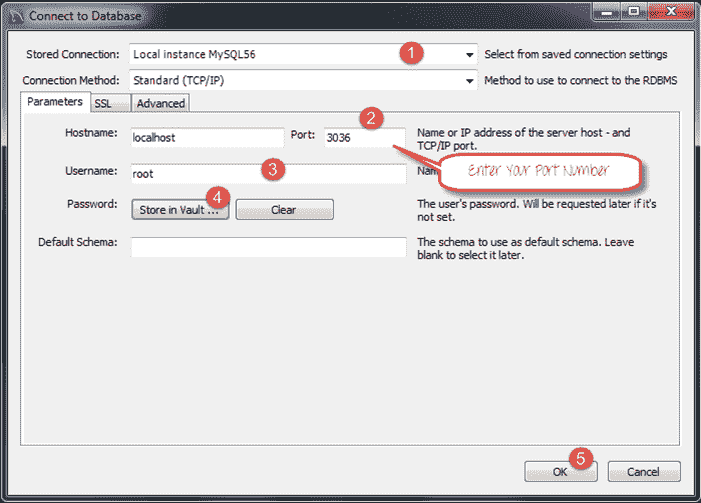
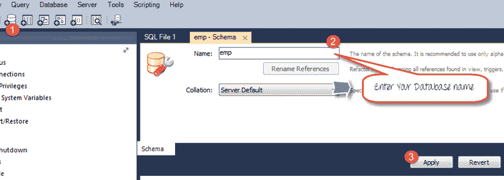
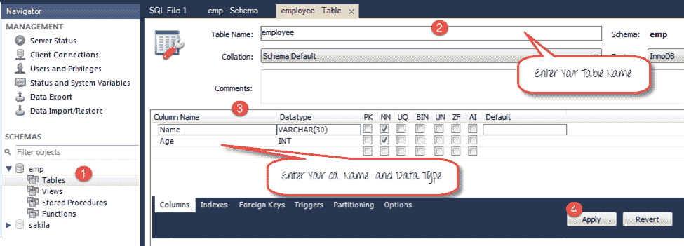
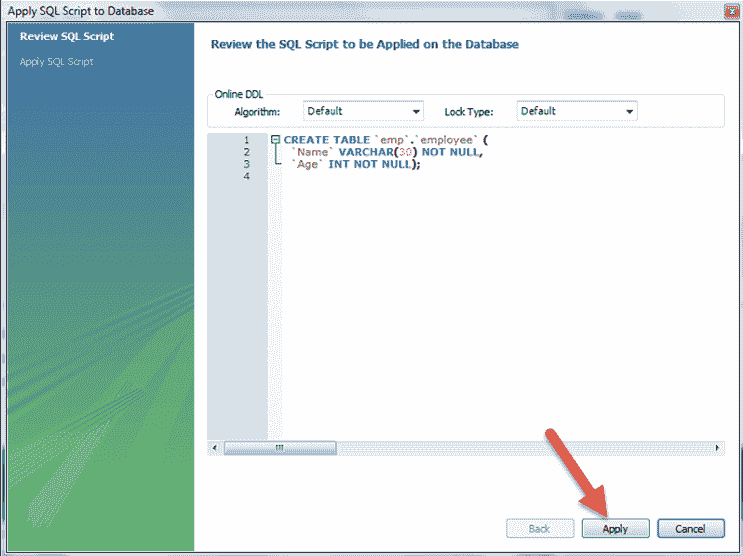
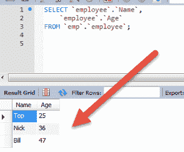
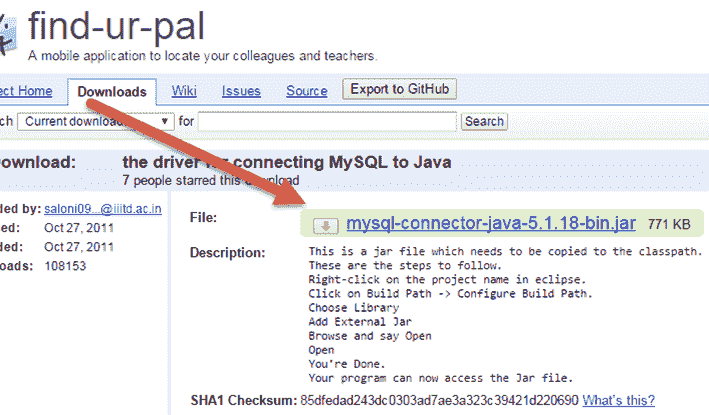
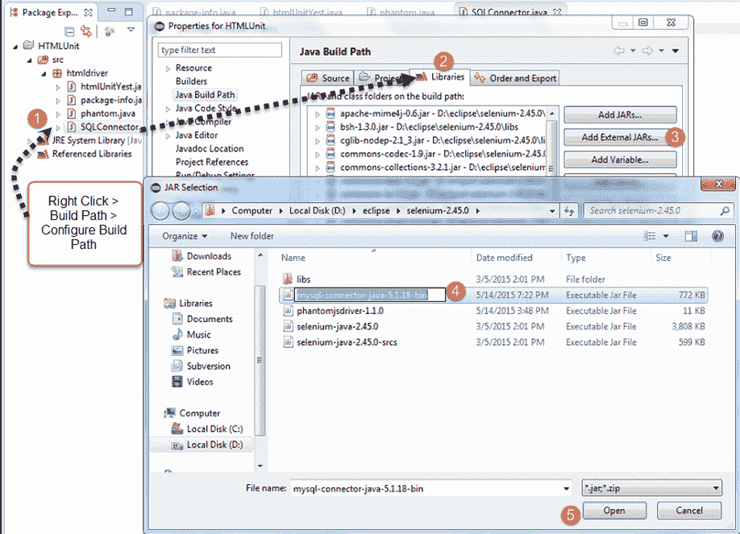
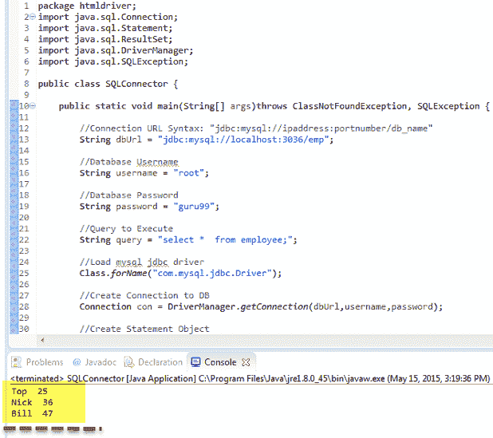

# 使用 Selenium 进行数据库测试：分步指南

> 原文： [https://www.guru99.com/database-testing-using-selenium-step-by-step-guide.html](https://www.guru99.com/database-testing-using-selenium-step-by-step-guide.html)

Selenium Webdriver 仅限于[使用浏览器测试您的应用程序](/software-testing.html)。 要使用 Selenium Webdriver 进行数据库验证，您需要使用 JDBC（“ Java 数据库连接”）。

JDBC（Java 数据库连接）是 [SQL](/sql.html) 级别的 API，允许您执行 SQL 语句。 它负责 [Java](/java-tutorial.html) 编程语言与各种数据库之间的连接。 JDBC API 提供以下类和接口

*   司机经理
*   司机
*   连接
*   声明
*   结果集
*   SQLException

在本教程中，您将学习

*   [建立与数据库](#1)的连接
*   [将查询发送到数据库](#2)
*   [处理结果](#3)
*   [使用硒](#4)进行数据库测试的示例

为了使用 Selenium 测试您的数据库，您需要遵循以下 3 个步骤



## 1）建立与数据库的连接

为了建立与数据库的连接，语法为

DriverManager.getConnection（URL，“ userid”，“ password”）

这里，

*   Userid 是在数据库中配置的用户名
*   配置用户的密码
*   URL 的格式为 jdbc：< dbtype >：// ipaddress：portnumber / db_name“
*   < dbtype >-您尝试连接的数据库的驱动程序。 要连接到 oracle 数据库，此值为“ oracle”

    要在 MYSQL URL 中连接名称为“ emp”的数据库，将为 jdbc：mysql：// localhost：3036 / emp

和创建连接的代码如下所示

```
Connection con = DriverManager.getConnection(dbUrl,username,password);
```

You also need to load the JDBC Driver using the code

```

Class.forName（“ com.mysql.jdbc.Driver”）;
```

## 2）将查询发送到数据库

建立连接后，您需要执行查询。

您可以使用 Statement 对象发送查询。

```
Statement stmt = con.createStatement();			
```

创建语句对象后，请使用 executeQuery 方法执行 SQL 查询。

```
stmt.executeQuery(select *  from employee;);
```

## 3）处理结果

来自已执行查询的结果存储在 ResultSet 对象中。

Java 提供了许多高级方法来处理结果。 下面列出了几种方法


## 使用硒进行数据库测试的示例

**步骤 1）**安装 [MySQL 服务器](https://dev.mysql.com/downloads/mysql/)和 [MySQL Workbench](https://dev.mysql.com/downloads/workbench/)

在此处查阅 Mysql & Mysql Workbench [的完整指南。](/sql.html)

在安装 MySQL Server 时，请注意数据库

*   用户名
*   密码
*   端口号

在进一步的步骤中将需要它。

MySQL Workbench 使得无需编码 SQL 即可轻松管理数据库。 但是，您也可以使用 MySQL Terminal 与数据库进行交互。

**步骤 2）**在 MySQL WorkBench 中，连接到 MySQL 服务器



在下一个屏幕中，

1.  选择 MySQL 的本地实例
2.  输入端口号
3.  输入用户名
4.  输入密码
5.  点击确定



**步骤 3）**要创建数据库，

1.  单击创建模式按钮
2.  输入模式/数据库名称
3.  点击应用



**步骤 4）**在导航器菜单中，

1.  单击 emp 数据库下方的 Tables
2.  输入表名作为员工
3.  输入字段作为名称和年龄
4.  点击应用



您将看到以下弹出窗口。 点击应用



**步骤 5）**我们将创建以下数据

| **名称** | **年龄** |
| 最佳 | 25 |
| 缺口 | 36 |
| 法案 | 47 |

在表中创建数据

1.  在导航器中，选择员工表
2.  在右窗格中，单击“表单编辑器”
3.  输入姓名和年龄
4.  点击应用


重复该过程，直到创建了所有数据



**步骤 6）**在此处下载 MySQL JDBC 连接器[](https://code.google.com/p/find-ur-pal/downloads/detail?name=mysql-connector-java-5.1.18-bin.jar&)



**步骤 7）**将下载的 Jar 添加到您的项目中

1.  右键单击您的 Java 文件。 然后单击构建路径à配置构建路径
2.  选择库
3.  点击添加外部 JAR
4.  您可以在库中看到 MySQL 连接器 Java
5.  单击打开以将其添加到项目中



**步骤 8）**将以下代码复制到编辑器中

```
Package  htmldriver;		
import  java.sql.Connection;		
import  java.sql.Statement;		
import  java.sql.ResultSet;		
import  java.sql.DriverManager;		
import  java.sql.SQLException;		
public class  SQLConnector {				
    	public static void  main(String[] args) throws  ClassNotFoundException, SQLException {													
				//Connection URL Syntax: "jdbc:mysql://ipaddress:portnumber/db_name"		
                String dbUrl = "jdbc:mysql://localhost:3036/emp";					

				//Database Username		
				String username = "root";	

				//Database Password		
				String password = "guru99";				

				//Query to Execute		
				String query = "select *  from employee;";	

         	    //Load mysql jdbc driver		
           	    Class.forName("com.mysql.jdbc.Driver");			

           		//Create Connection to DB		
            	Connection con = DriverManager.getConnection(dbUrl,username,password);

          		//Create Statement Object		
        	   Statement stmt = con.createStatement();					

       			// Execute the SQL Query. Store results in ResultSet		
         		ResultSet rs= stmt.executeQuery(query);							

         		// While Loop to iterate through all data and print results		
				while (rs.next()){
			        		String myName = rs.getString(1);								        
                            String myAge = rs.getString(2);					                               
                            System. out.println(myName+"  "+myAge);		
                    }		
      			 // closing DB Connection		
      			con.close();			
		}
}

```

**步骤 8）**执行代码，并检查输出



## 硒数据库测试步骤的摘要

**步骤 1）**使用方法连接到数据库。

```
DriverManager.getConnection(URL, "userid", "password") 
```

**步骤 2）**使用 Statement 对象创建对数据库的查询。

```
Statement stmt = con.createStatement();
```

**步骤 3）**使用执行查询将查询发送到数据库，并将结果存储在 ResultSet 对象中。

```
ResultSet rs = stmt.executeQuery(select * from employee;);
```

Java 提供了许多内置方法来使用 ResultSet 对象处理> SQL 输出

*   [上一页](/creating-keyword-hybrid-frameworks-with-selenium.html "Selenium Automation Framework: Data Driven, Keyword Driven & Hybrid")
[**Report a Bug**](javascript:void( window.open( 'https://form.jotform.me/72391811797466', 'blank', 'scrollbars=yes, toolbar=no, width=700, height=700' ) ))

*   [下一个](/handling-iframes-selenium.html "Handling iFrames in Selenium Webdriver: switchTo()")