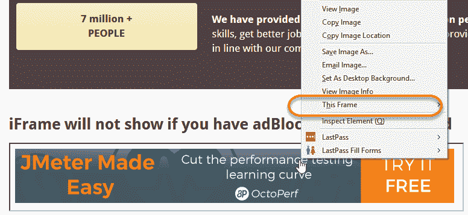
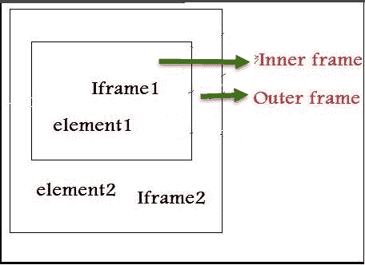
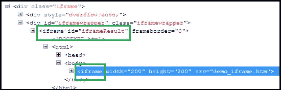

# 在 Selenium Webdriver 中处理 iFrame：switchTo（）

> 原文： [https://www.guru99.com/handling-iframes-selenium.html](https://www.guru99.com/handling-iframes-selenium.html)

### 什么是 iframe？

IFrame 是嵌入在另一个网页中的网页或嵌入在另一个 HTML 文档中的 HTML 文档。

IFrame 通常用于将来自其他来源的内容（例如广告）插入 Web 页面。 < **iframe** >标签指定一个内联框架。

在本教程中，您将学习-

1.  [如何识别 iframe：](#1)
2.  [如何使用 Web 驱动程序命令切换 iframe 中的元素：](#2)
3.  [嵌套框架（框架内的框架）的概念：](#3)

## 如何识别 iframe：

我们仅通过查看页面或检查 Firebug 就无法检测到框架。

观察下图，显示的广告是 iframe，我们仅通过使用 Firebug 进行检查就无法找到或识别该广告。 因此，问题是如何识别 iframe？



我们可以使用以下给出的方法识别 iframe：

*   右键单击该元素，如果找到“此框架”之类的选项，则为 iframe。（请参见上图）
*   右键单击页面，然后单击“查看页面源代码”，然后使用“ iframe”进行搜索，如果您可以找到带有“ iframe”的任何标签名称，则表示该页面包含一个 iframe。

在上图中，您可以在右键单击时看到' **This Frame** '选项，因此我们现在确定它是 iframe。

通过使用以下代码段，我们甚至可以识别 iframe 的总数。

```
Int size = driver.findElements(By.tagName("iframe")).size();

```

## 如何使用 Web 驱动程序命令切换 iframe 中的元素：

基本上，我们可以使用 3 种方式切换帧中的元素。

*   **按索引**
*   **按名称或 ID**
*   **通过网络元素**

**按索引切换到帧：**

索引是 Iframe 的属性之一，通过它我们可以切换到它。

iframe 的索引以“ 0”开头。

假设页面中有 100 帧，我们可以使用索引切换到 iframe。

*   driver.switchTo（）。frame（0）;
*   driver.switchTo（）。frame（1）;

**通过名称或 ID 切换到帧：**

名称和 ID 是 iframe 的属性，通过它们我们可以切换到它。

*   driver.switchTo（）。frame（“ iframe1”）;
*   driver.switchTo（）。frame（“元素的 id”）;

**通过 ID 切换到 iframe 的示例：**

让我们以下图所示的 iframe 显示为例。 我们的要求是点击 iframe。

我们可以通过以下网址访问此 iframe： [http://demo.guru99.com/test/guru99home/](http://demo.guru99.com/test/guru99home/)


由于它是 iframe，因此无法直接通过 [XPath](/xpath-selenium.html) 单击 iframe。 首先，我们必须切换到框架，然后才能使用 xpath 单击。

**步骤 1）**

```
WebDriver driver = new FirefoxDriver();

driver.get("http://demo.guru99.com/test/guru99home/");

driver.manage().window().maximize();

```

*   我们初始化 Firefox 驱动程序。
*   导航到包含 iframe 的“ guru99”网站。
*   最大化窗口。

**步骤 2）**

```
driver.switchTo().frame("a077aa5e");
```

*   在这一步中，我们需要通过 Firebug 进行检查以找出 iframe 的 ID。
*   然后通过 ID 切换到 iframe。

**步骤 3）**

```
driver.findElement(By.xpath("html/body/a/img")).click();
```

*   在这里，我们需要找出要单击的元素的 xpath。
*   单击上面显示的使用 Web 驱动程序命令的元素。

这是完整的代码：

```

public class SwitchToFrame_ID {
public static void main(String[] args) {

		WebDriver driver = new FirefoxDriver(); //navigates to the Browser
	    driver.get("http://demo.guru99.com/test/guru99home/"); 
	       // navigates to the page consisting an iframe

	       driver.manage().window().maximize();
	       driver.switchTo().frame("a077aa5e"); //switching the frame by ID

			System.out.println("********We are switch to the iframe*******");
     		driver.findElement(By.xpath("html/body/a/img")).click();
  		    //Clicks the iframe

  			System.out.println("*********We are done***************");
      }
}		

```

**输出：**

浏览器导航到包含上述 iframe 的页面，然后单击 iframe。

**通过 Web 元素切换到框架：**

我们甚至可以使用 web element 切换到 iframe。

*   driver.switchTo（）。frame（WebElement）;

**如何切换回主机**

我们必须走出 iframe。

要移回父框架，可以使用 switchTo（）。parentFrame（）；如果要返回到主框架（或大多数父框架），则可以使用 switchTo（）。defaultContent（）;。

```
	    driver.switchTo().parentFrame();
	    driver.switchTo().defaultContent();
```

**如果我们无法使用 ID 或 Web 元素进行切换，如何切换框架：**

假设页面中有 100 个框架，并且没有可用的 ID，在这种情况下，我们只是不知道从哪个 iframe 加载了必需的元素（这种情况是我们不知道框架的索引的情况 也）。

解决上述问题的方法是，我们必须找到通过其加载元素的 iframe 的索引，然后我们需要通过该索引切换到 iframe。

以下是使用下面的代码段查找用于加载元素的帧的索引的步骤

**Step 1)**

```
WebDriver driver = new FirefoxDriver();
driver.get("http://demo.guru99.com/test/guru99home/");
driver.manage().window().maximize();

```

*   初始化 Firefox 驱动程序。
*   导航到包含 iframe 的“ guru99”网站。
*   最大化窗口。

**Step 2)**

```
int size = driver.findElements(By.tagName("iframe")).size();
```

*   上面的代码使用标记名“ iframe”查找页面内存在的 iframe 总数。

**Step 3)**

的目标是找出 iframe 的索引。

```
for(int i=0; i<=size; i++){
	driver.switchTo().frame(i);
	int total=driver.findElements(By.xpath("html/body/a/img")).size();
	System.out.println(total);
	    driver.switchTo().defaultContent();}

```

在“ forloop”上方，迭代页面中的所有 iframe，如果找到所需的 iframe，则打印“ 1”，否则返回“ 0”。

**这是直到步骤 3 的完整代码：**

```
public class IndexOfIframe {
public static void main(String[] args) {
	    WebDriver driver = new FirefoxDriver();
	    driver.get("http://demo.guru99.com/test/guru99home/");  
	    driver.manage().window().maximize();
	    //driver.manage().timeouts().implicitlyWait(100, TimeUnit.SECONDS);
	    int size = driver.findElements(By.tagName("iframe")).size();

	    for(int i=0; i<=size; i++){
		driver.switchTo().frame(i);
		int total=driver.findElements(By.xpath("html/body/a/img")).size();
		System.out.println(total);
	    driver.switchTo().defaultContent();}}}

```

**执行此程序，输出如下：**

**Output:**

```
1
0
0
0	
0
0
```

Verify the output, you can find the series of 0's and 1's.

*   无论在哪里找到输出中的“ 1”，即装入元素的帧的索引。
*   如果在第 1 个 <sup>st</sup> 位置找到 1，则 iframe 的索引以'0'开头，因此索引为 0。
*   如果在<sup>和</sup>位置中找到三分之一，则索引为 2。

We can comment out the for loop, once we found the index. **Step 4)**

```
driver.switchTo().frame(0);				
```

*   找到元素的索引后，就可以使用上述命令切换框架。
*   driver.switchTo（）。frame（从步骤 3 中找到的索引）;

**Step 5)**

```
driver.findElement(By.xpath("html/body/a/img")).click();
```

*   上面的代码将单击 iframe 或 iframe 中的元素。

So the complete code would be like below:

```
public class SwitchToframe   {
public static void main(String[] args) throws NoSuchElementException{
	    WebDriver driver = new FirefoxDriver();
	    driver.get("http://demo.guru99.com/test/guru99home/");  
	    driver.manage().window().maximize();
	    //int size = driver.findElements(By.tagName("iframe")).size();

	/*for(int i=0; i<=size; i++){
	    driver.switchTo().frame(i);
	    int total=driver.findElements(By.xpath("html/body/a/img")).size();
		System.out.println(total);
	    driver.switchTo().defaultContent(); //switching back from the iframe
	 }*/

		//Commented the code for finding the index of the element
	    driver.switchTo().frame(0); //Switching to the frame
		System.out.println("********We are switched to the iframe*******");
		driver.findElement(By.xpath("html/body/a/img")).click();

		//Clicking the element in line with Advertisement
	    System.out.println("*********We are done***************");
	        }
	    }

```

**Output:** Browser navigates to the page consisting the above iframe and clicks on the iframe.

## 嵌套框架（框架内的框架）的概念：

Let's assume that there are two frames one inside other like shown in below image and our requirement is printing the text in the outer frame and inner frame. In the case of nested frames,

*   首先，我们必须通过 iframe 的索引或 ID 切换到外部框架
*   切换到外部框架后，我们可以找到外部框架中 iframe 的总数，并且
*   我们可以通过任何已知方法切换到内部框架。

While exiting out of the frame, we must exit out in the same order as we entered into it from the inner frame first and then outer frame.



上面的嵌套框架的 HTML 代码如下所示。



上面的 HTML 代码清楚地说明了另一个 iframe 标签中的 iframe 标签（以绿色突出显示），表明存在嵌套的 iframe。

以下是切换到外框并在外框上打印文本的步骤：**步骤 1）**

```
	WebDriver driver=new FirefoxDriver();
	    driver.get("Url");
	    driver.manage().window().maximize();
	    driver.manage().timeouts().implicitlyWait(2, TimeUnit.SECONDS);
	    int size = driver.findElements(By.tagName("iframe")).size();
	    System.out.println("Total Frames --" + size);

		// prints the total number of frames 
		driver.switchTo().frame(0); // Switching the Outer Frame    		
	    System.out.println (driver.findElement(By.xpath("xpath of the outer element ")).getText()); 
```

*   切换到外部框架。
*   在外框上打印文本。

切换到外部框架后，我们应该知道外部框架内部是否存在任何内部框架

**Step 2)**

```
size = driver.findElements(By.tagName("iframe")).size();
    // prints the total number of frames inside outer frame           
    System.out.println("Total Frames --" + size);

```

*   查找外部框架内的 iframe 总数。
*   如果发现大小为“ 0”，则说明框架内部没有内部框架。

**Step 3)**

```
driver.switchTo().frame(0); // Switching to innerframe
System.out.println(driver.findElement(By.xpath("xpath of the inner element ")).getText());

```

*   切换到内框
*   在内部框架上打印文本。

**Here is the complete code:**

```
public class FramesInsideFrames {
public static void main(String[] args) {
WebDriver driver=new FirefoxDriver();
	    driver.get("Url");
	    driver.manage().window().maximize();
	    driver.manage().timeouts().implicitlyWait(2, TimeUnit.SECONDS);

	    int size = driver.findElements(By.tagName("iframe")).size();
	    System.out.println("Total Frames --" + size);

		// prints the total number of frames 
		driver.switchTo().frame(0); // Switching the Outer Frame    		
	    System.out.println (driver.findElement(By.xpath("xpath of the outer element ")).getText());

		//Printing the text in outer frame
		size = driver.findElements(By.tagName("iframe")).size();
	    // prints the total number of frames inside outer frame           

	    System.out.println("Total Frames --" + size);
	    driver.switchTo().frame(0); // Switching to innerframe
	    System.out.println(driver.findElement(By.xpath("xpath of the inner element ")).getText());

		//Printing the text in inner frame
		driver.switchTo().defaultContent();
	}
}
```

**Output**: The output of the above code would print the text in the Inner frame and Outer frame.