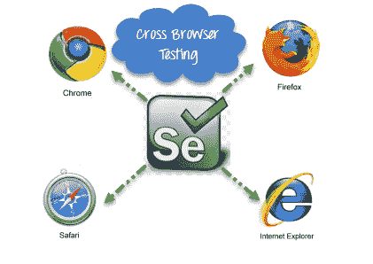
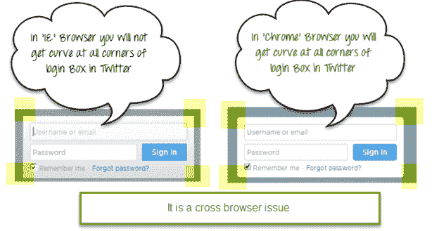
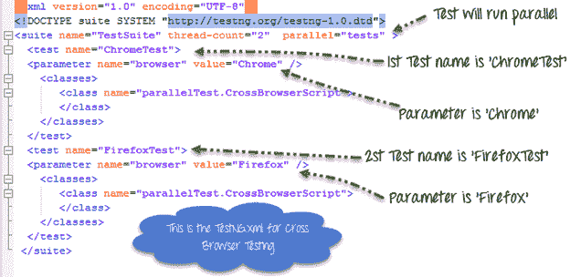
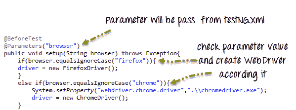
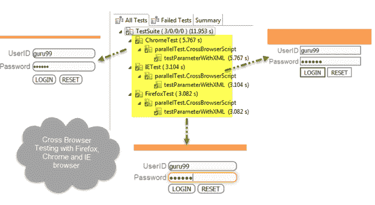

# 使用 Selenium WebDriver 进行跨浏览器测试

> 原文： [https://www.guru99.com/cross-browser-testing-using-selenium.html](https://www.guru99.com/cross-browser-testing-using-selenium.html)

## 什么是跨浏览器测试？

**跨浏览器测试**是一种功能测试，用于检查您的 Web 应用程序是否可以在不同的浏览器中正常工作。



## 为什么我们需要跨浏览器测试？

基于 Web 的应用程序与 Windows 应用程序完全不同。 最终用户可以在任何浏览器中打开 Web 应用程序。 例如，某些人喜欢在 **Firefox 浏览器**中打开 [**https://twitter.com**](https://twitter.com) ，而其他人则可以使用 **Chrome 浏览器** 或 **IE** 。

在下图中，您可以看到在 **IE** 中，Twitter 的登录框并未在所有角落显示曲线，但是我们可以在 Chrome 浏览器中看到它。



因此，我们需要确保该 Web 应用程序能够在所有流行的浏览器中正常运行，以便更多的人可以访问和使用它。

此动机可以通过产品的跨浏览器[测试](/software-testing.html)来实现。

**原因跨浏览器问题**

1.  在不同的浏览器中字体大小不匹配。
2.  JavaScript 的实现可以不同。
3.  CSS，HTML 验证差异可能存在。
4.  一些浏览器仍然不支持 HTML5。
5.  页面对齐方式和 div 大小。
6.  图像方向。
7.  浏览器与操作系统不兼容。 等等

## 如何执行跨浏览器测试

如果我们使用的是 Selenium WebDriver，则可以使用 Internet Explorer，FireFox，Chrome，Safari 浏览器自动执行测试用例。

要在同一台计算机上同时使用不同的浏览器执行测试用例，我们可以将 [Testng](/all-about-testng-and-selenium.html) 框架与 Selenium WebDriver 集成在一起。

您的 testing.xml 看起来像这样，



此 testing.xml 将与[测试用例](/test-case.html)映射，如下所示



这里，因为 testing.xml 具有两个测试标签（“ ChromeTest”，“ FirefoxTest”），所以此测试用例将针对 2 个不同的浏览器执行两次。

首次测试“ ChromeTest”会将参数“浏览器”的值传递为“ chrome”，因此将执行 ChromeDriver。 该测试用例将在 Chrome 浏览器上运行。

第二个测试“ FirefoxTest”将参数“ browser”的值传递为“ Firefox”，因此将执行 FirefoxDriver。 该测试用例将在 FireFox 浏览器上运行。

完整的代码：

**Guru99CrossBrowserScript.java**

```
package parallelTest;

import java.util.concurrent.TimeUnit;
import org.openqa.selenium.By;
import org.openqa.selenium.WebDriver;
import org.openqa.selenium.WebElement;
import org.openqa.selenium.chrome.ChromeDriver;
import org.openqa.selenium.edge.EdgeDriver;
import org.openqa.selenium.firefox.FirefoxDriver;
import org.testng.annotations.BeforeTest;
import org.testng.annotations.Parameters;
import org.testng.annotations.Test;

public class CrossBrowserScript {

	WebDriver driver;

	/**
	 * This function will execute before each Test tag in testng.xml
	 * @param browser
	 * @throws Exception
	 */
	@BeforeTest
	@Parameters("browser")
	public void setup(String browser) throws Exception{
		//Check if parameter passed from TestNG is 'firefox'
		if(browser.equalsIgnoreCase("firefox")){
		//create firefox instance
			System.setProperty("webdriver.gecko.driver", ".\\geckodriver.exe");
			driver = new FirefoxDriver();
		}
		//Check if parameter passed as 'chrome'
		else if(browser.equalsIgnoreCase("chrome")){
			//set path to chromedriver.exe
			System.setProperty("webdriver.chrome.driver",".\\chromedriver.exe");
			//create chrome instance
			driver = new ChromeDriver();
		}
		//Check if parameter passed as 'Edge'
				else if(browser.equalsIgnoreCase("Edge")){
					//set path to Edge.exe
					System.setProperty("webdriver.edge.driver",".\\MicrosoftWebDriver.exe");
					//create Edge instance
					driver = new EdgeDriver();
				}
		else{
			//If no browser passed throw exception
			throw new Exception("Browser is not correct");
		}
		driver.manage().timeouts().implicitlyWait(10, TimeUnit.SECONDS);
	}

	@Test
	public void testParameterWithXML() throws InterruptedException{
		driver.get("http://demo.guru99.com/V4/");
		//Find user name
		WebElement userName = driver.findElement(By.name("uid"));
		//Fill user name
		userName.sendKeys("guru99");
		//Find password
		WebElement password = driver.findElement(By.name("password"));
		//Fill password
		password.sendKeys("guru99");
	}
}

```

**testing.xml**

```
<?xml version="1.0" encoding="UTF-8"?>

<!DOCTYPE suite SYSTEM "http://testng.org/testng-1.0.dtd">

<suite name="TestSuite" thread-count="2" parallel="tests" >

<test name="ChromeTest">

<parameter name="browser" value="Chrome" />

<classes>

<class name="parallelTest.CrossBrowserScript">

</class>

</classes>

</test>

<test name="FirefoxTest">

<parameter name="browser" value="Firefox" />

<classes>

<class name="parallelTest.CrossBrowserScript">

</class>

</classes>

</test>

<test name="EdgeTest">

<parameter name="browser" value="Edge" />

<classes>

<class name="parallelTest.CrossBrowserScript">

</class>

</classes>

</test>

</suite>
```

**注意：**要运行测试，请右键单击 **testing.xml，**选择运行方式，然后单击 TestNG。



摘要

1.  跨浏览器测试是一种使用不同的 Web 浏览器测试 Web 应用程序的技术。
2.  硒可以支持不同类型的浏览器以实现自动化。
3.  硒可以与 TestNG 集成在一起以执行多浏览器测试。
4.  从 testing.xml 中的参数，我们可以传递浏览器名称，在测试案例中，我们可以相应地创建 WebDriver 引用。

**注意：**该给定程序是在硒 3.0.1，Chrome 56.0.2924.87 和 Firefox 47.0.2 & Microsoft Edge 14.14393 上测试的，内置&。 如果程序出现错误，请更新驱动程序

[在本教程中下载用于演示的 Selenium 项目文件](https://drive.google.com/uc?export=download&id=0ByI5-ZLwpo25WGJkWElMN051NE0)