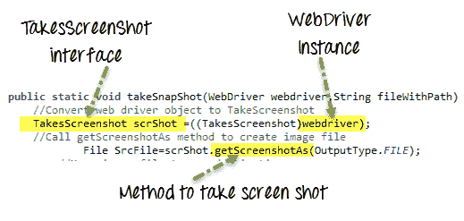
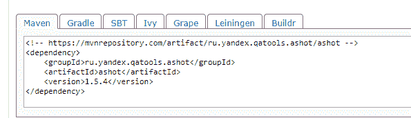
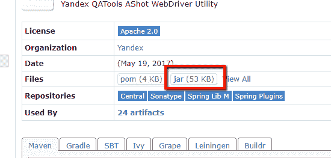

# 如何在 Selenium WebDriver 中截屏

> 原文： [https://www.guru99.com/take-screenshot-selenium-webdriver.html](https://www.guru99.com/take-screenshot-selenium-webdriver.html)

屏幕截图可用于错误分析。 Selenium 可以在执行期间自动拍摄屏幕截图。 您需要将强制转换的 WebDriver 实例键入 TakesScreenshot。



在本教程中，您将学习，

*   [使用 Selenium WebDriver](#1) 捕获屏幕截图
*   [什么是 Ashot API？](#2)
*   [如何下载和配置 Ashot API？](#3)
*   [使用 AShot API](#4) 捕获全页屏幕截图
*   [截取页面](#5)特定元素的屏幕截图
*   [使用 AShot](#6) 进行图像比较

## 使用 Selenium WebDriver 捕获屏幕截图

在 Selenium 中截屏是一个三步过程

**步骤 1）**将 Web 驱动程序对象转换为 TakeScreenshot

```
TakesScreenshot scrShot =((TakesScreenshot)webdriver);
```

**步骤 2）**调用 getScreenshotAs 方法创建图像文件

```
File SrcFile=scrShot.getScreenshotAs(OutputType.FILE);
```

**步骤 3）**将文件复制到所需位置

示例：在此示例中，我们将截取[的屏幕截图 http://demo.guru99.com/V4/](http://demo.guru99.com/V4/) &将其另存为 C：/Test.png

```
package Guru99TakeScreenshot;

import java.io.File;

import org.apache.commons.io.FileUtils;

import org.openqa.selenium.OutputType;

import org.openqa.selenium.TakesScreenshot;

import org.openqa.selenium.WebDriver;

import org.openqa.selenium.firefox.FirefoxDriver;

import org.testng.annotations.Test;

public class Guru99TakeScreenshot {

    @Test

    public void testGuru99TakeScreenShot() throws Exception{

		WebDriver driver ;
    	System.setProperty("webdriver.gecko.driver","C:\\geckodriver.exe");
    	driver = new FirefoxDriver();

        //goto url

        driver.get("http://demo.guru99.com/V4/");

        //Call take screenshot function

        this.takeSnapShot(driver, "c://test.png") ;     

    }

    /**

     * This function will take screenshot

     * @param webdriver

     * @param fileWithPath

     * @throws Exception

     */

    public static void takeSnapShot(WebDriver webdriver,String fileWithPath) throws Exception{

        //Convert web driver object to TakeScreenshot

        TakesScreenshot scrShot =((TakesScreenshot)webdriver);

        //Call getScreenshotAs method to create image file

                File SrcFile=scrShot.getScreenshotAs(OutputType.FILE);

            //Move image file to new destination

                File DestFile=new File(fileWithPath);

                //Copy file at destination

                FileUtils.copyFile(SrcFile, DestFile);

    }

}

```

**注意：** Selenium 版本 3.9.0 及更高版本不提供 Apache Commons IO JAR。 您只需在中下载它们[并在您的项目中调用它们](https://commons.apache.org/proper/commons-io/download_io.cgi)

## 什么是 Ashot API？

Ashot 是 Yandex 的第三方实用程序，受 Selenium WebDriver 支持，用于捕获屏幕截图。 它需要单个 WebElement 的屏幕截图以及页面的整页屏幕截图，该屏幕截图比屏幕大小更重要。

## 如何下载和配置 Ashot API？

有两种方法可以配置 Ashot API

*   1，使用 Maven
*   2.手动不使用任何工具

### 通过 Maven 配置：

*   转到 [https://mvnrepository.com/artifact/ru.yandex.qatools.ashot/ashot](https://mvnrepository.com/artifact/ru.yandex.qatools.ashot/ashot)
*   现在，单击最新版本。 是 1.5.4
*   复制依赖关系代码并添加到您的 pom.xml 文件中



*   保存文件，Maven 会将 jar 添加到您的构建路径
*   现在你准备好了！！！

### 在没有任何依赖工具的情况下手动配置

1.  转到 [https://mvnrepository.com/artifact/ru.yandex.qatools.ashot/ashot](https://mvnrepository.com/artifact/ru.yandex.qatools.ashot/ashot)
2.  现在，单击最新版本。 是 1.5.4
3.  单击罐子，下载并将其保存在您的计算机上



4.  在您的构建路径中添加 jar 文件：
5.  在 Eclipse 中，右键单击项目->转到属性->构建路径->库->添加外部 jar
6.  选择 jar 文件
7.  申请并关闭

## 使用 AShot API 捕获全屏截图

**步骤 1）**如果只需要屏幕尺寸页面的屏幕截图，请创建一个 Ashot 对象并调用 takeScreenshot（）方法。

```
Screenshot screenshot = new Ashot().takeScreenshot(driver);
```

但是，如果您希望页面的屏幕截图大于屏幕尺寸，则在调用 takeScreenshot（）方法设置策略之前，先调用 ShootingStrategy（）方法。 然后调用传递网络驱动程序的方法 takeScreenshot（），例如，

```
Screenshot screenshot = new AShot().shootingStrategy(ShootingStrategies.viewportPasting(1000)).takeScreenshot(driver);

```

这里以毫秒为单位滚动出 1000 个时间，因此要截取屏幕截图，程序将每滚动 1000 毫秒滚动一次。

**步骤 2）：**现在，从屏幕截图中获取图像并将其写入文件。 您可以提供 jpg，png 等文件类型。

```
ImageIO.write(screenshot.getImage(), "jpg", new File(".\\screenshot\\fullimage.jpg"));

```

截取大于屏幕大小的页面的全页屏幕截图。

**示例：**这是捕获 [http://demo.guru99.com/test/guru99home/](http://demo.guru99.com/test/guru99home/) 的全屏截图并将其保存到文件“ screenshot.jpg”的示例。

由于使用了 Ashot API 的 ShootingStrategy 类，我们将能够捕获大于屏幕尺寸的页面的完整图像。 这是程序：

```
package Guru99;

import java.io.File;
import java.io.IOException;
import javax.imageio.ImageIO;
import org.openqa.selenium.By;
import org.openqa.selenium.WebElement;
import org.openqa.selenium.WebDriver;
import org.openqa.selenium.chrome.ChromeDriver;
import ru.yandex.qatools.ashot.AShot;
import ru.yandex.qatools.ashot.Screenshot;
import ru.yandex.qatools.ashot.shooting.ShootingStrategies;

public class TestScreenshotUsingAshot {

public static void main(String[] args) throws IOException {

System.setProperty("webdriver.chrome.driver", "c:\\chromedriver.exe");
WebDriver driver  = new ChromeDriver();	

driver.get("http://demo.guru99.com/test/guru99home/");
driver.manage().window().maximize();

Screenshot = new AShot().shootingStrategy(ShootingStrategies.viewportPasting(1000)).takeScreenshot(driver);

ImageIO.write(screenshot.getImage(), "jpg", new File("c:\\ElementScreenshot.jpg"));

	}

}

```

## 截取页面特定元素的屏幕截图

**示例：**这是在 [http://demo.guru99.com/test/guru99home/](http://demo.guru99.com/test/guru99home/) 页面上捕获 Guru 99 徽标的元素截图并保存到文件“ ElementScreenshot.jpg”的示例 ”。 这是代码：

```
package Guru99;
import java.io.File;
import java.io.IOException;
import javax.imageio.ImageIO;
import org.openqa.selenium.By;
import org.openqa.selenium.WebElement;
import org.openqa.selenium.WebDriver;
import org.openqa.selenium.chrome.ChromeDriver;
import ru.yandex.qatools.ashot.AShot;
import ru.yandex.qatools.ashot.Screenshot;
import ru.yandex.qatools.ashot.shooting.ShootingStrategies;
public class TestElementScreenshotUsingAshot {
public static void main(String[] args) throws IOException {

System.setProperty("webdriver.chrome.driver", "c:\\chromedriver.exe");
WebDriver driver  = new ChromeDriver();	

driver.get("http://demo.guru99.com/test/guru99home/");
driver.manage().window().maximize();

// Find the element to take a screenshot

WebElement element = driver.findElement(By.xpath ("//*[@id=\"site-name\"]/a[1]/img"));

// Along with driver pass element also in takeScreenshot() method.

Screenshot = new AShot().shootingStrategy(ShootingStrategies.viewportPasting(1000)).takeScreenshot(driver,element);

ImageIO.write(screenshot.getImage(), "jpg", new File("c:\\ElementScreenshot.jpg"));
	}
}

```

## 使用 AShot 进行图像比较

```
package Guru99;

import java.awt.image.BufferedImage;
import java.io.File;
import java.io.IOException;
import javax.imageio.ImageIO;
import org.openqa.selenium.By;
import org.openqa.selenium.WebDriver;
import org.openqa.selenium.WebElement;
import org.openqa.selenium.chrome.ChromeDriver;
import ru.yandex.qatools.ashot.AShot;
import ru.yandex.qatools.ashot.Screenshot;
import ru.yandex.qatools.ashot.comparison.ImageDiff;
import ru.yandex.qatools.ashot.comparison.ImageDiffer;

public class TestImageComaprison {

    public static void main(String[] args) throws IOException {

        System.setProperty("webdriver.chrome.driver", "C:\\chromedriver.exe");
        WebDriver driver = new ChromeDriver();
        driver.get("http://demo.guru99.com/test/guru99home/");

        // Find the element and take a screenshot

        WebElement logoElement = driver.findElement(By.xpath("//*[@id=\"site-name\"]/a[1]/img"));
        Screenshot logoElementScreenshot = new AShot().takeScreenshot(driver, logoElemnent);

        // read the image to compare

        BufferedImage expectedImage = ImageIO.read(new File("C:\\Guru99logo.png"));

        BufferedImage actualImage = logoElementScreenshot.getImage();

        // Create ImageDiffer object and call method makeDiff()

        ImageDiffer imgDiff = new ImageDiffer();
        ImageDiff diff = imgDiff.makeDiff(actualImage, expectedImage);

        if (diff.hasDiff() == true) {
            System.out.println("Images are same");

        } else {
            System.out.println("Images are different");
        }
        driver.quit();
    }
}

```

### 摘要

*   Ashot API 是 Yandex 的免费软件。
*   它是用于在 Selenium 中截屏的实用程序。
*   它可以帮助您在桌面浏览器，iOS Simulator Mobile Safari，Android Emulator Browser 等不同平台上截取单个 WebElement 的屏幕截图。
*   它可以截取大于屏幕尺寸的页面的页面截图。
*   硒版本 3 中已删除了此功能，因此 Ashot API 是一个不错的选择。
*   它可以装饰屏幕截图。
*   它提供了屏幕截图比较。

由于 Shradhdha Dave 的贡献而成为可能