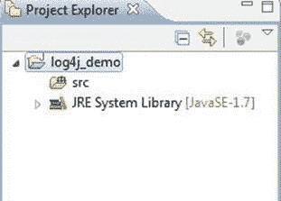
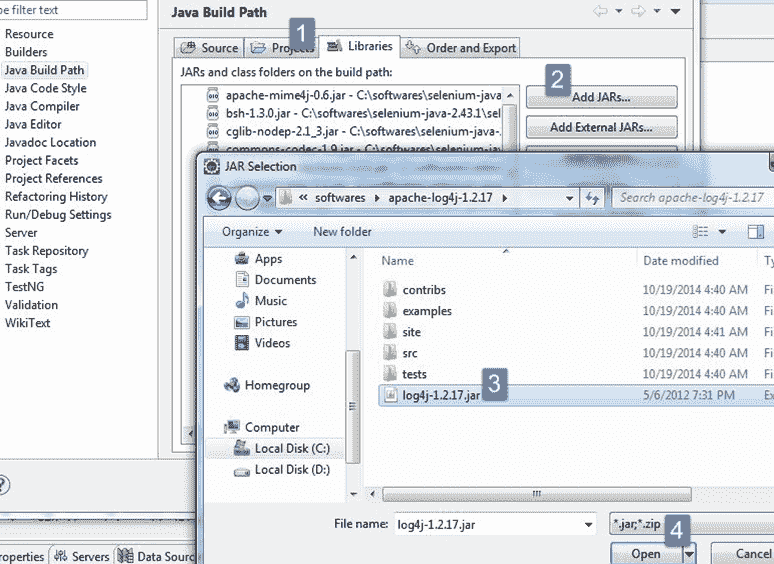
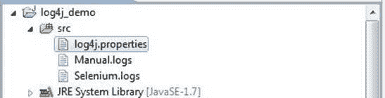
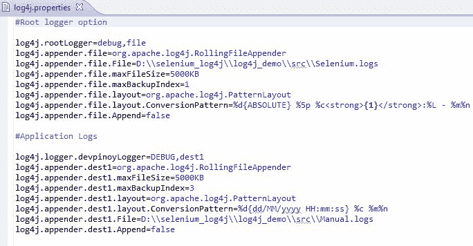
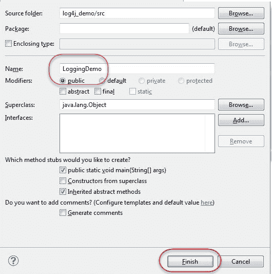
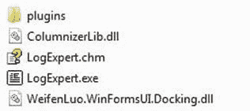
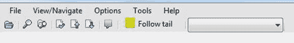
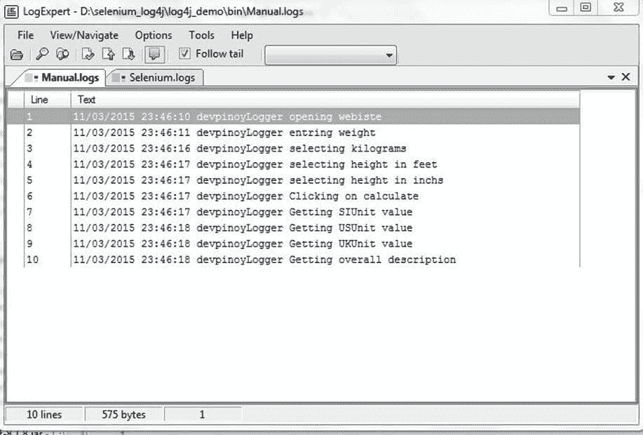
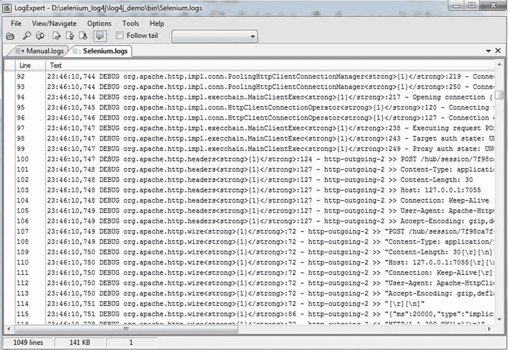

# 具有 Selenium 教程的 Log4j：下载，安装，使用&示例

> 原文： [https://www.guru99.com/tutorial-on-log4j-and-logexpert-with-selenium.html](https://www.guru99.com/tutorial-on-log4j-and-logexpert-with-selenium.html)

## 什么是 Log4j？

Log4j 是一种快速，灵活且可靠的日志记录框架（APIS），该框架以 [Java](/java-tutorial.html) 于 1996 年初开发。它根据 [Apache](/apache.html) 软件许可进行分发。 Log4J 已移植到 C，C ++，C＃， [Perl](/perl-tutorials.html) ， [Python](/python-tutorials.html) ，Ruby 和 Eiffel 语言中。 它是用于小型到大型 Selenium Automation 项目的工具。

## 为什么要使用 Log4j？

*   它是一个开源的
*   使用 Log4j，可以将 Selenium Automation 的流程详细信息存储在文件或数据库中
*   Log4j 用于大型和小型项目
*   在 Log4j 中，我们在代码中使用日志语句而不是 SOPL 语句来了解项目在执行时的状态

## Log4j 具有三个主要组件


1.  **记录器**：它负责记录信息。 要将记录器实施到项目中，需要执行以下步骤-

*   **为记录器类**创建一个实例：Logger 类是一个基于 Java 的实用程序，已经实现了使用 log4j 的所有通用方法。
*   **定义 Log4j 级别**：主要有五种日志级别
    1.  全部-此级别的日志记录将记录所有内容（它将打开所有日志）
    2.  调试–打印调试信息，对开发阶段有帮助
    3.  INFO –打印信息性消息，突出显示应用程序的进度
    4.  WARN –警告–打印有关系统故障和意外行为的信息。
    5.  错误–打印错误消息，可能允许系统继续
    6.  致命–打印导致系统崩溃的系统关键信息
    7.  关–不记录

2.  **Appenders**: It is used to deliver LogEvents to their destination. It decides what will happen with log information. In simple words, it is used to write the logs in file. Following are few types of Appenders
    1.  ConsoleAppender 记录到标准输出
    2.  文件附加器将日志打印到某些文件
    3.  将文件追加器滚动到最大大小的文件

    注意：在 log4j 属性中，我们可以使用任何名称调用 appender。 也有其他附加程序，但我们将限于这几个。

3.  **布局**：它负责格式化不同样式的日志信息。

Logger 类提供了不同的方法来处理日志记录活动。 它提供了两种用于获取 Logger 对象的静态方法。

```
Public static Logger getRootLogger()
Public static Logger getLogger(String name)
```

## 如何配置 log4j？

要配置 log4j，我们必须确定要实现的附加程序。 因此，将设置附加器的参数。

*   我们将使用 DEBUG 级别和 RollingFileAppender
*   我们将做两个配置或日志，
    *   首先：root logger，它将以文件名（即 Selenium.logs）写入所有系统生成的日志
    *   第二：将手动命令生成的信息以代码形式写入文件名 Manual.logs
*   布局将为 PatternLayout

＃根记录器

```
log4j.rootLogger=DEBUG,file
log4j.appender.file=org.apache.log4j.RollingFileAppender
log4j.appender.file.File=D:\\Guru99\\src\\Selenium.logs
log4j.appender.file.maxFileSize=900KB
log4j.appender.file.maxBackupIndex=5
log4j.appender.file.layout=org.apache.log4j.PatternLayout
log4j.appender.file.layout.ConversionPattern=%d{ABSOLUTE} %5p %c<strong>{1}</strong>:%L - %m%n
log4j.appender.file.Append=false

```

＃应用程序日志

```
log4j.logger.devpinoyLogger=DEBUG, dest1
log4j.appender.dest1=org.apache.log4j.RollingFileAppender
log4j.appender.dest1.maxFileSize=900KB
log4j.appender.dest1.maxBackupIndex=6
log4j.appender.dest1.layout=org.apache.log4j.PatternLayout
log4j.appender.dest1.layout.ConversionPattern=%d{dd/MM/yyyy HH:mm:ss} %c %m%n
log4j.appender.dest1.File=D:\\ Guru99\\src\\Manual.logs
log4j.appender.dest1.Append=false

```

在上面的示例中，我们配置了 log4j 来登录名为 Selenium.log 和 Manual.log 的两个不同文件。

*   file 和 dest1 是两个标识符。
*   “文件”用于指定将在其中保存日志的文件名
*   “ maxFileSize”用于配置日志文件的最大大小。 当文件达到此大小时，将创建一个具有相同名称的新文件，并将旧文件名添加为索引。
*   “ maxBackupIndex”用于配置要备份的最大文件数。
*   “布局”用于设置日志文件的格式。
*   “追加”用于设置追加功能。 如果将其设置为 false，则每次创建新文件而不是使用旧文件进行日志记录

## 在脚本中如何使用 log4j？

在代码中，我们已将“ log”用作引用 Logger 类的 getLogger 方法的参考变量

```
Logger log = Logger.getLogger("devpinoyLogger");
```

使用“ log”引用变量和调试方法来记录所需的信息。

```
log.debug("--information--");
```

## 什么是 LogExpert 工具？

1.  LogExpert 工具是 Windows 开发的用于尾随日志的工具
2.  它是免费的开源日志查看器。
3.  它是一个日志分析工具，具有多种功能，例如搜索，过滤，添加书签和突出显示日志
4.  在此工具日志中，文件在打开时会自动更新
5.  在此工具中，我们可以在不同的选项卡中打开多个日志文件
6.  我们还可以在书签上添加评论，并且有快捷键可以在不同的书签之间导航。 我们还可以看到完整的书签列表并从那里导航
7.  该工具的快捷方式在帮助文件中提供，以便可以参考该工具。

## 将 Log4j 与 Selenium 结合使用的步骤

**步骤 1）**在 Eclipse 中创建一个名称为 log4j_demo 的新项目。



**步骤 2）**右键单击 src->构建路径->配置构建路径


**步骤 2）**单击 Libraries 并添加 Log4J Library。 您可以从 [https://logging.apache.org/log4j/1.2/download.html](https://logging.apache.org/log4j/1.2/download.html) 下载



**步骤 3）**创建一个新文件。 该文件将包含所有 log4j 配置

1.  右键单击 src->新建->其他->常规->文件
2.  将文件名命名为“ log4j.properties”
3.  点击完成

再创建两个文件，并为其命名，例如 Selenium.logs 和 Manual.logs。 这些文件将包含系统创建的所有日志和手动记录的语句



**步骤 4）**在 log4j.properties 中复制整个配置。



**步骤 5）**创建主类：

1.  右键单击默认软件包->新建->类
2.  输入课程名称，然后单击完成



**步骤 6）**将以下代码复制到主类中

```
import org.openqa.selenium.By;
import org.openqa.selenium.WebDriver;
import org.openqa.selenium.firefox.FirefoxDriver;
import org.apache.log4j.Logger;

public class LoggingDemo {
    /**
		* @param args
    */
    public static void main(String[] args) {
         // TODO Auto-generated method stub
         WebDriver driver = new FirefoxDriver();
         Logger log = Logger.getLogger("devpinoyLogger");

         driver.get("http://healthunify.com/bmicalculator/");
		 log.debug("opening webiste");
         driver.manage().timeouts().implicitlyWait(20, TimeUnit.SECONDS);
		 log.debug("entring weight");
		 driver.findElement(By.name("wg")).sendKeys("87");
         log.debug("selecting kilograms");
         driver.findElement(By.name("opt1")).sendKeys("kilograms");
         log.debug("selecting height in feet");
         driver.findElement(By.name("opt2")).sendKeys("5");
         log.debug("selecting height in inchs");
         driver.findElement(By.name("opt3")).sendKeys("10");
         log.debug("Clicking on calculate");
         driver.findElement(By.name("cc")).click();

		 log.debug("Getting SIUnit value");
         String SIUnit = driver.findElement(By.name("si")).getAttribute("value");
         log.debug("Getting USUnit value");
         String USUnit = driver.findElement(By.name("us")).getAttribute("value");
         log.debug("Getting UKUnit value");
         String UKUnit = driver.findElement(By.name("uk")).getAttribute("value");
         log.debug("Getting overall description");
         String note = driver.findElement(By.name("desc")).getAttribute("value");

         System.out.println("SIUnit = " + SIUnit);
         System.out.println("USUnit = " + USUnit);
         System.out.println("UKUnit = " + UKUnit);
         System.out.println("note = " + note); 
		driver.quit();
	}
}

```

在上面的代码中，我们访问 [http://healthunify.com/bmicalculator/](http://healthunify.com/bmicalculator/) 并验证 BMI 计算器。 输入的重量为 87KG，高度为 5 英尺 10 英寸。 该脚本以 SE，US 和 UK 单位检查输出。

使用 Logger.getLogger（“ devpinoyLogger”）我们创建系统级日志

使用 log.debug 方法，我们将数据存储到 Manual.log

**步骤 7）**运行脚本。 打开“手动”和“硒”日志的位置以检查日志数据。

## 如何使用 LogExpert 工具分析日志

1.  Download the tool from [http://logexpert.codeplex.com/](http://logexpert.codeplex.com/) . Go to LogExpert download folder

    

2.  打开 LogExpert.exe
3.  单击文件->打开并浏览到 Manual.log 和 Selenium.log 文件的存储路径。 选择文件
4.  Select the "Follow tail" option

    

    选择跟随尾部选项将启用日志尾部，这意味着在脚本处于执行阶段时，LogExpert 自动更新日志文件。 如果我们使用其他任何编辑器（如记事本），则必须关闭并重新打开文件一次以更新日志。 但是，如果 ExpertTool 处于“跟踪尾巴”模式，则不需要这样做。

    下图显示了日志的布局

    

    

使用 LogExpert 工具，可以调试 selenium Webdriver 创建的日志，就像在此工具中一样

*   搜索任何文本和正则表达式，
*   创建书签并对其进行注释，还可以在书签之间导航，这是其他任何工具所无法实现的，
*   过滤日志并搜索文本范围，还可以将其他过滤器应用于之前过滤的日志，
*   根据某些单词突出显示不同的行。

该工具还有助于将数据划分为不同的列。