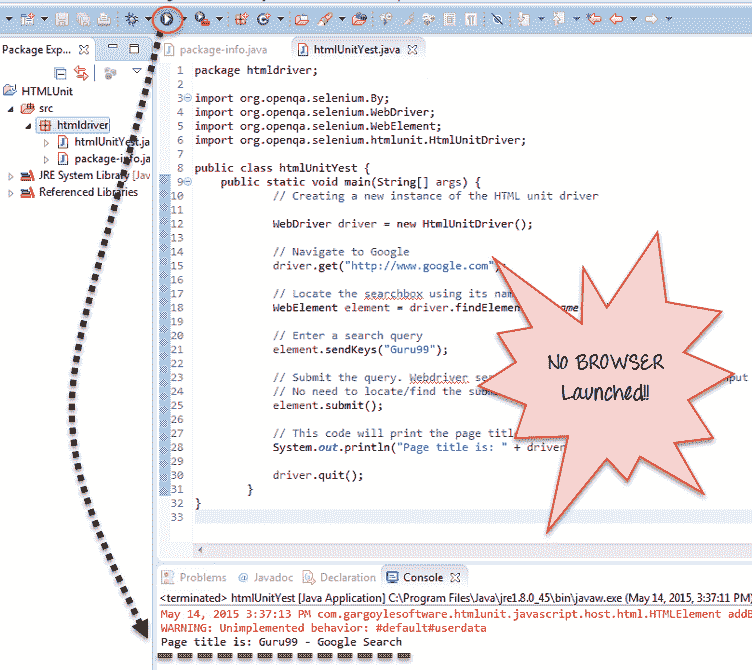
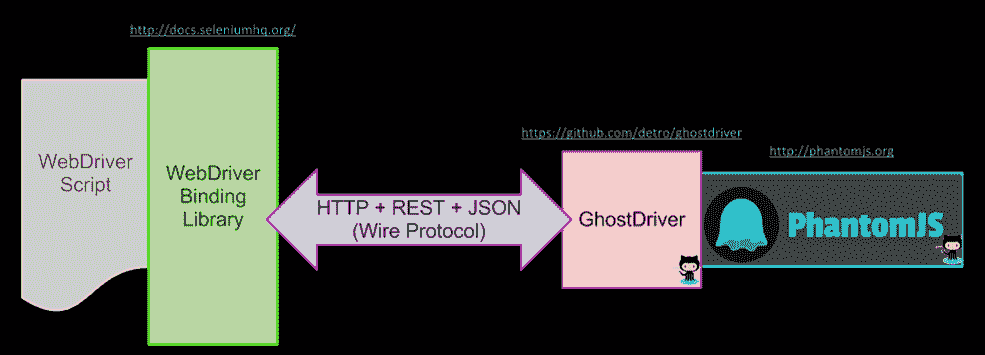
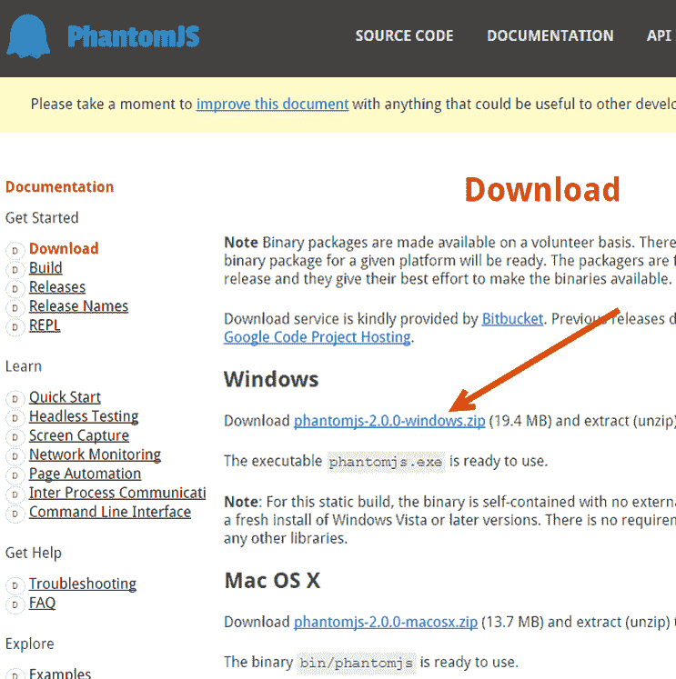
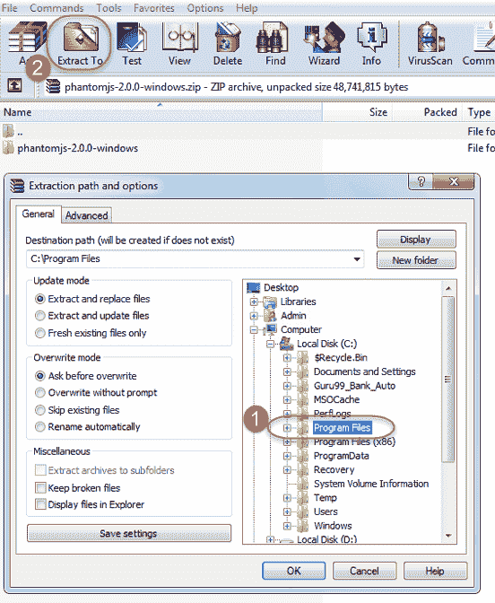
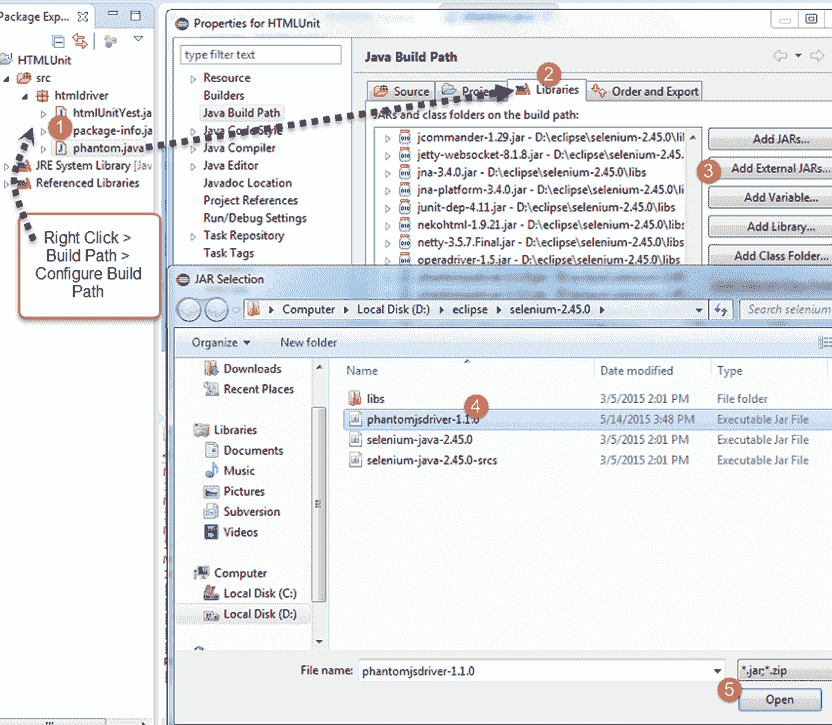
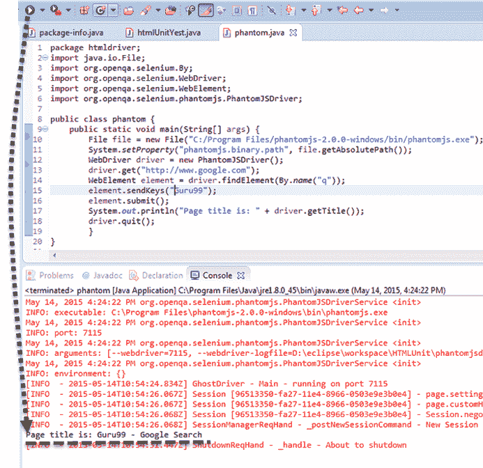

# 硒无头浏览器测试：HTMLUnitDriver & PhantomJS

> 原文： [https://www.guru99.com/selenium-with-htmlunit-driver-phantomjs.html](https://www.guru99.com/selenium-with-htmlunit-driver-phantomjs.html)

Selenium Web 驱动程序是一个 Web 自动化工具，使您可以在不同的浏览器上运行测试。 这些浏览器可以是 Internet Explorer，Firefox 或 Chrome。 要将特定的浏览器与 Selenium 一起使用，您需要相应的驱动程序。

在测试运行时，Selenium 将启动在脚本中调用的相应浏览器并执行测试步骤。 您可以看到浏览器和正在执行的测试。

## 什么是无头浏览器？

无头浏览器是没有图形用户界面的 Web 浏览器**。 该程序的行为就像浏览器一样，但是不会显示任何 GUI。**

无头驱动程序的一些示例包括

*   HtmlUnit
*   鬼
*   幻影
*   僵尸
*   水网驱动器

在本教程中，我们将重点介绍 HtmlUnit 和 PhatomJS

## HTMLUnitDriver

HTML UnitDriver 是 WebDriver 的最轻巧，最快的实现无头浏览器。 它基于 HtmlUnit。 它被称为 **Headless Browser Driver** 。 它与 Chrome，IE 或 FireFox 驱动程序相同，但没有 GUI，因此无法在屏幕上看到测试执行。

HTML 单元驱动程序的功能

*   支持 HTTPS 和 HTTP 协议
*   支持 HTML 响应（单击链接，提交表单，遍历 HTML 文档的 DOM 模型等）
*   支持 cookie
*   代理服务器支持
*   支持基本和 NTLM 身份验证
*   出色的 [JavaScript](/interactive-javascript-tutorials.html) 支持
*   支持提交方法 GET 和 POST
*   能够自定义发送到服务器的请求标头
*   能够确定来自服务器的失败响应是应该引发异常还是应该作为适当类型的页面返回

## 将 HTMLUnit 驱动程序与 Selenium 结合使用的步骤

**步骤 1）**在 Eclipse 中，复制以下代码。 将标准硒库文件添加到项目中。 不需要其他的 jar 文件。

```
package  htmldriver;
import org.openqa.selenium.By;		
import org.openqa.selenium.WebDriver;
import org.openqa.selenium.WebElement;	
import org.openqa.selenium.htmlunit.HtmlUnitDriver;		
public class htmlUnitYest {				
		public static void main(String[] args) {
                     // Creating a new instance of the HTML unit driver

                     WebDriver driver = new HtmlUnitDriver();

           		     // Navigate to Google		
                     driver.get("http://www.google.com");					

					 // Locate the searchbox using its name		
                     WebElement element = driver.findElement(By.name("q"));	

                    // Enter a search query		
                    element.sendKeys("Guru99");	

		            // Submit the query. Webdriver searches for the form using the text input element automatically		
                    // No need to locate/find the submit button		
                    element.submit();			

            		// This code will print the page title		
                    System.out.println("Page title is: " + driver.getTitle());		

                    driver.quit();			
         }		
}

```

步骤 2）运行代码。 **您将观察到没有启动浏览器，并且结果显示在控制台中。**



## HTML Unit Driver 的优点：

*   由于它不使用任何 GUI 进行测试，因此您的测试将在后台运行，而不会出现任何视觉中断
*   与所有其他实例相比，执行速度更快
*   要通过 HtmlUnit 驱动程序运行测试，您还可以选择其他浏览器版本
*   它是平台独立的，并且更容易同时运行多个测试。 [负载测试](/load-testing-tutorial.html)的理想选择。

**局限性：**

*   它无法模仿其他浏览器的 JavaScript 行为

## 幻影

PhantomJS 是一款具有 JavaScript API 的无头浏览器。 它是无头网站测试，访问和操作网页&随附的标准 DOM API 的最佳解决方案。

为了在 Seleniun 中使用 PhantomJS，必须使用 GhostDriver。 **GhostDriver** 是用于 PhantomJS 的简单 JS 中的 Webdriver Wire 协议的实现。

PhatomJS 的最新版本具有**集成了** GhostDriver 和**，因此无需单独安装。**

系统运作方式如下：



## 使用 PhatomJS 运行 Selenium 的步骤

**步骤 1）**您需要安装了 Selenium 的 Eclipse

**步骤 2）**在此处下载 PhantomJS[](https://phantomjs.org/download.html)



**步骤 3）**将下载的文件夹解压缩到 Program Files



**步骤 4）**从[此处](http://mvnrepository.com/artifact/com.github.detro.ghostdriver/phantomjsdriver/1.1.0)下载 PhantomJS 驱动程序。 将罐子添加到您的项目



**步骤 5）**将以下代码粘贴到 Eclipse 中

```
package htmldriver;	
import java.io.File;
import org.openqa.selenium.By;
import org.openqa.selenium.WebDriver;
import org.openqa.selenium.WebElement;
import org.openqa.selenium.phantomjs.PhantomJSDriver;	

public class phantom {				
		public static void main(String[] args) {
        	        File file = new File("C:/Program Files/phantomjs-2.0.0-windows/bin/phantomjs.exe");				
                    System.setProperty("phantomjs.binary.path", file.getAbsolutePath());		
                    WebDriver driver = new PhantomJSDriver();	
                    driver.get("http://www.google.com");         
                    WebElement element = driver.findElement(By.name("q"));	
                    element.sendKeys("Guru99");					
                    element.submit();         			
                    System.out.println("Page title is: " + driver.getTitle());		
                    driver.quit();			
           }		
}
```

**步骤 6）**运行代码。 您会看到输出显示在控制台中，并且没有启动浏览器。

**注意**：首次运行时，根据您的设置，您可能会从 Windows 收到安全警告，以允许运行 PhantomJS。 单击允许访问。



许多组织将 Phantom.JS 用于各种目的，例如，

*   无头测试
*   屏幕截图
*   页面自动化
*   网络监控
*   为用户呈现仪表板屏幕截图
*   在命令行上运行单元测试
*   从 HTML 到 PDF 生成员工手册
*   与 QUnit 结合用于测试套件

**摘要**

为了在各种浏览器中快速测试应用程序并且没有任何视觉中断，使用了无头浏览器[测试](/software-testing.html)。 由于其速度，准确性和易于访问的功能，HTML 单元驱动程序和 PhantomJS 在无头浏览器测试中越来越受欢迎。 通过执行一些简单的步骤，您将了解这些工具与其他工具的集成以及执行测试代码的难易程度。