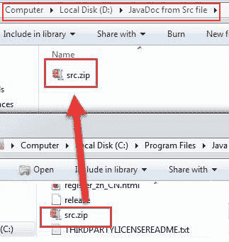
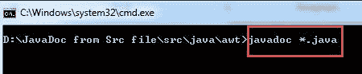
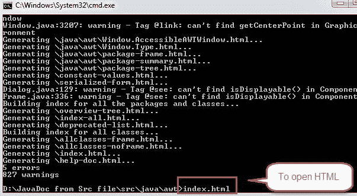
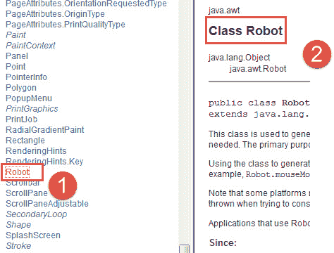

# Selenium Webdriver 中的机器人类

> 原文： [https://www.guru99.com/using-robot-api-selenium.html](https://www.guru99.com/using-robot-api-selenium.html)

## 为什么要上机器人课？

在某些 Selenium 自动化测试中，需要控制键盘或鼠标与 OS 窗口进行交互，例如下载弹出窗口，警报，打印弹出窗口等，或本机操作系统应用程序（例如记事本，Skype，计算器等）。

Selenium Webdriver 无法处理这些 OS 弹出窗口/应用程序。

在[中，引入了 Java](/java-tutorial.html) 1.3 版机器人类。 Robot Class 可以处理 OS 弹出窗口/应用程序。

在本教程中，您将学习，

*   [机器人课程](#1)的好处
*   [机器人类别](#2)的文档
*   [了解机器人课程的内部方法和用法](#3)
*   [如何使用 testNG 执行机器人类代码](#4)
*   [机器人类别](#5)的缺点

## 机器人课的好处

1.  机器人课程可以模拟键盘和鼠标事件
2.  使用 Selenium Web 驱动程序时，Robot Class 可以帮助上传/下载文件
3.  机器人类可以轻松地与当前的自动化框架集成（关键字，数据驱动或混合）

## 机器人课程的文档

Robot Class 文档将帮助您了解 Robot Class 中所有方法和函数的基本定义，语法和用法。 您可以在 [Oracle 官方网站](http://docs.oracle.com/javase/7/docs/api/)上查看文档，也可以在本地计算机上创建文档。

要在本地计算机上创建文档，请按照以下步骤操作-

**步骤 1）**您将在 JDK 文件夹中找到 src.zip 文件。 复制 src.zip 并将其解压缩到其他文件夹或目录中（例如 D：或 E：）



**步骤 2）**提取 src 文件夹并导航至（路径，直到 src 文件夹） **/ src / java / awt**

**步骤 3）**复制 awt 文件夹的当前位置并打开命令提示符。

**步骤 4）**在 cmd 中，将当前目录位置更改为 awt 文件夹，然后键入“ javadoc * .java”，如下所示



请稍候片刻，等待系统处理，完成后，您将在 awt 文件夹中看到很少的 HTML 文件。

**步骤 5）**打开 index.html



**步骤 6）**这是 awt 软件包的完整文档，在左侧导航栏中单击“机器人”超链接（请参见下图中的 1）。



在这里，您还可以看到 Robot Class 的所有方法和接口（请参见上图中标记的 2）。

## 了解机器人课程的内部方法和用法

在执行浏览器自动化的同时，可以使用 Robot Class 方法与键盘/鼠标事件进行交互。 另外，也可以使用 [AutoIT](/use-autoit-selenium.html) ，但是它的缺点是生成的可执行文件（exe）仅适用于 Windows，因此不是一个好选择。

**在网络自动化过程中，一些常用且流行的 Robot Class 方法：**

*   keyPress（）：**示例：** robot.keyPress（KeyEvent.VK_DOWN）：此方法使用键盘的向下箭头键
*   mousePress（）：**示例**：robot.mousePress（InputEvent.BUTTON3_DOWN_MASK）：此方法将右键单击鼠标。
*   mouseMove（）：**示例**：robot.mouseMove（point.getX（），point.getY（））：这会将鼠标指针移动到指定的 X 和 Y 坐标。
*   keyRelease（）：**示例：** robot.keyRelease（KeyEvent.VK_DOWN）：此方法带有释放键盘的向下箭头键
*   mouseRelease（）：**示例：** robot.mouseRelease（InputEvent.BUTTON3_DOWN_MASK）：此方法将释放鼠标右键

**使用机器人类**自动执行常见用例的示例代码

*   让我们以网站 http://spreadsheetpage.com/index.php/file/C35/P10/的网站为例，在其中，单击 Web 元素（ **.// a [@ href = contains（text（）， 'yearly-calendar.xls']** ），出现操作系统下载弹出窗口。

*   为了解决这个问题，我们使用 Robot 类（通过在您的代码中创建 Robot Class 的实例，说 **Robot robot = new Robot（）**））。 我们在 JDK 的 AWT 软件包中提供了机器人类。

*   要按下键盘的向下箭头键，我们使用（ **robot.keyPress（KeyEvent.VK_DOWN））**
*   按下键盘的 TAB 键（我们使用 **robot.keyPress（KeyEvent.VK_TAB））**
*   要按下 Enter 键，我们使用（ **robot.keyPress（KeyEvent.VK_ENTER））。**

这是示例代码

```
import java.awt.AWTException;	
import java.awt.Robot;	
import java.awt.event.KeyEvent;	
import org.openqa.selenium.By;	
import org.openqa.selenium.WebDriver;	
import org.openqa.selenium.firefox.FirefoxDriver;	

class Excercise1 {	

      public static void main(String[] args) throws AWTException, InterruptedException {	
           WebDriver driver = new FirefoxDriver();	
           driver.get("http://spreadsheetpage.com/index.php/file/C35/P10/"); // sample url	
           driver.findElement(By.xpath(".//a[@href=contains(text(),'yearly-calendar.xls')]")).click();	
           Robot robot = new Robot();  // Robot class throws AWT Exception	
           Thread.sleep(2000); // Thread.sleep throws InterruptedException	
           robot.keyPress(KeyEvent.VK_DOWN);  // press arrow down key of keyboard to navigate and select Save radio button	

           Thread.sleep(2000);  // sleep has only been used to showcase each event separately	
           robot.keyPress(KeyEvent.VK_TAB);	
           Thread.sleep(2000);	
           robot.keyPress(KeyEvent.VK_TAB);	
           Thread.sleep(2000);	
           robot.keyPress(KeyEvent.VK_TAB);	
           Thread.sleep(2000);	
           robot.keyPress(KeyEvent.VK_ENTER);	
       // press enter key of keyboard to perform above selected action	
     }	 
 }	
```

观看此视频以观看实际操作

## 如何使用 TestNG 执行机器人类代码

由于现在您了解了机器人类的基本方法，因此让我们了解一些更复杂的方法-

假设您**不想**想要使用**单击方法**来单击 Web 元素。

在这种情况下，可以使用 Robot 类的 mouseMove 方法。

**步骤 1）** mouseMove 方法将 x 和 y 坐标作为参数，例如 **robot.mouseMove（630，420）**，其中 630 表示 x 轴，420 表示 y 轴。 因此，此方法会将鼠标指针从当前位置移动到提到的 x 和 y 交点。

**步骤 2）**接下来，我们需要按下鼠标按钮。 我们可以使用 **mousePress** 方法，例如 **robot.mousePress（InputEvent.BUTTON1_DOWN_MASK）**。

**步骤 3）**按下后，需要释放鼠标。 我们可以使用 **robot.mouseRelease（InputEvent.BUTTON1_DOWN_MASK** ）来释放鼠标左键。

**使用 testNG 运行代码：**

使用 [Testng](/all-about-testng-and-selenium.html) 运行代码需要 testNG 的 maven 依赖性或 TestNG jar 文件的引用库。

TestNG Maven 依赖项：

```
<dependency>	
  <groupId>org.testng</groupId>
  <artifactId>testng</artifactId>	
  <version>6.1.1</version>	
</dependency>	
```

添加 maven 依赖项或 jar 文件之后。 您需要导入 testNG 的 Test 批注。 一旦完成，只需右键单击程序代码，然后单击运行方式，然后单击 TestNG ...，您会发现该代码将使用 testNG API 开始执行。

这是代码

```
import java.awt.AWTException;	
import java.awt.Robot;	
import java.awt.event.InputEvent;	
import java.awt.event.KeyEvent;	
import org.openqa.selenium.WebDriver;	
import org.openqa.selenium.firefox.FirefoxDriver;	
import org.testng.annotations.Test;	

public class Excersise1 {	

    @Test	
    public static void  execution() throws InterruptedException, AWTException {
        WebDriver driver = new FirefoxDriver();	
        driver.manage().window().maximize();	
        driver.get("http://spreadsheetpage.com/index.php/file/C35/P10/"); // sample url	
        Robot robot = new Robot();	
        robot.mouseMove(630, 420); // move mouse point to specific location	
        robot.delay(1500);        // delay is to make code wait for mentioned milliseconds before executing next step	
        robot.mousePress(InputEvent.BUTTON1_DOWN_MASK); // press left click	
        robot.mouseRelease(InputEvent.BUTTON1_DOWN_MASK); // release left click	
        robot.delay(1500);	
        robot.keyPress(KeyEvent.VK_DOWN); // press keyboard arrow key to select Save radio button	
        Thread.sleep(2000);	
        robot.keyPress(KeyEvent.VK_ENTER);	
        // press enter key of keyboard to perform above selected action	
    }	
}	

```

Check this video to see it in action

## 机器人课的缺点

机器人框架有以下几个缺点：

1.  关键字/鼠标事件仅适用于 Window 的当前实例。 例如。 假设代码正在执行任何机器人类事件，并且在代码执行过程中，用户已移至其他屏幕，则该屏幕上将发生关键字/鼠标事件。
2.  大多数方法（例如 mouseMove）都取决于屏幕分辨率，因此在一台计算机上运行的代码可能无法在另一台计算机上运行。

**摘要**

AWT 程序包中的 Robot 类用于生成键盘/鼠标事件，以与 OS 窗口和本机应用程序进行交互。

Robot 的主要目的是支持在 Java 平台中构建硒自动测试项目

***本文由领先的跨国公司（MNC）的测试自动化工程师 Ramandeep Singh 提供。***