# 如何在 Selenium Webdriver 中使用 AutoIT：文件上传示例

> 原文： [https://www.guru99.com/use-autoit-selenium.html](https://www.guru99.com/use-autoit-selenium.html)

## 什么是 AutoIt？

**AutoIt** 是一种免费软件的脚本语言，旨在自动执行 Windows GUI 和常规脚本。 它结合了鼠标移动，击键和窗口控制操作来自动执行硒 Webdriver 无法完成的任务。

在本教程中，您将学习-

*   [为什么使用 AutoIt？](#5)
*   [如何下载和安装 AutoIT](#1)
*   [通过元素标识符查找元素，并在 AutoIT 编辑器上编写脚本。](#2)
*   [Selenium Webdriver](#3) 中的 AutoIT Upload 文件

### 为什么使用 AutoIt？

Selenium 是一个开放源代码工具，旨在在不同的浏览器上自动化基于 Web 的应用程序，但可以处理应用程序中的窗口 GUI 和非 HTML 弹出窗口。 Selenium 不处理基于窗口的活动，因此需要 AutoIT。

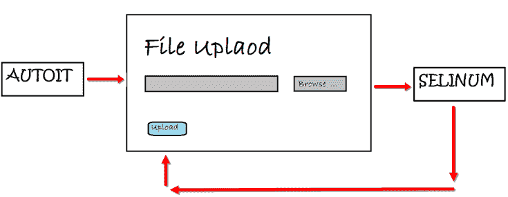

继续前进，我们将学习如何使用 autoIT 在 selenium Web 驱动程序中上传文件。 为此，我们需要三个工具。

*   Selenium Webdriver
*   AutoIT 编辑器和元素标识符
*   您要自动执行的窗口

## 如何下载和安装 AutoIT

**步骤 1）**：转到此[链接。](https://www.autoitscript.com/site/autoit/downloads/)

**步骤 2）**：将鼠标悬停在“自动”和“自动编辑器”下拉菜单上。

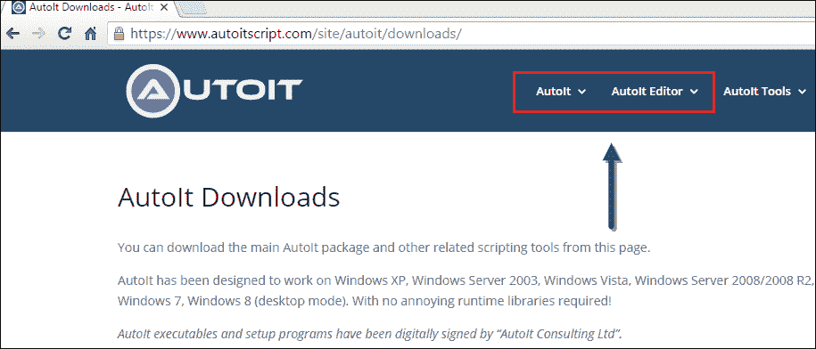

**步骤 3）**单击“ AutoIT”下载选项。

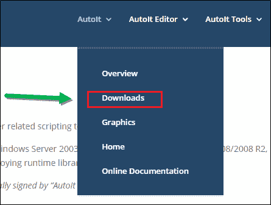

**步骤 4）**：通过单击“下载 Autoit”按钮下载“ Autoit”。

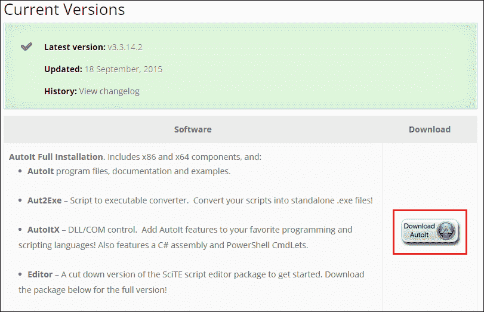

**步骤 5）**：现在，通过单击“下载”按钮下载“自动编辑器”。

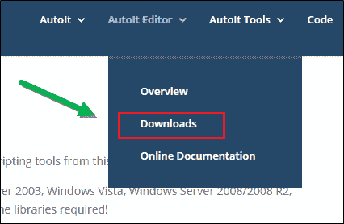

**步骤 6）：**单击链接，如下所示。

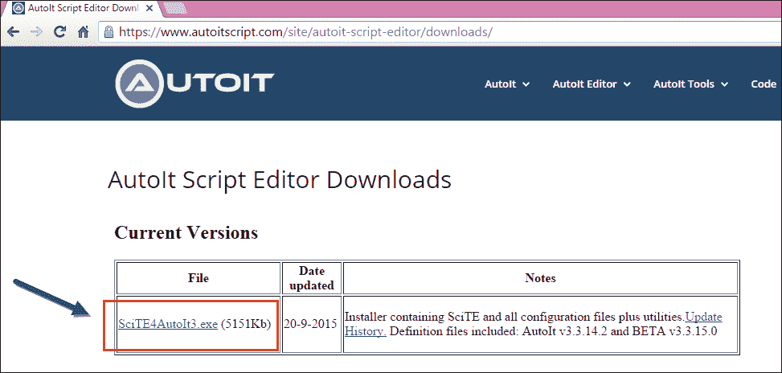

下载后，您将获得两个安装文件，如下屏幕所示，第一个是 **AutoIt 版本 3** 设置，第二个是 **Scitautoit3** 。

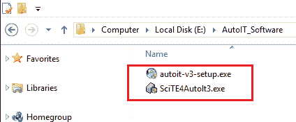

**步骤 6）**：用于安装 AutoIT-单击两个 AutoIT 设置一个一个。

**步骤 7）**：成功安装后-打开 AutoIT 编辑器。

转到'C：\ Program Files（x86）\ AutoIt3 \ SciTE'

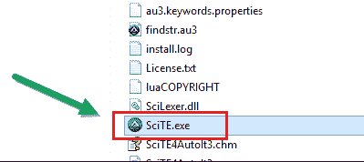

然后单击“ SciTE.exe”文件，将打开 AutoIT 编辑器，如下面的屏幕所示。

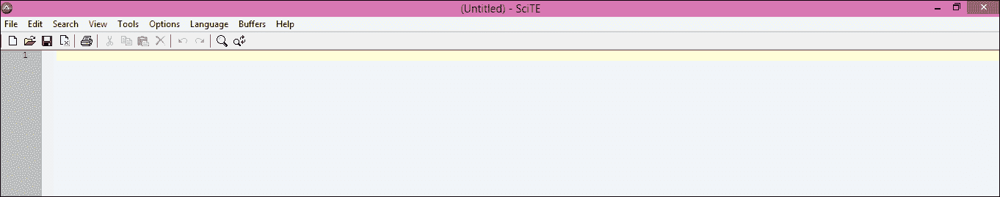

**步骤 8）**：现在打开元素标识符。

转到'C：\ Program Files（x86）\ AutoIt3'


然后点击“ Au3Info.exe”文件，元素标识符打开，如下图所示。

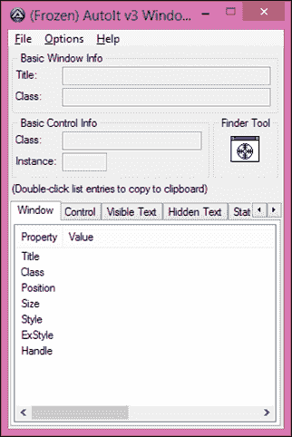

**注意：**使用此元素标识符后，您需要手动关闭，它不会自动关闭。

## 通过元素标识符查找元素，并在 AutoIT 编辑器上编写脚本。

在此之下，我们将看到如何通过 AutoIT 元素标识符在文件上传器窗口上查找元素（元素标识符是 Selenium IDE 之类的工具，标识符可以找到窗口 GUI 或非 HTML 弹出窗口的元素，并提供元素的属性，例如 **title** ，**类**，**实例**）以及如何使用 3 种方法在 AutoIT 编辑器上编写脚本。

**例如：**我们将使用 guru99 的“写给我们”页面上载简历（文档文件）。

在“写给我们”页面上单击“选择文件”按钮后，我们需要调用 AutoIT 脚本。 单击下面的语句（选择要上传的部分）后，单击“选择文件”后，控件立即转换为自动。

```
Runtime.getRuntime().exec("E:\\AutoIT\\FileUpload.exe");			
```

最后，当我们运行 Selenium 脚本时，它将填写表格->上传简历->提交表格。


**步骤 1）**：现在打开元素标识符-转到“ C：\ Program Files（x86）\ AutoIt3”，然后单击“ Au3Info.exe”文件，元素标识符窗口打开，如下图所示。


**步骤 2）**：现在，通过单击 Windows 活动中的“选择文件”来打开文件上传器窗口。


**步骤 3）**：将查找工具拖到文件上传器窗口的“文件名”框元素上，以找到基本属性信息，如以下屏幕中的箭头所示。

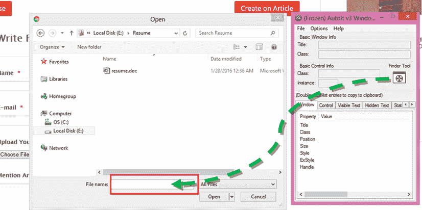

我们可以获得属性的值，即 **title ='Open'**， **class ='Edit'**和 **instance ='1'**，如下所示。 这些值用于编写 AutoIT 脚本，如以下步骤 4 中所述。

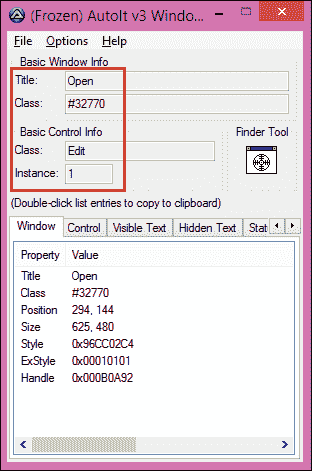

**步骤 4）**：现在打开 AutoIT 脚本编辑器，转到'C：\ Program Files（x86）\ AutoIt3 \ SciTE'，然后从 1 <sup>中单击“ SciTE.exe”，如步骤 7 所示。 st</sup> 主题。

开始编写用于选择要上传文件的脚本。

根据需要，可以在脚本中使用很多可用的方法，但是现在我们将重点介绍以下方法，因为编写文件上传脚本需要这些方法：

1.  **ControlFocus** （“ title”，“ text”，controlID） **//将输入焦点设置到窗口上的给定控件。**
2.  **ControlSetText** （“标题”，“文本”，controlID，“需要上传的文件路径”） **//设置控件的文本。**
3.  **ControlClick** （“ title”，“ text”，controlID） **//将鼠标单击命令发送到给定控件。**

您可以看到如下面的屏幕所示显示了许多方法。 AutoIT 的优点是，它类似于 Eclipse，可以为您建议一些方法。

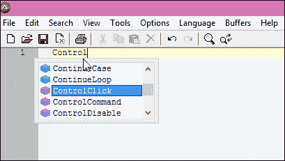

在 AutoIT 编辑器中，我们选择了**“控制焦点”** 方法。 元素标识符已经打开并最小化，因为在上面的步骤 3 中已经标识了元素。我们可以通过最大化它来打开它。

现在，我们将从“ ControlFocus”和“ ControlSetText”方法的元素标识符中获取值，因为这些方法适用于同一元素，即“文件名”文本框，但对于“ ControlClick”方法，则需要捕获不同元素的值，即“ Open” 按钮。

**ControlFocus** 方法的参数值：

此方法将焦点设置到文件上传器窗口的“文件名”文本框中。

*   第一个参数**标题**为“打开”。
*   我们忽略第二个参数，不需要**文本**。
*   第三个参数 **controlID** 是 class ='Edit'和 Instance ='1'的组合，即。 “编辑 1”。

    ```
    ControlFocus("Open","","Edit1") // This method sets input focus to 'File name' text box.						
    ```

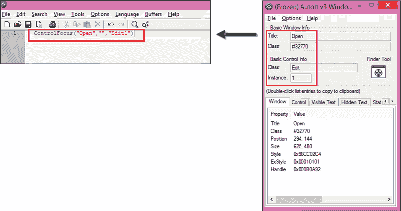

**ControlSetText** 方法的参数值：

此方法用于定义我们需要在“文件名”文本框中上载的文件的路径。 换句话说，可以说此方法用于将文本设置为输入元素。

*   第一个参数**标题**为“打开”。
*   我们忽略第二个参数，不需要**文本**。
*   第三个参数 **controlID** 是 class ='Edit'和 Instance ='1'的组合，即“ Edit1”。
*   第四个参数**新文本**传递了我们需要上传的文件的路径。

    ```
    ControlSetText("Open","","Edit1","E:\Resume\resume.doc") // This method input file path of a control.				
    ```

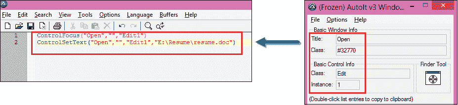

完成上述步骤后，不要关闭窗口（编辑器和元素标识符），保持打开状态。 再次需要打开文件上传器窗口，以查找“打开”按钮的属性，如下面的第 5 步所示。

**步骤 5）**：现在将查找工具拖到文件上传器窗口的“打开”按钮元素上，以查找基本属性信息。

以前的值（即“文件名”文本框的属性）将被“打开”按钮的新值覆盖。 您可以看到在 AutoIT 元素标识符窗口中，类属性现在已更改为“按钮”，以前是“编辑”。

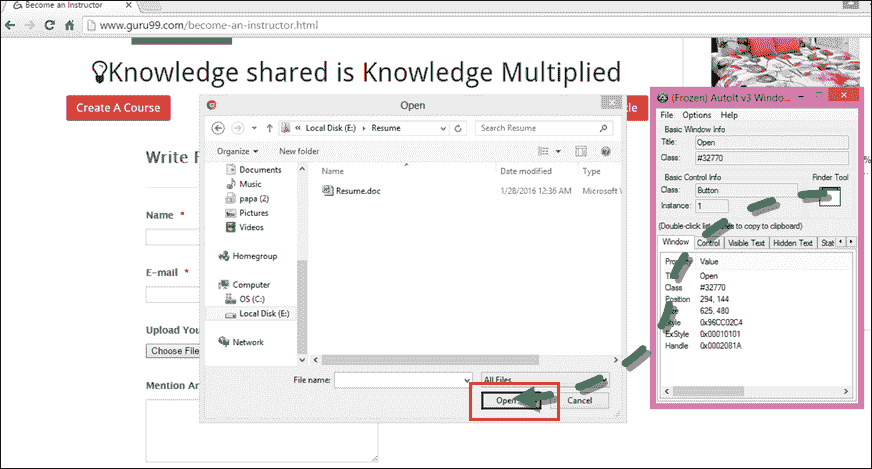

我们可以获取属性的值，即 **title ='Open'**， **class ='Button'**和 **instance ='1'**，如下所示。 这些值用于编写 Autoit 脚本，如下所述。

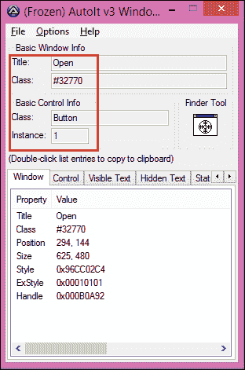

**ControlClick** 方法的参数值：

此方法单击文件上传器窗口的“打开”按钮。

*   第一个参数**标题**为“打开”。
*   我们忽略第二个参数； 不需要**文本**。
*   第三个参数 **controlID** 是类和实例的组合，即“ Button1”。

```
ControlClick("Open","","Button1") //This method click on 'Open' button of file uploader.
```

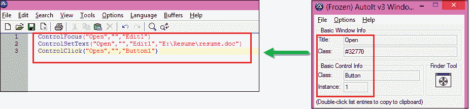

**步骤 6）**：您可以在下面的屏幕中看到 AutoIT 脚本已完成以处理文件上传器。现在您可以关闭元素标识符并将脚本保存为“ FileUpload”在给定位置（E：\ AutoIT ）。

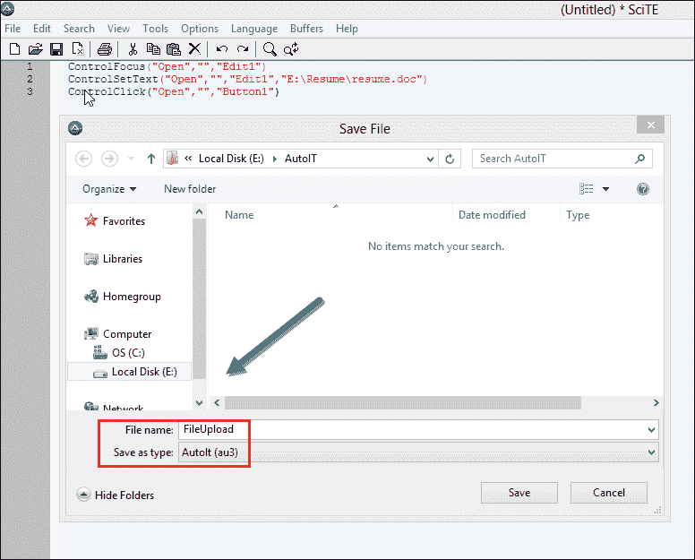

现在您无法直接执行此脚本，需要编译此脚本。

要编译此脚本，您有两个选项“ **编译脚本 x64** ”和“ **编译脚本 x86** ”，如果您使用的是 Windows 32 位计算机，则可以使用“ **编译” 脚本 x86“** ，对于 Windows 64 位计算机，则使用” **编译脚本 x64** ”。

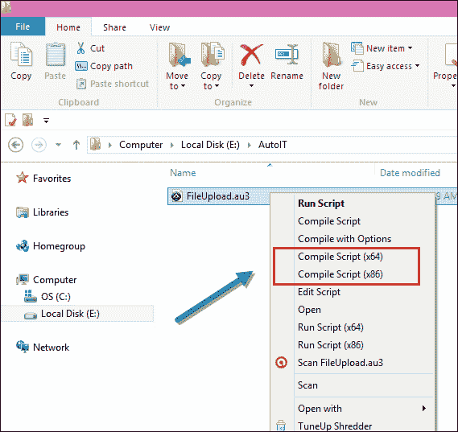

**步骤 7）：编译后生成的** **'FileUpload exe'**文件，您可以在以下屏幕中看到。 现在我们可以在 Selenium webdriver 脚本中使用此文件。

[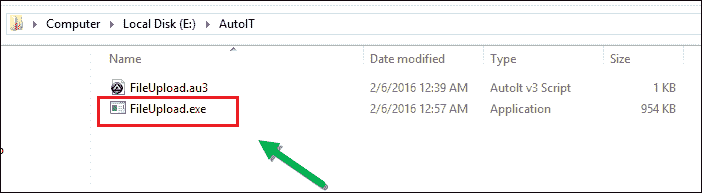 ](/images/jsp/022916_1258_HowtouseAut24.png) 

现在，我们将在 Selenium Web 驱动程序中使用此 AutoIT 脚本。 检查下面的输出。

## Selenium Webdriver 中的 AutoIT Upload 文件

在 Selenium 脚本中，我们找到表单的元素，并根据需要在每个元素中填充数据，并通过执行从 AutoIT 脚本生成的 AutoIT exe 文件上载“ resume.doc”文件，然后允许使用 selenium 脚本提交表单。

*   打开 Eclipse 并开始编写代码。
*   当硒单击“选择文件”按钮时，将打开文件上传器框。
*   然后我们需要调用 AutoIT 脚本，将控件立即转移到 AutoIT 以上传文件，然后将控件发送回 selenium，如下所示。

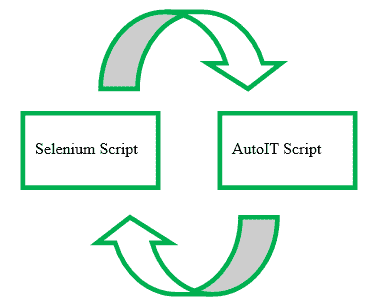

**步骤 1）**：开发日食中的硒脚本。

*   **运行时**类允许脚本与脚本在其中运行的环境进行交互。
*   **getRuntime（）**获取与此进程关联的当前运行时。
*   **exec（）**方法执行 AutoIT 脚本（FileUpload.exe）。

```
Runtime.getRuntime().exec("E:\\AutoIT\\FileUpload.exe");
```

上一行将在硒中调用 **AutoIT 脚本**并上传文件。

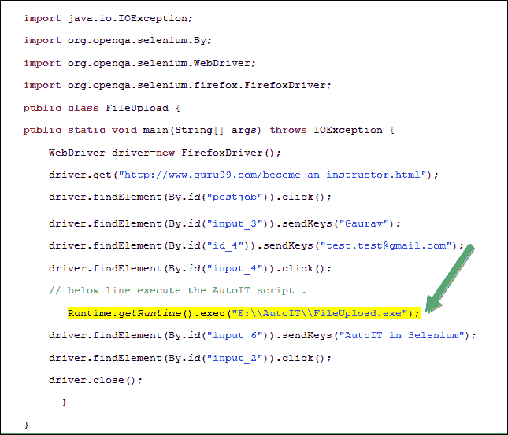

**步骤 2）**：在 Eclipse 中执行 Selenium 脚本。

```
importjava.io.IOException;		
import org.openqa.selenium.By;		
import org.openqa.selenium.WebDriver;		
import org.openqa.selenium.firefox.FirefoxDriver;		
public class FileUpload {				
public static void main(String[] args) throws IOException {								
    WebDriver driver=new FirefoxDriver();			
    driver.get("http://demo.guru99.com/test/autoit.html");			
    driver.findElement(By.id("postjob")).click();			

    driver.findElement(By.id("input_3")).sendKeys("Gaurav");                                 					
    driver.findElement(By.id("id_4")).sendKeys("This email address is being protected from spambots. You need JavaScript enabled to view it.
	");					
    driver.findElement(By.id("input_4")).click();			
    // below line execute the AutoIT script .
     Runtime.getRuntime().exec("E:\\AutoIT\\FileUpload.exe");		
    driver.findElement(By.id("input_6")).sendKeys("AutoIT in Selenium");					
    driver.findElement(By.id("input_2")).click();
    driver.close();
     }
}

```

**步骤 3）**：验证输出，成功上传 resume.doc 文件，并显示感谢信息。


**结论：**

*   下载并安装了 Element Identifier 和 AutoIT 编辑器。
*   打开要执行操作的站点。
*   元素标识符标识文件上载器窗口的元素。
*   在编辑器中借助元素标识符准备了 AutoIT 脚本。
*   Selenium Webdriver 脚本中使用了 Autoit 脚本。
*   执行了硒脚本。
*   输出：成功上传文件。

***本文由 Gaurav Nigam 发表***