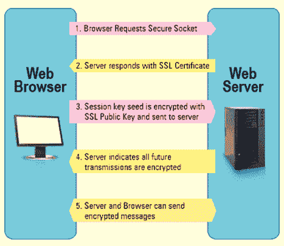
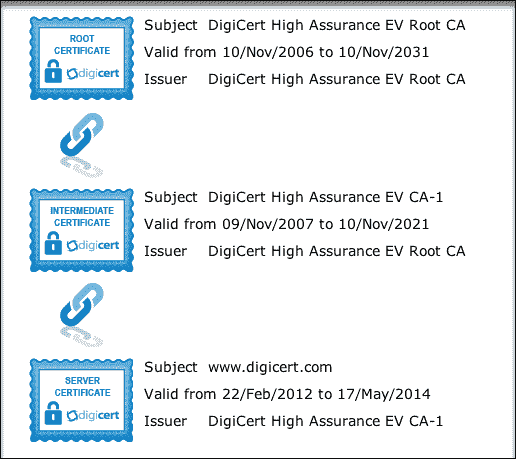
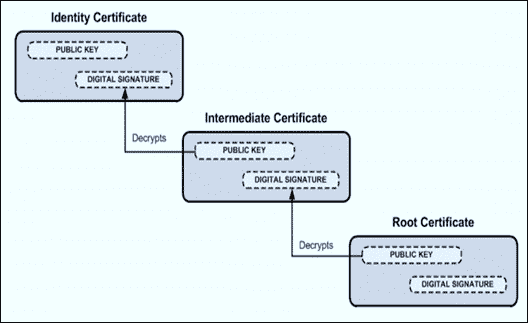
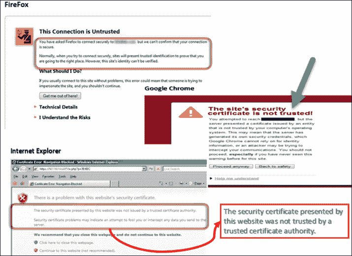
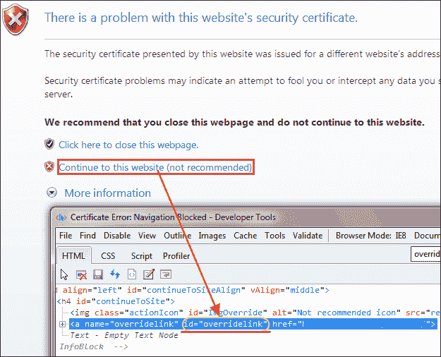

# 如何在 Selenium WebDriver 中处理 SSL 证书

> 原文： [https://www.guru99.com/ssl-certificate-error-handling-selenium.html](https://www.guru99.com/ssl-certificate-error-handling-selenium.html)

## 什么是 SSL 证书？

SSL（安全套接字层）是用于在服务器和作为浏览器的客户端之间建立安全连接的标准安全协议。

SSL（安全套接字层）证书可使用强大的加密标准或数字签名来确保跨服务器和客户端应用程序的数据安全转换。 必须安装 SSL 证书或代码签名证书。

在本教程中，您将学习-

*   [什么是 SSL 证书？](#1)
*   [SSL 证书](#10)的好处
*   [SSL 证书如何创建安全连接](#2)
*   [SSL 证书的类型](#3)
*   [如何验证 SSL 证书](#4)
*   [SSL 证书错误的类型](#5)
*   [如何使用 Selenium Webdriver 处理](#6) SSL 证书错误
*   [Firefox 中的 SSL 证书错误处理](#7)
*   [Chrome](#8) 中的 SSL 证书错误处理
*   [IE](#9) 中的 SSL 证书错误处理

### SSL 证书的好处

使用 SSL 证书有很多好处，例如，

*   可以提高用户和客户的信任度，以快速促进业务增长
*   这些证书有助于保护在线交易和客户的敏感信息，例如信用卡/借记卡数据等。
*   签名证书往往会获得用户的最大下载量和好评。

受 SSL 保护的网站以 **https：//** 开头，如果已建立牢固的连接，则可以看到锁定图标或绿色地址栏。

例如，如果您想通过网上银行进行某些交易，或者想通过电子商务网站（例如 Flipkart 或 Amazon）购买[移动](/mobile-testing.html)手机。

Web 浏览器和服务器之间会发生什么

1.  浏览器尝试与使用 SSL 保护的网站建立连接。 浏览器要求网络服务器标识自己
2.  服务器向浏览器发送其 SSL 证书的副本
3.  浏览器将验证 SSL 证书是否为正版。 如果是这样，它将向服务器发送一条消息
4.  服务器发回数字签名的确认以启动 SSL 加密的会话
5.  加密的数据在服务器和浏览器之间共享

这样做时，您需要传输敏感信息，例如信用卡号或登录凭据，并且必须安全传输，以使其不会被黑或拦截。

例如

1.  输入 **https://netbanking.hdfcbank.com/netbanking/** 。
2.  按下 Enter 键。
3.  您将在浏览器中看到一个绿色的地址栏，如下所示：-


## SSL 证书如何创建安全连接



1.  **浏览器**将 HTTPS 请求发送到服务器。
2.  现在，服务器必须向浏览器提供一些标识，以证明它是受信任的。 这可以通过将其 SSL 证书的副本发送到浏览器来完成。
3.  **每个浏览器都有其自己的受信任 CA 列表。** 浏览器根据其受信任的 CA 列表检查证书根目录，并且该证书尚未过期，未被吊销，并且公用名称对其所连接的网站有效。
4.  如果浏览器信任证书，则会在服务器和浏览器之间创建一个加密的会话。
5.  服务器和浏览器可以发送加密的消息

## SSL 证书的类型

浏览器和服务器使用 SSL 证书机制来建立安全连接。 此连接涉及对三种类型的证书的验证。

*   根
*   中间
*   服务器证书

**获得 SSL 证书的过程**

获取 SSL 证书的过程包括以下步骤：

1.  首先，您必须创建 CSR（创建证书签名请求）请求。
2.  CSR 请求创建 CSR 数据文件，该文件发送到 SSL 证书颁发者 CA（证书颁发机构）。
3.  CA 使用 CSR 数据文件为您的服务器创建 SSL 证书。
4.  收到 SSL 证书后，您必须将其安装在服务器上。
5.  还需要安装一个中间证书，该证书将您的 SSL 证书与 CA 的根证书绑定在一起。

下图表示所有三个证书-**根证书，中级证书和服务器证书。**



## 如何验证 SSL 证书

SSL 通过 Web 服务器计算机和 Web 服务器浏览器上存在的程序和加密/解密例程的组合来工作。

SSL 证书基本上包含以下信息。

1.  主题，即网站所有者的身份。
2.  有效性信息-公钥和私钥。

私钥和公钥是两个唯一相关的加密密钥（数字）。 用公钥加密的任何内容都只能用私钥解密。



如果由于证书未在服务器和客户端之间建立安全连接，则会显示以下 SSL 证书错误。

## SSL 证书错误的类型

假设您在浏览器中键入一些 https 请求，并收到一条消息，例如“此连接不受信任”或“该站点的安全证书不受信任”，这取决于所使用的浏览器。 然后，此类错误将受到 SSL 证书错误的影响。

现在，如果浏览器无法使用所请求的证书建立安全连接，则浏览器将引发以下“不受信任的连接”异常，并要求用户采取适当的措施。

您可能会在不同的浏览器中看到由于证书而导致的错误类型，如下所示

1.  **FireFox** -此连接不受信任

1.  **Google Chrome** -此网站的安全性不受信任

3.  **Internet Explorer（IE）**-此网站提供的此安全证书不受可信证书颁发机构（CA）的信任



## 如何使用 Selenium Webdriver 处理 SSL 证书错误

假设我们已经编写了一些测试脚本，并且在执行脚本时，在上面遇到“ Untrusted Connection”的情况，那么我们如何纯粹通过自动化处理异常。

在这种情况下，我们必须调整脚本，使其能够自行处理 SSL 异常。

需要根据我们使用的浏览器实例的类型来修改脚本。 这些在需要的功能时会出现。

所需功能用于配置 Selenium Webdriver 的驱动程序实例。 通过所需功能，可以配置所有驱动程序实例，例如 ChromeDriver，FirefoxDriver 和 Internet Explorer。

到目前为止，我们没有任何特定的 URL 可以创建上述方案，但是我提供了一些步骤，可以在 Selenium 脚本中添加这些步骤来处理上述情况“不受信任的连接”。

## Firefox 中的 SSL 证书错误处理

要在 Firefox 中处理 SSL 证书错误，我们需要使用 Selenium Webdriver 所需的功能，然后执行以下步骤。

**步骤 1）**：首先，我们需要创建一个新的 firefox 配置文件，例如“ **myProfile** ”。 您可以推荐 Google 学习“如何创建” Firefox 配置文件。 这很简单。

**步骤 2）**：现在，如下所示访问 myProfile 并创建 FirefoxProfile 对象。

```
ProfilesIni prof = new ProfilesIni()				
FirefoxProfile ffProfile= prof.getProfile ("myProfile")

```

**步骤 3）**：现在我们需要在 Fire Fox 配置文件中设置“ **setAcceptUntrustedCertificates** ”和“ **setAssumeUntrustedCertificateIssuer** ”属性。

```
ffProfile.setAcceptUntrustedCertificates(true) 
ffProfile.setAssumeUntrustedCertificateIssuer(false)

```

**步骤 4）**：现在使用 FireFox 驱动程序对象中的 FireFox 配置文件。

```
WebDriver driver = new FirefoxDriver (ffProfile) 		
```

**注意**：“ setAcceptUntrustedCertificates”和“ setAssumeUntrustedCertificateIssuer **”** 是处理 Web 浏览器中证书错误的功能。

## Chrome 中的 SSL 证书错误处理

为了处理 Chrome 中的 SSL 错误，我们需要使用 Selenium Webdriver 所需的功能。 以下代码将有助于接受 Chrome 中的所有 SSL 证书，并且使用此代码，用户将不会收到任何与 SSL 证书相关的错误。

我们需要创建 DesiredCapabilities 类的实例，如下所示：

```
DesiredCapabilities handlSSLErr = DesiredCapabilities.chrome ()       
handlSSLErr.setCapability (CapabilityType.ACCEPT_SSL_CERTS, true)
WebDriver driver = new ChromeDriver (handlSSLErr);
```

## IE 中的 SSL 证书错误处理

与在 IE 中处理 Chrome 浏览器和 Firefox 中的 SSL 证书不同，您可能必须使用 javascript 处理它。

要在 IE 中处理 SSL 证书，您可以通过两种方式处理这种情况，

1.  在此，您将单击链接“ **继续访问此网站（不推荐）”。** 在下面，我们将了解如何处理 IE 中的 SSL 错误。

在 IE 浏览器中观察 SSL 证书错误，您将找到“继续浏览此网站（不推荐）”链接。此链接的 ID 为“ override link”。您可以使用 F12 在 HTML 模式下查看 ID。



单击使用 driver.navigate（）方法和 [JavaScript](/interactive-javascript-tutorials.html) 的链接，如下所示：-

```
driver.navigate ().to ("javascript:document.getElementById('overridelink').click()");
```

2.  第二种方法与 Chrome SSL 处理代码非常相似

```
DesiredCapabilities capabilities = new DesiredCapabilities();
capabilities.setCapability(CapabilityType.ACCEPT_SSL_CERTS, true);
System.setProperty("webdriver.ie.driver","IEDriverServer.exe");
WebDriver driver = new InternetExplorerDriver(capabilities);
```

上面的代码将有助于处理 IE 中的 SSL 证书错误。

**摘要：**

*   SSL（安全套接字层）是用于在服务器和客户端之间建立安全连接的标准安全协议
*   浏览器和服务器使用 SSL 证书机制来建立安全连接。
*   SSL 通过 Web 服务器计算机和 Web 服务器浏览器上存在的程序和加密/解密例程的组合来工作。
*   由于证书 SSL 证书错误导致服务器与客户端之间未建立安全连接时
*   需要调整我们的脚本，使其可以通过 Selenium Web 驱动程序自行处理 SSL 异常/错误。