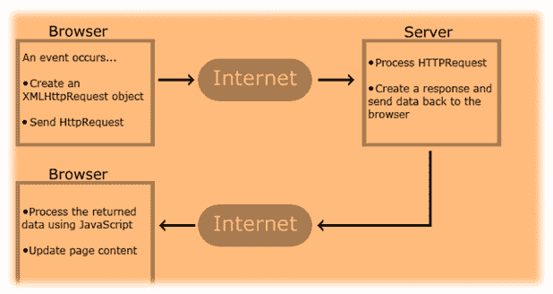

# 如何在 Selenium Webdriver 中处理 AJAX 呼叫

> 原文： [https://www.guru99.com/handling-ajax-call-selenium-webdriver.html](https://www.guru99.com/handling-ajax-call-selenium-webdriver.html)

## 什么是 Ajax？

AJAX 代表**异步 JavaScript & XML，**，它允许 Web 页面从服务器检索少量数据，而无需重新加载整个页面。

Ajax 是一种用于创建快速和动态网页的技术。 该技术是异步的，并且结合使用 Javascript 和 XML。

它将更新网页的一部分，而无需重新加载整个页面。

一些使用 AJAX 技术的著名应用程序包括 Gmail，Google Maps，Facebook，Youtube 等。

在本教程中，您将学习-

*   [什么是 Ajax？](#1)
*   [Ajax 如何工作？](#1)
*   [如何使用 Selenium Webdriver](#2) 处理 Ajax 调用
*   [在 Selenium Webdriver](#3) 中处理 Ajax 调用的挑战

### Ajax 如何工作？

例如，当您单击提交按钮时， [JavaScript](/interactive-javascript-tutorials.html) 将向服务器发出请求，解释结果并更新当前屏幕，而无需重新加载网页。



*   Ajax 调用是由浏览器发起的异步请求，不会直接导致页面转换。 这意味着，如果您触发 Ajax 请求，则用户在请求等待响应时仍可以在应用程序上工作。
*   AJAX 将 HTTP 请求从客户端发送到服务器，然后处理服务器的响应，而无需重新加载整个页面。 因此，当您进行 AJAX 呼叫时，**不太确定服务器向您发送响应**所花费的时间。

从测试人员的角度来看，如果要检查要显示的内容或元素，则需要等待直到得到响应。 在 AJAX 调用期间，数据以 XML 格式存储并从服务器检索。

## 如何使用 Selenium Webdriver 处理 Ajax 调用

**处理 Ajax 调用的最大挑战是知道网页的加载时间。** 由于网页的加载仅会持续几秒钟，因此测试人员很难通过自动化工具测试此类应用程序。 为此，Selenium Webdriver 必须在此 Ajax 调用上使用 wait 方法。

因此，通过执行此等待命令，硒将暂停当前[测试用例](/test-case.html)的执行，并等待期望值或新值。 当出现新值或新字段时，Selenium Webdriver 将执行暂挂的测试用例。

以下是 Selenium Webdriver 可以使用的等待方法

1.  **Thread.Sleep（）**

*   Thread.Sleep（）不是明智的选择，因为它会将当前线程挂起指定的时间。
*   在 AJAX 中，您永远无法确定确切的等待时间。 因此，如果元素不会在等待时间内显示，则测试将失败。 此外，这会增加开销，因为调用 Thread.sleep（t）会使当前线程从正在运行的队列移至等待队列。
*   到达时间“ t”后，当前线程将从等待队列移至就绪队列，然后需要一些时间才能被 CPU 选中并运行。

2.  **隐式 Wait（）**

*   此方法告诉 WebDriver 等待元素是否立即不可用，但是这种等待将在浏览器打开的整个过程中一直存在。 因此，对页面上的元素进行任何搜索都可能花费设置隐式等待的时间。

3.  **显式 Wait（）**

*   [显式等待](/implicit-explicit-waits-selenium.html)用于冻结测试执行，直到满足特定条件的时间或经过最大时间为止。

4.  **WebdriverWait**

*   它可以用于任何条件。 可以通过将 WebDriverWait 与 ExpectedCondition 结合使用来实现
*   动态等待元素的最佳方法是每秒检查条件，并在条件满足后立即继续执行脚本中的下一个命令。

但是所有这些等待的问题是，您必须提到超时单元。 如果该元素在一段时间内仍然不存在怎么办？ 因此，还有一个等待，称为 Fluent 等待。

5.  **流利的等待**

*   这是具有超时和轮询间隔的 Wait 接口的实现。 每个 FluentWait 实例都确定等待条件的最长时间，以及检查条件的频率。

## 在 Selenium Webdriver 中处理 Ajax 调用的挑战

*   使用“ pause”命令来处理 Ajax 调用并不完全可靠。 较长的暂停时间会使测试变慢，并且增加了[测试](/software-testing.html)时间。 相反，“ waitforcondition”将对测试 Ajax 应用程序更有帮助。
*   很难评估与特定 Ajax 应用程序相关的风险
*   开发人员拥有充分的自由来修改 Ajax 应用程序，这使测试过程具有挑战
*   对于测试工具而言，创建自动测试请求可能很困难，因为此类 AJAX 应用程序经常使用不同的编码或序列化技术来提交 POST 数据。

## Ajax 处理的示例

```
import org.openqa.selenium.By;
import org.openqa.selenium.WebDriver;
import org.openqa.selenium.WebElement;
import org.openqa.selenium.chrome.ChromeDriver;
import org.openqa.selenium.support.ui.ExpectedConditions;
import org.openqa.selenium.support.ui.WebDriverWait;
import org.testng.Assert;
import org.testng.annotations.BeforeClass;
import org.testng.annotations.Test;

public class Ajaxdemo {

	private String URL = "http://demo.guru99.com/test/ajax.html";

	WebDriver driver;
	WebDriverWait wait;

	@BeforeClass
	public void setUp() {
		System.setProperty("webdriver.chrome.driver",".\\chromedriver.exe");
		//create chrome instance
		driver = new ChromeDriver();
		driver.manage().window().maximize();
		driver.navigate().to(URL);
	}

	@Test
	public void test_AjaxExample() {

		By container = By.cssSelector(".container");
		wait = new WebDriverWait(driver, 5);
		wait.until(ExpectedConditions.presenceOfElementLocated(container));

		//Get the text before performing an ajax call
		WebElement noTextElement = driver.findElement(By.className("radiobutton"));
		String textBefore = noTextElement.getText().trim();

		//Click on the radio button
		driver.findElement(By.id("yes")).click();

		//Click on Check Button
		driver.findElement(By.id("buttoncheck")).click();

		/*Get the text after ajax call*/
		WebElement TextElement = driver.findElement(By.className("radiobutton"));
		wait.until(ExpectedConditions.visibilityOf(TextElement));
		String textAfter = TextElement.getText().trim();

		/*Verify both texts before ajax call and after ajax call text.*/
		Assert.assertNotEquals(textBefore, textAfter);
		System.out.println("Ajax Call Performed");

		String expectedText = "Radio button is checked and it's value is Yes";

		/*Verify expected text with text updated after ajax call*/
		Assert.assertEquals(textAfter, expectedText);
		driver.close();
	}

}
```

### **摘要：**

*   AJAX 允许 Web 页面从服务器检索少量数据，而无需重新加载整个页面。
*   要测试 Ajax 应用程序，应使用不同的等待方法
    *   线程睡眠
    *   隐式等待
    *   显式等待
    *   Webdriver 等待
    *   流利的等待
*   对于测试工具而言，创建自动测试请求可能很困难，因为此类 AJAX 应用程序经常使用不同的编码或序列化技术来提交 POST 数据。