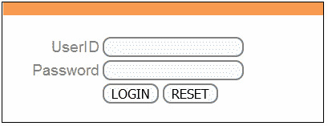
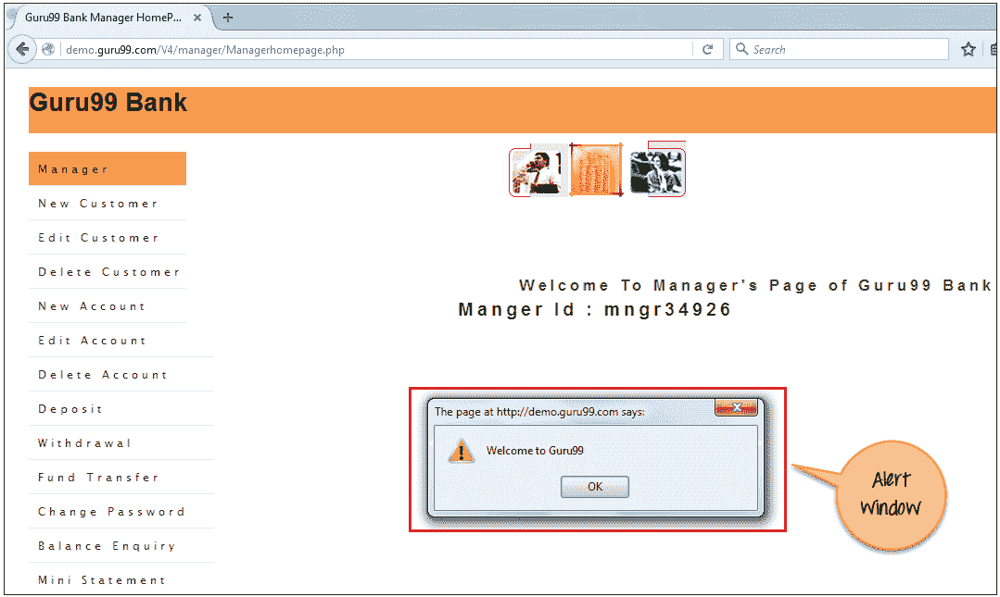
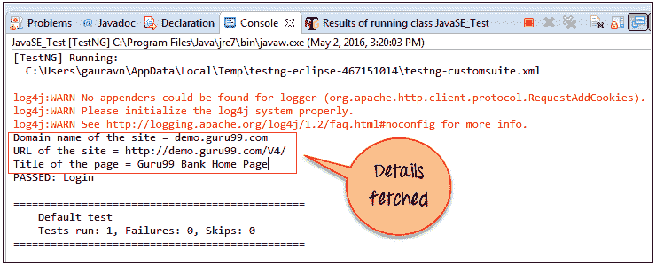
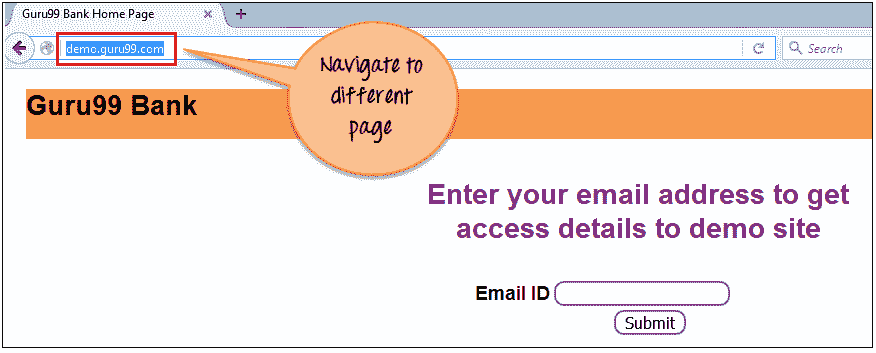

# Selenium WebDriver 中的 JavaScriptExecutor 示例

> 原文： [https://www.guru99.com/execute-javascript-selenium-webdriver.html](https://www.guru99.com/execute-javascript-selenium-webdriver.html)

## 什么是 JavaScriptExecutor？

JavaScriptExecutor 是一个接口，可帮助通过 Selenium Webdriver 执行 [JavaScript](/interactive-javascript-tutorials.html) 。 JavaScriptExecutor 提供了两种方法“ executescript” &“ executeAsyncScript”以在所选窗口或当前页面上运行 javascript。


在本教程中，您将学习-

*   [什么是 JavaScriptExecutor？](#1)
*   [为什么我们需要 JavaScriptExecutor？](#2)
*   [JavaScriptExecutor 方法](#3)
*   [executeAsyncScript](#4) 的示例

*   [示例 1：在被测浏览器中执行睡眠。](#5)

*   [executeScript](#6) 的示例

*   1）示例：单击一个按钮登录并生成警报窗口
*   [2）示例：捕获抓取数据并导航到其他页面](#8)
*   [3）示例：使用](#9)向下滚动

## 为什么我们需要 JavaScriptExecutor？

在 Selenium Webdriver 中，使用诸如 XPath，CSS 等定位器来标识和执行 Web 页面上的操作。

如果这些定位器不起作用，则可以使用 JavaScriptExecutor。 您可以使用 JavaScriptExecutor 在 Web 元素上执行所需的操作。

Selenium 支持 javaScriptExecutor。 不需要额外的插件或附件。 您只需在脚本中导入（ **org.openqa.selenium.JavascriptExecutor** ）即可使用 JavaScriptExecutor。

## JavaScriptExecutor 方法

1.  **executeAsyncScript**

使用异步脚本，页面可以更快地呈现。 而不是强迫用户在页面呈现之前等待脚本下载。 此函数将在 Selenium 中当前选定的框架或窗口的上下文中执行异步 JavaScript。 这样执行的 JS 是单线程的，具有各种同步运行的回调函数。

2.  **executeScript**

此方法在 Selenium 中当前选定的框架或窗口的上下文中执行 JavaScript。 此方法中使用的脚本在匿名函数（没有名称的函数）的主体中运行。 我们还可以将复杂的参数传递给它。

该脚本可以返回值。 返回的数据类型为

*   布尔型
*   Long
*   串
*   清单
*   WebElement。

JavascriptExecutor 的基本语法如下：

**语法：**

```
JavascriptExecutor js = (JavascriptExecutor) driver;  
js.executeScript(Script,Arguments);
```

*   脚本–这是需要执行的 JavaScript。
*   参数–它是脚本的参数。 它是可选的。

## executeAsyncScript 的示例

使用 executeAsyncScript，有助于提高测试性能。 它允许编写测试更像是普通编码。

execSync 阻止 Selenium 浏览器正在执行的其他操作，但是 execAsync 不阻止操作。 脚本完成后，它将向服务器端[测试](/software-testing.html)套件发送回调。 这意味着脚本中的所有内容都将由浏览器而不是服务器执行。

### 示例 1：在被测浏览器中执行睡眠。

在这种情况下，我们将使用“ Guru99”演示站点来说明 executeAsyncScript。 在此示例中，您将

*   启动浏览器。
*   打开网站“ [http://demo.guru99.com/V4/](http://demo.guru99.com/V4/) ”。
*   应用程序等待 5 秒钟以执行进一步的操作。

**步骤 1）**使用 executeAsyncScript（）方法捕获等待 5 秒（5000 毫秒）之前的开始时间。

**步骤 2）**然后，使用 executeAsyncScript（）等待 5 秒钟。

**步骤 3）**然后，获取当前时间。

**步骤 4）**减去（当前时间–开始时间）=经过时间。

**步骤 5）**验证输出应显示超过 5000 毫秒

```
import java.util.concurrent.TimeUnit;		

import org.openqa.selenium.JavascriptExecutor;		
import org.openqa.selenium.WebDriver;		
import org.openqa.selenium.firefox.FirefoxDriver;		
import org.testng.annotations.Test;		

public class JavaSE_Test {				

    @Test		
    public void Login() 					
    {		

        WebDriver driver= new FirefoxDriver();			

        //Creating the JavascriptExecutor interface object by Type casting		
        JavascriptExecutor js = (JavascriptExecutor)driver;		

        //Launching the Site.		
        driver.get("http://demo.guru99.com/V4/");			

          //Maximize window		
          driver.manage().window().maximize();		

          //Set the Script Timeout to 20 seconds		
          driver.manage().timeouts().setScriptTimeout(20, TimeUnit.SECONDS);			

          //Declare and set the start time		
          long start_time = System.currentTimeMillis();			

          //Call executeAsyncScript() method to wait for 5 seconds		
          js.executeAsyncScript("window.setTimeout(arguments[arguments.length - 1], 5000);");			

         //Get the difference (currentTime - startTime)  of times.		
         System.out.println("Passed time: " + (System.currentTimeMillis() - start_time));					

    }		
}			

```

**输出：**成功显示了超过 5 秒（5000 毫秒）的经过时间，如下所示：

```
[TestNG] Running:		
C:\Users\gauravn\AppData\Local\Temp\testng-eclipse-387352559\testng-customsuite.xml		
log4j:WARN No appenders could be found for logger (org.apache.http.client.protocol.RequestAddCookies).		
log4j:WARN Please initialize the log4j system properly.		
log4j:WARN See http://logging.apache.org/log4j/1.2/faq.html#noconfig for more info.		
Passed time: 5022		
PASSED: Login		

===============================================		
    Default test		
    Tests run: 1, Failures: 0, Skips: 0		
===============================================
```

## executeScript 的示例

对于 executeScript，我们将一一看到三个不同的示例。

### 1）示例：单击一个按钮登录并使用 JavaScriptExecutor 生成警报窗口。

在这种情况下，我们将使用“ Guru99”演示站点来说明 JavaScriptExecutor。 在这个例子中

*   启动网络浏览器
*   打开站点“ [http://demo.guru99.com/V4/](http://demo.guru99.com/V4/) ”，然后
*   用凭证登录



*   成功登录后显示警报窗口。

```
import org.openqa.selenium.By;		
import org.openqa.selenium.JavascriptExecutor;		
import org.openqa.selenium.WebDriver;		
import org.openqa.selenium.WebElement;		
import org.openqa.selenium.firefox.FirefoxDriver;		
import org.testng.annotations.Test;		

public class JavaSE_Test {				

    @Test		
    public void Login() 					
    {		
        WebDriver driver= new FirefoxDriver();			

        //Creating the JavascriptExecutor interface object by Type casting		
        JavascriptExecutor js = (JavascriptExecutor)driver;		

        //Launching the Site.		
        driver.get("http://demo.guru99.com/V4/");			

        WebElement button =driver.findElement(By.name("btnLogin"));			

        //Login to Guru99 		
        driver.findElement(By.name("uid")).sendKeys("mngr34926");					
        driver.findElement(By.name("password")).sendKeys("amUpenu");					

        //Perform Click on LOGIN button using JavascriptExecutor		
        js.executeScript("arguments[0].click();", button);

        //To generate Alert window using JavascriptExecutor. Display the alert message 			
        js.executeScript("alert('Welcome to Guru99');");   

    }		
}

```

**输出：**成功执行代码时。 你会观察

*   成功点击登录按钮，然后
*   将显示警报窗口（请参见下图）。

[ ](/images/ccna/061516_1127_ExecuteJava3.png) 

### 2）示例：使用 JavaScriptExecutor 捕获抓取数据并导航到其他页面。

执行以下硒脚本。 在这个例子中

*   启动网站
*   获取站点的详细信息，例如站点的 URL，站点的标题名称和域名。
*   然后导航到其他页面。

```
import org.openqa.selenium.JavascriptExecutor;		
import org.openqa.selenium.WebDriver;		
import org.openqa.selenium.firefox.FirefoxDriver;		
import org.testng.annotations.Test;		

public class JavaSE_Test {				

    @Test		
    public void Login() 					
    {		
        WebDriver driver= new FirefoxDriver();			

        //Creating the JavascriptExecutor interface object by Type casting		
        JavascriptExecutor js = (JavascriptExecutor)driver;		

        //Launching the Site.		
        driver.get("http://demo.guru99.com/V4/");

        //Fetching the Domain Name of the site. Tostring() change object to name.		
        String DomainName = js.executeScript("return document.domain;").toString();			
        System.out.println("Domain name of the site = "+DomainName);					

        //Fetching the URL of the site. Tostring() change object to name		
        String url = js.executeScript("return document.URL;").toString();			
        System.out.println("URL of the site = "+url);					

       //Method document.title fetch the Title name of the site. Tostring() change object to name		
       String TitleName = js.executeScript("return document.title;").toString();			
       System.out.println("Title of the page = "+TitleName);					

      //Navigate to new Page i.e to generate access page. (launch new url)		
      js.executeScript("window.location = 'http://demo.guru99.com/'");			
    }		
}

```

**输出：**成功执行上述代码后，它将获取站点的详细信息并导航到其他页面，如下所示。



```
[TestNG] Running:		
  C:\Users\gauravn\AppData\Local\Temp\testng-eclipse-467151014\testng-customsuite.xml		

log4j:WARN No appenders could be found for logger (org.apache.http.client.protocol.RequestAddCookies).		
log4j:WARN Please initialize the log4j system properly.		
log4j:WARN See http://logging.apache.org/log4j/1.2/faq.html#noconfig for more info.		
Domain name of the site = demo.guru99.com		
URL of the site = http://demo.guru99.com/V4/		
Title of the page = Guru99 Bank Home Page		
PASSED: Login		

===============================================		
    Default test		
    Tests run: 1, Failures: 0, Skips: 0
===============================================		
```



### 3）示例：使用 JavaScriptExecutor 向下滚动。

执行以下硒脚本。 在这个例子中

*   启动网站
*   向下滚动 600 像素

```
import org.openqa.selenium.JavascriptExecutor;		
import org.openqa.selenium.WebDriver;		
import org.openqa.selenium.firefox.FirefoxDriver;		
import org.testng.annotations.Test;		

public class JavaSE_Test {				

    @Test		
    public void Login() 					
    {		
        WebDriver driver= new FirefoxDriver();			

        //Creating the JavascriptExecutor interface object by Type casting		
        JavascriptExecutor js = (JavascriptExecutor)driver;		

        //Launching the Site.		
        driver.get("http://moneyboats.com/");			

        //Maximize window		
        driver.manage().window().maximize();		

        //Vertical scroll down by 600  pixels		
        js.executeScript("window.scrollBy(0,600)");			
    }		
}

```

**输出**：执行上述代码时，它将向下滚动 600 像素（请参见下图）。


**摘要：**

当 Selenium Webdriver 由于某些问题而无法单击任何元素时，将使用 JavaScriptExecutor。

*   JavaScriptExecutor 提供了两种方法“ executescript” &“ executeAsyncScript”来处理。
*   使用 Selenium Webdriver 执行了 JavaScript。
*   说明了如果硒由于某些问题无法单击元素时，如何通过 JavaScriptExecutor 单击元素。
*   使用 JavaScriptExecutor 生成了“警报”窗口。
*   使用 JavaScriptExecutor 导航到其他页面。
*   使用 JavaScriptExecutor 向下滚动窗口。
*   使用 JavaScriptExecutor 提取的 URL，标题和域名。