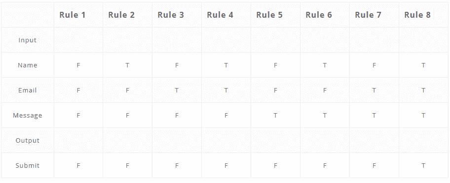
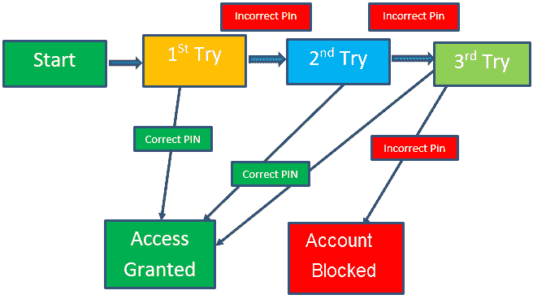

# 带有测试用例设计示例的软件测试技术

> 原文： [https://www.guru99.com/software-testing-techniques.html](https://www.guru99.com/software-testing-techniques.html)

## 什么是软件测试技术？

软件测试技术可帮助您设计更好的测试用例。 由于不可能进行详尽的测试； 手动测试技术有助于减少测试用例的数量，同时增加测试范围。 它们有助于确定否则难以识别的测试条件。

在本教程中，您将学习 5 种重要的软件测试技术：

*   [边界值分析（BVA）](#1)
*   [等价类分区](#2)
*   [基于决策表的测试。](#3)
*   [状态转换](#4)
*   [猜测错误](#5)

### 边值分析（BVA）

边界值分析基于对分区之间边界的测试。 它包括最大值，最小值，内部或外部边界，典型值和误差值。

通常可以看到，许多错误发生在定义的输入值的边界而不是中心。 它也被称为 BVA，它提供了一些选择测试用例，这些测试用例具有边界值。

这种黑匣子测试技术是对等价分区的补充。 该软件测试技术基于以下原理：如果系统对于这些特定值运行良好，那么它将对介于两个边界值之间的所有值都运行良好。

**边界值分析准则**

*   如果输入条件限制在值 x 和 y 之间，则测试用例应设计为值 x 和 y 以及值分别高于和低于 x 和 y。
*   如果输入条件是大量值，则应开发测试用例，该测试用例需要使用最小和最大数字。 在此，还将测试高于和低于最小值和最大值的值。
*   将准则 1 和 2 应用于输出条件。 它给出的输出反映了预期的最小值和最大值。 它还测试低于或高于该值。

**示例：**

```
Input condition is valid between 1 to 10

Boundary values 0,1,2 and 9,10,11
```

### 等价类分区

等效类分区允许您将测试条件集划分为应该视为相同的分区。 这种软件测试方法将程序的输入域划分为应设计测试用例的数据类别。

该技术背后的概念是，每个类别的代表值的测试用例等于对同一类别的任何其他值的测试。 它使您可以识别有效和无效的等效类。

**示例：**

输入条件在

```
 1 to 10 and 20 to 30
```

因此，有五个等效类

```
--- to 0 (invalid)
1 to 10 (valid)
11 to 19 (invalid)
20 to 30 (valid)
31 to --- (invalid)

```

您可以从每个类别中选择值，即

```
-2, 3, 15, 25, 45
```

### 基于决策表的测试。

决策表也称为因果表。 此软件测试技术用于响应输入或事件的组合的功能。 例如，如果用户输入了所有必填字段，则应启用提交按钮。

第一项任务是确定输出依赖于输入组合的功能。 如果组合的输入集很大，则将其分为较小的子集，这对管理决策表很有帮助。

对于每个功能，您都需要创建一个表并列出所有类型的输入及其相应输出的组合。 这有助于确定测试人员忽略的情况。

**以下是创建决策表的步骤：**

*   在行中征集输入
*   在栏中输入所有规则
*   用输入的不同组合填充表格
*   在最后一行中，根据输入组合记下输出。

**示例**：仅当最终用户输入了所有输入后，联系人表单中的提交按钮才启用。



### 状态转换

在状态转换技术中，输入条件的变化会更改被测应用程序（AUT）的状态。 这种测试技术允许测试人员测试 AUT 的行为。 测试人员可以通过依次输入各种输入条件来执行此操作。 在状态转换技术中，测试团队提供正负输入测试值以评估系统行为。

**状态转换指南：**

*   当测试团队针对一组有限的输入值测试应用程序时，应使用状态转换。
*   当测试团队想要测试被测应用程序中发生的事件序列时，应使用该技术。

**Example:**

在以下示例中，如果用户在前三次尝试中的任何一次输入中输入了有效密码，则该用户将能够成功登录。 如果用户在第一次或第二次尝试中输入了无效的密码，将提示用户重新输入密码。 当用户在<sup>到</sup>的时间输入错误 3 次时，该操作已执行，该帐户将被阻止。

### 状态转换图



在此图中，当用户提供正确的 PIN 码时，他或她将进入“访问许可”状态。 下表是根据上图创建的-

### 状态转换表

|  | **正确的 PIN 码** | **PIN 码错误** |
| **S1）启动** | **S5** | **S2** |
| **S2）1 次 <sup>st</sup> 尝试** | **S5** | **S3** |
| **S3）2 <sup>和</sup>尝试** | **S5** | **S4** |
| **S4）3 次<sup>次</sup>尝试** | **S5** | **S6** |
| **S5）授予访问权限** | **-** | **-** |
| **S6）帐户已被阻止** | **-** | **-** |

在上面给出的表中，当用户输入正确的 PIN 时，状态将转换为“授予访问权限”。 并且，如果用户输入了错误的密码，则他或她将进入下一个状态。 如果他第 3 次<sup>和</sup>做相同的时间，则他将进入帐户被阻止状态。

### 错误猜测

错误猜测是一种软件测试技术，它基于猜测代码中可能普遍存在的错误。 这是一种基于经验的技术，测试分析师可以使用他或她的经验来猜测测试应用程序中有问题的部分。

该技术计算了可能的错误或容易出错的情况的列表。 然后，测试人员编写一个测试用例以暴露那些错误。 为了基于这种软件测试技术设计测试用例，分析师可以利用过去的经验来确定条件。

**错误猜测准则：**

*   该测试应使用以前测试类似应用程序的经验
*   了解被测系统
*   了解典型的实施错误
*   记住以前遇到麻烦的地方
*   评估历史数据&测试结果

**结论**

*   软件测试技术使您可以设计更好的案例。 有五种主要使用的技术。
*   边界值分析正在分区之间的边界进行测试。
*   等效类分区允许您将测试条件集划分为应该视为相同的分区。
*   决策表软件测试技术用于响应输入或事件组合的功能。
*   在状态转换技术中，输入条件的变化会更改被测应用程序（AUT）的状态
*   错误猜测是一种软件测试技术，它基于猜测代码中可能普遍存在的错误。