# 使用 Python 的 Selenium Webdriver：示例教程

> 原文： [https://www.guru99.com/selenium-python.html](https://www.guru99.com/selenium-python.html)

Selenium 支持 [Python](https://www.guru99.com/python-tutorials.html) ，因此可以与 Selenium 一起用于测试。

*   与其他编程语言相比，Python 很容易，但冗长得多。
*   Python API 使您可以通过 Selenium 与浏览器连接。
*   Selenium 将标准的 Python 命令发送到不同的浏览器，尽管它们的浏览器设计有所不同。

您可以在不同的操作系统上为 Firefox，Chrome，IE 等运行 Python 脚本。

在本教程中，您将学习-

*   [什么是 Python？](#1)
*   [什么是硒？](#2)
*   [为什么在 Selenium 中选择 Python 而不是 Java](#3)
*   [如何在 Eclipse 中安装和配置 PyDev](#4)
*   [如何使用 Python 在 Selenium 中创建测试脚本](#5)

## 什么是 Python？

Python 是一种高级的面向对象的脚本语言。 它以用户友好的方式设计。 Python 使用简单的英文关键字，这很容易解释。 与其他任何编程语言相比，它的语法复杂性更低。

请参阅下表中的一些示例。

| **关键字** | **含义** | **用法** |
| 小精灵 | 否则 | Else if |
| 其他 | 其他 | 如果：X; elif：Y； 其他：J |
| 除 | 这样做，如果发生异常， | 除了 ValueError 外，a：打印一个 |
| 执行 | 作为 Python 运行字符串 | exec'打印“你好，世界！” |

## 什么是硒？

Selenium 是测试您的 Web 应用程序的工具。 您可以通过多种方式执行此操作，例如

*   允许它点击按钮
*   在结构中输入内容
*   浏览您的网站以检查是否一切正常，依此类推。

## 为什么在 Selenium 中选择 Python 而不是 Java

与 Selenium 一起使用 [Java](https://www.guru99.com/java-tutorial.html) 而不是 Python 的要点是，

1.  与 Python 程序相比，Java 程序的运行速度往往较慢。
2.  Java 使用传统花括号来开始和结束块，而 Python 使用缩进。
3.  Java 采用静态类型，而 Python 采用动态类型。
4.  与 Java 相比，Python 更简单，更紧凑。

## 如何在 Eclipse 中安装和配置 PyDev

PyDev 是 Eclipse 的 Python 开发环境。

**步骤 1）**进入 Eclipse Marketplace。 帮助>安装新软件

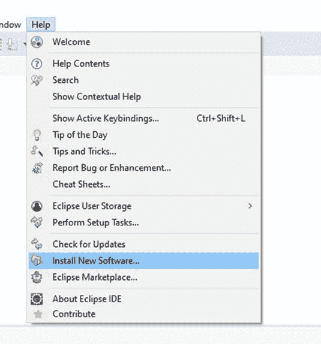

下一步是为 Eclipse 安装“ pydev IDE”。

**步骤 2）**在此步骤中，

1.  在“使用”中搜索“ http://pydev.org/updates”，然后
2.  选择所有列出的项目，然后单击两次 Next。
3.  接受许可协议，然后单击完成。

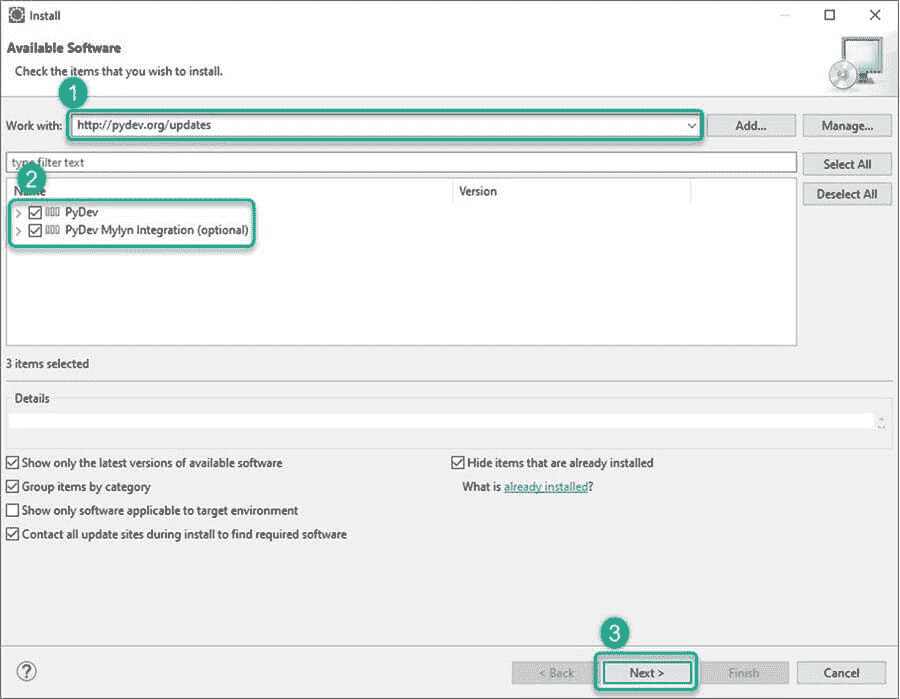

**步骤 3）**您可能会遇到安全警告，单击“仍然安装”。

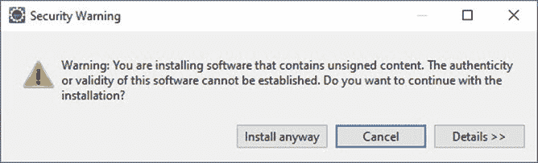

**步骤 4）**现在**，**，在此步骤中，您将设置首选项。 借助 preference 选项，您可以根据项目需要使用 Python。

转到窗口>首选项> PyDev >解释器> Python 解释器。

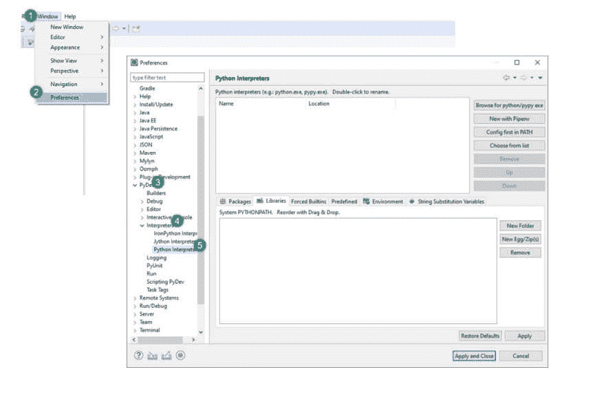

让我们设置默认的 Python 解释器。 就像您需要设置 Java 编译器以运行 Java 代码一样。 要更改解释器名称，请单击“浏览 python / pypy exe”按钮。

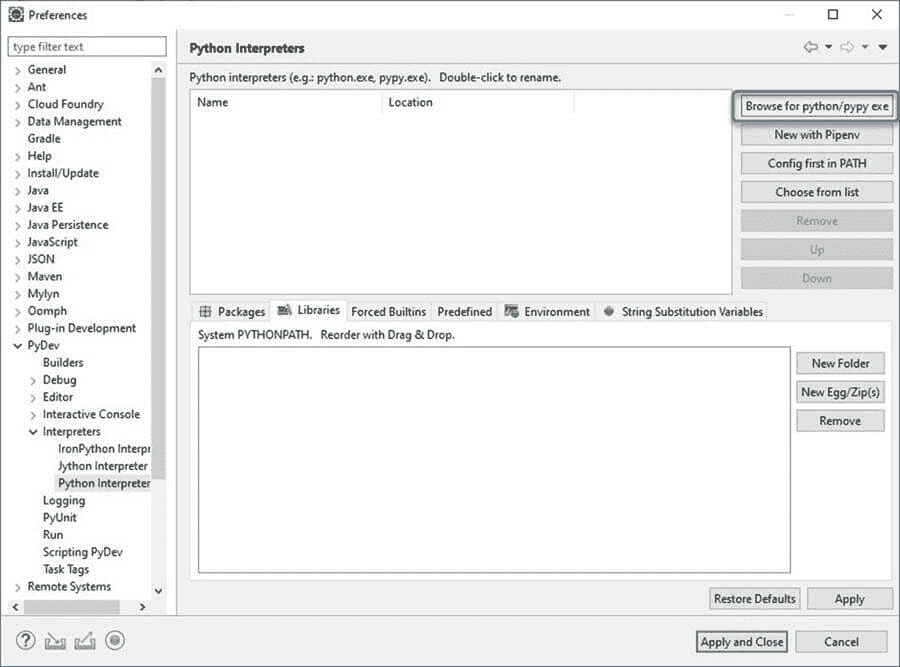

**步骤 5）**在此步骤中，提供 Python 的“解释器名称”和“ exe”文件路径。

1.  单击“浏览”，然后找到安装 python 的 python.exe。
2.  点击“确定”按钮。
3.  选择所有文件夹，然后单击确定
4.  单击“应用并关闭”。

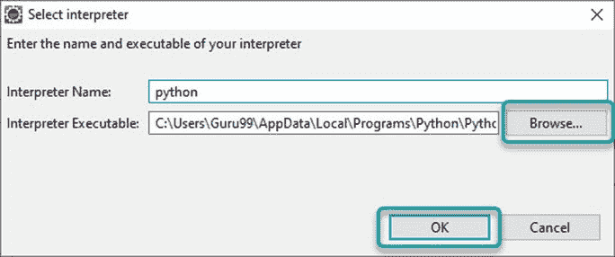

**步骤 6）**用 Python 创建一个新项目。 在这一步中

1.  右键单击“ PyDev 包资源管理器>新建”。
2.  选择其他选项。

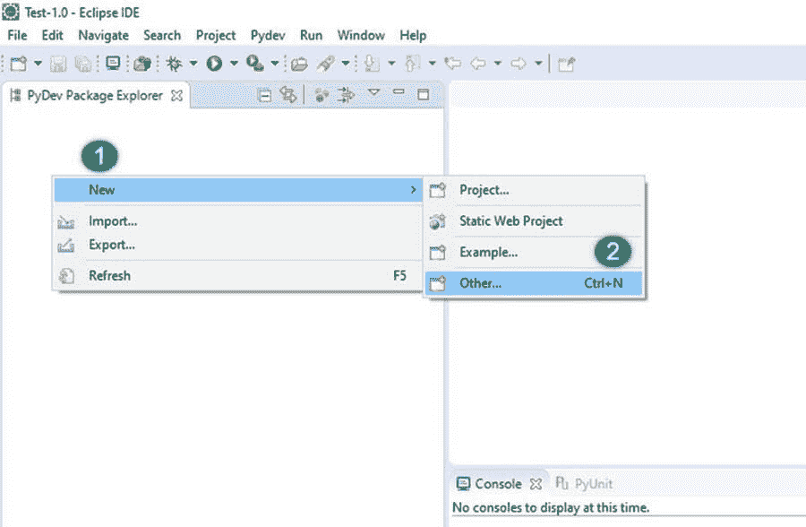

1.  选择“ PyDev > PyDev 项目”。
2.  按“下一步”按钮。

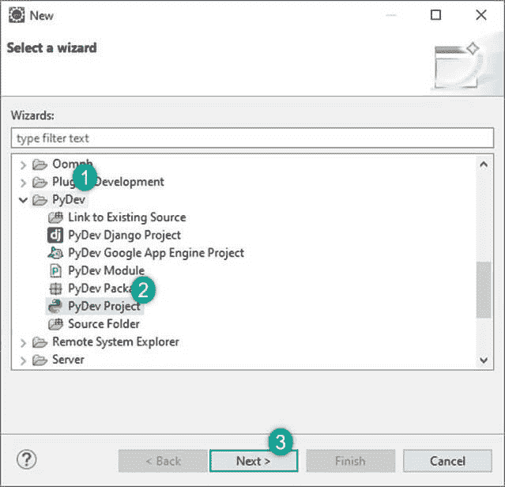

1.  为您的项目命名
2.  点击“完成”。

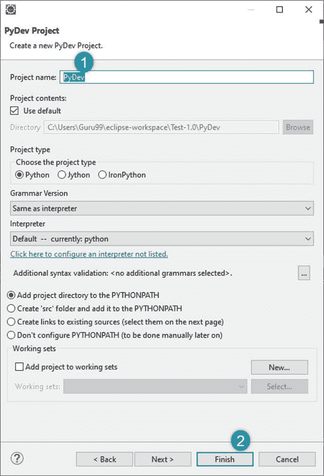

您可以看到新的 Python（PyDev）项目已创建。

**步骤 7）**在此步骤中，

创建“ PyDev 项目”后，您将创建一个新的 Python 包。

1.  右键单击 Project > New > PyDev 程序包。
2.  为您的软件包命名，然后单击完成。

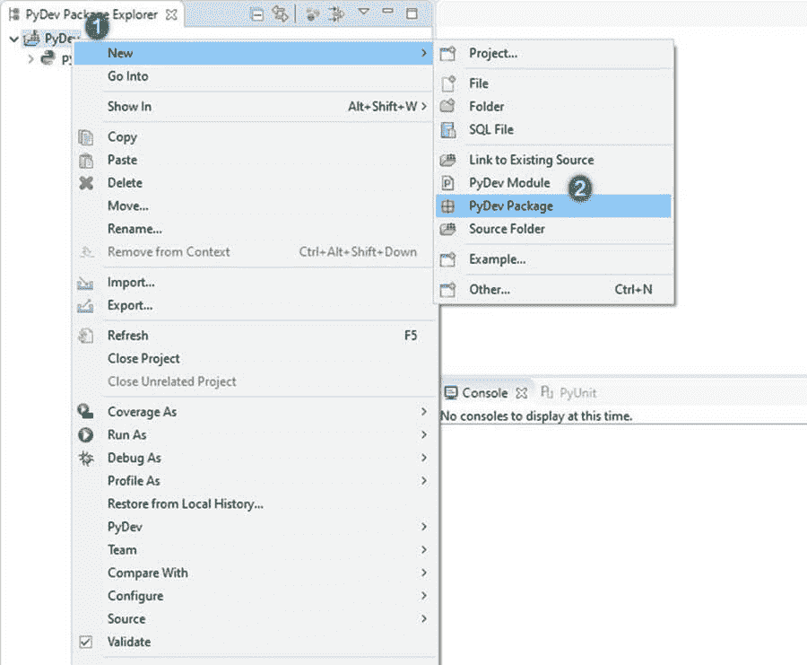

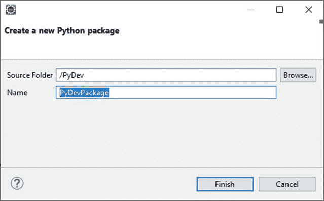

**步骤 8）**如果在下面的屏幕截图中看到，则会创建一个新的程序包。

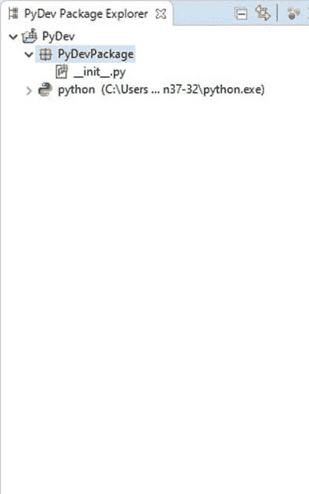

创建新程序包后，下一步是 createPyDev 模块。 该模块包含一些用于初始化的 Python 文件。 可以将模块中的这些文件或功能导入其他模块。 因此，无需重新编写程序。

**步骤 9）**创建一个新的 PyDev 模块。 右键单击包>新的> PyDev 模块。

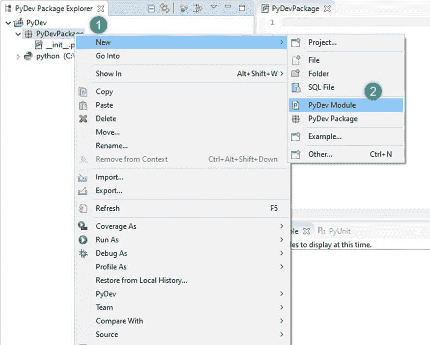

为模块命名，然后单击“完成”。

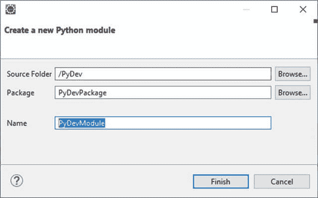

选择空模板，然后单击“确定”。

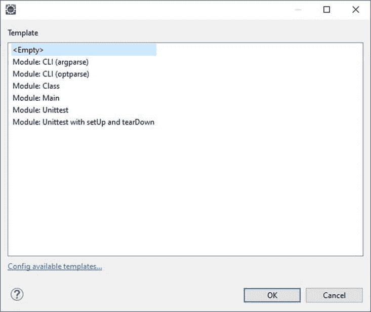

**步骤 10）**编写您的 Python 代码。


## 如何使用 Python 在 Selenium 中创建测试脚本

在此示例中，我们使用 Firefox 驱动程序对“ Facebook 登录页面”进行了自动化。

**示例 1：登录 Facebook**

```
from selenium import webdriver
from selenium.webdriver.common.keys import Keys
user_name = "YOUR EMAILID"
password = "YOUR PASSWORD"
driver = webdriver.Firefox()
driver.get("https://www.facebook.com")
element = driver.find_element_by_id("email")
element.send_keys(user_name)
element = driver.find_element_by_id("pass")
element.send_keys(password)
element.send_keys(Keys.RETURN)
element.close()

```

代码快照

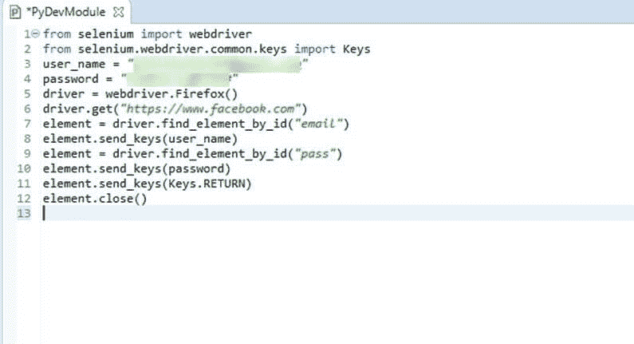

**代码**的说明

*   **代码行 1** ：从硒模块导入 webdriver
*   **代码行 2** ：从硒模块导入键
*   **代码行 3** ：用户是一个变量，我们将使用它来存储用户名的值。
*   **代码行 4** ：变量“密码”将用于存储密码值。
*   **代码行 5** ：在这一行中，我们通过使其作为对象来初始化“ FireFox”。
*   **代码行 6** ：“ driver.get 方法”将导航到 URL 给出的页面。 在将控制权返回到测试或脚本之前，WebDriver 将等待页面完全加载（即，“ onload”事件已释放）。
*   **代码行 7** ：在这一行中，我们找到了文本框中必须写入“电子邮件”的元素。
*   **代码行 8** ：现在，我们将值发送到电子邮件部分
*   **代码行 9** ：密码相同
*   **代码行 10** ：将值发送到密码部分
*   **代码行 11** ：插入值后，使用 element.send_keys（Keys.RETURN）按下 Enter 键
*   **代码行 12** ：关闭

**输出**

输入的用户名“ guru99”和密码的值。

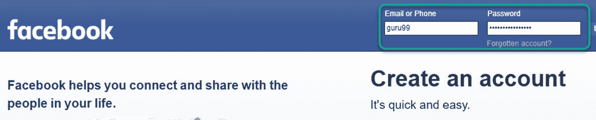

Facebook 页面将使用电子邮件和密码登录。 页面已打开（请参见下图）


**示例 2：登录 Facebook &检查标题**

在这个例子中

*   我们将打开一个登录页面。
*   填写必填字段“用户名”和“密码”。
*   检查页面标题

```
from selenium import webdriver
from selenium.webdriver.support.ui import WebDriverWait
# Step 1) Open Firefox 
browser = webdriver.Firefox()
# Step 2) Navigate to Facebook
browser.get("http://www.facebook.com")
# Step 3) Search & Enter the Email or Phone field & Enter Password
username = browser.find_element_by_id("email")
password = browser.find_element_by_id("pass")
submit   = browser.find_element_by_id("loginbutton")
username.send_keys("YOUR EMAILID")
password.send_keys("YOUR PASSWORD")
# Step 4) Click Login
submit.click()
wait = WebDriverWait( browser, 5 )
page_title = browser.title
assert page_title == "Facebook"

```

**代码**的快照

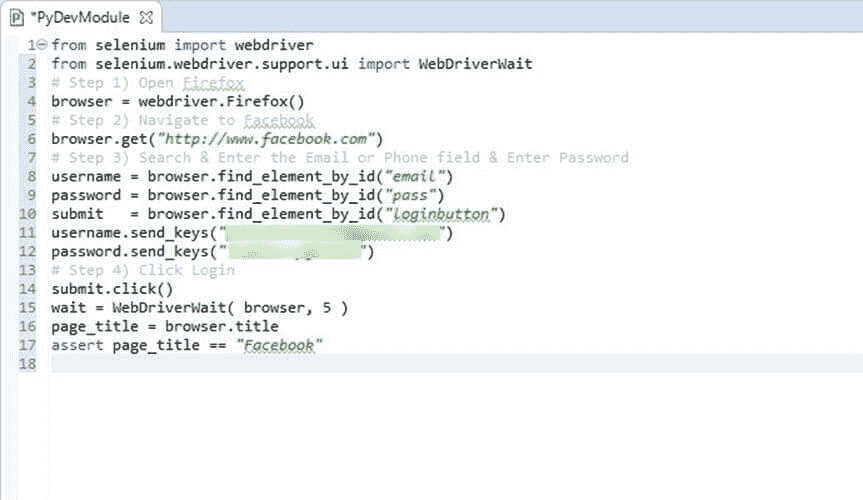

**代码说明：**

*   代码行 1-2：导入硒包
*   代码行 4：通过创建对象来初始化 Firefox
*   代码行 6：获取登录页面（Facebook）
*   代码行 8-10：获取用户名，密码输入框和提交按钮。
*   代码行 11-12：在用户名和密码输入框中输入数据
*   代码行 14：单击“提交”按钮
*   代码行 15：创建等待对象，其超时时间为 5 秒。
*   代码行 16：从“浏览器”对象捕获标题。
*   代码行 17：使用“ Facebook”测试捕获的标题字符串

**摘要**：

*   Selenium 是基于 Web 的开源自动化工具。
*   Selenium 使用 Python 语言进行测试。 它比任何其他编程语言都少得多冗长且易于使用
*   Python API 使您能够通过 Selenium 与浏览器连接
*   Selenium 可以将标准的 Python 命令发送到不同的浏览器，尽管它们的浏览器设计有所不同。