# 如何使用 IntelliJ IDE & Selenium Webdriver

> 原文： [https://www.guru99.com/intellij-selenium-webdriver.html](https://www.guru99.com/intellij-selenium-webdriver.html)

Intellij 是一个 IDE，可帮助您编写更好，更快的代码。 Intellij 可以用于 [Java](/java-tutorial.html) bean 和 Eclipse 的选项。

在本教程中，您将学习-

*   [什么是 IntelliJ？](#1)
*   [使用 Selenium Webdriver](#2) 进行 IntelliJ 的先决条件
*   [如何下载&安装 IntelliJ](#3)
*   [配置 IntelliJ 以支持硒](#4)
*   [范例](#5)

## 什么是 IntelliJ？

IntelliJ IDEA 是 Java 集成开发环境（IDE）。 它用于软件开发。 它由 JetBrains 开发。 它属于 apache2 许可的“社区版”和“专有商业版”。 它是可用的最好的 Java IDE。 它提供了高级代码导航和代码重构功能等功能。

使用 intelliJ 的优点是

*   它可以快速生成对象属性的 getter 和 setter 方法。
*   通过简单的击键，您可以将语句包装在 try-catch 或 if-else 块中。
*   IDE 提供了内置的打包工具，例如 gradle，SBT，grunt，bower 等。
*   可以从 IDE 直接访问 SQL，ORACLE，PostgreSQL，Microsoft [SQL](/sql.html) 服务器之类的数据库。
*   它支持各种语言，例如 Java，Javascript，Clojure 等。
*   它受 Windows，Linux 等不同操作系统的支持。可以从 JetBrains 官方网站下载。

## 使用 Selenium Webdriver 进行 IntelliJ 的先决条件

为此，我们需要满足以下一些先决条件。

*   IntelliJ
*   任何 Web 浏览器（最好是 Mozilla Firefox）
*   JDK（Java 开发套件）
*   Selenium .jar 文件

可从 [Selenium.org](https://www.selenium.dev/downloads/) 官方网站下载所需的 jar 文件。 下载后，该文件将.jar 文件提取到所需目录中。

## 如何下载&安装 IntelliJ

**步骤 1）**要下载 [IntelliJ](https://www.jetbrains.com/idea/download/) ，请访问 jetbrains 网站。 在这里，我们选择了“社区”版本。 您可以为移动，Web 和企业开发选择“最终”版本。

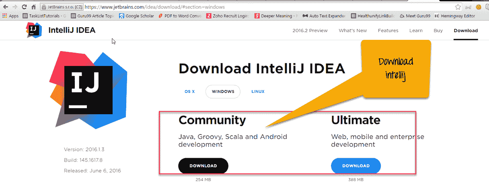

**步骤 2）**开始下载时，您会看到类似的消息。


**步骤 3）**在下一步中，将打开一个弹出窗口。 点击“运行”按钮。

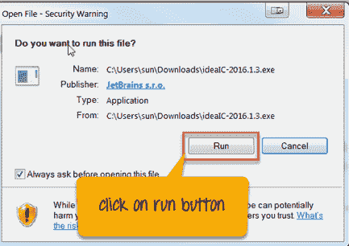

**步骤 4）**在此步骤中，单击设置向导中的“下一步”按钮。

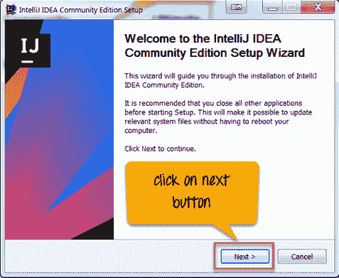

**步骤 5）**将打开另一个弹出窗口。 浏览您的目标文件夹，然后单击“下一步”按钮。

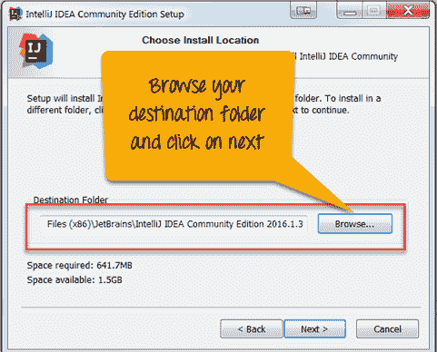

**步骤 6）**在此步骤中，

1.  标记该复选框– 32 位启动器
2.  根据您的要求标记语言复选框
3.  点击“下一步”按钮

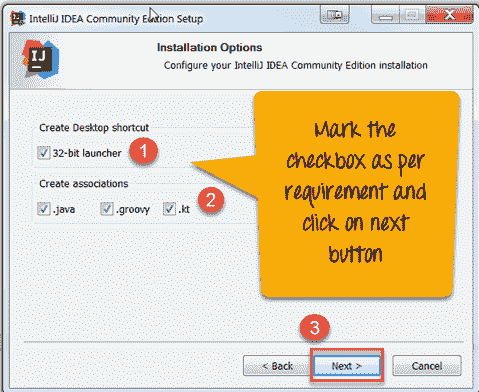

**步骤 7）**在下一步中，单击“安装”按钮。

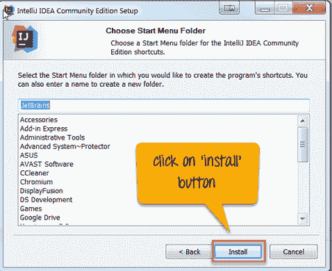

您可以看到 IntelliJ 的安装过程正在进行中。

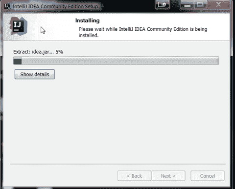

**步骤 8）**在此步骤中，

1.  要运行 IntelliJ，请选中该复选框，然后
2.  点击“完成”按钮

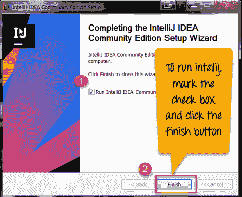

**步骤 9）**如果您已经在系统中安装了较旧版本的 IntelliJ。 您可以将设置从旧版本导入到新版本。 由于我们没有安装任何以前的版本。 我们将选择第二个选项。

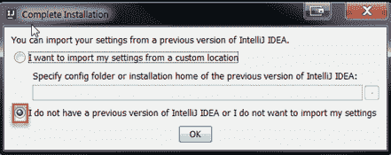

**步骤 10）**在上一步中单击“确定”按钮时，它将询问 Jetbrain 隐私政策协议。 点击“接受”按钮。


**步骤 11）**在此步骤中，您可以设置插件设置。

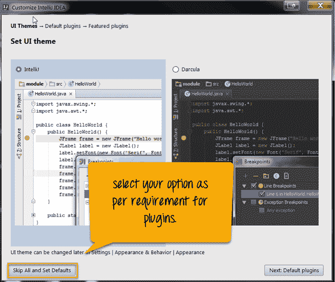

**步骤 12）**在下一步中，根据需要选择选项。 您将看到诸如创建新项目，导入项目，打开等选项。

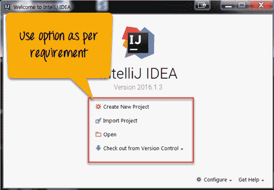

**步骤 13）**在此步骤中，

1.  从库中选择“项目”和“文件”，然后
2.  点击“确定”按钮

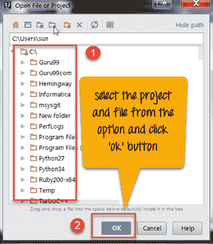

**步骤 14）**在这一步中，我们在上一步中选择的文件出现在项目目录中。

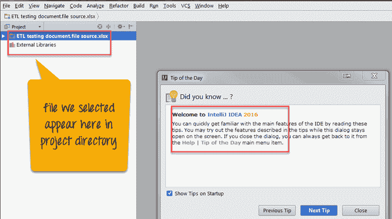

## 配置 IntelliJ 以支持硒

要支持 Selenium，您需要配置 IntelliJ。 为此，请遵循以下步骤。

**步骤 1）**启动 IntelliJ IDE 并创建一个新项目。 选择文件**->** 新**->** 项目

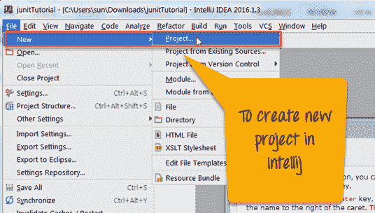

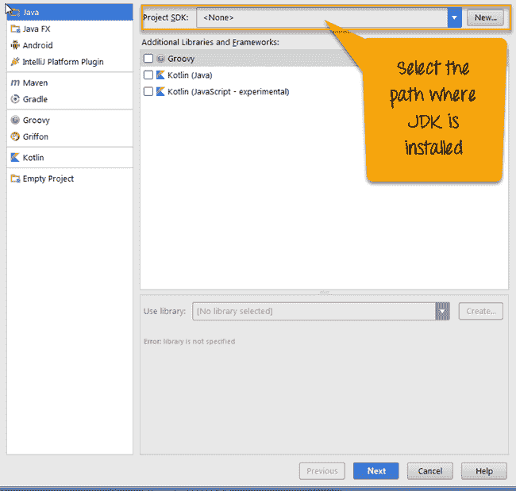

**步骤 2）**在上一步中，单击**->** 下一步。 将打开一个新屏幕。 在此屏幕上，输入项目名称。 在本例中，我们已将名称命名为 Selenium_Guru99。 然后单击**->** 完成。 您的项目已在 IntelliJ 中创建。

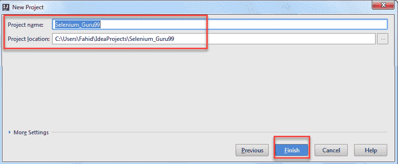

**步骤 3）**现在，您需要将 Selenium 的.jar 文件作为外部库添加到 intelliJ 中。

为此，请单击文件**->** 项目结构**->** ，在项目设置选项卡中查找模块**->** 依赖项 **->** 单击'+'号**->** 选择 JAR 或目录。

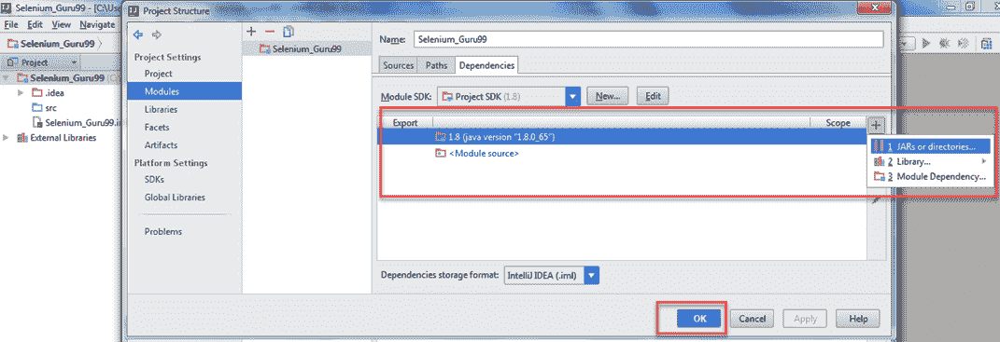

**步骤 4）**从下载后提取到的目录和子目录/ lib 中选择所有硒.jar 文件。

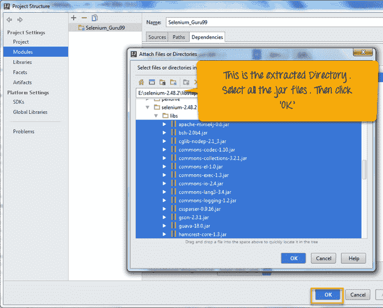

现在，您已成功将.jar 文件添加到 intelliJ 中。 如果您看到项目结构，那么您会注意到项目的/ src 目录为空。

**步骤 5）**右键单击/ src 目录**->** 新**->** Java 类。 您的项目结构如下所示。

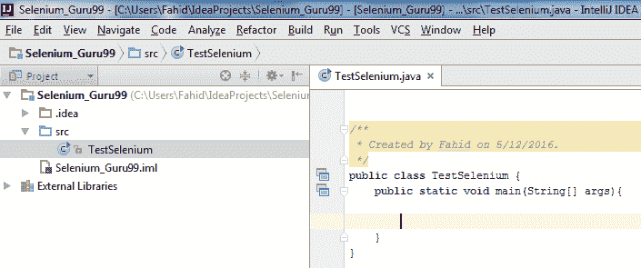

## 范例

我们将使用网站 [http://demo.guru99.com/](http://demo.guru99.com/) 。

在此测试方案中

*   我们将启动 URL
*   输入无效的电子邮件 ID
*   点击“提交”按钮
*   输出将如下所示-“电子邮件 ID 无效”


在以上结果中，您可以看到

*   当我们运行代码时，Firefox 实例已打开。
*   在代码级别，我们提供了一封电子邮件给 webelement。 这是一个输入字段（abc.gmail.com）。
*   当 Selenium Webdriver 单击“提交”按钮时，电子邮件 ID 由 guru99 网站验证。
*   正如我们所说，未注册的电子邮件将显示消息“电子邮件 ID 无效”。

以下是 test1 的 Java 代码。

```
import org.openqa.selenium.By;
import org.openqa.selenium.WebElement;
import org.openqa.selenium.firefox.FirefoxDriver;

public class TestSelenium {											
			public static void main(String[] args){        
				FirefoxDriver driver=new FirefoxDriver();        
				driver.get("http://demo.guru99.com/");        
				WebElement element=driver.findElement(By.xpath("//input[@name='emailid']"));        
				element.sendKeys("This email address is being protected from spambots. You need JavaScript enabled to view it.
	");            

				WebElement button=driver.findElement(By.xpath("//input[@name='btnLogin']"));         
			button.click();    
		}
}

```

**摘要**

*   IntelliJ IDEA 是 Java 集成开发环境（IDE）。
*   它确实具有高级代码导航和代码重构功能。
*   使用 intelliJ 的优点是
    *   快速生成 getter 和 setter 方法
    *   通过简单的按键操作，您可以将语句包装在 try-catch 或 if-else 块中
    *   它支持各种语言，例如 Java， [JavaScript](/interactive-javascript-tutorials.html) ，Clojure 等。
    *   它支持 Windows，Linux 等不同的操作系统
*   它带有内置的插件和打包工具
*   要与 Selenium 一起使用，您需要配置 IntelliJ

本文由 Fahid M 发表，并由 Jeegar M 编辑。