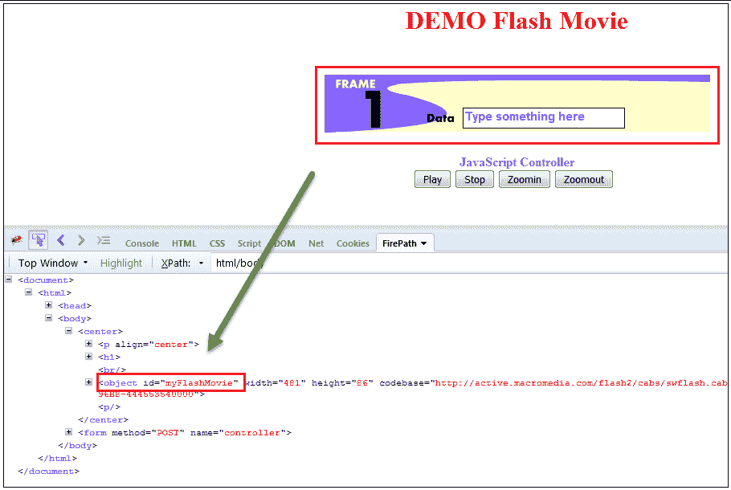
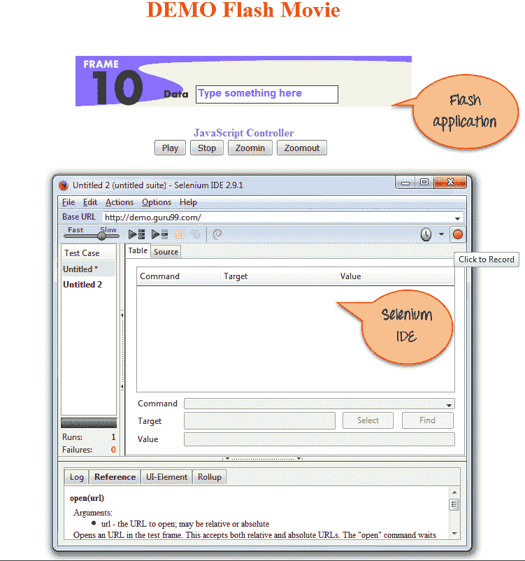
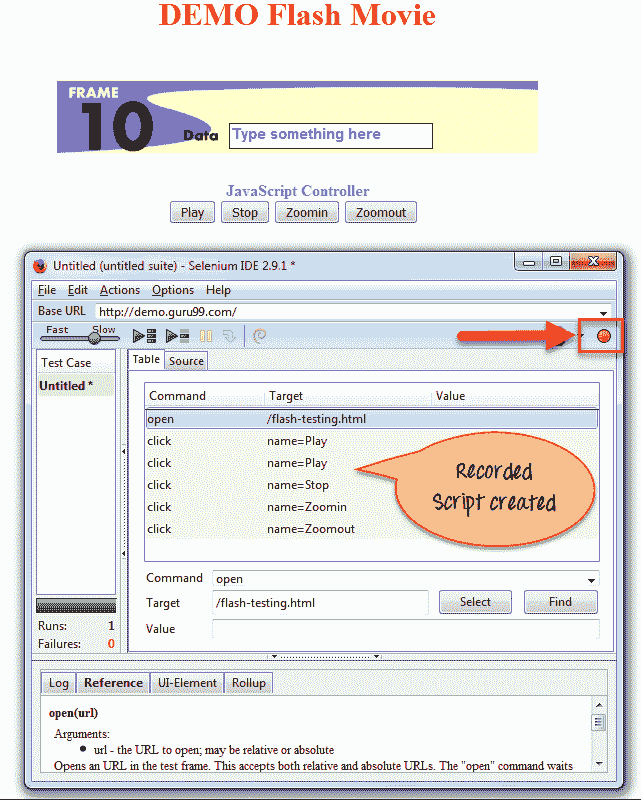
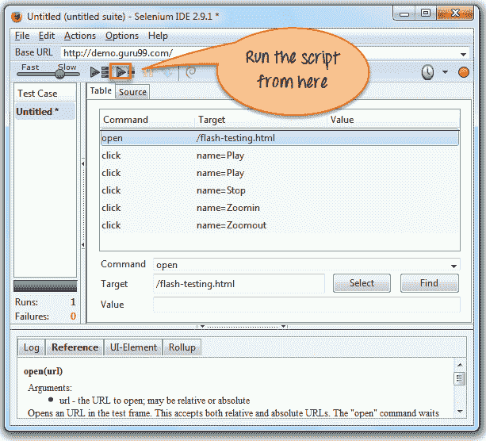
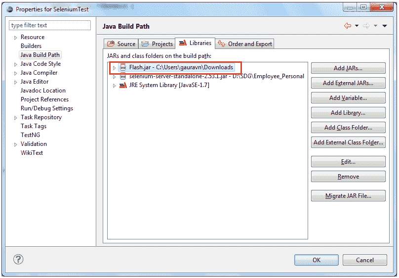
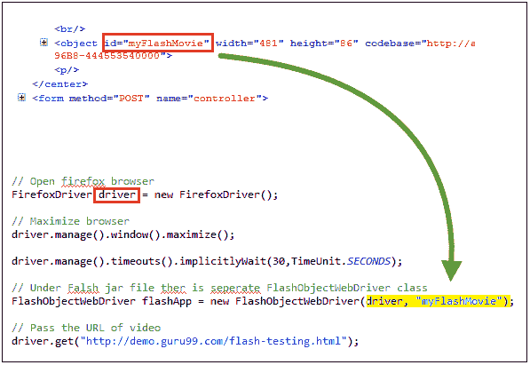
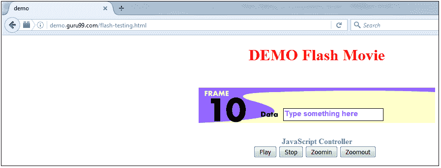

# 使用 Selenium WebDriver 进行闪存测试

> 原文： [https://www.guru99.com/flash-testing-selenium.html](https://www.guru99.com/flash-testing-selenium.html)

## 什么是闪存测试？

Flash Testing 是用于检查基于 Flash 的视频，游戏，电影等是否按预期工作的测试类型。 换句话说，测试闪存的功能称为**闪存测试。** Flash 是 Mircomedia 开发的非常流行的软件（现已由 Adobe 收购）。 它用于开发游戏，应用程序，基于图形的动画，电影，[移动](/mobile-testing.html)游戏，程序等。

在 Selenium Automation 中，如果通用定位符**未找到元素，例如 id，class，name 等**。 那么需要 **XPath** 才能在网页上找到一个元素以对该特定元素执行操作。 但是在 Flash 测试中， [XPath](/xpath-selenium.html) 无法访问 Flash 对象。 因此，需要 Flashwebdriver 对象才能在任何应用程序中查找 Flash 对象。


在这里，您将看到如何执行闪存[测试](/software-testing.html)以及如何使用 Selenium 进行闪存测试。

在本教程中，您将学习-

*   [什么是闪存测试？](#1)
*   [Flash 测试与其他元素](#2)有何不同
*   [如何获取 Flash 电影/ Flash 应用程序的 Flash 对象 ID](#3)
*   [如何使用 Selenium IDE 录制自动执行 Flash](#4)
*   [如何使用 Selenium Webdriver 自动执行 Flash。](#5)
*   [创建用于 Flash 测试的硒脚本。](#6)

## 闪存测试的前提条件

以下是测试 Flash 应用程序的要求

1.  Flash 应用程序。
2.  支持网页浏览器。
3.  Adobe Flash Player 插件。

**工具-**以下是在闪存测试中有用的测试工具。

1.  硒
2.  肥皂界面
3.  测试完成
4.  测试工作室等

Selenium 是非常流行的 Web 测试工具。 您可以跨不同的平台和不同的语言创建框架。 这是一个开放源代码工具，可以从官方网站下载。 它易于配置，使用和实施。

## Flash 测试与其他元素有何不同

*   **为什么很难捕获 Flash 对象？ 如何解决？**

Flash 是一种过时的技术。 由于 Flash 对象不同于 HTML，因此很难捕获它。 此外，Flash 是嵌入式 SWF 文件（小型 Web 格式）。 在移动设备上访问 Flash 对象也很困难。

与使用 SEO（搜索引擎优化）透视图开发 HTML 页面相比，开发 Flash 更加困难，因为搜索引擎无法完全读取 Flash。 但是，引入了诸如 HTML 5 之类的高级技术来克服诸如性能和安全性之类的问题。

*   **测试闪存应用程序的方式。**

Flash 应用程序通过两种方式进行测试：

*   **手册–** 您可以通过手动执行测试用例来测试 Flash 对象，因为它很容易测试。 修复错误后，请确保闪存可以按预期正常工作并提供注销。
*   **自动化–** 您可以使用任何自动化工具（如 Selenium，SoapUI，TestComplete 等）编写脚本并执行脚本。

*   **Flash 和其他元素之间的差异。**

如上所述，Flash 和其他元素之间的主要区别是 Flash 嵌入在 SWF 文件中，而其他元素嵌入在 HTML 文件中。 因此，与 Flash 相比，HTML 更易于捕获。

## 如何获取 Flash 电影/ Flash 应用程序的 Flash 对象 ID

在任何网页中，<对象>标签都用于任何嵌入式多媒体（如 Flash，ActiveX，视频等）。 它意味着在 HTML 文档中“嵌入”。 这个标签定义了一个容器，该容器嵌入在<对象/ >或< embed / >标签中，用于交互式内容或外部应用程序。 对象名称用于在网页上定位 Flash 对象。

例如，在下面的示例中，您可以看到 Flash 电影是在 HTML 文档或文件的“嵌入”标签中定义的。

**示例：**

```
/* Html page*/
<html>
<body marginwidth="0" marginheight="0">
<embed width="100%" height="100%" name="plugin" src="http://video/movie_play.swf" type="application/flash"/>
</body>
</html>

```

**使用对象 ID 查找 Flash 元素。**

您可以使用对象 ID 之类的 Flash 属性来定位 Flash 对象。 因此，您可以根据需要对其执行播放，停止等操作。

如上所述，无法使用 XPath 访问 Flash 对象。 因此，为了对这些对象执行任何操作，开发人员需要分配适当的对象 ID。

下面的屏幕显示为 Flash 分配了对象 ID“ MyFlashMovie”：



## 如何使用 Selenium IDE 录制自动执行 Flash

您也可以使用 Selenium IDE 自动执行闪存。

**步骤 1）**您需要打开 Flash 应用程序，然后打开 Selenium IDE，如下图所示：



**步骤 2）**现在，单击右侧的“录制红色按钮”并开始对 Flash 电影进行操作，然后您将找到录制的脚本，如下所示：



录制后，如果用户要执行脚本，则可以单击“绿色运行按钮”，如下屏幕所示。 Selenium IDE 将逐步执行脚本。



## 如何使用 Selenium Webdriver 自动执行 Flash。

您还可以使用 Selenium Web 驱动程序通过 Flashwebdriver 对象自动执行 Flash，然后调用一种方法来操作 Flash 对象。 您需要[下载 flashwebdriver jar 文件](https://drive.google.com/file/d/0B2SE8u2xJC83Y3VzVTRkRmRPek0/view)：

**步骤 1）**下载后，如下屏幕所示，将 jar 文件添加到您的项目中。



**步骤 2）**在 Flash jar 文件下，有一个单独的 flashobjectwebdriver 类。 如下面的屏幕所示，在您的硒脚本中实现 flashWebdriver“ myFlashmovie”。



添加 Web 驱动程序类“ MyFlashMovie”之后，您可以访问 Flash 对象。

**何时自动执行闪存测试**

通常，当不容易访问 Flash 对象时，您需要使 Flash 测试自动化。 测试结果将中止，因此无法测试 Flash 对象。

## 创建用于 Flash 测试的硒脚本。

**步骤 1）**您可以使用“ Guru99”动画影片来测试动画场景。

[http://demo.guru99.com/test/flash-testing.html](http://demo.guru99.com/test/flash-testing.html)



**步骤 2）**在 Selenium Eclipse 中编写脚本并执行。 下面的代码在执行时将执行以下操作

*   打开 Firefox 浏览器，
*   启动 guru99 Flash 网站，
*   播放 Flash 电影，然后
*   然后停止播放电影。

```
import org.openqa.selenium.firefox.FirefoxDriver;		
import Flash.FlashObjectWebDriver;		
public class Flash {				
    public static void main(String[] args) throws InterruptedException {								
  	// Open firefox browser		
	FirefoxDriver driver = new FirefoxDriver();			
  	// Maximize browser		
	driver.manage().window().maximize();		
  	// Under Flash jar file there is separate FlashObjectWebDriver class		
	FlashObjectWebDriver flashApp = new FlashObjectWebDriver(driver, "myFlashMovie");		
  	// Pass the URL of video		
	driver.get("http://demo.guru99.com/test/flash-testing.html");			
	Thread.sleep(5000);		
  	flashApp.callFlashObject("Play");			
  	Thread.sleep(5000);		
	flashApp.callFlashObject("StopPlay");			
	Thread.sleep(5000);		
	flashApp.callFlashObject("SetVariable","/:message","Flash testing using selenium Webdriver");
    System.out.println(flashApp.callFlashObject("GetVariable","/:message"));						
  }		
}
```

**步骤 3）**：执行以上脚本。

**输出：**执行上述脚本后，Flash 影片开始播放，然后停止等。

**闪存测试中的挑战**

*   自动化 Flash 应用程序是一个挑战。 要使 Flash 应用程序自动化，您可以使用 FlexMonkium，它是 Selenium IDE 的附加组件。
*   您可能会遇到使用 Selenium-Flexmonkium 集成启用记录/回放 Flex 应用程序的问题。 解决方案是用户需要仔细安装 Flex monkium 并将其集成到 Selenium IDE。 正确安装将启用记录以使 Flash 应用程序自动化。

**摘要：**

*   在 Flash 测试中，您需要检查 Flash 视频，游戏，电影等是否按预期工作。
*   您可以使用对象 ID 之类的 Flash 属性来定位 Flash 对象。 因此，您可以根据需要对其执行播放，停止等操作。
*   Flash 和其他元素之间的主要区别是 Flash 嵌入在 SWF 文件中，而其他元素嵌入在 HTML 文件中
*   当无法轻松访问 Flash 对象时，通常需要自动执行 Flash 测试。
*   在 Flash 测试中有用的工具是

1.  硒
2.  肥皂界面
3.  测试完成
4.  测试工作室等

*   自动化 Flash 应用程序是一个挑战。 要使 Flash 应用程序自动化，您可以使用 FlexMonkium，它是 Selenium IDE 的附加组件。