# 带有 Selenium 的 Apache ANT：完整教程

> 原文： [https://www.guru99.com/using-apache-ant-with-selenium.html](https://www.guru99.com/using-apache-ant-with-selenium.html)

## **什么是 Apache Ant？**

在创建完整的软件产品时，需要注意不同的第三方 API，它们的类路径，清理先前的可执行二进制文件，编译我们的源代码，执行源代码，创建报告和部署代码库等。如果完成了这些任务 一个接一个地手动操作，将花费大量时间，并且该过程容易出错。

这就是像 Ant 这样的构建工具的重要性。 它按 Ant 配置文件（通常为 build.xml）中提到的顺序存储，执行和自动化所有过程。


## 蚂蚁建造的好处

1.  Ant 会创建应用程序生命周期，即清理，编译，设置依赖项，执行，报告等。
2.  第三方 API 依赖性可以由 Ant 设置，即其他 Jar 文件的类路径由 Ant 构建文件设置。
3.  为端到端交付和部署创建了一个完整的应用程序。
4.  这是一个简单的构建工具，其中所有配置都可以使用 XML 文件完成，并且可以从命令行执行。
5.  由于配置与实际的应用程序逻辑分开，因此可以使您的代码清晰。

## 如何安装 Ant

在 Windows 中安装 Ant 的步骤如下

**步骤 1）**转到 [http://ant.apache.org/bindownload.cgi](http://ant.apache.org/bindownload.cgi) 从 [apache-ant-1.9.4-bin.zip 下载.zip 文件](http://apache.bytenet.in/ant/binaries/apache-ant-1.9.4-bin.zip)

[](http://apache.bytenet.in/ant/binaries/apache-ant-1.9.4-bin.zip)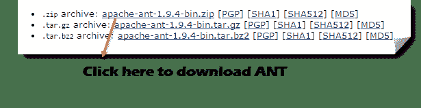 

**步骤 2）**解压缩该文件夹，然后转到路径并将其复制到未压缩文件夹的根目录

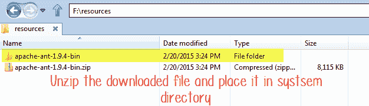 

**步骤 3）**转到开始->计算机->右键单击此处并选择“属性”，然后单击高级系统设置

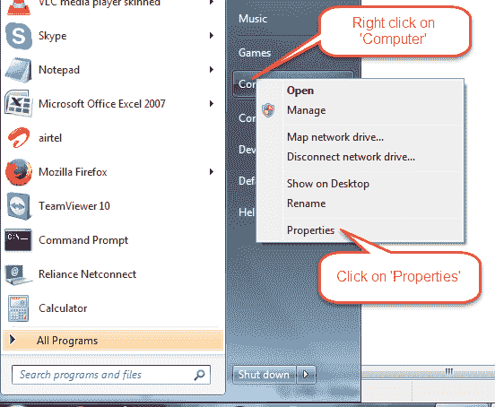 

**步骤 4）**将打开一个新窗口。 单击“环境变量...”按钮。

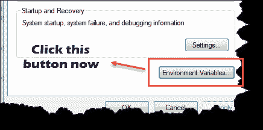 

**步骤 5）**单击“新建…”按钮，并将变量名称设置为“ ANT_HOME”，并将变量值设置为根 压缩文件夹的路径，然后单击确定。

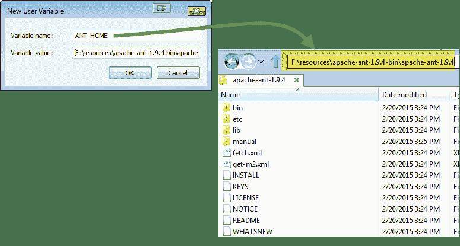 

**步骤 6）**现在从列表中选择“路径”变量，然后单击“编辑”并附加； ％ANT_HOME％\ bin。

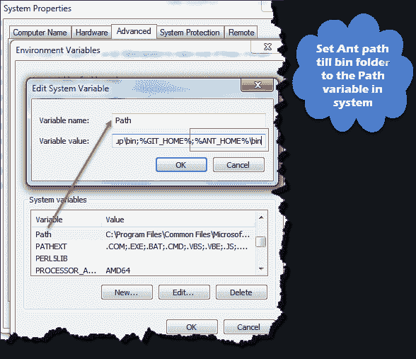 

一次重新启动系统，您现在就可以使用 Ant 构建工具。

**步骤 7）**要使用命令行检查 Ant 的版本：

Ant –version

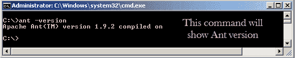 

## 了解 Build.xml

Build.xml 是 Ant 构建工具最重要的组件。 对于 [Java](/java-tutorial.html) 项目，此文件中以 XML 格式提到了所有与清理，设置，编译和部署相关的任务。 当我们使用命令行或任何 IDE 插件执行此 XML 文件时，写入该文件的所有指令都将按顺序执行。

让我们了解示例构建中的代码。XML

*   Project 标签用于提及项目名称和 basedir 属性。 basedir 是应用程序的根目录

    ```

    <project name="YTMonetize" basedir=".">

    ```

*   属性标记用作 build.XML 文件中的变量，以在后续步骤中使用

```

<property name="build.dir" value="${basedir}/build"/>
		<property name="external.jars" value=".\resources"/>
	<property name="ytoperation.dir" value="${external.jars}/YTOperation"/>
<property name="src.dir"value="${basedir}/src"/>

```

*   目标标签用作将按顺序执行的步骤。 Name 属性是目标的名称。 您可以在一个 build.xml 中包含多个目标。

    ```
    	<target name="setClassPath">
    ```

*   路径标记用于逻辑上捆绑位于公共位置

    ```
    		<path id="classpath_jars">
    ```

*   pathelement 标记会将路径设置为存储所有文件的公共位置的根。

    ```
    		<pathelement path="${basedir}/"/>
    ```

*   pathconvert 标记，用于转换路径内所有公共文件的路径 标记为系统的类路径格式

    ```
    <pathconvert pathsep=";" property="test.classpath" refid="classpath_jars"/>					
    ```

*   文件集标记，用于为我们的项目中的其他第三方 jar 设置类路径

    ```
    <fileset dir="${ytoperation.dir}" includes="*.jar"/>
    ```

*   Echo 标签用于在控制台上打印文本

```
<echo message="deleting existing build directory"/>

```

*   删除标签将清除给定文件夹

```
<delete dir="${build.dir}"/>            						
```

*   中的数据 mkdir 标记将创建一个新目录

```
	<mkdir dir="${build.dir}"/>

```

*   javac 标记，用于编译 Java 源代码并将.class 文件移动到 ew 文件夹

```
        <javac destdir="${build.dir}" srcdir="${src.dir}">
	<classpath refid="classpath_jars"/>
</javac>
```

*   jar 标签将从.class 文件创建 jar 文件。

```
	<jar destfile="${ytoperation.dir}/YTOperation.jar" basedir="${build.dir}">

```

*   清单标签将设置您的 执行的主要类别

```
<manifest>
		<attribute name="Main-Class" value="test.Main"/>
</manifest>		
```

*   'depends'属性，用于使一个目标依赖于另一个目标

```
	<target name="run" depends="compile">

```

*   java 标记将从编译目标部分

```
	<java jar="${ytoperation.dir}/YTOperation.jar" fork="true"/>									
```

中创建的 jar 中执行主要功能

## 使用 Eclipse 插件运行 Ant

要从 eclipse 运行 Ant，请转到 build.xml 文件->右键单击文件->运行为…->单击生成文件

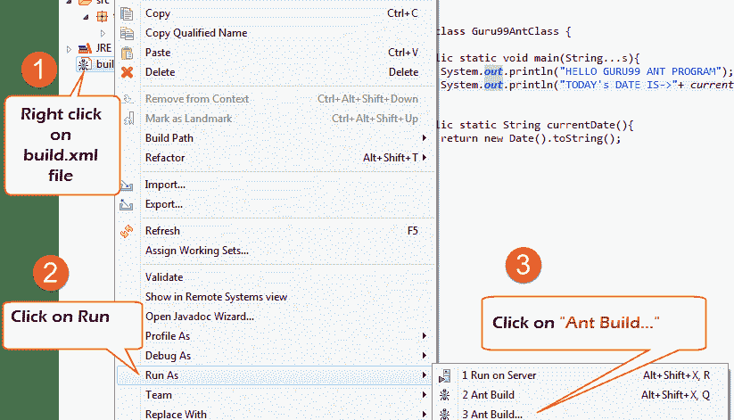

## 例：

我们将使用一个小示例程序，该程序将非常清楚地解释 Ant 功能。 我们的项目结构看起来像–

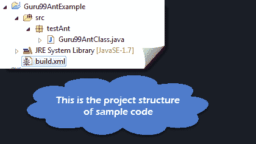

在此示例中，我们有 4 个目标

1.  设置外部罐子的类路径，
2.  清理以前编译的代码
3.  编译现有的 Java 代码
4.  运行代码

Guru99AntClass.class

```
package testAnt;		
import java.util.Date;		

public class Guru99AntClass {				
   public static void main(String...s){									       
		System.out.println("HELLO GURU99 ANT PROGRAM");					        
		System.out.println("TODAY's DATE IS->"+ currentDate() );					  
}		    		   
public static String currentDate(){					        
	return new Date().toString();					  
	}		
}		
```

Build.xml

```

<?xml version="1.0" encoding="UTF-8"	standalone="no"?>									
<!--Project tag used to mention the project name, and basedir attribute will be the root directory of the application-->	

<project name="YTMonetize" basedir=".">								
     <!--Property tags will be used as variables in build.xml file to use in further steps-->		

	<property name="build.dir" value="${basedir}/build"/>								
    <property name="external.jars" value=".\resources"/>								
		<property name="ytoperation.dir" value="${external.jars}/YTOperation"/>
<property name="src.dir"value="${basedir}/src"/>
<!--Target tags used as steps that will execute in sequential order. name attribute will be the name  of the target and < a name=OLE_LINK1 >'depends' attribute used to make one target to depend on another target -->		
	       <target name="setClassPath">					
			<path id="classpath_jars">						
				<pathelement	path="${basedir}/"/>					
			</path>				         
<pathconvert	pathsep=";"property="test.classpath" refid="classpath_jars"/>	
</target>				
	<target name="clean">						
		<!--echo tag will use to print text on console-->		
		<echo message="deleting existing build directory"/>						
		<!--delete tag will clean data from given folder-->		
		<delete dir="${build.dir}"/>						
	</target>				
<target name="compile" depends="clean,setClassPath">								
	<echo message="classpath:${test.classpath}"/>					
			<echo message="compiling.........."/>						
	<!--mkdir tag will create new director-->							
	<mkdir dir="${build.dir}"/>						
		<echo message="classpath:${test.classpath}"/>						
		<echo message="compiling.........."/>						
	<!--javac tag used to compile java source code and move .class files to a new folder-->		
	<javac destdir="${build.dir}" srcdir="${src.dir}">								
			<classpath refid="classpath_jars"/>						
	</javac>				
	<!--jar tag will create jar file from .class files-->		
	<jar	destfile="${ytoperation.dir}/YTOperation.jar"basedir="${build.dir}">								
	            <!--manifest tag will set your main class for execution-->		
						<manifest>				
							<attribute name="Main-Class" value="testAnt.Guru99AntClass"/>  
</manifest>		
</jar>				
    </target>				
	<target name="run" depends="compile">								
		<!--java tag will execute main function from the jar created in compile target section-->	
<java jar="${ytoperation.dir}/YTOperation.jar"fork="true"/>			
</target>				
	</project>				

```

[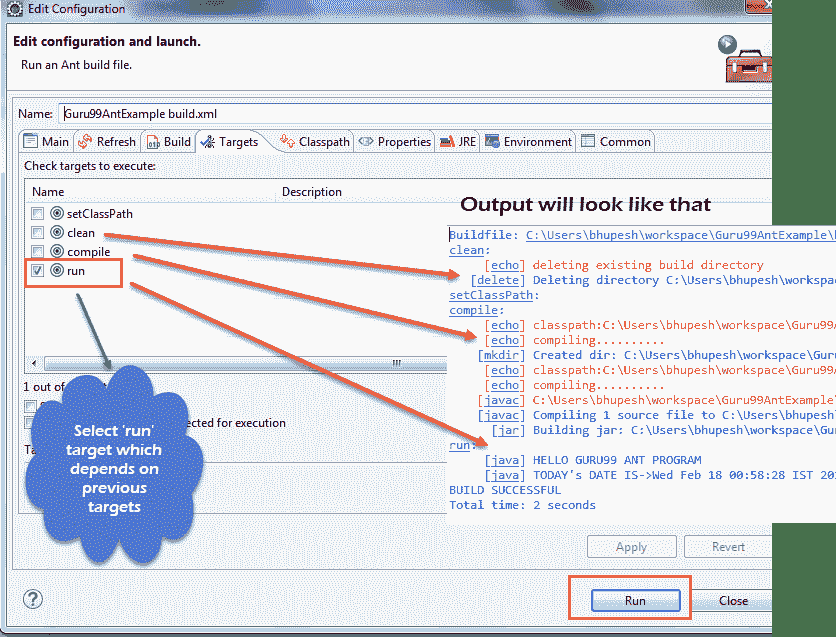 ](/images/1-2015/031015_1057_UsingApache11.png) 

## 如何使用 Ant 执行 TestNG 代码

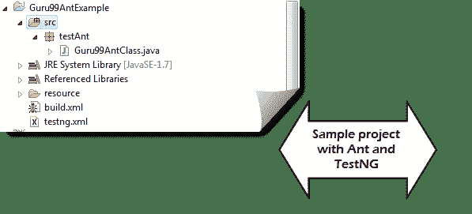

在这里，我们将使用 [Testng](/all-about-testng-and-selenium.html) 方法创建一个类，并在 build.xml 中设置用于[测试](/software-testing.html)的类路径。

现在执行 testng 方法，我们将创建另一个 testng.xml 文件，并从 build.xml 文件中调用该文件。

**步骤 1）**我们在程序包 **testAnt** 中创建了一个**“** **Guru99AntClass.class”**

Guru99AntClass.class

```
package testAnt;
import java.util.Date;
import org.testng.annotations.Test;		
public class Guru99AntClass {				
    @Test		  
	public void Guru99AntTestNGMethod(){					     
		System.out.println("HELLO GURU99 ANT PROGRAM");					
		System.out.println("TODAY's DATE IS->"+ currentDate() );					
	}		
	public static String currentDate(){					
		return new Date().toString();					
	}		
}		

```

**步骤 2）创建一个目标，以将此类加载到 Build.xml 中**

```
<!-- Load testNG and add to the class path of application -->
	<target name="loadTestNG" depends="setClassPath">
<!—using taskdef  tag we can add a task to run on the current project. In below line, we are adding testing task in this project. Using testing task here now we can run testing code using the ant script -->
		<taskdef resource="testngtasks" classpath="${test.classpath}"/>
</target>

```

**步骤 3）**创建 testng.xml

testng.xml

```
<?xml version="1.0"encoding="UTF-8"?>
<!DOCTYPE suite SYSTEM "http://testng.org/testng-1.0.dtd">
<suite name="YT"thread-count="1">
			<test name="GURU99TestNGAnt">
			<classes>
			   <class name="testAnt.Guru99AntClass">
	</class>
</classes>
</test>
</suite>

```

**步骤 4）**在 Build.xml 中创建目标以运行此 TestNG 代码

```
<target name="runGuru99TestNGAnt" depends="compile">
<!-- testng tag will be used to execute testng code using corresponding testng.xml file. Here classpath attribute is setting classpath for testng's jar to the project-->
	<testng classpath="${test.classpath};${build.dir}">
<!—xmlfileset tag is used here to run testng's code using testing.xml file. Using includes tag we are mentioning path to testing.xml file-->
	 <xmlfileset dir="${basedir}" includes="testng.xml"/>
</testng>				

```

步骤 5）完整的 Build.xml

```
<?xml version="1.0"encoding="UTF-8"standalone="no"?>
<!--Project tag used to mention the project name, and basedir attribute will be the root directory of the application-->
			<project name="YTMonetize" basedir=".">
		       <!--Property tags will be used as variables in build.xml file to use in further steps-->
			<property name="build.dir"value="${basedir}/build"/>
<!-- put  testng related jar in the resource  folder -->
	      <property name="external.jars" value=".\resource"/>
				<property name="src.dir" value="${basedir}/src"/>
<!--Target tags used as steps that will execute in  sequential order. name attribute will be the name
    of the target and 'depends' attribute used to make one target to depend on another target-->
<!-- Load testNG and add to the class path of application -->
         <target name="loadTestNG"depends="setClassPath">
				<taskdef resource="testngtasks"classpath="${test.classpath}"/>
		</target>
		<target name="setClassPath">
		       <path id="classpath_jars">
					<pathelement path="${basedir}/"/>
					<fileset dir="${external.jars}" includes="*.jar"/>
         </path>
        <pathconvert pathsep=";"property="test.classpath"refid="classpath_jars"/>
	</target>
	<target name="clean">
              <!--echo tag will use to print text on console-->
	               <echo message="deleting existing build directory"/>
               <!--delete tag will clean data from given folder-->
	               <delete				dir="${build.dir}"/>
			</target>
<target name="compile"depends="clean,setClassPath,loadTestNG">
	         <echo message="classpath:${test.classpath}"/>
	               <echo	message="compiling.........."/>
		       <!--mkdir tag will create new director-->
		        <mkdir dir="${build.dir}"/>
					<echo message="classpath:${test.classpath}"/>
			<echo message="compiling.........."/>
	<!--javac tag used to compile java source code and move .class files to a new folder-->
	        <javac destdir="${build.dir}"srcdir="${src.dir}">
	             <classpath refid="classpath_jars"/>
		</javac>
  </target>
<target name="runGuru99TestNGAnt"depends="compile">
		<!-- testng tag will be used to execute testng code using corresponding testng.xml file -->
			<testng classpath="${test.classpath};${build.dir}">
               <xmlfileset dir="${basedir}"includes="testng.xml"/>
	</testng>
</target>
</project>

```

**步骤 6）**输出

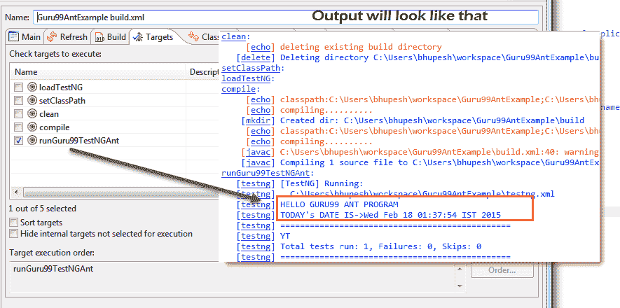

[下载上述文件](https://drive.google.com/uc?export=download&id=0B_vqvT0ovzHceGJQbi12Q013VlE)

## 带有 Selenium Webdriver 的 Ant：

到目前为止，我们已经了解到，使用 ANT，我们可以将所有第三方 jar 放在系统中的特定位置，并为我们的项目设置它们的路径。 使用这种方法，我们可以在一个地方设置项目的所有依赖项，并使它对编译，执行和部署更加可靠。

同样，对于我们使用硒的测试项目，我们可以在 build.xml 中轻松提及硒依赖性，并且不需要在应用程序中手动添加它的类路径。

因此，现在您可以忽略下面提到的为项目设置类路径的传统方法。

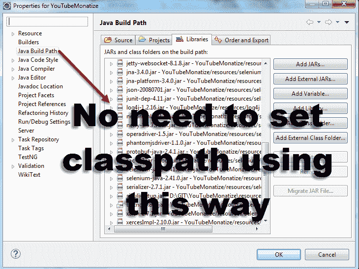

例：

我们将修改前面的示例

**步骤 1）**将属性 selenium.jars 设置为资源文件夹中与硒相关的 jar

```
		<property name="selenium.jars" value=".\selenium"/>

```

**步骤 2）**在目标 setClassPath 中，添加硒文件

```
<target name="setClassPath">
	        <path id="classpath_jars">
				<pathelement path="${basedir}/"/>	
				<fileset dir="${external.jars}" includes="*.jar"/>
	            <!-- selenium jar added here -->
  		            <fileset dir="${selenium.jars}" includes="*.jar"/>
         </path>		

```

**步骤 3）**完成 Build.xml：

```
<?xml version="1.0" encoding="UTF-8" standalone="no"?>

<!--Project tag used to mention the project name, and basedir attribute will be the root directory of the application-->
			<project name="YTMonetize" basedir=".">
                  <!--Property tags will be used as variables in build.xml file to use in further steps-->
				<property name="build.dir" value="${basedir}/build"/>
      <!-- put  testng related jar in the resource  folder -->
	       <property name="external.jars" value=".\resource"/>
<!-- put  selenium related jar in resource  folder -->
     <property name="selenium.jars" value=".\selenium"/>
			<property name="src.dir" value="${basedir}/src"/>
				<!--Target tags used as steps that will execute in  sequential order. name attribute will be the name 
of the target and 'depends' attribute used to make one target to depend on another target-->
      <!-- Load testNG and add to the class path of application -->
       <target name="loadTestNG" depends="setClassPath">
				<taskdef resource="testngtasks" classpath="${test.classpath}"/>
		</target>
<target name="setClassPath">
	        <path id="classpath_jars">
				<pathelement path="${basedir}/"/>
					<fileset dir="${external.jars}" includes="*.jar"/>
			<!-- selenium jar added here -->
	            <fileset dir="${selenium.jars}"includes="*.jar"/>
        </path>
   <pathconvert pathsep=";" property="test.classpath" refid="classpath_jars"/>
</target>
<target name="clean">
<!--echo tag will use to print text on console-->
               <echo message="deleting existing build directory"/>
	                <!--delete tag will clean data from given folder-->
		               <delete dir="${build.dir}"/>
				</target>
<target name="compile" depends="clean,setClassPath,loadTestNG">
         <echo message="classpath:${test.classpath}"/>
                <echo message="compiling.........."/>
        <!--mkdir tag will create new director-->
	        <mkdir dir="${build.dir}"/>
          			<echo message="classpath:${test.classpath}"/>
			<echo message="compiling.........."/>
	<!--javac tag used to compile java source code and move .class files to new folder-->
     <javac destdir="${build.dir}"srcdir="${src.dir}">
             <classpath refid="classpath_jars"/>
	</javac>
</target>
<target name="runGuru99TestNGAnt" depends="compile">
		<!-- testng tag will be used to execute testng code using corresponding testng.xml file -->
			<testng classpath="${test.classpath};${build.dir}">
               <xmlfileset dir="${basedir}" includes="testng.xml"/>
		</testng>
	</target>
</project>

```

**步骤 4）**现在，用新代码更改以前创建的类 Guru99AntClass.java。

在此示例中，我们使用硒的步骤为：

1.  转到 [http://demo.guru99.com/test/guru99home/](http://demo.guru99.com/test/guru99home/)
2.  逐一阅读所有课程链接
3.  在控制台上打印所有课程的超链接。

Guru99AntClass.java:

```
package testAnt;		
import java.util.List;		
import org.openqa.selenium.By;
import org.openqa.selenium.WebDriver;
import org.openqa.selenium.WebElement;	
import org.openqa.selenium.firefox.FirefoxDriver;
import org.testng.annotations.Test;

public class Guru99AntClass {

	@Test		
		public void Guru99AntTestNGMethod(){
	      WebDriver driver = new FirefoxDriver();	
		  driver.get("http://demo.guru99.com/test/guru99home/");
		  List<WebElement> listAllCourseLinks = driver.findElements(By.xpath("//div[@class='canvas-middle']//a"));							        
          for(WebElement webElement : listAllCourseLinks) {
			System.out.println(webElement.getAttribute("href"));
      	  }
		}
}		

```

**步骤 5）**成功执行后，输出将如下所示：

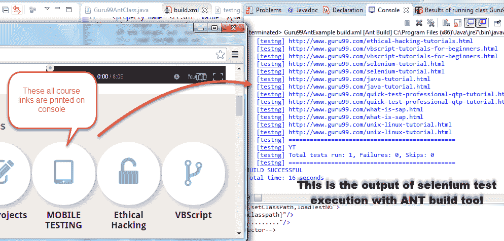

[下载以上示例文件](https://drive.google.com/uc?export=download&id=0B_vqvT0ovzHcOW9WZlprdy1nNWs)

**摘要：**

Ant 是 Java 的构建工具。

Ant 用于代码编译，部署，执行过程。

可以从 [Apache](/apache.html) 网站下载 Ant。

Build.xml 文件，用于使用 Ant 配置执行目标。

可以从命令行或合适的 IDE 插件（如 eclipse）运行 Ant。