# Selenium Webdriver 中的 XSLT 报告

> 原文： [https://www.guru99.com/xslt-report-selenium.html](https://www.guru99.com/xslt-report-selenium.html)

测试报告是 Selenium 框架最重要的功能。

在 Selenium 中， [Testng](/all-about-testng-and-selenium.html) 提供了其默认报告系统。 为了增强报告功能，进一步的 XSLT 报告很有帮助。 它还具有更加用户友好的 UI 和测试套件结果的详细描述。

在本教程中，您将学习–

*   [什么是 XSLT？](#1)
*   [生成 XSLT 报告的先决条件](#2)
*   [在硒](#3)中生成 XSLT 报告
*   [验证 XSLT 报告](#4)

## 什么是 XSLT？

XSLT 是一种用于将 XML 文档转换为浏览器使用的其他 XML 文档（XHTML）的语言。 XSLT 的完整形式是**可扩展样式表语言转换**。

使用 XSLT，我们可以自定义输出文件。 这可以通过在 XML 文件中添加/删除属性和元素来完成。 这有助于快速解释结果。 所有浏览器都支持 XSLT。 它使用 [XPath](/xpath-selenium.html) 浏览 XML 文档中的元素和属性。

以下是编程中最常用的 XSL 元素：

*   **< xsl：stylesheet >** 定义此文档为 XSLT 样式表文档。
*   **< xsl：if >** 用于对 XML 文件的内容进行条件测试。
*   **< xsl：template >** 用于构建模板。
*   **< xsl：apply-templates >** 用于将模板应用于元素。
*   **< xs1：选择>** 与< xs1 结合使用：否则，>和< xs1：>表示多种条件时使用。
*   **< xsl：for-each >** 用于选择指定节点的每个 XML 元素。
*   **< xsl：>的值**用于提取所选节点的值。
*   **< xsl：sort >** 用于对输出进行排序。

## 生成 XSLT 报告的先决条件

以下是生成 XSLT 报告的前提条件。

1）应该安装 ANT 构建工具（必须安装 ANT 才能使用 XSLT 报告功能）。 ANT 用于编译源代码并创建内部版本。 它也是非常可扩展的。 请参考此[链接](/using-apache-ant-with-selenium.html)以获取下载和安装 ANT 的步骤。

2）下载 XSLT 软件包。

3）应该由 TestNG 执行的 Selenium 脚本。

在此示例中，我们将在 Selenium Webdriver 中讨论 XSLT 报告。

## 在硒中生成 XSLT 报告

在这种情况下，我们将使用 Guru99 演示站点来说明“生成 XSLT”报告。

**场景**：您将针对以下场景自动生成 XSLT 报告

*   启动网络浏览器
*   启动 Firefox 并打开站点“ [http://demo.guru99.com/V4/”](http://demo.guru99.com/V4/)


*   登录到该应用程序。


*   Log out from the application.

    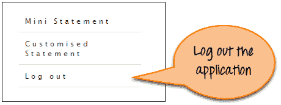

现在，我们将按照以下步骤在硒中生成 XSLT 报告。

**步骤 1）：**对于上述情况。 为 Guru99 演示站点创建并执行 Selenium 脚本。

```
import org.openqa.selenium.Alert;		
import org.openqa.selenium.By;		
import org.openqa.selenium.WebDriver;		
import org.openqa.selenium.firefox.FirefoxDriver;		
import org.testng.Assert;		
import org.testng.annotations.Test;		

public class Testing {				
    WebDriver driver= new FirefoxDriver();					

    @Test(priority=1)			
    public void Login() 					
    {		
        //Launching the Site.		
        driver.get("http://demo.guru99.com/V4/");					

        //Login to Guru99 		
        driver.findElement(By.name("uid")).sendKeys("mngr34926");							
        driver.findElement(By.name("password")).sendKeys("amUpenu");							
        driver.findElement(By.name("btnLogin")).click();					
        //Verifying the manager home page		
        Assert.assertEquals(driver.getTitle(),"Guru99 Bank Manager HomePage" );					
    }		

    @Test(priority=2)			
    public void verifytitle()					
    {		
        //Verifying the title of the home page		
        Assert.assertEquals(driver.getTitle(),"Guru99 Bank Manager HomePage" );					
        }		

    @Test(priority=3)			
    public void Logout()					
    {		
        driver.findElement(By.linkText("Log out")).click();					
        Alert alert=driver.switchTo().alert();			
        alert.accept();		
        //Verifying the title of the logout page		
        Assert.assertEquals(driver.getTitle(),"Guru99 Bank Home Page" );					
    }		
}	

```

**步骤 2）：**从此[链接](https://drive.google.com/folderview?id=0B5v_nInLNoquV1p5YWtHc3lkUkU&usp=sharing_eid&ts=5731a400)下载 XSLT 报告包：

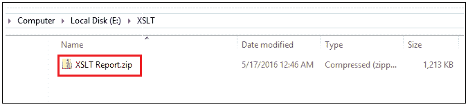

解压缩上面的文件夹，您将获得以下项目：

*   build.xml
*   testng-results.xsl

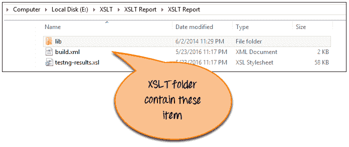

**步骤 3）：**解压缩文件夹并复制所有文件，然后粘贴到项目主目录中，如下图所示。

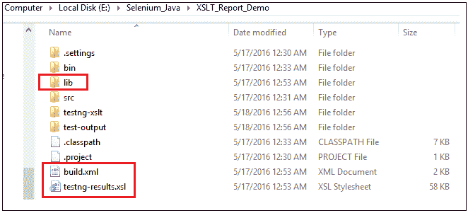

**步骤 4）：**在此步骤中，从 eclipse 运行 build.xml 文件，如下所示：

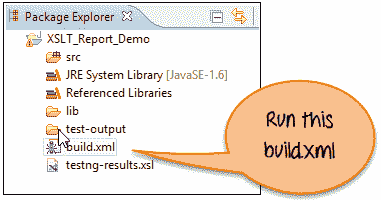

右键单击 build.xml，然后单击“以 Ant 形式运行”。

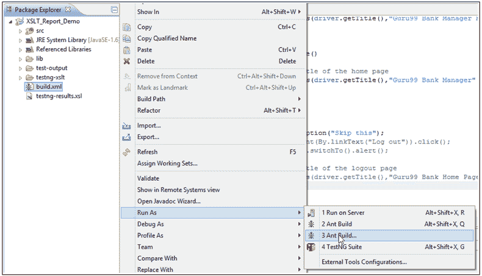

然后将打开一个新窗口。 现在选择选项“ generateReport”。

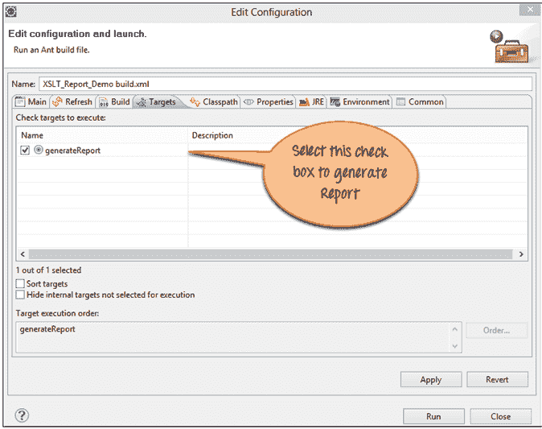

单击运行按钮。 它应该生成报告。

## 验证 XSLT 报告

一旦构建成功并移至项目主目录。 您会找到 **testng-xslt** 文件夹。

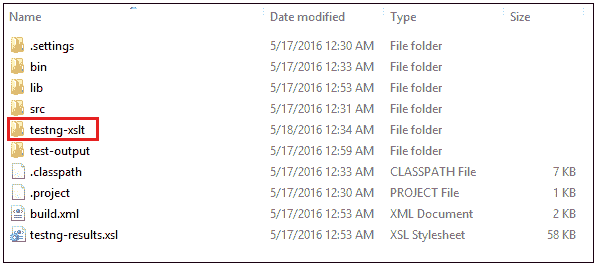

在此文件夹中，您将找到 **index.html** 文件，如下所示：

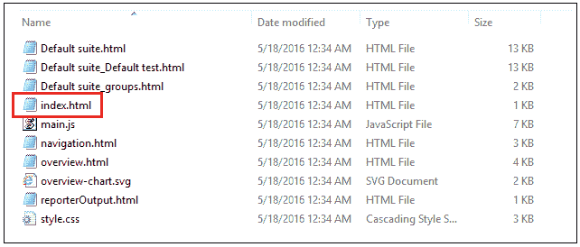

现在，在支持 javascript 的任何浏览器（如 Firefox 或 Chrome）中打开此 HTML 文件。 您将在以下屏幕中找到报告。 饼图报告更清楚地表示测试状态。 过滤功能允许用户按照设置的标准过滤结果。

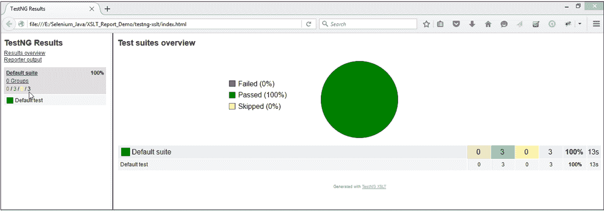

您会发现饼图显示通过，未通过和跳过的测试的百分比。

要以常规格式显示结果，请单击窗格左侧的**默认套件**。 它应该显示每个测试的详细信息，如以下屏幕所示：

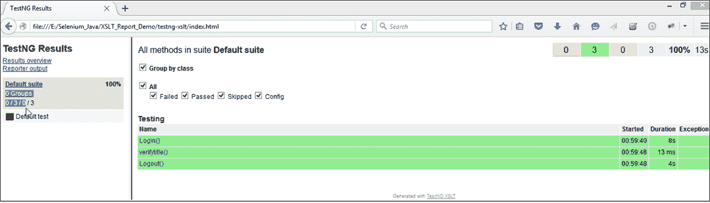

现在，我们强制进行测试通过，失败和跳过。

要查看测试结果的每种类型的报告，我们需要对以下方法进行一些更改。

1.  **verifytitle（）**：在声明中，我们传递了错误的预期页面标题。 执行代码时，它与预期的标题不匹配。 因此使测试失败。
2.  **Logout（）**：在这种方法中，我们通过使用 skipexception 强制跳过测试。 这样，当执行代码时，此方法将被跳过。

这样，我们试图在饼图的帮助下显示 XSLT 报告。 它将显示通过，失败和跳过测试的测试结果。

```
@Test(priority=2)		
    public void verifytitle()					
    {		
    	//Verifying the title of the home page		
    	Assert.assertEquals(driver.getTitle(),"Guru99 Bank Manager" );					
    }

```


```
@Test(priority=3)		
    public void Logout()					
    {		
        throw new SkipException("Skip this");			

    }

```


现在，我们对每种结果状态（即通过，失败和跳过）进行一次测试。

执行完脚本和 build.xml 之后。 验证 XSLT 报告，如以下屏幕所示：

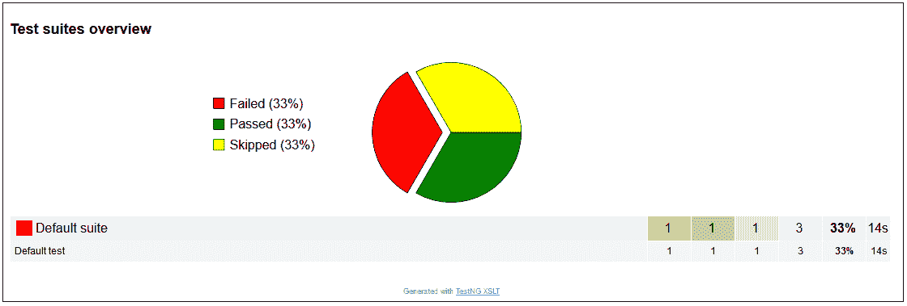

测试报告是更人性化的报告，易于理解。 您还可以通过选择以下屏幕中的复选框来过滤结果。

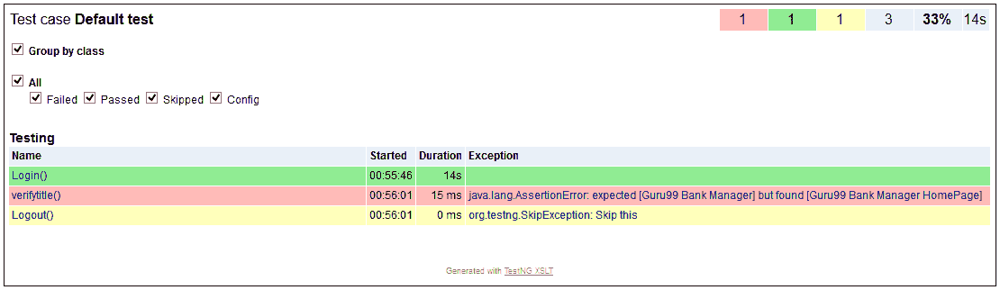

**注意**：在屏幕快照中，“ config”选项显示已完成配置的测试。 在大型项目中，有很多配置代码。 因此通常在大型项目中使用。

**摘要：**

需要 XSLT 报告以非常用户友好的方式增强 TestNG 报告功能。

*   XSLT 代表可扩展样式表语言转换。
*   ANT build 的下载和安装参考给定的链接。
*   在 selenium 中生成 XSLT 报告，并从 eclipse 中执行 build.xml。
*   验证来自项目文件夹的 XSLT 报告。
*   验证每种结果状态的 XSLT 报告。