# Github 与 Selenium 集成：完整教程

> 原文： [https://www.guru99.com/selenium-github.html](https://www.guru99.com/selenium-github.html)

### 什么是 GitHub？

Git Hub 是一个协作平台。 它建立在 git 之上。 它允许您保留项目的本地和远程副本。 您可以在团队成员中发布它的项目，因为他们可以使用它并从那里对其进行更新。

**将 Git Hub 用于硒的优势。**

*   当多个人在同一个项目上工作时，他们可以更新项目详细信息并同时通知其他团队成员。
*   Jenkins 可以帮助我们从远程存储库中定期构建项目，这可以帮助我们跟踪失败的构建。

在本教程中，您将学习

*   [Selenium 和 github 集成的先决条件](#6)
*   [Git 二进制文件安装](#1)
*   [Jenkins Git 插件安装](#2)
*   [使用 GitHub 插件设置我们的 Eclipse](#3)
*   [在 Git](#4) 上构建存储库
*   [在 Git Hub 中使用硒的测试示例。](#5)

### Selenium 和 github 集成的先决条件

在开始 selenium 和 git hub 集成之前，我们需要安装以下组件。

1.  Jenkins 安装。
2.  Maven 安装。
3.  Tomcat 安装。

您可以在以下链接中找到此安装步骤：

1）Maven 和 Jenkins 安装指南（ [https://www.guru99.com/maven-jenkins-with-selenium-complete-tutorial.html](/maven-jenkins-with-selenium-complete-tutorial.html) ）

2）Tomcat 安装指南（ [https://www.guru99.com/apache.html](/apache.html) ）

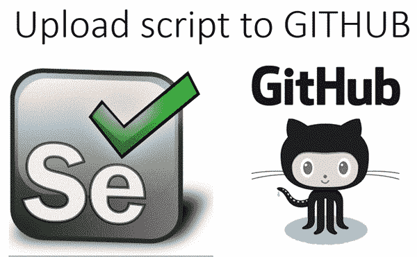

## Git 二进制文件安装

现在让我们开始安装“ Git Binaries”。

**步骤 1）**启动浏览器并导航到 URL- https://git-scm.com/

**步骤 2）**下载最新的稳定版本。

**步骤 3）**单击 Windows 的下载文件下载后，我们就可以开始安装了。

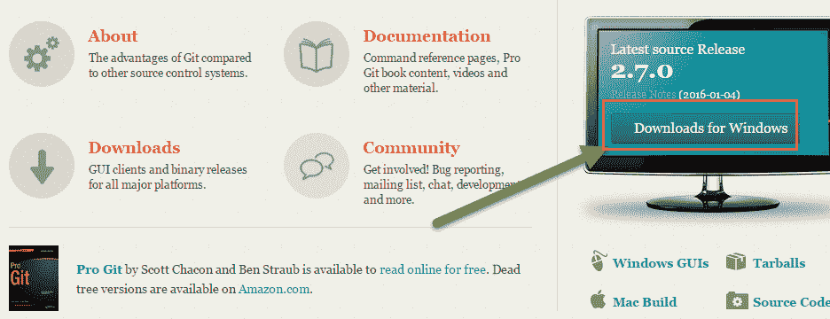

**步骤 4）**转到下载位置或图标并运行安装程序。

**步骤 5）**单击“欢迎”和“通用”许可证。

**步骤 6）**在 git 设置向导中单击“下一步”按钮

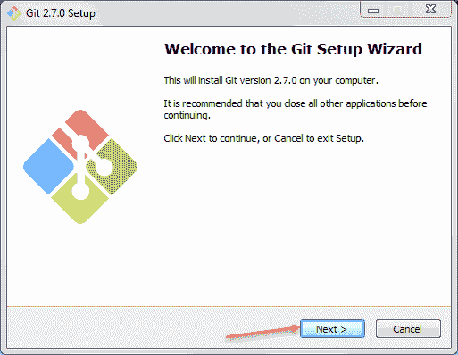

**步骤 7）**阅读 GNU 通用公共许可证，然后单击下一步

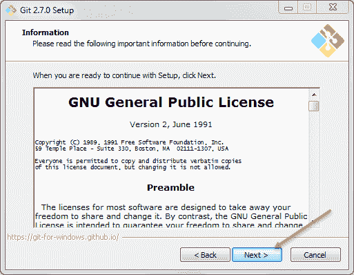

将会弹出另一个窗口，

**步骤 8）**在此步骤中，

1.  选择要安装“ Git Binaries”的目录，然后
2.  点击下一个按钮

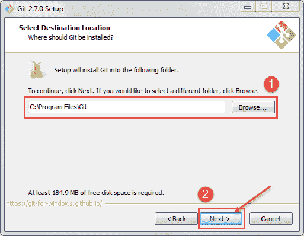

**步骤 9）**选择要安装的组件，然后单击下一步

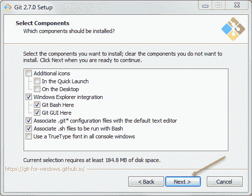

**步骤 10）**如果要为 Git 创建开始菜单文件夹，请保留默认设置，然后单击下一步。

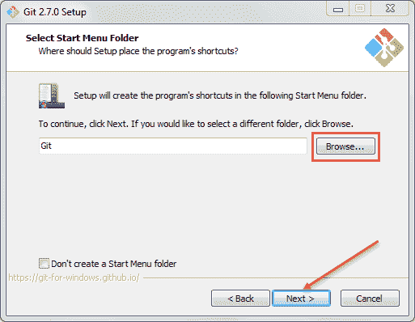

**步骤 11）**在此步骤中，

1.  从 Windows 命令提示符中选择 Use Git 从命令行运行 Git，然后
2.  点击下一步。

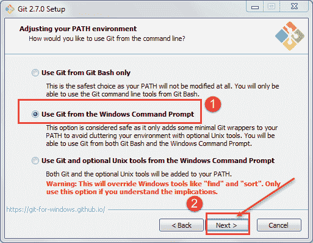

保留默认设置，然后单击下一步进行安装。

**步骤 12）**在此步骤中，

1.  选择 Use Open SSH。它将帮助我们从命令行执行命令，并设置环境路径。
2.  单击下一步按钮。

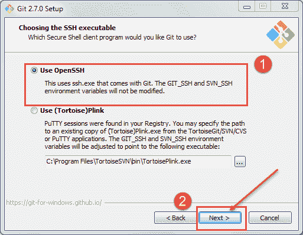

**步骤 13）**在此步骤中，

1.  选择“签出 Windows 样式，提交 Unix 样式的行尾”。（git hub 如何处理文本文件中的行尾）。
2.  单击下一步按钮。

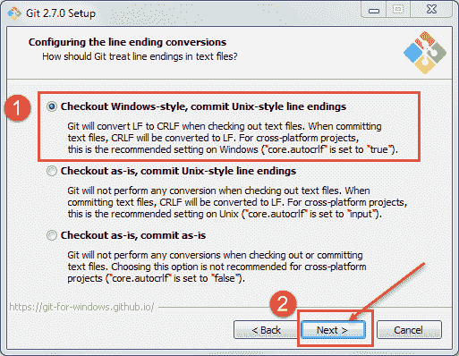

**步骤 14）**在此步骤中，

1.  选择 Use MinTTY 是 Git Bash 的 MSys2 的默认终端
2.  点击下一个按钮

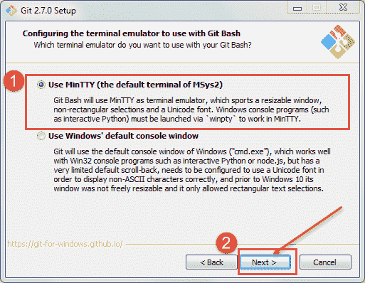

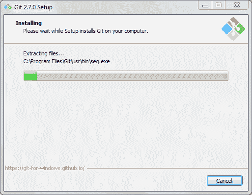

成功安装 git 后，即可访问 git。

打开命令提示符，然后键入“ git”，然后单击“ Enter”。如果您看到以下屏幕，则表示已成功安装

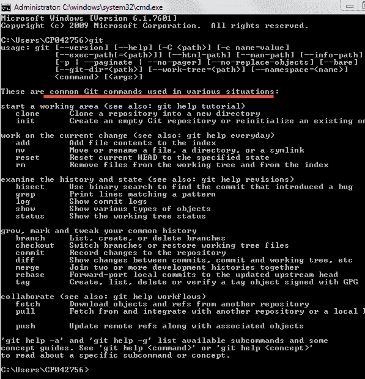

## Jenkins Git 插件安装

现在让我们开始安装 Jenkins Git 插件。

**步骤 1）**启动浏览器并导航到您的 Jenkins。

**步骤 2）**单击管理詹金斯。

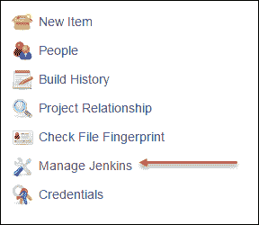

**步骤 3）**单击管理插件，它将打开另一个窗口

**步骤 4）**单击可用 TAB

**步骤 5）**在此步骤中，

1.  选择 GitHub 插件，然后
2.  单击立即下载并在重启后安装按钮。

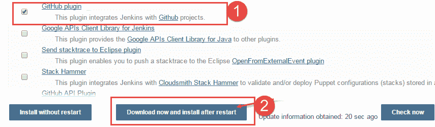

现在它将安装以下插件。

安装完成后。 通过调用“ shutdown.bat”文件重新启动 Tomcat 服务器

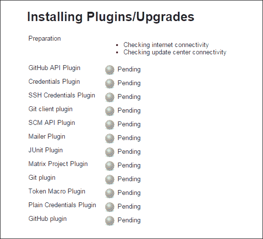

重新启动 tomcat 和 Jenkins 之后，我们可以看到插件已安装在“已安装” TAB 中。

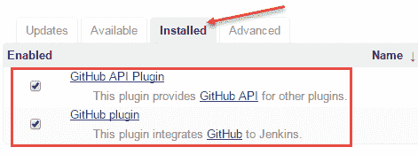

## 使用 GitHub 插件设置我们的 Eclipse

现在，让我们安装 Eclipse 的 GitHub 插件。

EGit 插件位置[的 URI https://download.eclipse.org/egit/updates/](https://download.eclipse.org/egit/updates/)

**步骤 1）**启动 Eclipse，然后

1.  点击帮助按钮，然后
2.  点击安装新软件

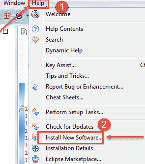

**步骤 2）**单击我们的安装新软件，将打开以下屏幕。 现在点击添加

**步骤 3）**在此步骤中，

1.  输入名称“ EGIT”，然后
2.  输入位置 [https://download.eclipse.org/egit/updates/](https://download.eclipse.org/egit/updates/) ，然后
3.  单击确定。

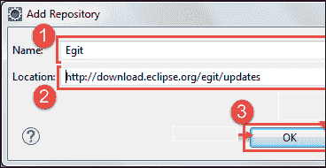

**步骤 4）**然后单击全选，然后单击下一步

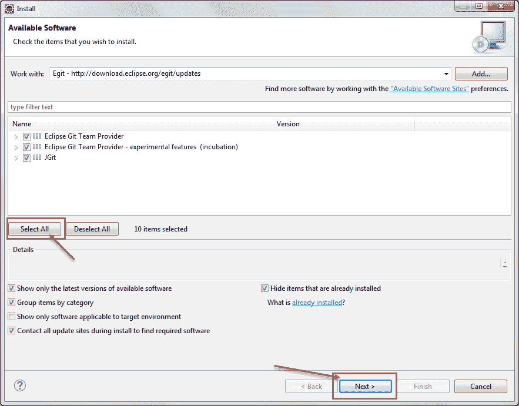

**步骤 5）**单击下一步，然后单击接受许可协议，然后完成安装。

然后重新开始蚀。

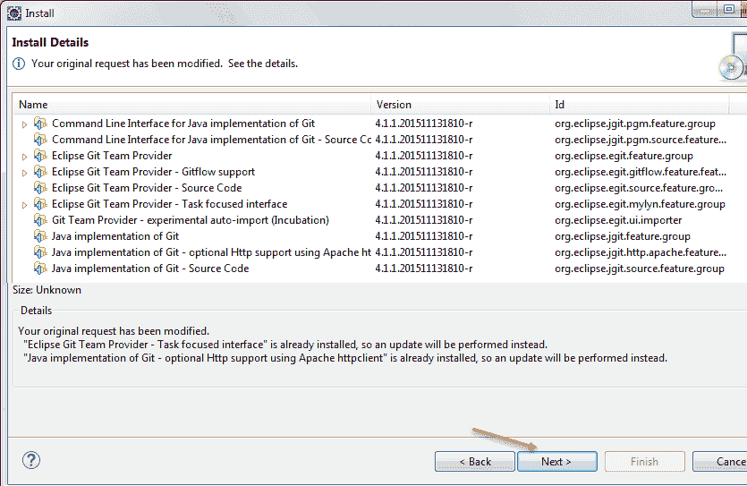

## 在 Git 上构建存储库

**步骤 1）**导航至 Git Hub URI： [https://github.com/](https://github.com/) 注册 git hub

**步骤 2）**成功注册后，请单击创建新存储库

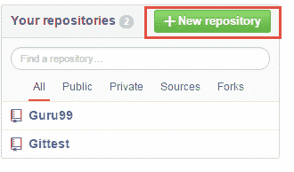

**Step 3)** In this step,

1.  输入存储库的名称，然后
2.  点击创建存储库 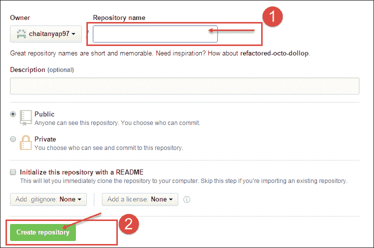

## 在 Git Hub 中使用硒的测试示例。

**步骤 1）**在完成新存储库后，启动 Eclipse

1.  点击文件
2.  然后点击新按钮，然后
3.  点击其他

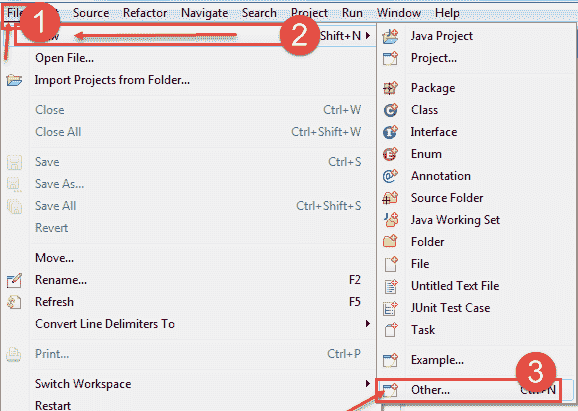

**步骤 2）**在此步骤中，

1.  选择“ Maven 项目”并浏览位置。
2.  点击下一步

**Step 3)** In this step,

1.  选择项目名称和位置，然后
2.  点击下一步

**步骤 4）**单击下一步

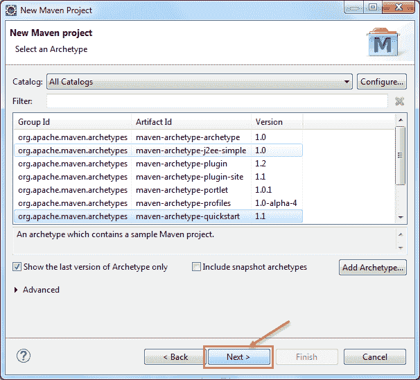

**Step 5)** In this step,

1.  输入组 ID 和
2.  工件 ID 和
3.  单击完成按钮。

 

单击完成按钮后，将立即创建一个项目。

**步骤 6）**

现在让我们创建一个示例脚本

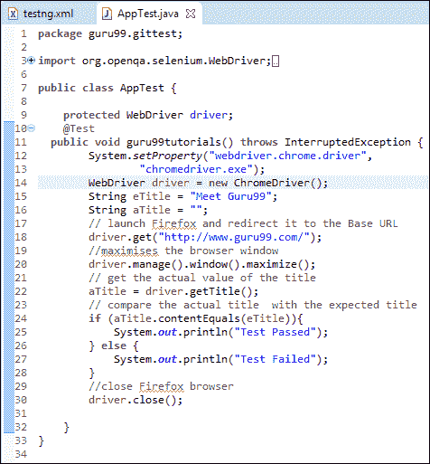

让我们将代码/本地存储库推送到 Git Hub。

**步骤 7）**在此步骤中，

1.  打开 Eclipse，然后导航到项目
2.  右键单击该项目，然后选择“团队”，然后
3.  选择共享项目

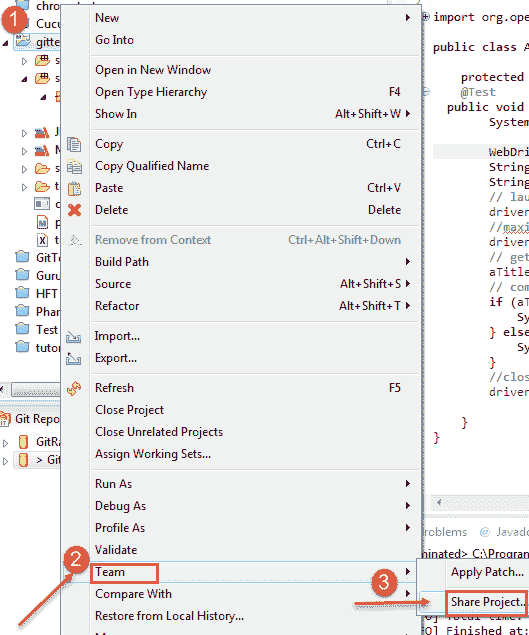

**步骤 8）**单击上方屏幕中的“共享项目”后，我们将获得另一个窗口

在这一步中

1.  选择本地存储库，然后
2.  单击完成。

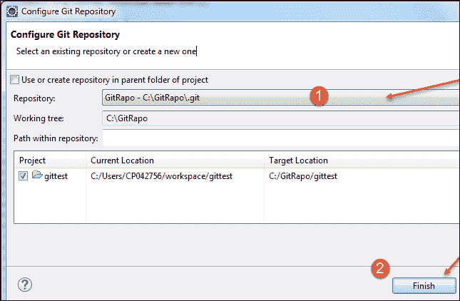

单击完成后，我们可以看到创建本地存储库的项目结构中的更改。

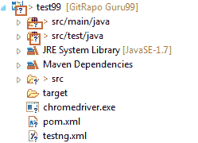

现在是时候将我们的代码推送到 Git Hub 仓库了

**步骤 9）**在此步骤中，

1.  右键单击项目和团队，然后
2.  点击提交

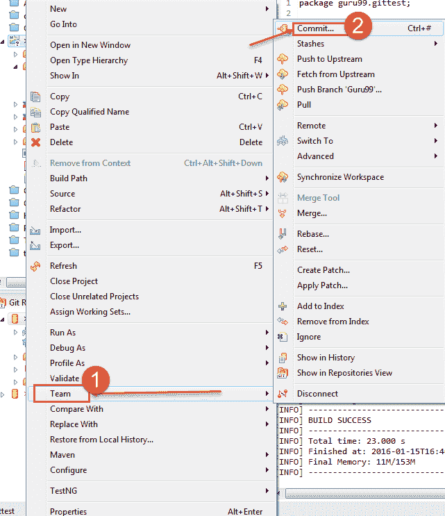

**步骤 10）**在此步骤中，

1.  输入提交消息，然后
2.  选择我们要发送到 Git Hub 存储库的文件
3.  点击提交并推送

完成后，您会看到项目中的图标正在更改，它表示我们已成功将代码推送并提交到 Git Hub

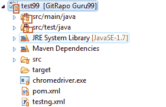

我们可以在存储库的 Git 中心中验证我们的项目已成功推入存储库

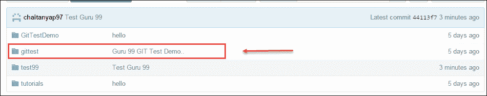

现在是时候从詹金斯的 Git Hub 执行我们的项目了

**步骤 11）**启动浏览器并打开您的 Jenkins。

**步骤 12）**单击新项目。

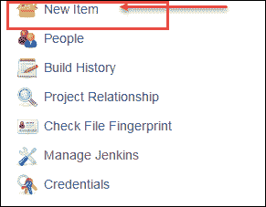

**步骤 13）**在此步骤中，

1.  输入商品名称
2.  选择 Maven 项目
3.  点击确定按钮

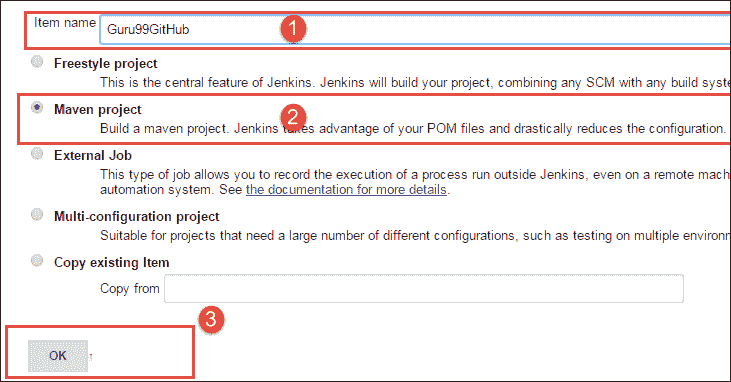

**步骤 14）**在这一步中，我们将在 Jenkins 中配置 Git Hub

1.  点击 Git 并
2.  输入存储库 URI
3.  单击添加存储库

如果 Git Hub 中有多个存储库，则需要添加存储库的名称 Refspec 字段。

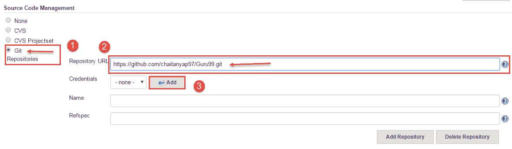

我们可以在 Git Hub 中获取 URI

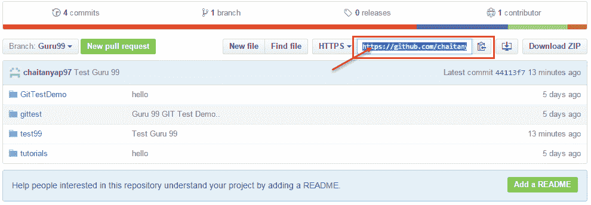

**步骤 15）**在此步骤中，

1.  在文本框中添加 pom.xml 文件位置，然后
2.  然后指定 Maven 的目标和选项
3.  选择有关如何运行测试的选项
4.  点击保存按钮。

**步骤 16）**一旦我们单击“保存”，将出现以下屏幕，

现在我们可以构建我们的项目，点击构建。

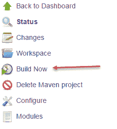

**步骤 17）**将显示内部版本，单击内部版本号或内部日期。

**步骤 18）**一旦我们单击下面的内部版本号，屏幕就会出现，在此步骤中我们可以看到控制台输出，请单击控制台输出。

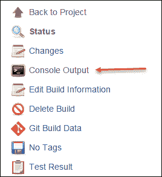

最后，我们可以验证我们的构建已成功完成/执行。

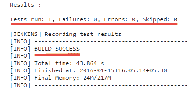

***本文由 Chaitanya Pujari 提供***