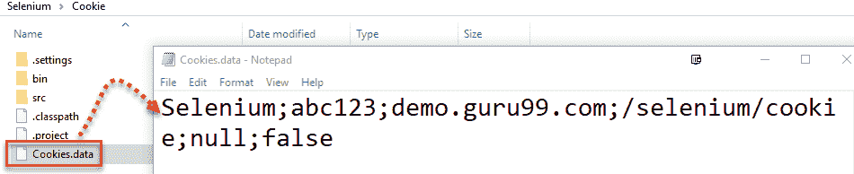

# Selenium WebDriver 中的 Cookie 处理

> 原文： [https://www.guru99.com/handling-cookies-selenium-webdriver.html](https://www.guru99.com/handling-cookies-selenium-webdriver.html)

HTTP cookie 由有关用户及其首选项的信息组成。 它使用键值对存储信息。 当用户浏览该网站时，它是从 Web 应用程序发送并存储在 Web 浏览器中的一小段数据。

点击此处了解 [Cookie 测试](/cookie-testing-tutorial-with-sample-test-cases.html)。

在本教程中，我们将学习-

*   [Cookie 的硒查询命令](#1)
*   [为什么要处理硒中的饼干？](#2)
*   [演示：Selenium 中的 Cookie 处理。](#3)
*   [步骤 1）存储 cookie 信息。](#4)
*   [步骤 2）使用存储的 cookie 登录应用程序。](#5)

## 硒查询命令

**在 Selenium Webdriver 中，我们可以使用以下内置方法查询 Cookie 并与之交互：**

```
driver.manage().getCookies();   // Return The List of all Cookies
driver.manage().getCookieNamed(arg0);  //Return specific cookie according to name
driver.manage().addCookie(arg0);   //Create and add the cookie
driver.manage().deleteCookie(arg0);  // Delete specific cookie
driver.manage().deleteCookieNamed(arg0); // Delete specific cookie according Name
driver.manage().deleteAllCookies();  // Delete all cookies

```

## 为什么要处理硒中的曲奇？

每个 cookie 均与名称，值，域，路径，到期时间以及是否安全的状态相关联。 为了验证客户端，服务器将所有这些值解析为 cookie。

当使用硒 Web 驱动程序测试 [Web 应用程序时，您可能需要创建，更新或删除 Cookie。](/software-testing.html)

例如，当自动化在线购物应用程序时，您许多人需要自动化测试场景，例如下订单，查看购物车，付款信息，订单确认等。

如果未存储 cookie，则在执行上面列出的测试方案之前，您每次都需要执行登录操作。 这将增加您的编码工作量和执行时间。

解决方案是将 cookie 存储在文件中。 稍后，从该文件中检索 cookie 的值，并将其添加到当前浏览器会话中。 结果，您可以跳过每个[测试用例](/test-case.html)中的登录步骤，因为您的驱动程序会话中包含此信息。

现在，应用程序服务器将您的浏览器会话视为已认证，并直接将您带到您请求的 URL。

## 演示：Selenium 中的 Cookie 处理。

我们将出于演示目的使用 [http://demo.guru99.com/test/cookie/selenium_aut.php](http://demo.guru99.com/test/cookie/selenium_aut.php) 。

这将是一个两步过程。

**步骤 1）**登录到应用程序并存储生成的身份验证 cookie。

**步骤 2）**使用存储的 cookie，无需使用用户名和密码即可再次登录应用程序。

### 步骤 1）存储 cookie 信息。

```

package CookieExample;

import java.io.BufferedWriter;		
import java.io.File;		
import java.io.FileWriter;
import java.util.Set;
import org.openqa.selenium.By;		
import org.openqa.selenium.WebDriver;		
import org.openqa.selenium.chrome.ChromeDriver;
import org.openqa.selenium.Cookie;		

public class cookieRead{	

    public static void main(String[] args)		
    {
    	WebDriver driver;	
        System.setProperty("webdriver.chrome.driver","G:///chromedriver.exe");					
		driver=new ChromeDriver();        
		driver.get("http://demo.guru99.com/test/cookie/selenium_aut.php");

        // Input Email id and Password If you are already Register		
        driver.findElement(By.name("username")).sendKeys("abc123");							
        driver.findElement(By.name("password")).sendKeys("123xyz");							
        driver.findElement(By.name("submit")).click();					

        // create file named Cookies to store Login Information		
        File file = new File("Cookies.data");							
        try		
        {	  
            // Delete old file if exists
			file.delete();		
            file.createNewFile();			
            FileWriter fileWrite = new FileWriter(file);							
            BufferedWriter Bwrite = new BufferedWriter(fileWrite);							
            // loop for getting the cookie information 		

            // loop for getting the cookie information 		
            for(Cookie ck : driver.manage().getCookies())							
            {			
                Bwrite.write((ck.getName()+";"+ck.getValue()+";"+ck.getDomain()+";"+ck.getPath()+";"+ck.getExpiry()+";"+ck.isSecure()));																									
                Bwrite.newLine();             
            }			
            Bwrite.close();			
            fileWrite.close();	

        }
        catch(Exception ex)					
        {		
            ex.printStackTrace();			
        }		
    }		
}

```

**代码说明：**

*   创建 WebDriver 实例
*   我们使用 driver.get（“ http://demo.guru99.com/test/cookie/selenium_aut.php”）访问该网站
*   登录到应用程序
*   使用

    ```
    driver.manage().getCookies();   						
    ```

    阅读 Cookie 信息
*   使用 FileWriter 类存储 cookie 信息以写入字符流，并使用 BufferedWriter 存储文本以将文本写入文件以将其创建为文件 Cookies.data

*   “ Cookies.data”文件与“名称，值，域，路径”一起存储所有 cookie 信息。 我们可以检索此信息并登录到应用程序，而无需输入登录凭据。
*   Once you run above code the Cookie.data file is created into the project folder structure as shown in below screen. Open the Cookie.data file, you can see login credential of the AUT is saved in the format of Cookie, see below-highlighted screen

    

### 步骤 2）使用存储的 cookie 登录应用程序。

现在，我们将访问在步骤 1 中生成的 cookie，并使用生成的 cookie 对应用程序中的会话进行身份验证

```
package CookieExample;

import java.io.BufferedReader;		
import java.io.File;		
import java.io.FileReader;		
import java.util.Date;		
import java.util.StringTokenizer;		
import org.openqa.selenium.Cookie;		
import org.openqa.selenium.WebDriver;		
import org.openqa.selenium.chrome.ChromeDriver;

public class CookieWrite		
{		

	public static void main(String[] args){ 
    	WebDriver driver;     
       	System.setProperty("webdriver.chrome.driver","G://chromedriver.exe");					
        driver=new ChromeDriver();					
    try{			

        File file = new File("Cookies.data");							
        FileReader fileReader = new FileReader(file);							
        BufferedReader Buffreader = new BufferedReader(fileReader);							
        String strline;			
        while((strline=Buffreader.readLine())!=null){									
        StringTokenizer token = new StringTokenizer(strline,";");									
        while(token.hasMoreTokens()){					
        String name = token.nextToken();					
        String value = token.nextToken();					
        String domain = token.nextToken();					
        String path = token.nextToken();					
        Date expiry = null;					

        String val;			
        if(!(val=token.nextToken()).equals("null"))
		{		
        	expiry = new Date(val);					
        }		
        Boolean isSecure = new Boolean(token.nextToken()).								
        booleanValue();		
        Cookie ck = new Cookie(name,value,domain,path,expiry,isSecure);			
        System.out.println(ck);
        driver.manage().addCookie(ck); // This will add the stored cookie to your current session					
        }		
        }		
        }catch(Exception ex){					
        ex.printStackTrace();			
        }		
        driver.get("http://demo.guru99.com/test/cookie/selenium_aut.php");					
}	
	}	

```

输出：您无需输入输入的用户名和密码即可直接进入登录成功屏幕

注意：使用硬刷新，以防执行上述脚本后看到登录页面。

**结论**

因此，您可以避免在 Selenium Webdriver 的帮助下在服务器上输入用户名和密码来一次又一次地验证用户名和密码，从而节省大量时间。

***本文由 Mangesh Waghmare*** 贡献