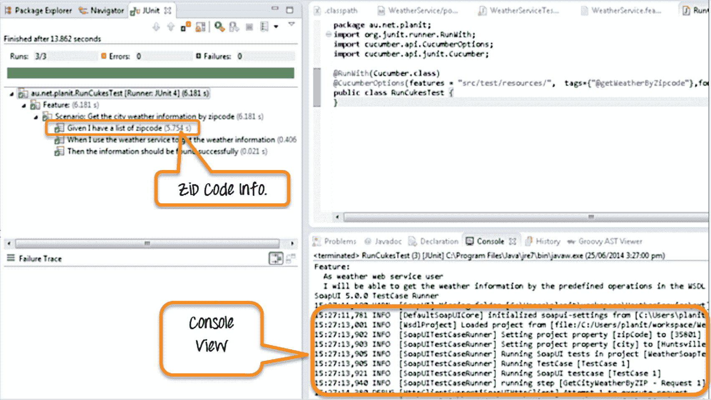
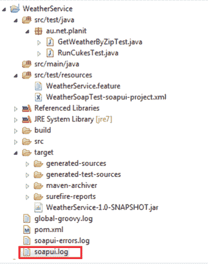

# 将 SoapUI 与 Selenium 一起用于 Web 服务测试

> 原文： [https://www.guru99.com/using-soapui-selenium.html](https://www.guru99.com/using-soapui-selenium.html)

SoapUI 是用于 [Api 测试](/api-testing.html)的最受欢迎的开源功能[测试](/software-testing.html)工具。 它提供完整的[测试范围](/test-coverage-in-software-testing.html)，并支持所有标准协议和技术。

### 什么是 SOAP？

[SOAP](/introduction-to-soapui.html) 是一个简单的基于 XML 的协议。 它允许应用程序通过 HTTP 交换信息。 它使用 [Web 服务](/web-services-tutorial.html)描述语言（WSDL）语言进行通信。 其他应用程序也可以使用 WSDL 接口与 Web 服务进行交互。

### 什么是 SOAPUI？

[SOAPUI](/introduction-to-soapui.html) 是一种开源的跨平台 Web 服务测试工具。 SOAPUI-Pro 为处理关键 Web 服务的公司提供了额外的功能。 Web 服务在 Internet 应用程序中起着重要作用。

### 硒

*   **Selenium** ：-这是一个测试工具，可以跨多个平台自动执行浏览器。
*   **Selenium Webdriver** ：-直接调用浏览器。 它使用浏览器的本机支持来实现自动化。

### 硒与 SoapUI

将 Selenium 与 Soapui 集成的最简单，最简单的方法是使用 Groovy。 SoapUI 广泛支持 Groovy。

Groovy 是一种面向对象的脚本语言。 Groovy 包含所有 [Java](/java-tutorial.html) 库。 因此，所有与 Java 相关的关键字和函数都可以直接在 groovy 脚本中使用。 它与 JVM（Java 虚拟机）集成。

### 将 Selenium 与 SoapUI 一起使用的先决条件

*   下载 [Groovy SDK](http://groovy.codehaus.org/Download) ：
*   安装 [Java SDK](/install-java.html)
*   [安装硒](/installing-selenium-webdriver.html)
*   安装 [SoapUI Pro](/soapui-installation-configuration.html)

### 在 Selenium 中调用 SoapUI Testcase 运行程序。

以下代码将用于调用 SoapUI 测试用例。 它将设置城市的属性和相应的邮政编码。 执行代码后，它将获得城市和邮政编码的值。 另外，显示与相应城市和邮政编码不匹配的失败计数。 此代码将在 Selenium 中运行。

**注意**：此处使用“ usePropertyFileFlag = true”，而不是使用静态属性文件存储邮政编码和城市。 邮政编码和城市信息将通过 setProjectProperties（）方法在运行时动态传递。

运行代码的说明。

*   启动 SoapUI
*   开始一个新的测试用例
*   添加一个新的常规步骤。
*   将示例代码复制粘贴到步骤中。
*   单击播放。
*   您会看到 Firefox 正在启动并导航到 Google。 之后，您可以看到 SoapUI 日志条目。
*   使用 Junit 运行代码

### 代码示例

```
@when("<I use the weather service to get the weather information")						
    public void i_use_the_weather_service_to_get_the_information() {
        Set<Entry<String, string>> set = zipAndCities.entrySet();
        while (iterator,hasNext)) {
            Entry<String, String> entry = iterator.next();
            String zipCode = entry.getkey();
            String city = entry.getValue();
            String[] prop = {"usePropertyFileFlag=true","zipCode=" +zipCode, "city=" +city};									

            try{
                SoapUITestCaseRunner soapUITestCaseRunner = new	SoapUITestCaseRunner();
                soapUITestCaseRunner.setProjectFile("src/test/resources/WeatherSoapTest-soapui-project.xml");					
                soapUITestCaseRunner.setProjectProperties(prop);
                soapUITestCaseRunner.setTestSuite("TestSuite1");
                soapUITestCaseRunner.setTestCase("TestCase1");
                soapUITestCaseRunner.run();

            } catch (Exception e) {
                System.err.println("checking" + zipCode + " failed!");
                failureCount++;
                zipCodes.append(zipCode + " [" + city +"] ");
                e.printStackTrace();
            }finally{					
                totalCount++;
            }
}
}
}

```

控制台视图使我们可以浏览所有执行的测试用例。 您会找到一个邮政编码列表，以及已获取并传递到 SoapUI [测试用例](/test-case.html) 1 中的城市。

### 查看 SoapUI 日志文件

日志文件记录了操作系统或软件应用程序中发生的每个操作。 要查看，SoapUI 日志文件。 转到主目录，您将看到文件名“ soapui.log”。



在 SoapUI 中，日志文件位于安装目录的 bin 文件夹中。 例如 C：\ Program Files \ SmartBear \ soapUI-Pro-4.0.1 \ bin



通过单击打开此日志文件时，其外观类似于以下屏幕截图。


**摘要**

*   肥皂是基于 XML 的简单协议。 它允许通过 HTTP 交换信息。
*   SoapUI 是一个开源的跨平台 Web 服务测试工具。
*   Selenium 是一套测试工具，可以跨多个平台自动执行浏览器。
*   Selenium Webdriver 直接调用浏览器。 它使用浏览器的本机支持来实现自动化。
*   Selenium 使用 Groovy 与 SoapUI 集成。