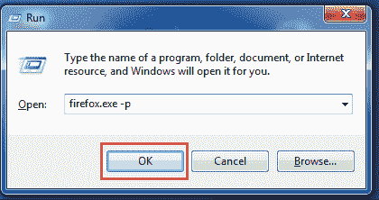
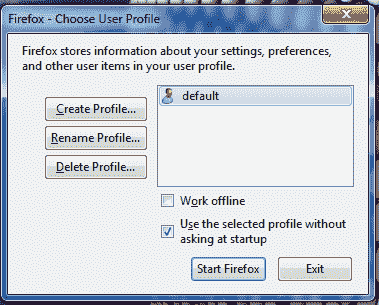
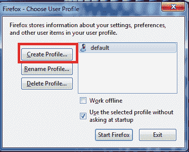
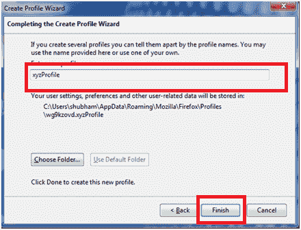
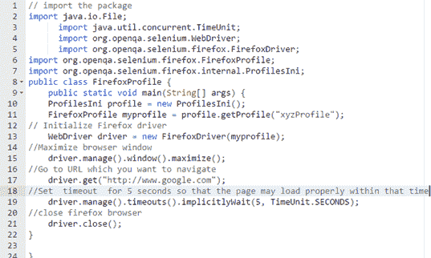
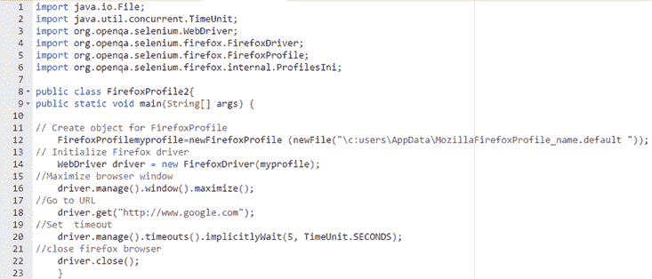

# 如何在 Selenium WebDriver 中创建 Firefox 配置文件

> 原文： [https://www.guru99.com/firefox-profile-selenium-webdriver.html](https://www.guru99.com/firefox-profile-selenium-webdriver.html)

Firefox 配置文件是可以在 Firefox 浏览器上完成的设置，自定义，加载项和其他个性化设置的集合。 您可以自定义 Firefox 配置文件以适合您的 Selenium 自动化要求。

此外，Firefox 或任何其他浏览器都会处理 SSL 证书设置。 因此，将它们自动化以及测试执行代码非常有意义。

简而言之，配置文件是用户的个人设置。 当您想在 Firefox 浏览器上运行可靠的自动化程序时，建议制作一个单独的配置文件。

在本教程中，您将学习-

*   [配置文件文件夹在磁盘](#1)中的位置
*   [如何创建 Firefox 配置文件](#2)
*   [硒自动化脚本](#3)
*   [Firefox 配置文件示例 1](#4)
*   [Firefox 配置文件示例 2](#5)

## 您的配置文件文件夹在磁盘中的位置

Firefox 配置文件就像使用 Firefox 的其他用户一样。 Firefox 保存个人信息，例如书签，密码和用户首选项，可以使用程序管理器进行编辑，删除或创建。


配置文件的位置如下

*   对于 Windows 7 > /AppData/MozillaFirefoxProfile_name.default
*   对于 [Linux](/unix-linux-tutorial.html) > /.mozilla/firefox/profile_name.default/
*   对于 Mac OS X >〜/ Library / ApplicationSupport / Firefox / Profiles / profile_name.default /

为了运行成功的 Selenium 测试，Firefox 配置文件应为-

*   易于装载
*   代理设置（如果需要）
*   根据自动化需求的其他用户特定设置

## 如何创建 Firefox 配置文件

让我们逐步介绍如何创建 Firefox 配置文件。

**步骤 1）**首先，如果打开 Firefox，则将其关闭。

**步骤 2）**打开运行（Windows 键+ R）并键入 firefox.exe –p，然后单击“确定”。



注意：如果无法打开，则可以尝试使用引号中的完整路径。

*   在 32 位 Windows 上：“ C：Program FilesMozilla Firefox.exe” –p
*   在 64 位上：Windows：“ C：Program Files（x86）Mozilla Firefox.exe” –p

**步骤 3）**将打开一个名为 Firefox 的对话框-选择用户个人资料



**步骤 4）**从窗口中选择选项“创建配置文件”，将打开一个向导。 点击下一步



**步骤 5）**输入您要创建的个人资料名称，然后点击完成按钮



现在您的个人资料已准备就绪，您可以选择您的个人资料并打开 Firefox。

您会注意到，新的 Firefox 窗口不会显示任何“书签”和“收藏夹”图标。

**注意：**上一次选择的配置文件将在下次 Firefox 启动时自动加载。 如果要更改配置文件，则需要重新启动配置文件管理器。

## 硒自动化脚本

要在 Selenium Webdriver 软件测试中访问新创建的 Firefox 配置文件，我们需要使用 webdrivers 内置类'profilesIni'及其方法 getProfile，如下所示。

**配置文件**的硒代码

这是实现配置文件的代码，可以嵌入到硒代码中。

```
ProfilesIni profile = new ProfilesIni();
```

//这将为 Firefox 配置文件创建一个对象

```
FirefoxProfile myprofile = profile.getProfile("xyzProfile");
```

//这将初始化 Firefox 驱动程序

```
WebDriver driver = new FirefoxDriver(myprofile)
```

让我们在以下示例中查看此代码的实现。

### Firefox 配置文件示例 1



```
// import the package
import java.io.File;
      import java.util.concurrent.TimeUnit;
      import org.openqa.selenium.WebDriver;
      import org.openqa.selenium.firefox.FirefoxDriver;
import org.openqa.selenium.firefox.FirefoxProfile;
import org.openqa.selenium.firefox.internal.ProfilesIni;
public class FirefoxProfile {
 	public static void main(String[] args) {
	ProfilesIni profile = new ProfilesIni();
	FirefoxProfile myprofile = profile.getProfile("xyzProfile");
// Initialize Firefox driver
	WebDriver driver = new FirefoxDriver(myprofile);
//Maximize browser window
	driver.manage().window().maximize();
//Go to URL which you want to navigate
	driver.get("http://www.google.com");
//Set  timeout  for 5 seconds so that the page may load properly within that time
	driver.manage().timeouts().implicitlyWait(5, TimeUnit.SECONDS);
//close firefox browser
	driver.close();
}

}

```

**代码解释：**

以下是逐行代码的说明。

*   **代码行 2-7** ：首先，我们需要导入运行硒代码所需的包。
*   **代码行 8** ：设置一个公共类“ FirefoxProfile”。
*   **代码行 9** ：制作一个对象（您需要具有 oops 概念的基本知识）。
*   **代码行 10-11** ：我们需要使用 myprofile 对象初始化 Firefox 配置文件。
*   **代码行 13** ：为 Firefox 创建对象
*   **代码行 15** ：最大化窗口。
*   **代码行 17** ：Driver.get 用于导航到给定的 URL。
*   **代码行 19** ：设置超时用于等待一段时间，以便浏览器可以在继续下一页之前加载页面。
*   **代码行 21** ：关闭 Firefox。

让我们再看一个例子。

### Firefox 配置文件示例 2



```
import java.io.File;
import java.util.concurrent.TimeUnit;
import org.openqa.selenium.WebDriver;
import org.openqa.selenium.firefox.FirefoxDriver;
import org.openqa.selenium.firefox.FirefoxProfile;
import org.openqa.selenium.firefox.internal.ProfilesIni;

public class FirefoxProfile2{
public static void main(String[] args) {

// Create object for FirefoxProfile
	FirefoxProfilemyprofile=newFirefoxProfile (newFile("\c:users\AppData\MozillaFirefoxProfile_name.default "));  
// Initialize Firefox driver    
	WebDriver driver = new FirefoxDriver(myprofile);
//Maximize browser window       
	driver.manage().window().maximize();
//Go to URL      
	driver.get("http://www.google.com");
//Set  timeout      
	driver.manage().timeouts().implicitlyWait(5, TimeUnit.SECONDS);
//close firefox browser  
	driver.close();
    }

```

**代码**的说明：

Below is the explanation of code line by line.

*   **代码行 1-6：**首先，我们需要导入运行硒代码所需的包。
*   **代码行 8** ：设置一个公共类 FirefoxProfile 2。
*   **代码行 12** ：通过引用精确路径来创建 myprofile 对象。
*   **代码行 14** ：为 Firefox 创建对象
*   **代码行 16** ：最大化窗口。
*   **代码行 18** ：Driver.get 用于导航到给定的 URL。
*   **代码行 20** ：设置超时用于等待一段时间，以便浏览器可以在继续下一页之前加载页面。
*   **代码行 22** ：关闭 Firefox。

**摘要**：

*   自动化 Firefox 配置文件非常有意义，因为它们可以处理 SSL 证书设置。
*   可以自定义 Firefox 配置文件以适合您的 Selenium 自动化要求。
*   Firefox 配置文件应易于加载，并具有一些特定于用户的代理设置以运行良好的测试。
*   要在 Selenium Webdriver 软件测试中访问新创建的 Firefox 配置文件，我们需要使用 webdrivers 内置类'profilesIni'及其方法 getProfile。