# 含硒硒（BDD 框架）：带有示例的教程

> 原文： [https://www.guru99.com/using-cucumber-selenium.html](https://www.guru99.com/using-cucumber-selenium.html)

在本教程中，您将学习如何将 Cucumber 与 Selenium Webdriver 集成。

### 什么是黄瓜？

Cucumber 是一种支持行为驱动开发（BDD）的测试方法。 它使用 Gherkin 语言以简单的英语文本说明了应用程序的行为。

了解更多信息- [https://www.guru99.com/cucumber-tutorials.html](/cucumber-tutorials.html)

### 什么是硒？

Selenium 是用于基于 Web 的应用程序的[功能测试](/functional-testing.html)的自动化工具。 Selenium 支持不同的语言，例如 java，ruby，python C＃等。

了解更多信息- [https://www.guru99.com/selenium-tutorial.html](/selenium-tutorial.html)

在本教程中，我们将学习-

*   [为什么将黄瓜和硒一起使用？](#1)
*   [黄瓜和硒一起使用的先决条件。](#2)
*   [使用黄瓜和硒进行自动化测试。](#3)
*   [方案 1：在控制台中打印文本。](#4)
*   [方案 2：输入登录凭据并重置该值。](#5)
*   [场景 3：在 Guru99 上输入登录凭据&重设该值。 对 3 组数据执行此操作。](#6)

## 为什么将黄瓜和硒一起使用？

黄瓜和硒是两种流行的技术。

大多数组织使用 Selenium 进行功能测试。 这些正在使用 Selenium 的组织希望将 Cucumber 与硒集成在一起，因为 Cucumber 使**易于阅读和理解应用程序流程。**

黄瓜工具基于行为驱动开发框架，其中**充当以下人员之间的桥梁**：

1.  软件工程师和业务分析师。
2.  手动测试仪和自动化测试仪。
3.  手动测试人员和开发人员。

黄瓜**也使客户理解应用程序代码**，因为它使用纯文本格式的 Gherkin 语言。 组织中的任何人都可以了解软件的行为。 Gherkin 的语法采用简单的文本，易于阅读和理解。


## 黄瓜和硒一起使用的先决条件。

在开始将黄瓜与硒整合之前，我们需要以下各项：

硒罐文件：

*   硒服务器独立

可以从 [http://www.seleniumhq.org/download/](http://www.seleniumhq.org/download/) 下载


黄瓜的 Jar 文件：

*   黄瓜芯
*   黄瓜-html
*   cobertura 代码覆盖率
*   黄瓜
*   黄瓜黄瓜
*   黄瓜-jvm-deps
*   黄瓜报告
*   Hemcrest-core
*   小黄瓜
*   朱尼特

可以从 [https://mvnrepository.com/search?q=Cucumber](https://mvnrepository.com/search?q=Cucumber) 下载

您需要搜索文件并逐个下载。

例如，我们将向您展示下载其中一个 jar 文件，即“黄瓜芯”。

点击上面的下载链接。 它将重定向到以下站点。 现在搜索特定的罐子，即“黄瓜芯”，如下图所示：

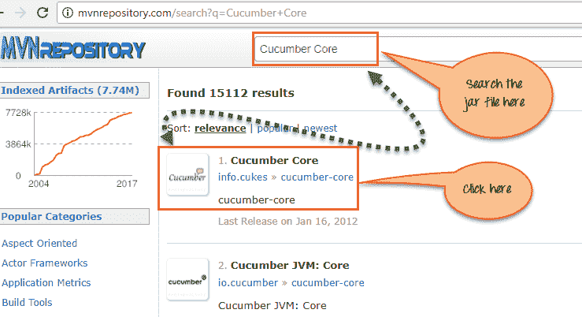

在下一页中，单击 1.2.2 版，

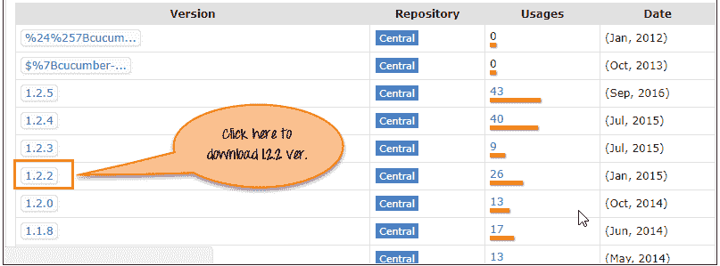

在下一个屏幕中，单击下载以获取“ Cucumber Core” jar 文件。

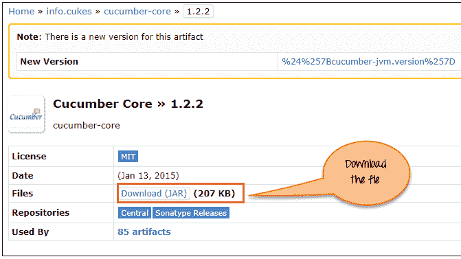

**注意**：为了您的方便，我们在此处捆绑了需要从 Maven [下载的 jar 文件。 随着时间的流逝，这些罐子可能会更新并变得不兼容。 要求您使用上述方法下载它们。](https://drive.google.com/uc?export=download&id=0ByI5-ZLwpo25LWlnMTdrbU1ESXc)

## 使用黄瓜和硒进行自动化测试。

让我们逐步研究将黄瓜与硒一起使用的步骤。 这里我们将介绍 3 种情况：

*   方案 1：在控制台中打印文本。
*   方案 2：输入登录凭据并重置该值。
*   方案 3：在 Guru99 &上输入登录凭据，以重置该值。 对 3 组数据执行此操作。

### 方案 1：在控制台中打印文本。

在这种情况下，我们只是使用 Cucumber 在控制台中打印文本。

**步骤 1）**在 Eclipse 中创建项目。

创建名称为“ CucumberWithSelenium”的 Java 项目，如下面的屏幕快照所示。

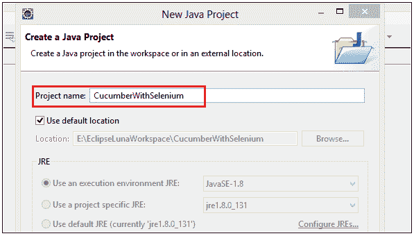

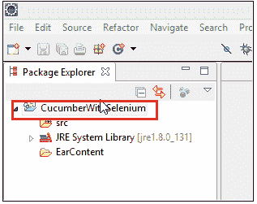

**步骤 2）**在项目中添加 Jar 文件。

右键单击项目>，选择属性。>转到 Java Build Path。 添加之前下载的所有库。

[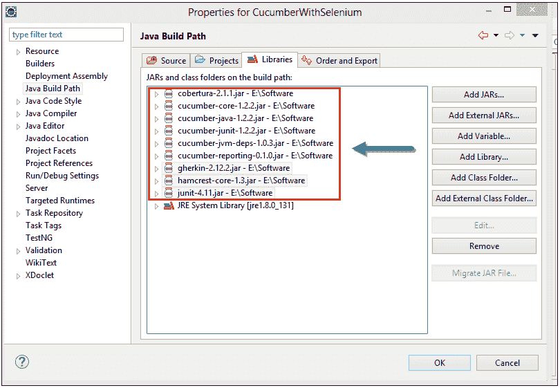 ](/images/2-2017/092917_0716_UsingCucumb8.png) 

**步骤 3）**创建功能文件

要创建功能文件，首先创建功能文件夹，如下图所示。

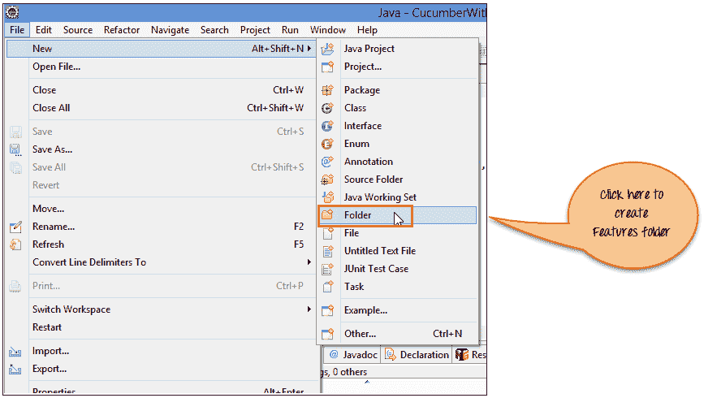

现在输入文件夹名称“功能”，然后单击“完成”按钮。

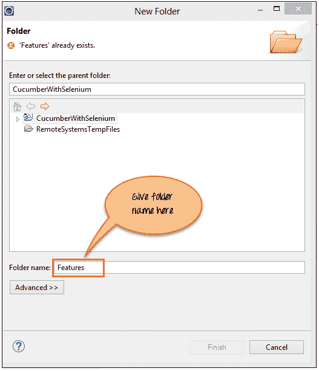

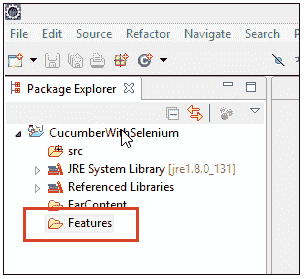

现在，在“功能”文件夹中创建名称为“ MyTest.feature”的功能文件-过程类似于创建文件夹

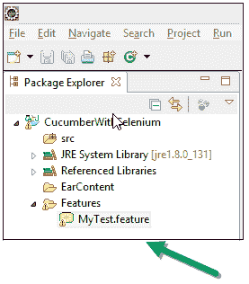

**注意：**您可能需要安装 Cucumber Eclipse 插件才能起作用。 转到-帮助->安装新软件->复制粘贴链接 [http://cucumber.github.io/cucumber-eclipse/update-site/](http://cucumber.github.io/cucumber-eclipse/update-site/) 和 安装

**步骤 4）**编写脚本。

下面的行使用 Gherkin 语言写在“ MyTest.feature”文件中，如下所示：

```

功能：在应用程序登录页面上重置功能场景：重置按钮的验证给定打开 Firefox 并启动应用程序输入用户名和密码时然后重置凭证
```

**代码说明**

**第 1 行）在这一行中，我们编写业务功能。**

**第 2 行）在这一行中，我们编写了一个要测试的方案。**

**第 3 行）在这一行中，我们定义了前提条件。**

**第 4 行）在这一行中，我们定义了需要执行的操作。**

**第 4 行）在这一行中，我们定义了预期的结果或结果。**

**步骤 5）**编写硒 testrunner 脚本。

在这里，我们创建“ TestRunner”包，然后在其下创建“ Runner.java”类文件。

```
package TestRunner;		

import org.junit.runner.RunWith;		
import cucumber.api.CucumberOptions;		
import cucumber.api.junit.Cucumber;		

@RunWith(Cucumber.class)				
@CucumberOptions(features="Features",glue={"StepDefinition"})						
public class Runner 				
{		

}

```

在上面的代码中，我们使用以下注释来运行 Cucumber 测试：

**@RunWith（）**注释告知测试运行器类开始执行测试。

**@CucmberOptions（）**批注用于为我们的黄瓜测试设置一些属性，例如功能文件，步骤定义等。

TestRunner 文件的屏幕截图。

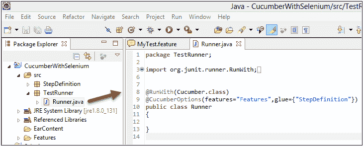

**步骤 6）**创建步骤定义脚本。

现在在这里，我们创建“ StepDefinition”包，然后在其下创建“ Steps.java”脚本文件。 在这里，我们实际上编写了一个硒脚本来执行 Cucumber 方法下的测试。

```
package StepDefinition;		

import cucumber.api.java.en.Given;		
import cucumber.api.java.en.Then;		
import cucumber.api.java.en.When;		

public class Steps {				

    @Given("^Open the Firefox and launch the application$")				
    public void open_the_Firefox_and_launch_the_application() throws Throwable							
    {		
        System.out.println("This Step open the Firefox and launch the application.");					
    }		

    @When("^Enter the Username and Password$")					
    public void enter_the_Username_and_Password() throws Throwable 							
    {		
       System.out.println("This step enter the Username and Password on the login page.");					
    }		

    @Then("^Reset the credential$")					
    public void Reset_the_credential() throws Throwable 							
    {    		
        System.out.println("This step click on the Reset button.");					
    }		

}

```

在上面的代码中，该类的名称为“ Steps”。 黄瓜注释用于与要素文件进行映射。 定义了每种注释方法：

**@Given** 注释定义方法打开 Firefox 并启动应用程序

**@当**注释定义输入用户名和密码的方法

**@然后使用**注释定义方法来重置凭据

在每种方法下，我们仅打印一条消息。

下面是“ Steps.java”脚本和项目树的屏幕截图，它的外观如何。

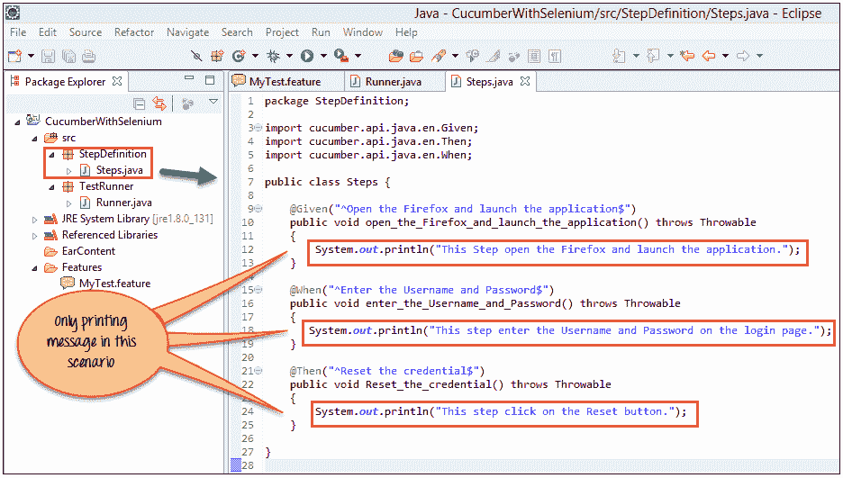

**注意：**步骤定义不过是您要在该黄瓜方法下执行的步骤。

**步骤 7）**执行脚本。

用户可以从测试运行器脚本（即“ Runner.java”）执行此脚本，如下面的屏幕快照所示。

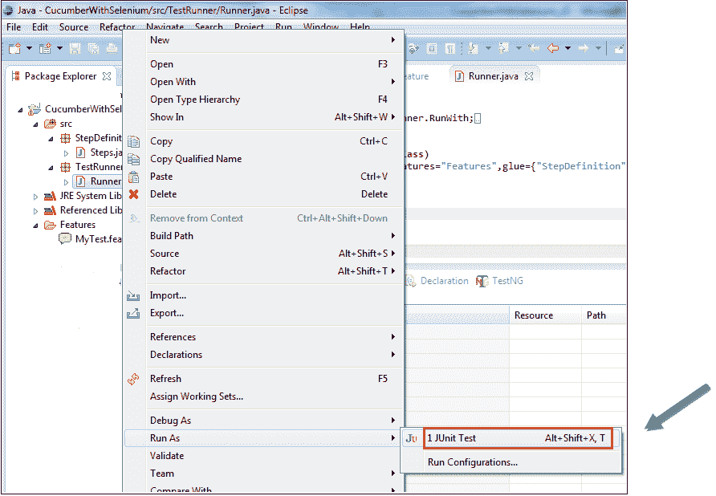

**步骤 8）**分析输出。

在执行“ Runner.java”脚本时，它将在控制台上显示文本。 它与“ Steps.java”脚本中定义的文本相同。

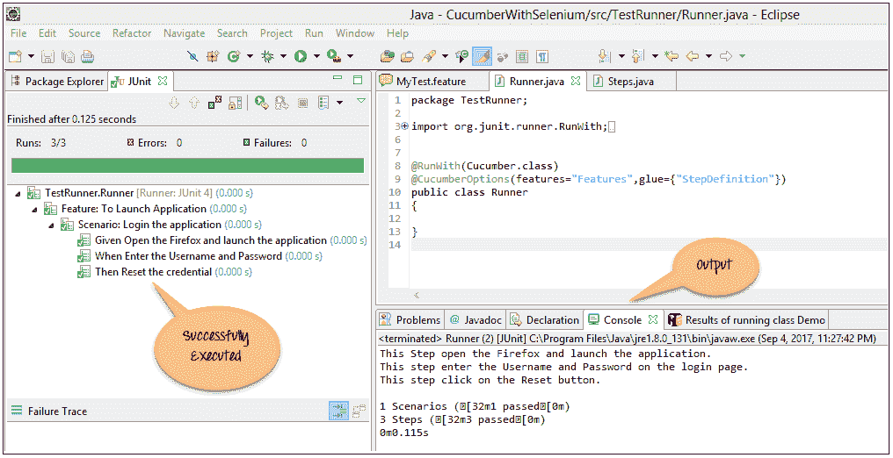

### 方案 2：输入登录凭据并重置该值。

在这里，我们只需在 Guru99 演示登录页面上输入 Credential 并重置值

对于方案 2，我们仅需要更新“ Steps.java”脚本。 在这里，我们实际上编写了硒脚本，如下步骤所示。 首先，我们需要将 Selenium jar 文件添加到该项目中。

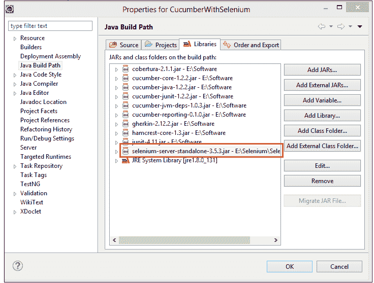

**步骤 1）**在这里，我们更新了'Steps.java'脚本，如下面的代码和屏幕截图所示。

```
package StepDefinition;		

import org.openqa.selenium.By;		
import org.openqa.selenium.WebDriver;		
import org.openqa.selenium.firefox.FirefoxDriver;		

import cucumber.api.java.en.Given;		
import cucumber.api.java.en.Then;		
import cucumber.api.java.en.When;		

public class Steps {				

    WebDriver driver;			

    @Given("^Open the Firefox and launch the application$")					
    public void open_the_Firefox_and_launch_the_application() throws Throwable							
    {		
       System.setProperty("webdriver.gecko.driver", "E://Selenium//Selenium_Jars//geckodriver.exe");					
       driver= new FirefoxDriver();					
       driver.manage().window().maximize();			
       driver.get("http://demo.guru99.com/v4");					
    }		

    @When("^Enter the Username and Password$")					
    public void enter_the_Username_and_Password() throws Throwable 							
    {		
       driver.findElement(By.name("uid")).sendKeys("username12");							
       driver.findElement(By.name("password")).sendKeys("password12");							
    }		

    @Then("^Reset the credential$")					
    public void Reset_the_credential() throws Throwable 							
    {		
       driver.findElement(By.name("btnReset")).click();					
    }		
}		

```

上述硒脚本的屏幕截图。


**步骤 2）**执行脚本。

更新后，我们运行 Runner.java。

**步骤 3）**分析输出。

在输出中，您可以看到以下内容：

*   浏览器启动。
*   Guru99 银行演示站点已打开。
*   用户名和密码位于登录页面上。
*   重置值。

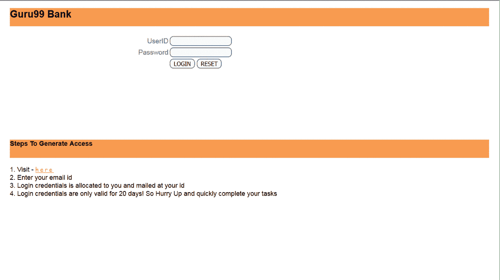

### 方案 3：在 Guru99 上输入登录凭据&重设该值。 对 3 组数据执行此操作。

在这里，我们需要更新“ Step.java”和功能文件。

**步骤 1）**更新功能文件，如下所示：

```
在这里，我们使用“方案大纲”和“示例”语法更新功能文件。功能：在应用程序登录页面上重置功能方案概要：使用凭证编号验证重置按钮给定打开 Firefox 并启动应用程序输入用户名<用户名>和密码<密码>时然后重置凭证例子：|用户名|密码||用户 1 |密码 1 || User2 | password2 || User3 | password3 |//在这一行中，我们定义数据集。
```

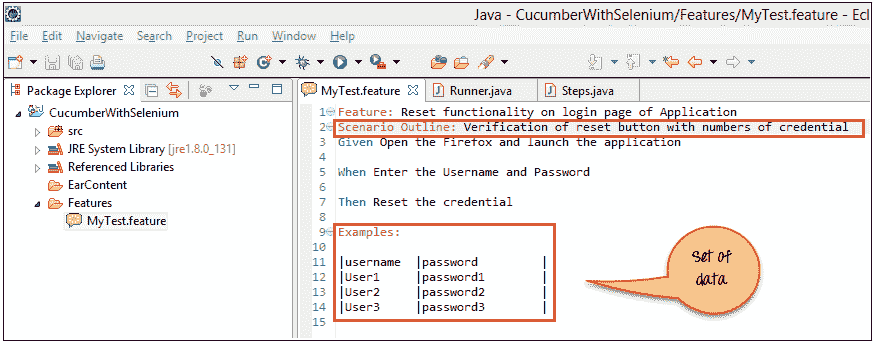

**步骤 2）**现在更新 Step.java 脚本。

在这里，我们更新方法以传递参数，更新后的脚本如下所示：

```
package StepDefinition;		

import org.openqa.selenium.By;		
import org.openqa.selenium.WebDriver;		
import org.openqa.selenium.firefox.FirefoxDriver;		

import cucumber.api.java.en.Given;		
import cucumber.api.java.en.Then;		
import cucumber.api.java.en.When;		

public class Steps {				

    WebDriver driver;			

    @Given("^Open the Firefox and launch the application$")					
    public void open_the_Firefox_and_launch_the_application() throws Throwable							
    {		
       System.setProperty("webdriver.gecko.driver", "E://Selenium//Selenium_Jars//geckodriver.exe");					
       driver= new FirefoxDriver();					
       driver.manage().window().maximize();			
       driver.get("www.demo.guru99.com/v4");					
    }		

    @When("^Enter the Username \"(.*)\" and Password \"(.*)\"$")			
    public void enter_the_Username_and_Password(String username,String password) throws Throwable 							
    {		
       driver.findElement(By.name("uid")).sendKeys(username);					
       driver.findElement(By.name("password")).sendKeys(password);					
    }		

    @Then("^Reset the credential$")					
    public void	Reset_the_credential() throws Throwable 							
    {		
       driver.findElement(By.name("btnReset")).click();					
    }		
}		

```

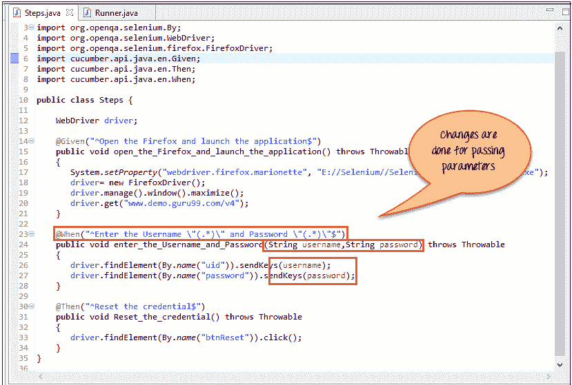

**步骤 3）**现在执行更新的脚本。

下面的屏幕显示脚本的成功执行以及每组数据所花费的时间。

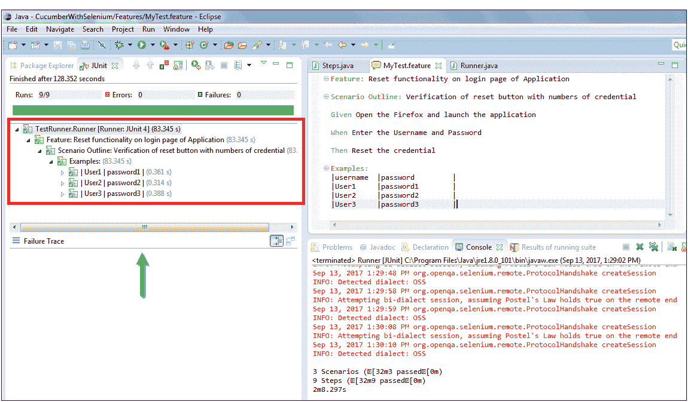

**步骤 4）**分析输出。

In the output you can see the following:

下面的输出将重复数据集的数量，即 3 组。

*   浏览器启动。
*   Guru99 银行演示站点已打开。
*   用户名和密码位于登录页面上。
*   重置值。

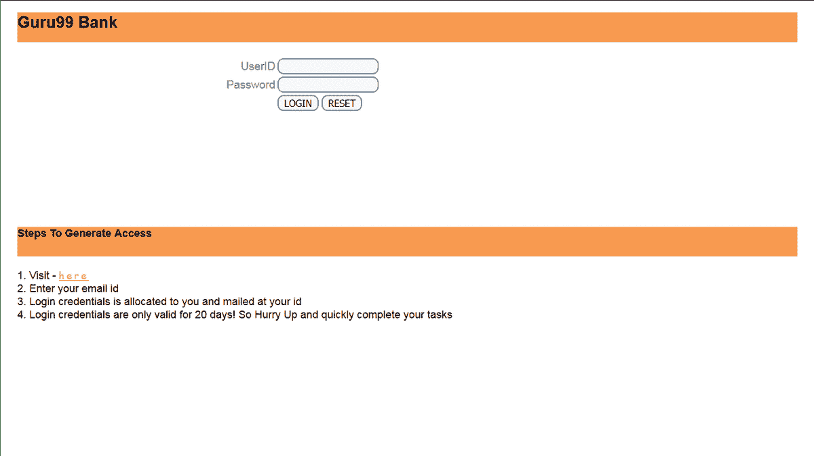

#### 结论。

黄瓜是一种非常流行的 BDD 工具。 它易于阅读，并且所有利益相关者（包括技术人员和非技术人员）都可以理解。

黄瓜可以通过以下 3 个步骤与 Selenium 集成

1.  创建功能文件，在其中使用 Gherkin 语言逐步定义功能和方案。
2.  创建 Testrunner 文件。 在此文件中，我们将黄瓜和硒进行了整合。 我们执行此脚本。
3.  创建步骤定义，即在此程序包下定义的实际硒脚本。