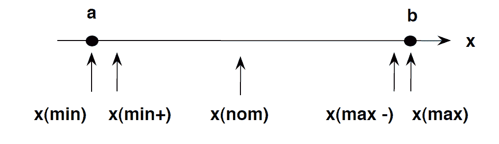
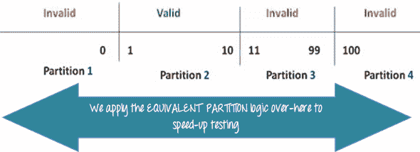
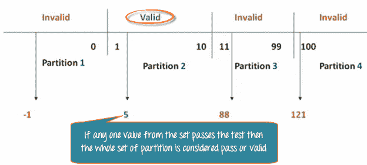
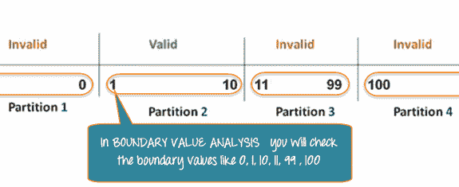

# 边界值分析&等价分割的例子

> 原文： [https://www.guru99.com/equivalence-partitioning-boundary-value-analysis.html](https://www.guru99.com/equivalence-partitioning-boundary-value-analysis.html)

实际上，由于时间和预算的考虑，不可能对每组测试数据都进行详尽的测试，尤其是在输入组合池很大的情况下。

*   我们需要一种简单的方法或特殊的技术，可以从测试用例池中智能地选择测试用例，从而涵盖所有测试用例。
*   我们使用两种技术-**等价分区&边值分析测试技术**来实现此目的。

在本教程中，我们将学习

*   [什么是边界测试？](#1)
*   [什么是等效类分区？](#2)
*   [范例 1：当量和边值](#3)
*   [示例 2：当量和边值](#4)
*   [为什么等效&边界分析测试](#5)

### 什么是边界测试？

边界测试是测试极端值或输入值的分区之间的边界之间的过程。

*   因此，这些极端值（例如开始-结束，下-上，最大-最小，仅内部-刚刚外部）称为边界值，而测试称为“边界测试”。
*   边界值测试的基本思想是在以下位置选择输入变量值：

1.  最低要求
2.  刚好高于最小值
3.  标称值
4.  略低于最大值
5.  最大值

*   在边界测试中，等效类划分起着很好的作用
*   边界测试是在等效类划分之后进行的。

### 什么是等效类分区？

等效类分区是一种黑盒技术（代码对测试人员不可见），可以应用于所有级别的测试，例如单元，集成，系统等。在这种技术中，您将测试条件集划分为一个分区，该分区可以 被认为是一样的。

*   它将软件的输入数据分为不同的等效数据类。
*   您可以在输入字段中有一个范围的情况下应用此技术。

### 例 1：当量和边值

*   让我们考虑下面的“订购披萨”文本框的行为
*   披萨值 1 到 10 被认为是有效的。 显示一条成功消息。
*   虽然值 11 到 99 被认为对订单无效，并且会出现错误消息，但**“只能订购 10 个比萨饼”**

**Order Pizza:**  <input id="number" name="number" style="width: 30%;background:#fff;color:#000;" type="text">   <input onclick="getcube()" style="background: #FFF;color: #000;padding: 5px;font-size: 18px;" type="submit" value="Submit">

**这是测试条件**

1.  在“订购比萨”字段中输入的任何大于 10 的数字（假设为 11）均被视为无效。
2.  任何小于 1 的数字，等于 0 或小于 0，则视为无效。
3.  数字 1 到 10 被认为是有效的
4.  任意 3 位数字表示-100 无效。

我们无法测试所有可能的值，因为如果完成，测试用例的数量将超过 100。为解决此问题，我们使用等价划分假设，在其中将票证的可能值分为组或集，如下所示 行为可以认为是相同的。

划分的集合称为等效分区或等效类。 然后，我们从每个分区中只选择一个值进行测试。 该技术背后的假设是**，如果分区中的一个条件/值通过，所有其他条件/值也将通过**。 同样**，如果分区中的一个条件失败，则该分区中的所有其他条件将失败**。

**边界值分析**-在边界值分析中，测试等效分区之间的边界

在我们前面的示例中，不是检查每个分区的一个值，而是检查每个分区的值，例如 0、1、10、11 等。 如您所见，您在**处测试了有效和无效边界**处的值。 边界值分析也称为**范围检查**。

等效分区和边界值分析（BVA）密切相关，可以在所有测试级别上一起使用。

### 例 2：当量和边值

以下密码字段接受至少 6 个字符，最多 10 个字符

这意味着分区 0-5、6-10、11-14 中的值的结果应该相等

**Enter Password:**   <input id="textbox" style="width: 30%;background:#fff;color:#000;" type="password">   <input name="textboxSubmit" onclick="checkLength()" style="background: #FFF;color: #000;padding: 5px;font-size: 18px;" type="submit">

| 测试场景 | 测试方案说明 | 预期结果 |
| 1 | 在密码字段中输入 0 到 5 个字符 | 系统不应该接受 |
| 2 | 在密码字段中输入 6 到 10 个字符 | 系统应接受 |
| 3 | 在密码字段中输入 11 至 14 个字符 | System should not accept |

### 示例 3：输入框应接受数字 1 到 10

在这里，我们将看到边值测试用例

| **测试方案说明** | **预期结果** |
| 边界值= 0 | 系统不应接受 |
| 边界值= 1 | System should accept |
| 边界值= 2 | System should accept |
| 边界值= 9 | System should accept |
| 边界值= 10 | System should accept |
| 边界值= 11 | System should NOT accept |

### 为什么等效&边界分析测试

1.  此测试用于将大量测试用例减少为可管理的块。
2.  在不影响测试有效性的情况下确定测试用例的非常明确的准则。
3.  适用于具有大量变量/输入的计算密集型应用

**摘要：**

*   当实际上不可能单独测试大量测试用例时，使用边界分析测试
*   两种技术-等值划分&边值分析测试技术
*   在“等效分区”中，首先，将一组测试条件划分为一个可以考虑的分区。
*   然后在“边界值分析”中测试等效分区之间的边界
*   Appropriate for calculation-intensive applications with variables that represent physical quantities